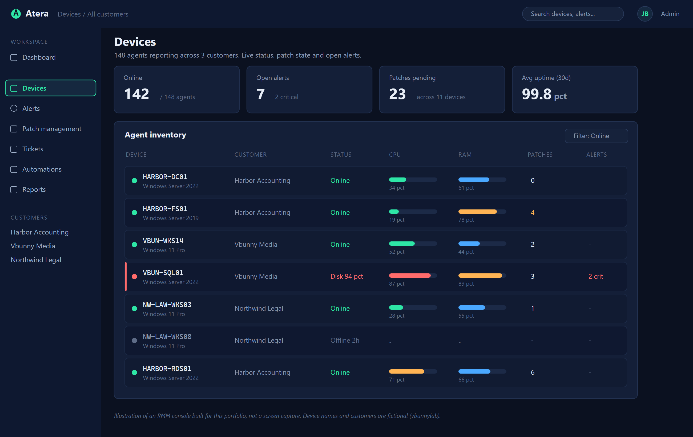

# Atera RMM

Cloud-based remote monitoring and management. Atera combines RMM with a PSA, so monitoring, patching, scripting and ticketing sit in one platform.

The pricing model is what makes it popular with small MSPs and internal IT teams. Per technician rather than per device, so the endpoint count does not drive the bill.

*The Atera console: every managed machine with live status, CPU and memory, pending patches and open alerts in one view.*

---

## What an RMM Gives You

The value is one console covering every managed machine.

| Capability | Does |
| --- | --- |
| **Monitoring** | Alerts on disk, memory, CPU, services, events |
| **Patch management** | Windows and third-party updates |
| **Scripting** | Run PowerShell, batch or shell across many machines |
| **Remote access** | Splashtop, AnyDesk, ScreenConnect |
| **Inventory** | Hardware and software across the estate |
| **Ticketing** | Built-in PSA, with alerts raising tickets |
| **Automation** | Scheduled maintenance profiles |

**Alert to ticket is the piece that matters.** A disk filling up creates a ticket before the user notices. That is the difference between managing an estate and reacting to it.

---

## Structure

Atera organises around customers and devices.

| Level | Holds |
| --- | --- |
| **Customer** | An organisation, or a department for internal IT |
| **Site** | A location within a customer |
| **Device** | An agent-managed endpoint |
| **Contact** | A person who can raise tickets |

Internal IT teams often use a single customer with sites per office. MSPs use one customer per client.

**Get the structure right before deploying agents.** Moving devices between customers afterwards is possible but tedious, and alert profiles are assigned by customer.

---

## The Dashboard

| Section | Holds |
| --- | --- |
| **Devices** | Every managed endpoint and its status |
| **Alerts** | Open monitoring alerts by severity |
| **Tickets** | The PSA queue |
| **Customers** | Organisations, sites, contacts |
| **Patch Management** | Patch status and policy |
| **Admin** | Thresholds, automation profiles, scripts |
| **App Center** | Integrations |
| **Knowledge Base** | Documentation |

Devices and Alerts are where the day happens. Everything else supports them.

---

## Device View

Click a device and you get the full picture without touching it.

- Alert status and history
- Patch status, with what is missing
- Hardware, model, serial, specifications
- Disks with free space
- Installed software
- Services and their state
- Event logs
- Network configuration
- Ticket history

Actions available from the same page:

- Connect remotely
- Run a script
- Install or remove software
- Restart, or schedule a restart
- Wake on LAN
- Open a command prompt
- Run a patch scan

**Being able to answer a question without disturbing the user is the main day to day benefit.** Checking free disk space or whether a service is running takes seconds and the user never knows.

---

## Alerts and Thresholds

Alerts come from thresholds you set. Getting them right is the difference between a useful console and one nobody looks at.

**Admin**, **Monitoring**, threshold profiles.

Reasonable starting points:

| Monitor | Warning | Critical |
| --- | --- | --- |
| Disk free space | 15% | 10% |
| CPU sustained | 85% for 15 min | 95% for 15 min |
| Memory | 85% | 95% |
| Service stopped | Critical for named services | |
| Agent offline | 30 minutes | 24 hours |
| Failed backup | Critical | |

**Alert fatigue is the failure mode.** Thresholds set too tight produce hundreds of alerts a day, everyone stops reading them, and the one that mattered gets missed with the rest.

Tune aggressively in the first month. If an alert has never once led to action, it is noise. Turn it off.

Assign threshold profiles per customer. A file server and a laptop do not need the same rules.

---

## Automation Profiles

Scheduled maintenance applied to a group of devices.

A typical profile:

- Install Windows updates
- Install third-party updates
- Clear temporary files
- Run disk cleanup
- Restart if required
- Report results

Schedule outside working hours. Assign per customer or per device group.

This is where an RMM stops being a monitoring tool and starts saving real time. Patching a hundred machines becomes a profile that runs on Sunday rather than a week of work.

---

## Remote Access

Atera integrates rather than providing its own.

| Tool | Notes |
| --- | --- |
| **Splashtop** | Included. Fast, good on poor connections |
| **AnyDesk** | Integration, separate licence |
| **ScreenConnect** | Integration, separate licence |

Launch from the device page. Unattended access is available on managed endpoints, which is what you want for servers.

See [Splashtop](Splashtop-Remote-Access.md) and [AnyDesk](Remote-Access-Via-Anydesk.md).

**Unattended access to every managed machine is powerful and worth protecting.** MFA on the Atera account is not optional. An RMM account is effectively domain admin across every client, and RMM platforms have been targeted directly for exactly that reason.

---

## The PSA Side

Atera includes ticketing, so alerts become tickets automatically.

- Alerts raise tickets on the affected device
- Contacts raise tickets by email or portal
- Tickets link to the device, building history
- Time tracking for billing

For a small MSP this removes the need for a separate PSA. For a team already using ServiceNow or HaloPSA, Atera integrates instead.

---

## Getting Started

1. Sign up. There is a 30 day trial.
2. Create your customer and site structure.
3. Set threshold profiles before deploying agents, so you are not flooded on day one.
4. Deploy agents. See [Installing Agents](Installing-Agents-for-Atera.md).
5. Configure patch management policies.
6. Build automation profiles for maintenance.
7. Enable MFA on every technician account.

**Thresholds before agents.** Deploying a hundred agents against default thresholds produces an unusable alert queue and sets the habit of ignoring it.

---

## Security Notes

An RMM is a high-value target. It has an agent with system-level access on every managed machine.

- **MFA on every technician account.** Non-negotiable
- **Least privilege** on technician roles. Not everyone needs full admin
- **Review the audit log.** Who ran what script, against which device
- **Control script permissions.** A script runs as SYSTEM on every target
- **Remove agents on decommission.** An agent on a disposed machine is a live endpoint
- **Watch for unexpected script execution.** Compromised RMM platforms have been used to push ransomware to every managed endpoint at once

That last point is not hypothetical. Attacking the RMM rather than the endpoints is an efficient path, and it has been used in real incidents. Treat the RMM console like a domain controller.
