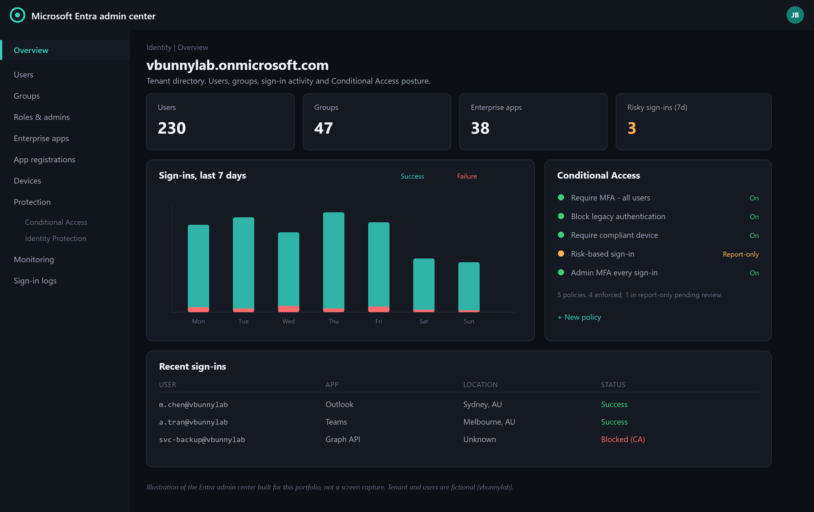

# Microsoft Entra ID

Identity and access management for Microsoft 365 and Azure. Entra ID (formerly Azure Active Directory) is the cloud equivalent of on-premises Active Directory, and in a hybrid environment the two are synchronised with Entra Connect.

The distinction that matters: on-premises AD authenticates against a domain controller you own, on a network you control. Entra ID authenticates over the internet, from anywhere, with no network boundary in front of it. That single difference is why conditional access exists and why identity is now the primary security perimeter.



*The Entra admin center: directory totals, sign-in trend and Conditional Access posture for the tenant.*

---

## What It Provides

| Capability | Purpose |
| --- | --- |
| **Authentication** | Sign-in for Microsoft 365, Azure and third-party SaaS |
| **Single sign-on** | One credential across many applications |
| **Multi-factor authentication** | Second factor on sign-in |
| **Conditional access** | Policy based on user, device, location and risk |
| **Self-service password reset** | Users reset their own passwords |
| **Device identity** | Registered and joined devices, tied to compliance |
| **Identity Protection** | Risk detection on users and sign-ins |
| **Privileged Identity Management** | Just-in-time elevation for admin roles |

> **Licensing shapes what is available.** Conditional access, Identity Protection and PIM need Entra ID P1 or P2. Security Defaults are free. Plan around the licence you actually have rather than the one in the documentation.

---

## Users

### Creating a User

1. Sign in to the [Entra admin center](https://entra.microsoft.com).
2. **Identity** then **Users** then **All users**.
3. **New user** then **Create new user**.
4. Complete:
   - **User principal name**, for example `ballen@vbunnylab.onmicrosoft.com`
   - **Display name**
   - **Password**, auto-generated, with change-on-first-sign-in
   - **Usage location**, required before most licences can be assigned
5. **Review + create**.

> Licences are assigned in the Microsoft 365 admin center or through group-based licensing, not in the Entra user blade. Group-based licensing is the better pattern: add the user to the group, the licence follows.

### Managing Users

| Task | Path |
| --- | --- |
| Reset password | Select user, **Reset password** |
| Block sign-in | Select user, **Block sign-in** |
| Assign a role | Select user, **Assigned roles** |
| Review sign-ins | Select user, **Sign-in logs** |
| Revoke sessions | Select user, **Revoke sessions** |

**Block sign-in, do not delete.** A deleted user goes to the recycle bin for 30 days and then is gone, taking group memberships, licences and mailbox links with it. Blocking is immediate and reversible.

**Revoke sessions is the step people forget.** Blocking sign-in stops *new* authentications. Existing refresh tokens can keep working. During an account compromise, block sign-in, reset the password, **and** revoke sessions, or the attacker keeps their session.

---

## Groups

### Types

| Type | Use |
| --- | --- |
| **Security** | Permissions, conditional access targeting, licence assignment |
| **Microsoft 365** | Collaboration, which also creates a mailbox, SharePoint site and Teams team |

### Membership

| Membership | Behaviour |
| --- | --- |
| **Assigned** | Manually managed |
| **Dynamic User** | Membership from a rule against user attributes |
| **Dynamic Device** | Membership from a rule against device attributes |

Creating a dynamic group:

1. **Groups** then **New group**.
2. Type **Security**, membership type **Dynamic User**.
3. **Add dynamic query** and build the rule:

```text
user.department -eq "IT"
user.accountEnabled -eq true -and user.department -eq "Accounting"
(user.userPrincipalName -contains "@vbunnylab.onmicrosoft.com") -and (user.jobTitle -startsWith "Contract")
```

Dynamic groups are the practical way to keep conditional access and licensing accurate without manual maintenance. They depend entirely on the attributes being populated, so if `department` is blank for half the directory the rule silently under-matches.

> Dynamic membership needs Entra ID P1, and evaluation is not instant. Allow time before testing a rule change.

---

## Multi-Factor Authentication

Three mechanisms exist, and they are commonly confused.

| Mechanism | Status | Notes |
| --- | --- | --- |
| **Per-user MFA** | Legacy | Enabled account by account. Superseded, and it interacts badly with conditional access |
| **Security Defaults** | Free baseline | All-or-nothing MFA for everyone, blocks legacy authentication |
| **Conditional access** | The real control | P1 required, granular, policy-driven |

> **Security Defaults and conditional access are mutually exclusive.** Turning on conditional access requires Security Defaults to be off. A tenant with neither has no MFA enforcement at all, which is worth checking first in any assessment.

### Security Defaults

For a small tenant with no P1 licence this is the correct choice.

1. **Identity** then **Overview** then **Properties**.
2. **Manage security defaults**, set to **Enabled**.

It enforces MFA registration for all users, requires MFA for administrators, and blocks legacy authentication protocols.

### Authentication Methods

**Protection** then **Authentication methods**.

| Method | Recommendation |
| --- | --- |
| SMS / voice | Disable where possible. SIM swap |
| Microsoft Authenticator (push) | Enable, with number matching |
| Authenticator (passwordless) | Enable |
| FIDO2 security key | Enable, required for privileged roles |
| Windows Hello for Business | Enable |
| Temporary Access Pass | Enable, for onboarding and recovery |

**Number matching is not optional any more** and is enforced by Microsoft. It is the control that blunts MFA fatigue attacks, where an attacker with a valid password spams approval prompts until someone taps Approve.

FIDO2 and Windows Hello are **phishing-resistant**: the credential is cryptographically bound to the origin, so an adversary-in-the-middle proxy cannot relay it. Push and TOTP can both be relayed.

---

## Conditional Access

The mechanism that turns identity into a real security control. Each policy is: **if these signals, then these requirements.**

### Building a Policy

1. **Protection** then **Conditional Access** then **New policy**.
2. Name it descriptively. `CA001-Require-MFA-All-Users-Excluding-BreakGlass` beats `Policy 1`.
3. **Assignments**:
   - **Users**: target groups, and set exclusions
   - **Target resources**: cloud apps, or All
   - **Conditions**: locations, device platforms, client apps, sign-in risk
4. **Access controls**: Grant with requirements, or Block.
5. Set **Report-only** first.

### Baseline Policy Set

| Policy | Effect |
| --- | --- |
| Require MFA for all users | The foundation |
| Require MFA for administrators | Stricter, phishing-resistant factors |
| Block legacy authentication | POP, IMAP and SMTP AUTH cannot do MFA, so they bypass it entirely |
| Require compliant device for Microsoft 365 | Ties access to Intune compliance |
| Block access from unexpected countries | Cheap, high-signal |
| Require MFA for risky sign-ins | Needs P2 and Identity Protection |

**Blocking legacy authentication is the highest-value single policy.** Legacy protocols do not support modern authentication, so any conditional access requirement for MFA simply does not apply to them. Password spraying against legacy endpoints was the standard route into Microsoft 365 tenants for years.

### Break-Glass Accounts

**This is the mistake that locks organisations out of their own tenant.**

Create two emergency access accounts and **exclude them from every conditional access policy**:

- Cloud-only, `.onmicrosoft.com`, not synced from on-premises
- Global Administrator
- Very long random passwords, stored offline in a physical safe
- Excluded from all CA policies, including the MFA-for-admins policy
- Excluded from Security Defaults
- Monitored, with an alert on any sign-in

Without them, a misconfigured CA policy, an expired certificate on a federation service, or an MFA provider outage locks out every administrator with no recovery path. Microsoft's own guidance requires them.

> Always deploy a new policy in **Report-only** and read the sign-in logs before enforcing. Report-only shows exactly who would have been blocked.

---

## Self-Service Password Reset

1. **Protection** then **Password reset** then **Properties**.
2. Scope: None, Selected, or All users.
3. **Authentication methods**: require **two** methods.
4. **On-premises integration**: enable password writeback for hybrid, so a cloud reset updates on-premises AD.
5. **Notifications**: alert users and admins on reset.

SSPR removes a large volume of tickets, and it removes the service-desk password reset as a social engineering target. It also has to be configured carefully, because the methods that let a legitimate user recover are the same ones an attacker would use.

---

## Devices

| State | Meaning |
| --- | --- |
| **Registered** | Personal device with access to work resources, BYOD |
| **Entra joined** | Cloud-only corporate device |
| **Hybrid joined** | Joined to on-premises AD and registered to Entra ID |

**Identity** then **Devices** then **All devices** shows join type, ownership, compliance and last activity.

Operationally:

- Review compliance reports and act on non-compliant devices
- Require compliant devices in conditional access, which is what makes Intune compliance enforceable
- Enable **device cleanup** for stale objects. A device record that has not checked in for a year is an account that still exists
- Ensure **BitLocker keys escrow to Entra ID**, and confirm they are actually there before you need one

---

## Privileged Roles

| Role | Scope |
| --- | --- |
| **Global Administrator** | Everything. Keep to a minimum |
| **User Administrator** | Users and groups |
| **Helpdesk Administrator** | Password resets for non-admins |
| **Security Reader** | Read-only across security features |
| **Exchange / SharePoint / Teams Administrator** | Per-workload |

**Microsoft recommends fewer than five Global Administrators.** Most tenants have considerably more, usually because it was easier than finding the right role. Every one is a full compromise of the tenant if taken.

With P2, use **Privileged Identity Management** so admin roles are eligible rather than permanently assigned: the admin activates the role for a limited window, with justification and approval. Standing privilege is the thing attackers look for.

---

## Sign-In Logs and Troubleshooting

**Identity** then **Monitoring** then **Sign-in logs**. This is the first place to look for almost any access problem, and the error code is usually the whole answer.

| Code | Meaning |
| --- | --- |
| 50126 | Invalid username or password |
| 50053 | Account locked by smart lockout, often password spraying |
| 50055 | Password expired |
| 50057 | Account disabled |
| 50058 | Silent sign-in failed, session expired |
| 50074 | MFA required but not satisfied |
| 50076 / 50079 | MFA required, or user must enrol |
| 53003 | Blocked by conditional access |
| 53004 | MFA enrolment required |
| 530032 | Blocked by a security policy |
| 700016 | Application not found in the directory |

### Common Issues

| Symptom | Cause | Action |
| --- | --- | --- |
| Cannot sign in | Password, lockout, MFA, or CA | Read the error code in the sign-in log first |
| Locked out | Smart lockout after repeated failures | Check the source IP. Repeated failures from one address is spraying, not a forgetful user |
| MFA not prompting | Per-user MFA conflicting with CA | Confirm which mechanism is actually in force |
| Blocked unexpectedly | CA policy | Sign-in log shows which policy applied |
| No password reset email | SSPR not enabled or scoped | Check SSPR properties and group scope |
| Group access not working | Membership, or dynamic rule not yet evaluated | Check membership and rule processing state |
| Works on one device, not another | Device compliance or join state | Check the device record |

The sign-in log shows, per attempt, the **conditional access policies evaluated and their result**. That answers "why was this blocked" directly, rather than by elimination.

---

## Identity Protection

With P2, Entra ID scores risk on users and sign-ins.

| Detection | Signal |
| --- | --- |
| Anonymous IP address | Tor or anonymising proxy |
| Atypical travel | Two sign-ins geographically impossible to reconcile |
| Unfamiliar sign-in properties | Deviation from the user's pattern |
| Leaked credentials | Password found in a breach dump |
| Password spray | Pattern across many accounts |

**Protection** then **Identity Protection** holds the risky users and risky sign-ins reports. Wire these into conditional access: require MFA on medium risk, block on high.

**Leaked credentials is the highest-confidence signal there is.** It means that exact password has appeared in a public breach corpus. Treat it as compromised rather than as a warning.

---

## Hybrid Identity

**Entra Connect** synchronises on-premises AD to Entra ID.

| Method | Where authentication happens |
| --- | --- |
| **Password hash sync** | Cloud. A hash of the password hash is synced |
| **Pass-through authentication** | On-premises, via a lightweight agent |
| **Federation (ADFS)** | On-premises federation service |

Password hash sync is the simplest and the most resilient, because it keeps working when the on-premises environment is down. It also enables leaked-credential detection, which the others do not.

Worth knowing: the Entra Connect server holds credentials for both directories and is effectively a tier-0 asset. It should be treated, patched and monitored like a domain controller, not like a utility server.

---

## Security Checklist

- Security Defaults on, or conditional access configured. Not neither
- Legacy authentication blocked
- Two break-glass accounts, excluded from all policies, monitored
- Global Administrators counted and justified
- Phishing-resistant MFA for privileged roles
- SSPR enabled with two methods and writeback for hybrid
- Sign-in and audit logs retained, and forwarded to a SIEM where one exists
- Guest access reviewed. External users accumulate
- Stale devices and dormant accounts cleaned up on a schedule
- New CA policies deployed in report-only first
