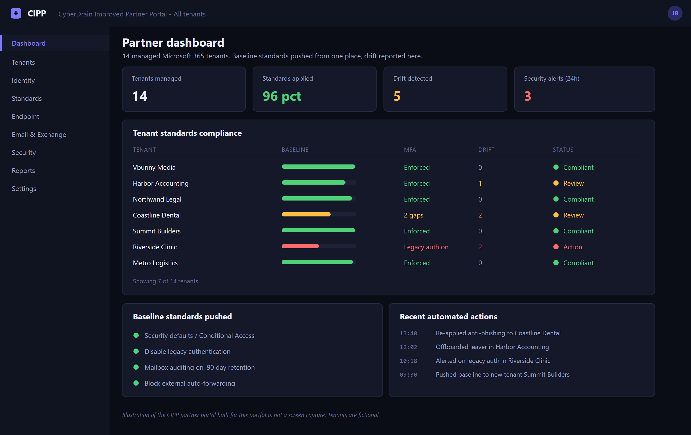

# CIPP Standard Operating Procedures

CIPP is an open-source multi-tenant management portal for Microsoft 365. Built for MSPs managing many client tenants from one console.

The problem it solves: without it, managing 30 clients means signing into 30 tenants separately, applying the same change 30 times, and having no way to confirm they all match. CIPP gives you one pane across all of them.

*The CIPP partner dashboard: every managed tenant in one view, with baseline standards compliance, drift and security alerts surfaced together.*

---

## Hosting

| | Self-hosted | Hosted SaaS |
| --- | --- | --- |
| Software cost | Free, open source | Subscription |
| Infrastructure | Your Azure consumption | Included |
| Maintenance | Yours. Updates, backups, security | Handled for you |
| Control | Full | Managed |

Self-hosting deploys into your own Azure tenant using Functions, Storage and Key Vault. Cheap to run, but you own patching and securing it.

**A self-hosted CIPP instance is a tier-0 asset.** It holds delegated admin access to every client tenant. Treat it accordingly.

---

## GDAP

CIPP depends on **Granular Delegated Admin Privileges**.

GDAP replaced the older DAP model, which handed partners blanket Global Admin over every client tenant with no expiry. GDAP grants specific roles for a set duration.

### Role Mapping

Roles map to groups in your partner tenant.

1. Choose the roles you need, such as Exchange Administrator or Intune Administrator.
2. CIPP creates a matching group in your partner tenant, for example `M365 GDAP Exchange Admin`.
3. Add technicians to those groups.

Membership in a group grants that role across every client tenant it applies to.

**Request only the roles you actually need.** Asking for Global Administrator on every relationship recreates the problem GDAP was designed to fix. A technician who only does Exchange work needs Exchange Administrator, nothing more.

Relationships expire. Enable automatic extension or they lapse and access disappears without warning.

---

## Onboarding a Tenant

Two phases.

### Phase 1: The Relationship

1. **Partner Center.** Send the client a reseller relationship request.
2. **CIPP**, **Tenant Administration**, **GDAP Invite Wizard**. Select roles, generate the invite link.
3. Client Global Admin approves the link.

### Phase 2: Into CIPP

1. **Tenant Administration**, **Tenant Onboarding**.
2. **Sync**. CIPP queries the Partner Center API for new relationships.
3. Run the **GDAP Check** to confirm roles are active.
4. Run the **Permissions Check** to confirm CIPP's service principal has the rights it needs.
5. Both green means the tenant appears in the selector.

**Allow 15 to 30 minutes after client approval.** Microsoft's APIs do not report the relationship instantly. A tenant not appearing straight away is usually propagation, not a fault. Wait before troubleshooting.

---

## User Management

**Identity Management**, **Administration**, **Users**.

A user profile shows licensing, storage, last sign-in, applied conditional access policies and remediation history in one view. That last part matters. Seeing which CA policies apply to a user answers most access questions without opening Entra.

### Daily Actions

- Reset password
- Send an MFA push
- Unlock the account
- Edit properties and licences
- Revoke sessions

### Just-In-Time Admin

Create a temporary admin account with a scheduled start and end. It expires on its own.

This is the right pattern for a technician who needs elevated access for one piece of work. No standing privilege, nothing to remember to remove.

### Offboarding Wizard

One of the strongest features. Select the tenant, select the user, choose the actions:

- Disable sign-in
- Revoke all sessions
- Reset the password
- Convert the mailbox to shared
- Remove licences
- Cancel future calendar events
- Remove from groups
- Set out of office
- Forward mail to a manager

**Consistency is the point.** Offboarding done by hand misses steps, and the step missed is usually session revocation or licence removal. A wizard runs the same list every time, and the run is logged.

---

## Intune Across Tenants

**Intune**, **Devices**.

Remote actions across every tenant from one view. Wipe, retire, fresh start, sync, rename.

**Applications** deploys apps to selected tenants, with a queue showing status.

**Configuration policies** and the **Apply Policy Wizard** push the same policy to many tenants in three steps. Select tenants, configure, confirm.

That is the core value. Deploying a compliance policy to 30 tenants individually is a day's work. Here it is one operation.

---

## Exchange

**Message trace** across the last 10 days, without signing into each tenant. This alone saves a lot of time on a busy day.

**Quarantine** management, release or block.

**Mailbox actions**: convert to shared, delegation, permissions.

**Resources and contacts**, including contact templates to standardise address books across clients.

---

## Standards and Drift

The feature that separates CIPP from a convenience console.

### Standards

Baseline settings applied automatically across tenants. Re-applied every four hours.

Roughly 150 available, covering conditional access, Exchange settings, Intune configuration, security defaults and more.

Set a standard once, apply it to the tenants you choose, and CIPP keeps it in place. Someone turning a setting off in a client tenant gets it turned back on within four hours.

### Drift Detection

Evaluates every twelve hours and reports configuration that has moved away from the template.

- One drift template per tenant
- Monitors security standards, conditional access and Intune
- Detects changes made outside CIPP

**Drift detection is what catches the change nobody told you about.** A client's internal IT person disabling MFA, or a setting changed during a support call and never reverted. Without it, you find out when something goes wrong.

---

## Scheduler and Templates

**Scheduler** runs scripts and compliance checks on a schedule, pushing results to a PSA, a webhook or email. Useful for recurring reporting without anyone remembering to run it.

**Template Library** snapshots a tenant's configuration, such as Intune policies or transport rules, and saves it for deployment elsewhere.

That is how you take a well-configured tenant and make it the baseline for new clients. Onboarding becomes applying a template rather than rebuilding from scratch.

---

## Security Notes

CIPP holds delegated administrative access to every client tenant. That makes it one of the highest-value targets an MSP operates.

- **MFA on every CIPP user.** No exceptions
- **Conditional access on the partner tenant**, restricting where the console can be accessed from
- **Least privilege GDAP roles.** Request what is needed, not Global Admin everywhere
- **Review the audit log.** Every action is recorded and should be read
- **Keep a self-hosted instance patched.** It runs in your Azure tenant and it is yours to maintain
- **Remove technician access immediately when someone leaves.** Group membership grants access across every client
- **Enable automatic GDAP extension**, or relationships lapse silently

An attacker with access to an MSP's management portal reaches every client at once. That is a known attack pattern against MSPs, and the portal is the target rather than the clients.
