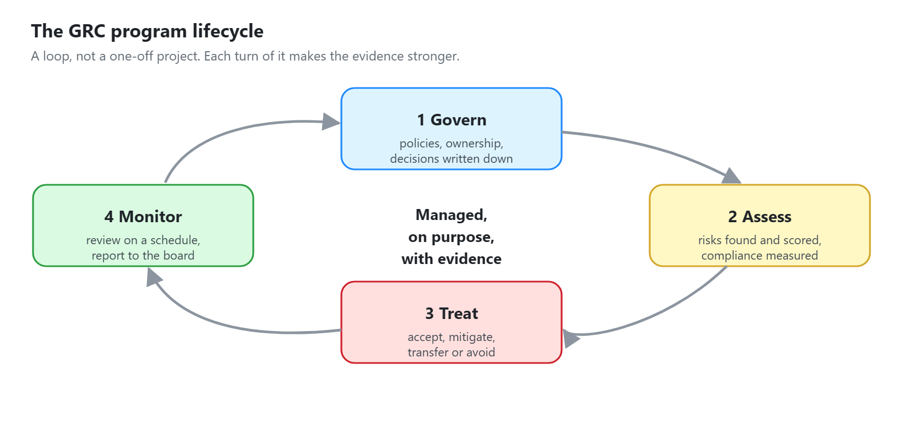
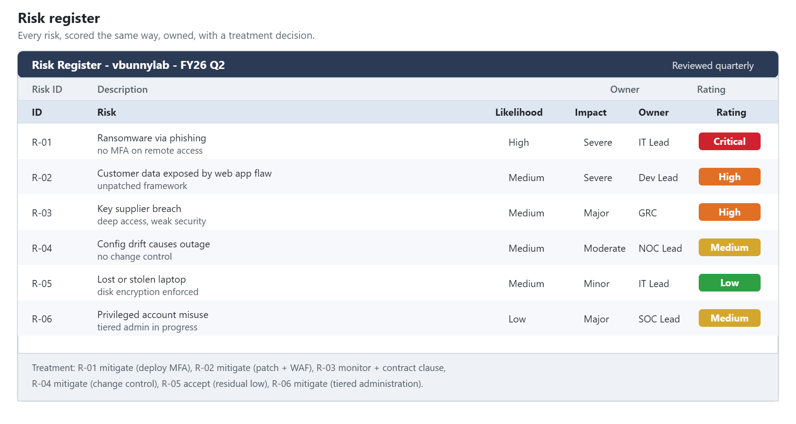
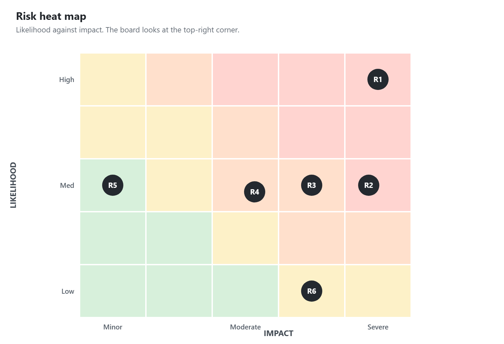
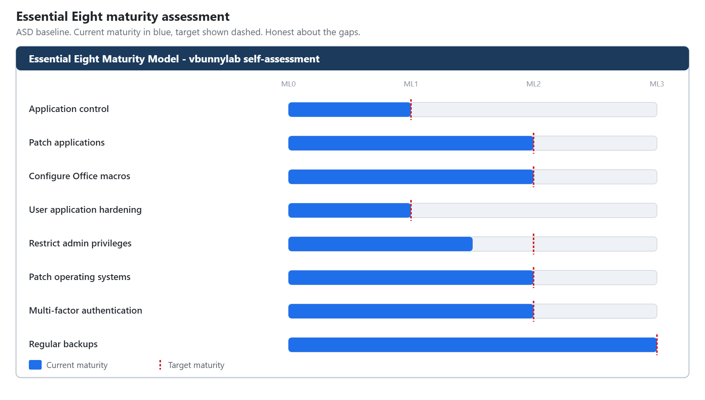
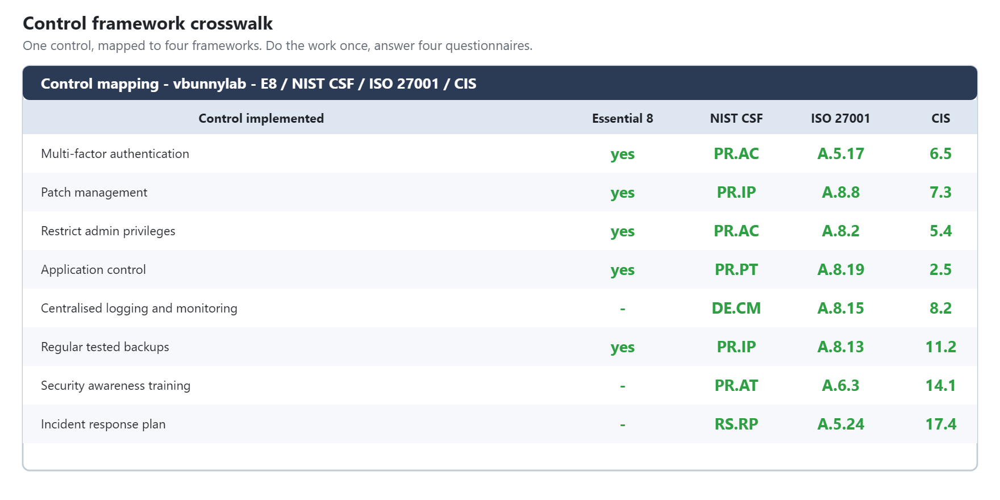
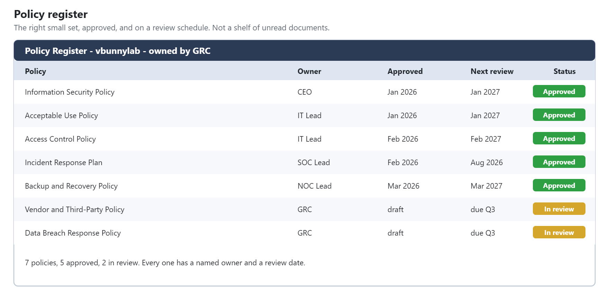
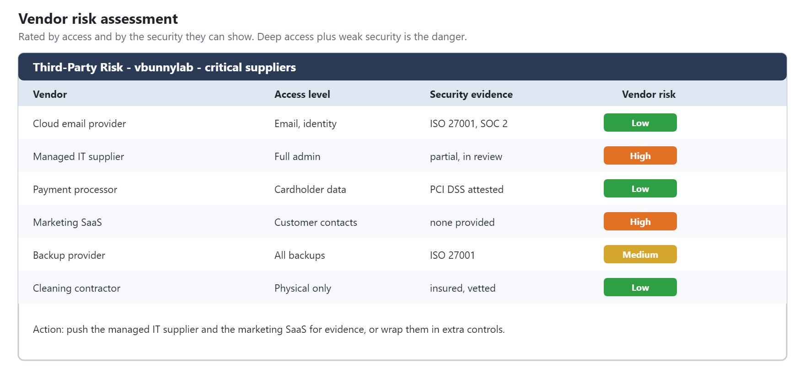
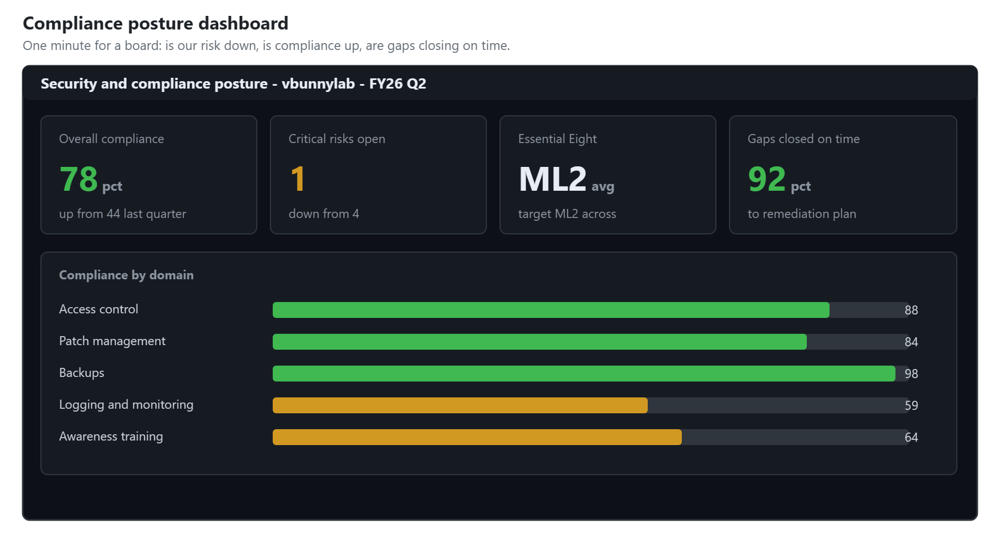

# GRC-01: Governance, Risk and Compliance Program

**Role target:** GRC Analyst, Security Governance, Risk and Compliance
**Theme:** Turn security from a pile of ad hoc fixes into a managed program an auditor, a regulator and a board can all trust.
**Environment:** A governance program built for the same fictional small company the rest of this portfolio models, `vbunnylab`
**Frameworks:** ASD Essential Eight, NIST Cybersecurity Framework, ISO 27001, CIS Controls

> Everything here is a lab I built. The company, its data and its auditors are fictional. It shows the tools and documents a GRC analyst produces, so a non-technical reader can see the work and a technical reader can see I know what each artefact contains.

---

## What A GRC Analyst Actually Does

The technical roles in this portfolio stop a breach. GRC is the role that proves, to people who will never read a log, that the organisation is managing its risk on purpose. It is the translation layer between the security team and the auditor, the insurer, the regulator and the board.

A GRC analyst answers three questions, forever, with evidence:

1. **Governance.** Who decided this, and is it written down?
2. **Risk.** What could hurt us, how badly, and what are we doing about it?
3. **Compliance.** Can we prove we are doing what we said, to the standard we claimed?

This project is the artefacts that answer those three questions for a small business.

---

## Risk: The Register And The Heat Map

The core artefact of the whole discipline is the risk register. Every risk the business faces, scored the same way, owned by a named person, with a decision recorded about what to do. Not a document that is written once and filed. A living record that is reviewed on a schedule.

Each risk is scored on likelihood and impact, and plotted so that leadership can see, in one glance, which handful of risks actually matter. A board does not read forty risk entries. They look at the top-right corner of this chart.

**The discipline that matters is consistency.** Every risk scored by the same rules, so that "high" means the same thing for a ransomware risk as for a supplier risk. Without that, a risk register is just opinions in a table. With it, it is a tool for deciding where the money goes.

---

## Compliance: The Essential Eight

For an Australian small business, the Australian Signals Directorate Essential Eight is the baseline that matters, and it is where a GRC program starts. It is eight mitigation strategies, each assessed at a maturity level from zero to three.

This assessment is honest about where the lab sits: strong on some strategies, partway on others, with a clear target maturity and a plan to reach it. An assessment that claims Maturity Level 3 across the board is one no auditor believes, because almost nobody is there. The value is in the gap and the plan, not in a perfect score.

---

## Governance: Mapping The Frameworks Together

Small businesses get asked to comply with different things by different people. The insurer wants one thing, a big customer's security questionnaire wants another, and good practice wants a third. A GRC analyst maps them to each other so the work is done once and counted many times.

This crosswalk shows how one set of controls satisfies the Essential Eight, the NIST Cybersecurity Framework, ISO 27001 and the CIS Controls at the same time. Implement the control once, and it answers four questionnaires. That mapping is the single most leveraged thing a GRC analyst does, because it turns four compliance projects into one.

---

## The Policy Set

Governance is written down or it does not exist. A GRC analyst owns the policy set: the documents that say what the organisation requires, who approved them, and when they are next reviewed.

The point is not to have the most policies. It is to have the right small set, actually approved, actually reviewed, and actually followed. A shelf of unread policies fails the first audit question, which is always "show me this being done", not "show me that you wrote it down".

---

## Third-Party Risk

Most breaches now come through a supplier. A GRC program assesses the vendors the business depends on, so a weak link in someone else's security does not become your incident.

Each vendor is rated by the access they have and the security they can demonstrate. The ones with deep access and weak security are the ones to push, drop, or wrap in extra controls. It is the same risk thinking as the register, pointed outward.

---

## Reporting To Leadership

The output of all of this is one dashboard a board can read in a minute: are we getting more compliant, is our risk going down, and are the gaps being closed on schedule.

The headline a board remembers: the business can now prove its security posture to a customer, an insurer or a regulator, on demand, with evidence. That is what GRC delivers that no firewall can.

---

## Skills This Demonstrates

| Area | Evidence |
| --- | --- |
| Risk management | A scored register and heat map with owners and treatments |
| Compliance assessment | Essential Eight maturity, honest about the gaps |
| Framework knowledge | A crosswalk across E8, NIST CSF, ISO 27001 and CIS |
| Policy and governance | A reviewed, approved policy set, not a shelf of documents |
| Third-party risk | Vendor assessments rated by access and security |
| Leadership reporting | A posture dashboard that answers the board's actual question |
| Evidence thinking | Everything built to answer "show me", not "tell me" |
| Honesty | No claimed perfect scores, gaps named with a plan |

---

## Honest Notes

**The company and its auditors are fictional.** The frameworks, the scoring method, the control mappings and the structure of every artefact are real and are what a GRC analyst produces. What a lab cannot reproduce is the politics: getting a busy manager to accept a risk, or an executive to fund a control. That negotiation is most of the real job, and no lab teaches it.

**GRC is only as good as its follow-through.** A register nobody reviews and a policy nobody follows are worse than nothing, because they create false confidence. The schedules and review dates in these artefacts are the part that makes them real, and they are included on purpose.

---

Back to the [portfolio home](../README.md).
