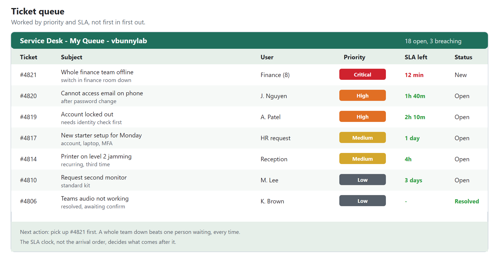
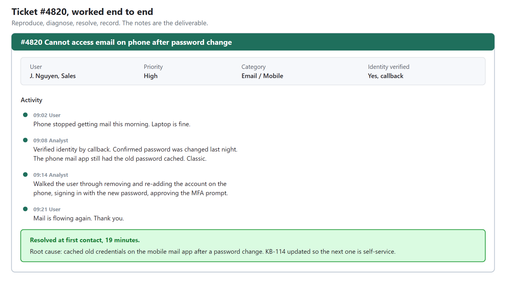
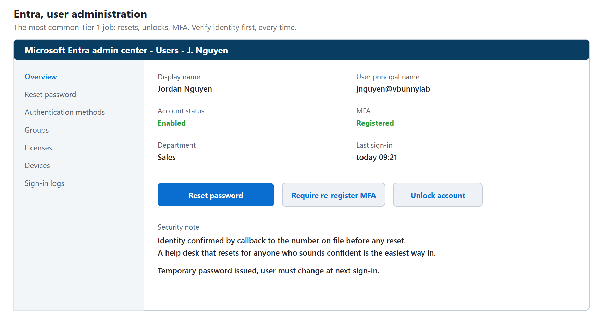
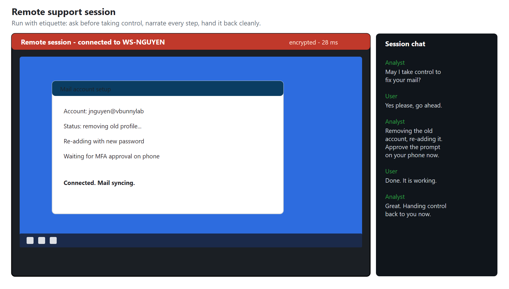
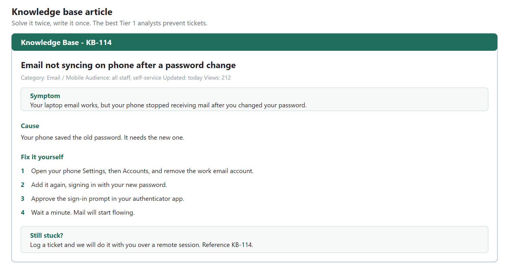
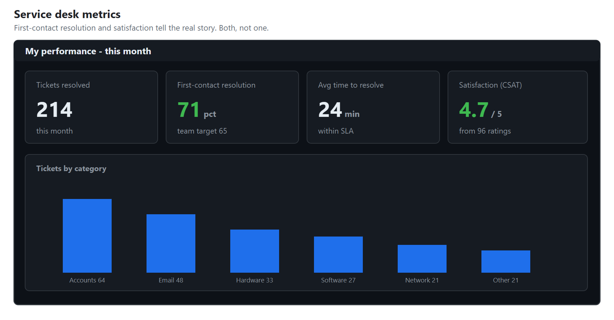

# HD-01: Service Desk, Tier 1 Support

**Role target:** Help Desk Analyst, Service Desk, IT Support Tier 1
**Theme:** First contact. Fix it fast, fix it kindly, and know when to escalate.
**Environment:** Internal IT and small-client support for `vbunnylab`
**Tools:** Ticketing (HaloPSA style), Microsoft Entra and Active Directory, remote support, a knowledge base

> Everything here is a lab I built. The users, tickets and data are fictional. The images are **realistic illustrations of the tools a Tier 1 analyst uses, labelled as illustrations, not screen captures of a real system.** They show what the work looks like. Swap in your own real screenshots to make them evidence.

---

## What Tier 1 Actually Does

Tier 1 is the front door of IT. It is the role that most people in a company ever actually see, and it sets whether they trust the IT team or dread calling it. The job is two things at once: solve the common problems quickly, and make the person on the other end feel looked after while you do.

A good Tier 1 analyst:

1. **Resolves at first contact** whatever can be resolved at first contact.
2. **Logs everything** so the next person is not starting from nothing.
3. **Escalates cleanly** when it is beyond the tier, with the work already half done.
4. **Communicates like a human**, not like a terminal.

This project is the day of a Tier 1 analyst, shown through the tools and the tickets.

---

## The Queue

The ticket queue is where the day lives. The skill is triage: pick up the right ticket next, by priority and by how long it has been waiting against its SLA, not just the one at the top.

Priority is not first-come-first-served. A whole team down beats one person with a cosmetic issue, every time, and the queue is worked that way. The SLA clock on each ticket is the thing that keeps that honest.

---

## A Ticket, Worked End To End

A ticket is not closed when the problem stops. It is closed when it is documented so the next person understands what happened. This is one ticket, worked the way they all should be: reproduce, diagnose, resolve, record.

The notes matter as much as the fix. Six months later, when the same thing happens to someone else, these notes are what turns a thirty-minute investigation into a two-minute resolution.

---

## The Bread And Butter: Accounts

The single most common Tier 1 job is accounts: resets, unlocks, MFA, and joiners and leavers. This is the Entra admin view where most of it happens.

Every one of these actions is also a small security decision. Verify who you are talking to before you reset a password, because a help desk that resets passwords for anyone who sounds confident is the easiest way into a company. Tier 1 is the first line of that defence.

---

## Remote Support

Half of Tier 1 is done on someone else's screen. A remote session, run politely and narrated so the user knows what you are doing, turns a scary problem into a solved one.

The etiquette is the skill here: ask before you take control, say what you are about to do, and hand it back cleanly. People remember how it felt, not what the fix was.

---

## The Knowledge Base

The difference between a help desk that scales and one that drowns is the knowledge base. Every problem solved twice should be written up once, so the third time anyone, including the user, can fix it.

Writing good articles is a core Tier 1 skill that juniors underrate. A clear article turns a ticket into a self-service answer, and the best Tier 1 analysts are measured partly by how many tickets they prevent.

---

## The Numbers That Matter

A service desk is measured on a few things, and a good analyst knows theirs. Volume, how fast tickets are resolved, how many are fixed at first contact, and whether people were happy.

**First-contact resolution and customer satisfaction are the two that tell the real story.** Speed without satisfaction means rushed, unhappy users. Satisfaction without resolution means nice chats that fix nothing. The job is both.

---

## Skills This Demonstrates

| Area | Evidence |
| --- | --- |
| Ticketing and triage | Working a queue by priority and SLA, not first-in-first-out |
| Account administration | Resets, unlocks, MFA, joiners and leavers in Entra and AD |
| Remote support | Sessions run with etiquette and clear communication |
| Documentation | Knowledge base articles that prevent future tickets |
| Security awareness | Verifying identity before account actions |
| Customer service | Communicating like a human, measured on satisfaction |
| Escalation | Clean handoffs with the groundwork already done |

---

## Honest Notes

**The users and tickets are fictional.** The tools, the workflow, the triage logic and the way a ticket is documented are exactly what the real job looks like. What a lab cannot give you is the hardest part of Tier 1: staying patient and kind with a frustrated person on a bad day. That is learned on the phones.

**The images are illustrations**, labelled as such. Your own screenshots from a real ticketing system and admin console are the genuine evidence, and the detail here is enough to recreate them.

The next tier up, [HD-02](../Help-Desk-2/), is where the tickets that cannot be fixed at first contact go.

---

Back to the [portfolio home](../README.md).
