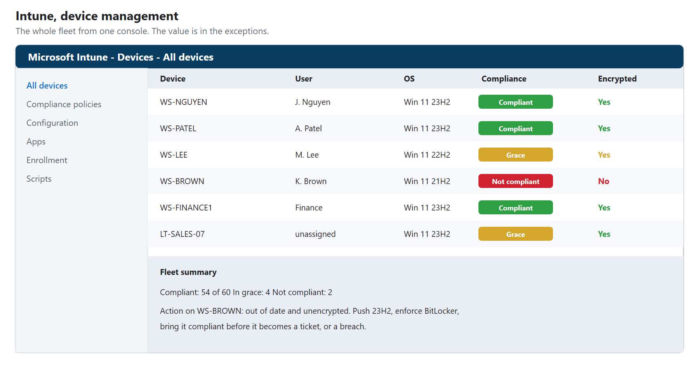
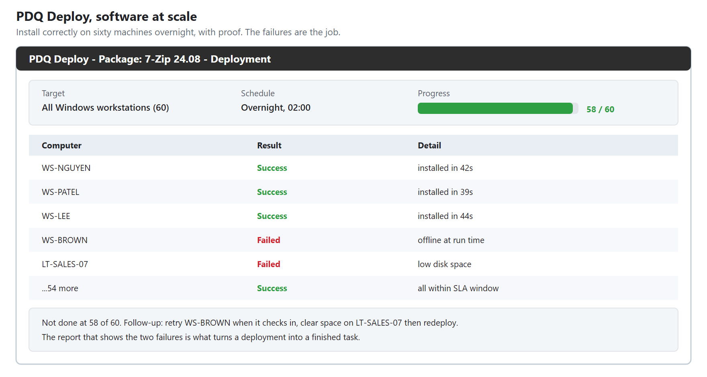
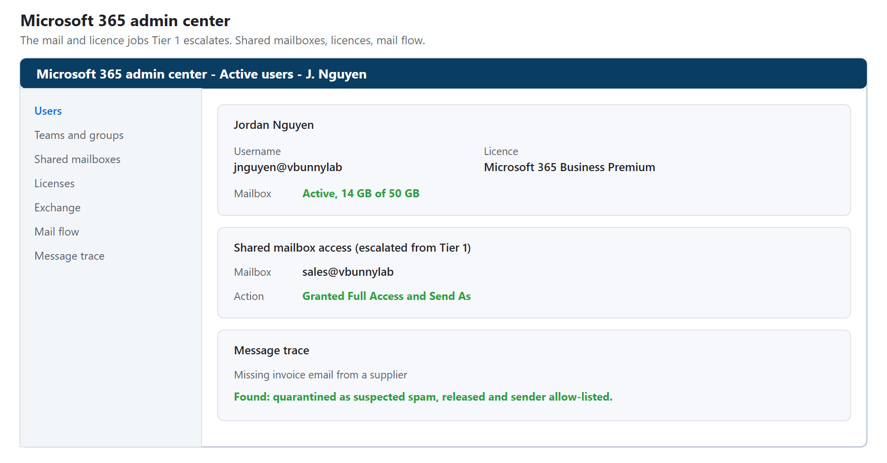
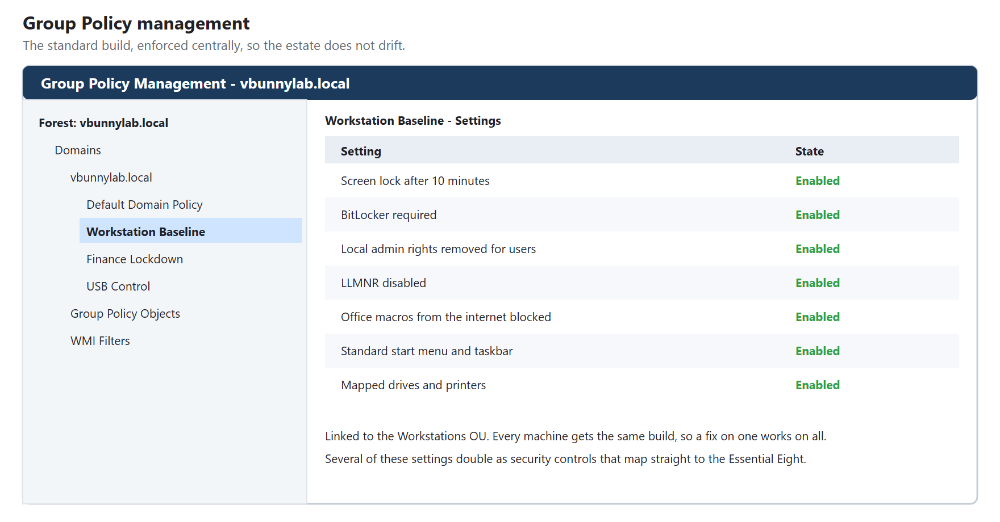
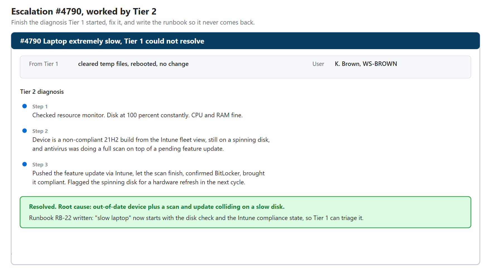
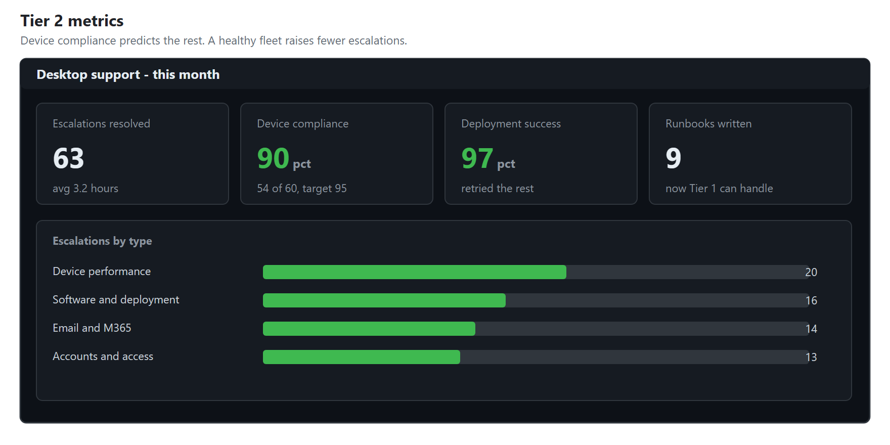

# HD-02: Desktop Support, Tier 2

**Role target:** Desktop Support, Deskside Support, IT Support Tier 2
**Theme:** The escalation tier. Fix what Tier 1 cannot, and manage the fleet so fewer things break.
**Environment:** Internal IT and small-client support for `vbunnylab`
**Tools:** Microsoft Intune, PDQ Deploy, Microsoft 365 admin, Group Policy, Entra and Active Directory

> Everything here is a lab I built. The devices, users and data are fictional. The images are **realistic illustrations of the consoles a Tier 2 analyst uses, labelled as illustrations, not screen captures.** Swap in your own real exports to make them evidence.

---

## What Tier 2 Actually Does

Tier 1 handles the common and the quick. Tier 2 handles the rest: the escalations that need more depth, and the fleet management that stops problems before a ticket is ever raised. It is the first tier that is as much about the estate as about the individual user.

A good Tier 2 analyst:

1. **Takes escalations cleanly** and finishes the diagnosis Tier 1 started.
2. **Manages devices at scale** with MDM, not one machine at a time.
3. **Deploys and patches software** to many machines, repeatably.
4. **Administers the platforms**, Microsoft 365, Entra and Group Policy.
5. **Writes the runbook** so the fix becomes a Tier 1 fix next time.

---

## Managing The Fleet With Intune

The biggest shift from Tier 1 is scale. Instead of fixing one laptop, you manage all of them from one console: compliance, configuration, and apps pushed to every device at once.

The value is in the exceptions. The console shows at a glance which devices are non-compliant, out of date, or unencrypted, so they can be fixed before they become an incident. One non-compliant laptop is a ticket waiting to happen.

---

## Deploying Software At Scale

Installing an app on one machine is Tier 1. Installing it correctly on sixty machines, overnight, with a record of which succeeded, is Tier 2.

The skill is repeatability and proof. A deployment that works on fifty-eight of sixty machines is not done. The two failures are the job, and the report that shows them is what turns a deployment into a finished task.

---

## Administering Microsoft 365

A lot of Tier 2 is in the Microsoft 365 admin center: mailboxes, shared mailboxes, distribution lists, licences, and the mail problems that are beyond resetting a password.

The common Tier 2 jobs here are the ones Tier 1 escalates: a shared mailbox someone needs access to, a licence that needs assigning, a mail flow rule, or a message that is not arriving and needs tracing.

---

## Group Policy And Standard Configuration

Tier 2 owns the standard build: what every machine gets, enforced centrally, so the estate is consistent and does not drift into a hundred slightly different configurations.

A consistent build is the quiet thing that prevents tickets. When every machine is configured the same way, a fix that works on one works on all, and a problem that appears on one is caught before it spreads.

---

## An Escalation, Worked

This is what an escalation looks like from the Tier 2 side: the handoff from Tier 1, the deeper diagnosis, and the fix, with a runbook written so it does not need to come to Tier 2 again.

**The best Tier 2 work makes itself unnecessary.** Every escalation that gets turned into a runbook and a knowledge base article is one that Tier 1 handles alone next time, which is how a support team gets faster over time instead of just busier.

---

## The Numbers That Matter

Tier 2 is measured on escalation resolution, deployment success, and how healthy the fleet is kept.

Device compliance is the number that predicts the others. A fleet that is patched, encrypted and configured correctly generates fewer escalations, so the time spent keeping compliance high pays itself back in tickets that never happen.

---

## Skills This Demonstrates

| Area | Evidence |
| --- | --- |
| Device management | Intune compliance, configuration and app deployment at scale |
| Software deployment | PDQ packages pushed and verified across the fleet |
| Microsoft 365 admin | Mailboxes, shared mailboxes, licences, mail flow |
| Group Policy | A consistent standard build, enforced centrally |
| Escalation handling | Clean handoffs finished with a runbook |
| Fleet health | Compliance kept high to prevent tickets |
| Documentation | Turning escalations into Tier 1 runbooks |

---

## Honest Notes

**The devices and tenant are fictional.** The consoles, the workflows and the way a deployment or escalation is handled are exactly the real job. What a lab cannot reproduce is the scale and the mess of a real estate that has grown over years, with exceptions and legacy nobody documented.

**The images are illustrations**, labelled as such. Your own exports from a real Intune tenant, PDQ console and Microsoft 365 admin center are the genuine evidence.

Below this tier, [HD-01](../Help-Desk-1/) handles first contact. Above it, [HD-03](../Help-Desk-3/) handles root cause and automation.

---

Back to the [portfolio home](../README.md).
