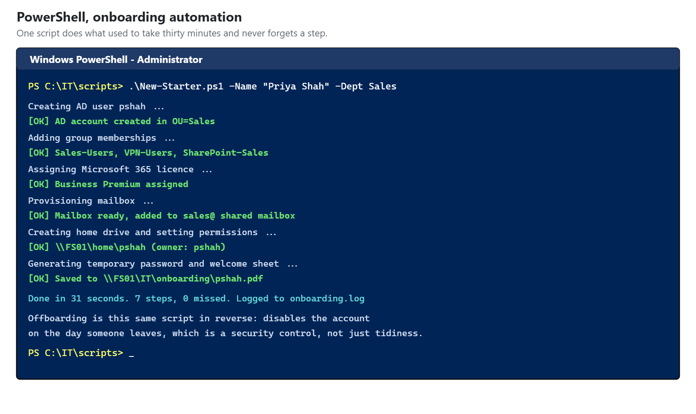
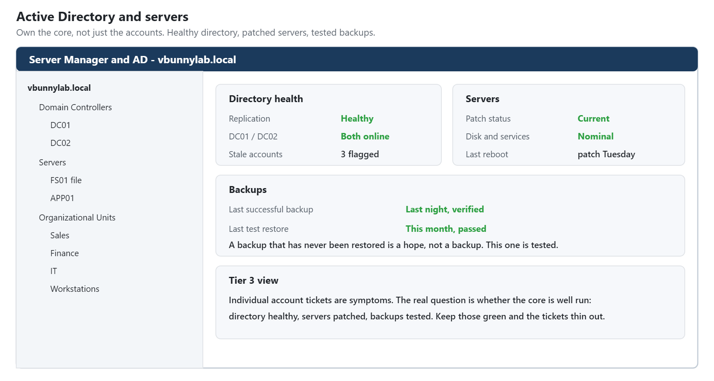
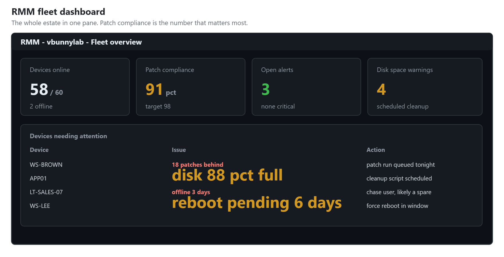
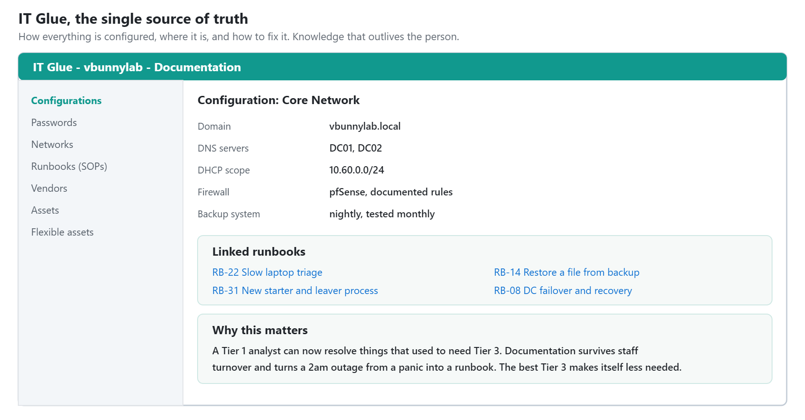
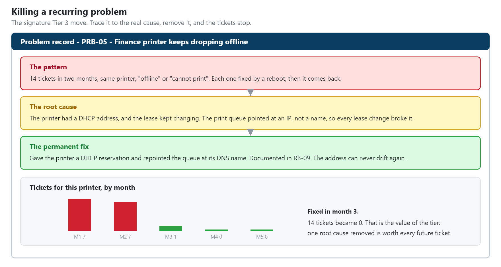
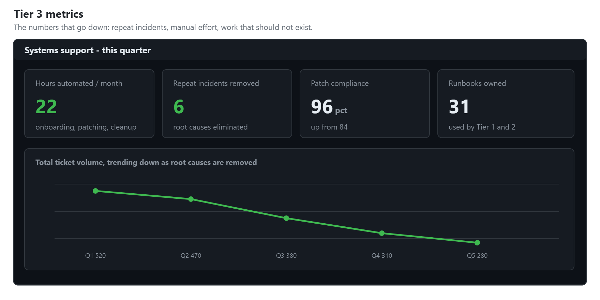

# HD-03: Systems Support, Tier 3

**Role target:** Senior IT Support, Systems Administrator, Escalation Engineer, Tier 3
**Theme:** Stop the tickets from happening. Fix the root cause, automate the toil, and build what the other tiers use.
**Environment:** Internal IT and systems administration for `vbunnylab`
**Tools:** PowerShell, Active Directory and Windows Server, an RMM platform, IT Glue documentation

> Everything here is a lab I built. The systems, users and data are fictional. It shows the tools a Tier 3 engineer works in, including a Windows terminal with real commands.

---

## What Tier 3 Actually Does

Tier 1 fixes the ticket. Tier 2 fixes the device. Tier 3 fixes the reason the ticket keeps happening, and builds the automation and systems the other tiers rely on. It is the bridge from support into systems administration.

A good Tier 3 engineer:

1. **Finds the root cause** of recurring problems and removes it, permanently.
2. **Automates the repetitive work** so nobody does it by hand again.
3. **Owns the core systems**, Active Directory, servers, patching.
4. **Documents everything** so the knowledge is not trapped in one head.
5. **Mentors Tier 1 and Tier 2**, turning tickets into learning.

---

## Automating The Toil

The clearest Tier 3 skill is PowerShell. Instead of clicking through twenty steps to onboard a new starter, you run one script that does it all, the same way every time, with a log.

The win is consistency and time. A manual onboarding takes thirty minutes and misses a step one time in five. The script takes thirty seconds and never forgets the mailbox, the groups, the licence or the home drive. Offboarding is the same script in reverse, which is also a security control: accounts actually get disabled on the day someone leaves.

---

## Owning Active Directory And The Servers

Tier 3 is where you own the core systems rather than just use them. Active Directory structure, servers, roles, and the health of the things everything else depends on.

The mindset shift is from "fix this account" to "is the directory healthy, are the servers patched, is replication working, are the backups tested". The individual tickets become symptoms of whether the core is well run.

---

## Managing The Fleet With RMM

An RMM platform is how a small team keeps a whole estate healthy: patch status, monitoring, alerts and remote action across every machine from one pane.

Patch compliance is the number that matters most here, because unpatched machines are both the most common cause of incidents and the easiest thing to fix at scale. A fleet kept current is a fleet that generates far fewer tickets and is far harder to breach.

---

## Documentation That Outlives The Person

The difference between a team that scales and one that depends on a hero is documentation. Tier 3 owns the single source of truth: how everything is configured, where it is, and how to fix it.

Good documentation is a force multiplier. It lets a Tier 1 analyst resolve something that used to need Tier 3, it survives staff turnover, and it turns a 2am outage from a panic into a runbook. The best Tier 3 engineers are measured partly by how little the team needs them personally.

---

## Killing A Recurring Problem

This is the signature Tier 3 move: a problem that keeps generating tickets, traced to its real cause, and removed so it never comes back.

**A ticket closed is worth one. A root cause removed is worth every future ticket it prevents.** Tier 1 and Tier 2 keep the water out with buckets. Tier 3 finds the hole and fixes it. That is the whole value of the tier.

---

## The Numbers That Matter

Tier 3 is measured on things that go down: repeat incidents, manual effort, and the time the team spends on work that should not exist.

Hours automated and repeat incidents eliminated are the two that tell the story. A Tier 3 engineer who is busy with the same tickets every week is not doing the job. One whose ticket types keep disappearing is.

---

## Skills This Demonstrates

| Area | Evidence |
| --- | --- |
| Automation | PowerShell onboarding and offboarding, repeatable and logged |
| Systems administration | Active Directory and Windows Server ownership |
| Fleet management | RMM, patch compliance kept high across the estate |
| Documentation | A single source of truth that outlives the person |
| Root cause analysis | Recurring problems traced and eliminated |
| Security by habit | Offboarding that actually disables accounts on time |
| Mentoring | Turning Tier 3 fixes into Tier 1 runbooks |

---

## Honest Notes

**The systems and data are fictional.** The scripts, the consoles, the administration and the root-cause method are exactly the real job. What a lab cannot give you is the weight of a production outage at 2am with real people waiting, which is where a Tier 3 engineer earns their keep.

The PowerShell shown is realistic and non-destructive.

This is the top of the support ladder in this portfolio. The natural next step from here is a dedicated systems administration or cloud role, which is where several of the other projects here already point.

---

Back to the [portfolio home](../README.md).
