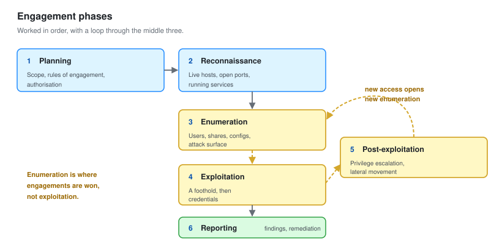

# 01 - Engagement Setup

Scope, rules of engagement, methodology, and the lab this was run against.

---

## Authorisation

The environment assessed here is a lab I own, built on my own hardware, isolated from every other network.

```text
Asset owner       Self
Systems           6 virtual machines on a private Proxmox host
Network           10.50.10.0/24, no route to any external network
Data              Synthetic. No real personal or business data exists
Authorisation     Self-authorised, sole owner
```

**This section is not a formality.** Testing without written authorisation is a criminal offence in most countries, and the willingness to write the scope down before touching anything is the first thing that separates a professional from somebody running tools.

In a client engagement this section holds the signed authorisation letter, the named approver, the emergency contact, and the testing window. It goes in the report. It is the first page.

---

## Rules of Engagement

| | |
| --- | --- |
| **In scope** | `10.50.10.0/24`, all hosts, the `ptlab.local` domain |
| **Out of scope** | The Proxmox hypervisor, the management interface, anything outside the lab VLAN |
| **Starting position** | Assumed breach. Network access, no credentials |
| **Window** | Unrestricted |
| **Permitted** | Enumeration, exploitation, privilege escalation, lateral movement, credential attacks, persistence |
| **Prohibited** | Denial of service, destructive payloads, ransomware simulation, physical attacks, social engineering of real people |
| **Evidence** | Command output and screenshots retained. No data exfiltrated |
| **Cleanup** | All persistence removed. Snapshot rollback after testing |

### Why assumed breach

Three starting positions are common on an internal test.

| Position | The question it answers |
| --- | --- |
| **Black box, external** | Can somebody get in from the internet |
| **Assumed breach, no credentials** | Once somebody is on the network, how far do they get |
| **Assumed breach, with a user account** | If one employee is compromised, how far does it go |

**Assumed breach with no credentials is the most useful for a small environment.** It skips the argument about whether initial access is possible, which it almost always is, and spends the time on the part clients actually need answering.

---

## Methodology



Six phases, worked in order, with a loop between three and five.

| Phase | Output |
| --- | --- |
| **1. Planning** | Scope, rules of engagement, authorisation |
| **2. Reconnaissance** | Live hosts, open ports, running services |
| **3. Enumeration** | Users, shares, configurations, attack surface |
| **4. Exploitation** | A foothold, then credentials |
| **5. Post-exploitation** | Privilege escalation, lateral movement, reach |
| **6. Reporting** | Findings, evidence, remediation |

### The loop

Phases 3 to 5 are not linear. Every new credential opens enumeration you could not do before.

```text
Enumerate  ->  Exploit  ->  New access  ->  Enumerate again
     ^                                            |
     +--------------------------------------------+
```

**That loop is the whole job.** Anonymous enumeration finds a user list. The user list enables a spray. The spray gives a credential. The credential enables authenticated enumeration, which finds far more than the anonymous pass did. Each turn of the loop widens what you can see.

The most common junior mistake is going straight to exploitation with the first thing found, instead of finishing enumeration. **Enumeration is where engagements are won.**

### Document as you go

Every command, every result, timestamped. Not afterwards.

```bash
# Log everything for the session
script -a ~/engagement/logs/session-$(date +%Y%m%d-%H%M).log
```

Reconstructing a week of testing from memory does not work, and a finding you cannot evidence is a finding you cannot report.

---

## Evidence Handling

```text
engagement/
  01-recon/
      nmap-discovery.txt
      nmap-full-tcp.xml
  02-enum/
      smb-shares.txt
      ldap-users.txt
      bloodhound/
  03-access/
      spray-results.txt
      hashes/
  04-loot/
      screenshots/
  logs/
      session-*.log
  notes.md
```

Three rules.

**Timestamp everything.** A finding without a time is hard to correlate with the client's own logs, and clients ask.

**Screenshot the moment it works.** You will not want to recreate it, and a redacted screenshot is the clearest possible evidence in a report.

**Redact before it leaves your machine.** Real password hashes, real tokens and real personal data do not belong in a report. Show enough to prove the finding, no more.

---

## The Lab Build

Six machines on Proxmox, VLAN 50, isolated.

| VM | Name | OS | Role | Address |
| --- | --- | --- | --- | --- |
| 201 | `DC01` | Windows Server 2022 | Domain controller | 10.50.10.10 |
| 202 | `SRV-FILE01` | Windows Server 2022 | File server | 10.50.10.20 |
| 203 | `SRV-WEB01` | Ubuntu 22.04 | Internal web app | 10.50.10.30 |
| 210 | `WS-01` | Windows 11 | Standard workstation | 10.50.10.101 |
| 211 | `WS-02` | Windows 11 | IT staff workstation | 10.50.10.102 |
| 250 | `KALI` | Kali Linux | Testing platform | 10.50.10.200 |

Build steps follow the same pattern as [the lab course](../Blue-Team-Lab-Course/01-Build-Your-Lab.md), with a different subnet and domain.

### Accounts

```powershell
# Domain: ptlab.local
$pw = ConvertTo-SecureString 'P@ssw0rd2024!' -AsPlainText -Force

New-ADUser -Name "Alex Rivera"   -SamAccountName "arivera" -AccountPassword $pw -Enabled $true
New-ADUser -Name "Priya Shah"    -SamAccountName "pshah"   -AccountPassword $pw -Enabled $true
New-ADUser -Name "Tom Becker"    -SamAccountName "tbecker" -AccountPassword $pw -Enabled $true
New-ADUser -Name "Dana Okoro"    -SamAccountName "dokoro"  -AccountPassword $pw -Enabled $true
New-ADUser -Name "IT Support"    -SamAccountName "itsupport" -AccountPassword $pw -Enabled $true

# Deliberately weak, and deliberately privileged
$weak = ConvertTo-SecureString 'Autumn2024!' -AsPlainText -Force
New-ADUser -Name "SQL Service" -SamAccountName "svc_sql" `
    -AccountPassword $weak -Enabled $true -PasswordNeverExpires $true `
    -ServicePrincipalNames "MSSQLSvc/srv-file01.ptlab.local:1433"

$weak2 = ConvertTo-SecureString 'Backup#2024' -AsPlainText -Force
New-ADUser -Name "Backup Service" -SamAccountName "svc_backup" `
    -AccountPassword $weak2 -Enabled $true -PasswordNeverExpires $true
Add-ADGroupMember -Identity "Backup Operators" -Members "svc_backup"

Add-ADGroupMember -Identity "Domain Admins" -Members "itsupport"
```

### Misconfigurations introduced on purpose

Each of these maps to a finding in [08-Findings-Report.md](08-Findings-Report.md). All of them are things I have seen described as common in real small environments.

| Misconfiguration | Why it is realistic | Finding |
| --- | --- | --- |
| Service accounts with seasonal passwords | Somebody had to type it once and remember it | PT-01, PT-02 |
| Same local administrator password everywhere | The image was cloned | PT-03 |
| Unconstrained delegation on a file server | Set during a migration, never removed | PT-04 |
| Anonymous LDAP bind allowed | Legacy default, never hardened | PT-05 |
| SMB null sessions allowed | An old application needed it | PT-06 |
| SMB signing not required | Default on member servers | PT-07 |
| LLMNR and NBT-NS on | Nobody turned them off | PT-08 |
| A share containing a spreadsheet of passwords | Somebody was being helpful | PT-09 |
| MachineAccountQuota left at 10 | Default, nobody changed it | PT-10 |
| Minimum password length of 7 | Default from an old domain | PT-11 |
| Domain admins using RDP to workstations | It is convenient | PT-14 |

**None of these are exotic.** They are the defaults and the shortcuts that accumulate in any environment nobody has audited. That is precisely why an internal test finds them.

### Setting them up

```powershell
# PT-04: unconstrained delegation on a file server
Set-ADComputer -Identity "SRV-FILE01" -TrustedForDelegation $true

# PT-05 and PT-06: anonymous enumeration
Set-ADObject -Identity "CN=Directory Service,CN=Windows NT,CN=Services,CN=Configuration,DC=ptlab,DC=local" `
    -Replace @{dSHeuristics="0000002"}
New-ItemProperty -Path 'HKLM:\SYSTEM\CurrentControlSet\Control\Lsa' `
    -Name 'RestrictAnonymous' -Value 0 -PropertyType DWord -Force

# PT-11: weak password policy
Set-ADDefaultDomainPasswordPolicy -Identity ptlab.local `
    -MinPasswordLength 7 -ComplexityEnabled $true -LockoutThreshold 0
```

**Lockout threshold of 0 means no lockout at all.** That is a real default in plenty of environments and it is what makes password spraying practical.

---

## Tools

Everything used, and what it is for. All free and open source.

| Tool | Phase | Used for |
| --- | --- | --- |
| **Nmap** | Recon | Host discovery, port scanning, service identification |
| **netexec** | Enumeration, access | SMB, LDAP, WinRM, spraying, execution |
| **Impacket** | Enumeration, access, AD | A whole suite. GetNPUsers, GetUserSPNs, secretsdump, psexec |
| **BloodHound** | AD | Mapping attack paths in the directory |
| **Responder** | Access | LLMNR and NBT-NS poisoning |
| **ntlmrelayx** | Access | Relaying captured authentication |
| **Hashcat** | Access | Offline password cracking |
| **Mimikatz** | Post-exploitation | Credential extraction from memory |
| **Rubeus** | AD | Kerberos ticket manipulation |
| **PowerView** | AD | Directory enumeration from a Windows host |
| **WinPEAS / LinPEAS** | Escalation | Local privilege escalation enumeration |
| **Chisel** | Post-exploitation | Tunnelling and pivoting |
| **Nikto / gobuster** | Recon | Web enumeration |

### Setting up

```bash
sudo apt update && sudo apt install -y \
    nmap netexec impacket-scripts responder hashcat \
    gobuster nikto seclists bloodhound neo4j

# Python-based tools in an isolated environment
pipx install impacket
pipx install bloodhound
```

### The rule about tools

**Know what the tool does, not just what to type.**

`netexec smb 10.50.10.0/24 -u user -p pass` is one command. Underneath it is an SMB session negotiation, an authentication attempt, and an error code you need to be able to interpret. When the tool fails, and it will, the error is the only thing that tells you whether the account is wrong, the protocol is blocked, or signing is required.

A junior who can read the error is worth far more than one who can only run the command.

---

## Safety

Even in your own lab.

```text
1. Snapshot everything before starting
2. Never test against anything you do not own
3. Keep the lab isolated. Attack tooling should not touch a real network
4. Remove every piece of persistence afterwards
5. Roll back when finished
```

```bash
for id in 201 202 203 210 211; do
  qm snapshot $id pre-engagement --description "Clean, before testing"
done
```

**Rule 2 is the one that matters outside the lab.** Scanning a network you do not own is illegal in most jurisdictions, regardless of intent, and "I was learning" is not a defence anybody has successfully used.

---

Next: [02-Reconnaissance.md](02-Reconnaissance.md)
