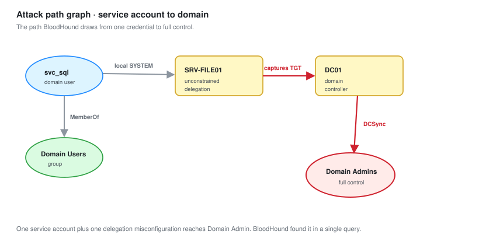

# 03 - Enumeration

Turning open ports into a list of things to attack. This is where the engagement is won.

---

## The Principle

Recon told you what is there. Enumeration tells you what is wrong with it.

**Enumerate everything before exploiting anything.** The first weakness you find is rarely the best path, and going straight for it means you miss the one that actually leads to Domain Admin. Finish the sweep first.

Start with no credentials. Every credential you gain opens enumeration you could not do before, so you come back around.

---

## SMB Without Credentials

SMB on 445 is the richest source of information on a Windows network, and a surprising amount of it is available with no login at all.

```bash
# What does each host tell us for free
netexec smb 10.50.10.0/24
```

```text
SMB  10.50.10.10  445  DC01        [*] Windows Server 2022 x64 (name:DC01) (domain:ptlab.local) (signing:True)
SMB  10.50.10.20  445  SRV-FILE01  [*] Windows Server 2022 x64 (name:SRV-FILE01) (domain:ptlab.local) (signing:False)
SMB  10.50.10.101 445  WS-01       [*] Windows 11 (name:WS-01) (domain:ptlab.local) (signing:False)
```

**Read the `signing` field.** `signing:False` on the member servers is finding PT-07. It means SMB relay attacks are possible against them, which matters in a moment.

### Null session

A null session is a login with no username and no password. It should not work. Here it does.

```bash
# Try an anonymous session
netexec smb 10.50.10.10 -u '' -p '' --shares
```

```text
SMB  10.50.10.10  445  DC01  [+] ptlab.local\: (Guest)
SHARE           PERMISSIONS   REMARK
-----           -----------   ------
IPC$            READ          Remote IPC
NETLOGON        READ          Logon server share
SYSVOL          READ          Logon server share
```

That anonymous read is finding PT-06. It should be denied entirely.

### Enumerate users through the null session

```bash
# Pull the user list with no credentials
netexec smb 10.50.10.10 -u '' -p '' --users
impacket-lookupsid ptlab.local/@10.50.10.10 -no-pass
```

`lookupsid` walks the relative identifiers one by one and returns every account name. With that you have a user list, and a user list is what a password spray needs.

---

## LDAP Without Credentials

The directory itself will often answer anonymous questions.

```bash
# Can we read the directory without logging in
ldapsearch -x -H ldap://10.50.10.10 -b "DC=ptlab,DC=local" "(objectClass=user)" sAMAccountName
```

It returns every user. That anonymous bind is finding PT-05.

### Why this matters more than it looks

An anonymous LDAP bind is not just a user list. It is the whole directory: group memberships, descriptions, service accounts, computer objects, and often passwords left in description fields by administrators who thought nobody could read them.

```bash
# Description fields sometimes contain passwords. People do this
ldapsearch -x -H ldap://10.50.10.10 -b "DC=ptlab,DC=local" "(objectClass=user)" description
```

---

## Building the User List

Combine everything into one clean list. This feeds the next module.

```text
arivera
pshah
tbecker
dokoro
itsupport
svc_sql
svc_backup
Administrator
```

```bash
# Save it
cat > users.txt << 'EOF'
arivera
pshah
tbecker
dokoro
itsupport
svc_sql
svc_backup
Administrator
EOF
```

**Two of those are service accounts** (`svc_sql`, `svc_backup`), and service accounts are prime targets because they often have weak, unchanging passwords and elevated rights.

---

## Kerberos Enumeration

Kerberos leaks information by design, and two attacks start here.

### Which accounts do not require pre-authentication

An account with pre-authentication disabled can have its password hash requested by anyone, then cracked offline. This is AS-REP roasting.

```bash
# Ask Kerberos which accounts we can roast
impacket-GetNPUsers ptlab.local/ -usersfile users.txt -no-pass -dc-ip 10.50.10.10
```

In this lab none were vulnerable, so this returned nothing. **A negative result is still a result, and it goes in the notes.** You checked, it was clean, you move on.

### Which accounts have service principal names

An account with an SPN can have a service ticket requested for it, which contains material encrypted with the account's password. That ticket is crackable offline. This is Kerberoasting, and it needs one valid credential, so it comes back in module 06.

```bash
# We note the SPN now, exploit it later once we have any credential
netexec ldap 10.50.10.10 -u '' -p '' --query "(servicePrincipalName=*)" ""
```

`svc_sql` has `MSSQLSvc/srv-file01.ptlab.local`. That is the Kerberoasting target, flagged for later.

---

## The Web Server

SRV-WEB01 runs nginx. Enumerate it properly.

```bash
# Identify the technology and look for obvious issues
nikto -h http://10.50.10.30

# Find hidden paths
gobuster dir -u http://10.50.10.30 -w /usr/share/seclists/Discovery/Web-Content/common.txt
```

```text
Server: nginx/1.18.0
```

The version banner is finding PT-12. Low severity on its own, but version disclosure helps an attacker match known vulnerabilities, so it is worth removing.

```bash
# Check the TLS configuration
sslscan 10.50.10.30
```

Legacy TLS 1.0 and 1.1 were enabled, which is finding PT-13.

---

## Map the Directory With BloodHound

This is the tool that changes how you see Active Directory. It collects every user, group, computer, session and permission, then draws the shortest path to Domain Admin.

You need one valid credential to run it, so in a real flow this happens after initial access. Run it as soon as you have any account.

```bash
# Collect everything the directory will tell this account
bloodhound-python -u arivera -p 'P@ssw0rd2024!' -d ptlab.local -ns 10.50.10.10 -c All
```

Load the output into the BloodHound interface and run the built-in queries:

- **Shortest paths to Domain Admins**
- **Find computers with unconstrained delegation**
- **Find principals with DCSync rights**

**BloodHound found the delegation issue on SRV-FILE01 in one query.** That is finding PT-04, and it is the step that ends the engagement at Domain Admin. Finding it by hand would have taken far longer.




---

## Open Shares

Once you have any credential, walk every share on every host.

```bash
netexec smb 10.50.10.0/24 -u arivera -p 'P@ssw0rd2024!' --shares
```

```text
SMB  10.50.10.20  SRV-FILE01  SHARE: Finance      READ
SMB  10.50.10.20  SRV-FILE01  SHARE: IT           READ,WRITE
SMB  10.50.10.20  SRV-FILE01  SHARE: Public       READ,WRITE
```

Spider them for interesting files.

```bash
netexec smb 10.50.10.20 -u arivera -p 'P@ssw0rd2024!' -M spider_plus
```

**This is where PT-09 was found, and it was found by accident.** While looking through the IT share for configuration files, there was a spreadsheet named `passwords.xlsx`. It contained local administrator credentials.

I have recorded it as an accidental discovery, because that is how it happened. A lot of real findings turn up exactly this way, while you are looking for something else.

---

## The Enumeration Summary

Before moving to exploitation, write down everything found and the path it suggests.

| Found | Host | Leads to |
| --- | --- | --- |
| Null session allowed | DC01 | User enumeration (PT-06) |
| Anonymous LDAP bind | DC01 | Full directory read (PT-05) |
| User list of 8 accounts | Domain | Password spray target |
| `svc_sql` has an SPN | Domain | Kerberoasting (PT-02) |
| SMB signing off | Member servers | Relay attacks (PT-07) |
| LLMNR responding | Network | Credential interception (PT-08) |
| Unconstrained delegation | SRV-FILE01 | Domain compromise (PT-04) |
| `passwords.xlsx` on IT share | SRV-FILE01 | Local admin creds (PT-09) |
| nginx version disclosed | SRV-WEB01 | Version matching (PT-12) |
| Legacy TLS | SRV-WEB01 | Weak crypto (PT-13) |

**Ten findings before firing a single exploit.** That is what enumeration buys you, and it is why finishing it first matters.

---

## Checklist

- [ ] SMB enumerated on every host, signing status recorded
- [ ] Null session and anonymous LDAP tested
- [ ] Full user list built and saved
- [ ] AS-REP roasting checked (negative result recorded)
- [ ] SPNs identified for later Kerberoasting
- [ ] Web server enumerated, version and TLS checked
- [ ] BloodHound collected and the key queries run
- [ ] Every share walked, interesting files noted
- [ ] A written enumeration summary with the path each finding suggests

---

Next: [04-Initial-Access.md](04-Initial-Access.md)
