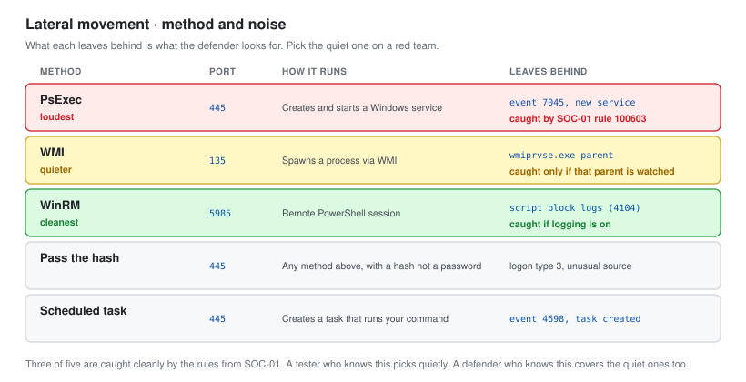

# 07 - Lateral Movement

Moving from one machine to another once you have credentials. What each method does, and what it leaves behind.

---

## The Idea

You have credentials or hashes. Lateral movement is using them to get code running on other machines. Every method here needs valid access already, so this comes after initial access, not before.

**What matters for a report is not just that it works, but what each method leaves behind.** The defender is looking for exactly these artefacts, so knowing them makes you better at both jobs.

---

## The Methods



| Method | Port | How it runs | Noise |
| --- | --- | --- | --- |
| **PsExec** | 445 | Creates and starts a service | Loud, event 7045 |
| **WMI** | 135 | Spawns a process via WMI | Quieter |
| **WinRM** | 5985 | Remote PowerShell | Normal-looking if WinRM is used |
| **Pass the hash** | 445 | Any of the above, with a hash | Same as the method used |
| **Scheduled task** | 445 | Creates a task that runs | Event 4698 |

---

## PsExec

The classic, and the loudest.

```bash
impacket-psexec ptlab.local/Administrator@10.50.10.20 -hashes :31d6cfe0...
```

It works by uploading a service binary, creating a Windows service to run it, and executing as SYSTEM.

**What it leaves:** System event 7045, a new service installed, usually with a semi-random name. That is [SOC-01 rule 100603](../Junior-SOC-Analyst/03-Detection-Rules.md), which catches exactly this. It fired instantly against PsExec in testing.

Use it when noise does not matter. Avoid it on a red team.

---

## WMI

Quieter. No service, no file dropped by default.

```bash
impacket-wmiexec ptlab.local/Administrator@10.50.10.20 -hashes :31d6cfe0...
```

It runs your command through Windows Management Instrumentation, which is a legitimate management channel, so it blends in more.

**What it leaves:** process creation events with `wmiprvse.exe` as the parent. A defender watching for that parent process catches it, but far fewer environments watch for it than watch for service creation.

---

## WinRM

The cleanest, when WinRM is already in use in the environment.

```bash
# With a password
evil-winrm -i 10.50.10.20 -u Administrator -p 'password'

# With a hash
evil-winrm -i 10.50.10.20 -u Administrator -H 31d6cfe0...
```

WinRM is remote PowerShell. In an environment that uses it for management, your session looks like administration. In one that does not, a WinRM session at all is the signal.

**What it leaves:** PowerShell operational logs, and if script block logging is on (as in [SOC-01](../Junior-SOC-Analyst/)), the actual commands you ran, decoded. That is the detection that beats obfuscation.

---

## Pass the Hash

Not a movement method itself, but what makes the others work without a password.

Windows authenticates with the hash of your password, not the password. If you have the hash, you can often skip cracking it entirely and pass it directly.

```bash
# Every method above accepts -H or -hashes
netexec smb 10.50.10.0/24 -u Administrator -H 31d6cfe0... --local-auth
```

This is where finding PT-03, the reused local admin password, becomes so damaging. One hash, and `--local-auth` sprays it across every workstation at once.

```text
SMB  10.50.10.101  WS-01  [+] WS-01\Administrator (Pwn3d!)
SMB  10.50.10.102  WS-02  [+] WS-02\Administrator (Pwn3d!)
```

**Reused local admin passwords turn one compromised machine into all of them.** The fix, Microsoft LAPS, gives every machine a different, rotating local admin password, and it breaks this attack completely.

---

## Finding Where to Go

Do not move blindly. Find where privileged users are logged in, because those sessions are what you are hunting.

```bash
# Where is a Domain Admin currently logged in
netexec smb 10.50.10.0/24 -u Administrator -H 31d6cfe0... --loggedon-users
```

BloodHound's **Find where Domain Admins are logged in** query does the same thing from the data you already collected. You move toward the machine with the session you want, not at random.

---

## Post-Exploitation

Once on a machine, what you actually collect. In this engagement, only enough to prove impact, because the rules of engagement prohibit touching real data and there is none.

| Goal | Command | Note |
| --- | --- | --- |
| Prove access | `whoami`, `hostname` | Screenshot for the report |
| Credentials in memory | Mimikatz `sekurlsa::logonpasswords` | Needs SYSTEM |
| Cached domain creds | Mimikatz `lsadump::cache` | Offline-crackable |
| Local hashes | `secretsdump` locally | The SAM database |
| Confirm data access | List a share, read one file name | Do not exfiltrate |

**Stop at proof.** A penetration test demonstrates that data could be accessed. It does not take the data. Reading one filename in a Finance share proves the finding. Downloading the folder is out of scope and unprofessional.

---

## Persistence

Noted, not deployed.

A real engagement sometimes tests whether persistence is possible and detectable. Here, with a golden ticket capability from the domain hashes, persistence was possible indefinitely. That fact goes in the report as impact.

**No persistence was left behind.** Everything was rolled back. In a client engagement, any persistence created is documented in detail and removed before the engagement closes, and the client is told exactly what was placed and where.

---

## The Defender's View

This module maps almost one to one onto detections. That is the point of building the pentest lab like the SOC lab.

| Method | Detection | Caught |
| --- | --- | --- |
| PsExec | Service creation, rule 100603 | Yes, instantly |
| WMI | `wmiprvse.exe` parent process | Depends on rules |
| WinRM | PowerShell script block logging | Yes, if enabled |
| Pass the hash | Logon type 3 from unusual source | Partial |
| Scheduled task | Event 4698 | Yes |

**Three of five are caught cleanly by the rules from SOC-01.** A tester who knows this picks the quiet method on a red team, and a defender who knows this makes sure the quiet methods are covered too.

---

## Checklist

- [ ] At least three movement methods used and understood
- [ ] The artefact each one leaves recorded
- [ ] Pass the hash confirmed, reuse demonstrated
- [ ] Logged-in privileged users located before moving
- [ ] Post-exploitation stopped at proof, no data taken
- [ ] Persistence noted as possible, none left behind
- [ ] Detection outcome recorded for each method

---

Next: [08-Findings-Report.md](08-Findings-Report.md)
