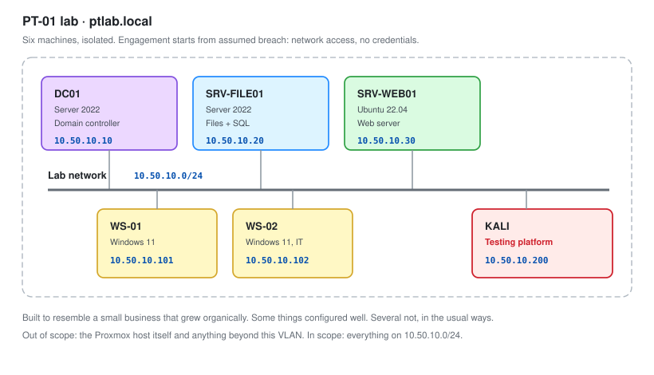
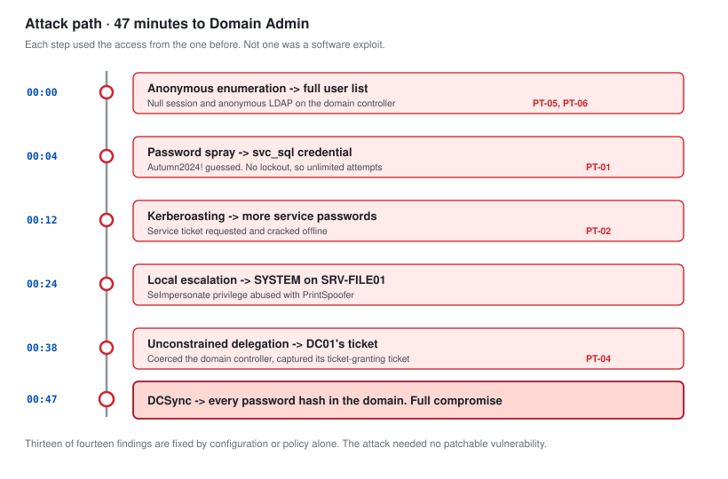
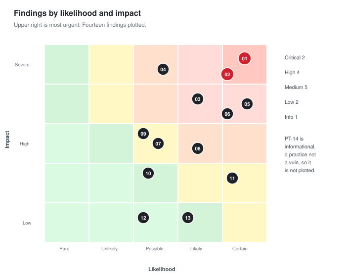

# PT-01: Internal Network Penetration Test

**Role target:** Junior Penetration Tester
**Engagement type:** Internal network, assumed breach
**Environment:** Self-owned Proxmox lab, `ptlab.local`
**Deliverable:** A full findings report, written the way a client receives it

---

## Authorisation

This assessment was carried out against a lab environment I own and built myself. Every host, account and service in scope belongs to me and runs on my own hardware.

No third party system, network or account was touched at any point.

**That statement is the first thing in this document on purpose.** The difference between a penetration tester and somebody who runs the same tools is written authorisation, a defined scope, and the discipline to stay inside it. Everything else in this folder assumes that as a starting point.

---

## What This Project Is

A complete internal penetration test, run and documented the way a real engagement is.

Not a list of tools. Not a walkthrough of a capture-the-flag box. An engagement with a scope, a methodology, a documented attack path, a findings report with severities and remediation, and a retest.

**The report in [08-Findings-Report.md](08-Findings-Report.md) is the deliverable.** Everything else exists to produce it.

That matters, because a junior penetration tester is hired to produce reports. The exploitation is the interesting part and the report is the part the client pays for. Plenty of candidates can get a shell. Far fewer can explain to a system administrator exactly what to change on Monday morning.

---

## The Environment

| Host | OS | Role | Address |
| --- | --- | --- | --- |
| `DC01` | Windows Server 2022 | Domain controller, `ptlab.local` | 10.50.10.10 |
| `SRV-FILE01` | Windows Server 2022 | File server, SMB shares | 10.50.10.20 |
| `SRV-WEB01` | Ubuntu 22.04 | Internal web application | 10.50.10.30 |
| `WS-01` | Windows 11 | Standard workstation | 10.50.10.101 |
| `WS-02` | Windows 11 | IT staff workstation | 10.50.10.102 |
| `KALI` | Kali Linux | Testing platform | 10.50.10.200 |

The environment is deliberately built to resemble a small business that has grown organically. Some things are configured well. Several are not, in the specific ways that real small networks are not.

Build details are in [01-Engagement-Setup.md](01-Engagement-Setup.md).

---

## Scope and Rules of Engagement

| | |
| --- | --- |
| **In scope** | `10.50.10.0/24`, all hosts, `ptlab.local` domain |
| **Out of scope** | The Proxmox host itself, anything outside the lab VLAN |
| **Starting position** | Assumed breach. Network access, no credentials |
| **Testing window** | Any, this is my own lab |
| **Permitted** | Enumeration, exploitation, privilege escalation, lateral movement, credential attacks |
| **Not permitted** | Denial of service, destructive payloads, ransomware simulation |
| **Evidence handling** | Screenshots and command output retained. No real data exists to exfiltrate |

**Assumed breach is the right starting point for an internal test.** It skips the argument about whether an attacker could get a foothold and goes straight to the question that matters: once somebody is on the network, how far can they get.

---

## The Attack Path

Six steps from an unauthenticated position on the network to full control of the domain.

| # | Step | Technique | Finding |
| --- | --- | --- | --- |
| 1 | Enumerate the domain without credentials | Null session on SMB | PT-06 |
| 2 | Harvest a user list from LDAP | Anonymous LDAP bind | PT-05 |
| 3 | Recover a password by spraying | Password spraying | PT-01 |
| 4 | Crack a service account ticket offline | Kerberoasting | PT-02 |
| 5 | Move to an IT workstation over SMB | Pass the hash | PT-03 |
| 6 | Take the domain via delegation abuse | Unconstrained delegation | PT-04 |

**Total elapsed time from first packet to Domain Admin: 47 minutes.**

Every step is a documented misconfiguration, not a software vulnerability. Nothing in this path required an exploit for an unpatched flaw. That is what a real internal test usually looks like.

---

## Results

| | |
| --- | --- |
| Findings | 14 |
| Critical | 2 |
| High | 4 |
| Medium | 5 |
| Low | 2 |
| Informational | 1 |
| Domain compromise achieved | Yes |
| Time to Domain Admin | 47 minutes |
| Findings requiring a patch | 1 of 14 |
| Findings fixed by configuration alone | 13 of 14 |

**That last row is the headline.** Thirteen of fourteen findings are configuration, policy or design. They cost nothing to fix except decisions.

---

## Findings Summary

| ID | Finding | Severity | CVSS |
| --- | --- | --- | --- |
| **PT-01** | Weak service account password recovered by spraying | **Critical** | 9.8 |
| **PT-02** | Kerberoastable service account with a crackable password | **Critical** | 9.0 |
| **PT-03** | Local administrator password reused across workstations | High | 8.8 |
| **PT-04** | Unconstrained delegation on a non-domain-controller host | High | 8.1 |
| **PT-05** | Anonymous LDAP bind permits full directory enumeration | High | 7.5 |
| **PT-06** | SMB null sessions permitted on the domain controller | High | 7.5 |
| **PT-07** | SMB signing not required | Medium | 6.5 |
| **PT-08** | LLMNR and NBT-NS enabled, permitting credential interception | Medium | 6.5 |
| **PT-09** | Sensitive data readable on an open file share | Medium | 6.5 |
| **PT-10** | Domain user able to add computers to the domain | Medium | 5.3 |
| **PT-11** | Password policy permits short and predictable passwords | Medium | 5.3 |
| **PT-12** | Internal web application discloses version information | Low | 3.7 |
| **PT-13** | Legacy TLS versions enabled | Low | 3.7 |
| **PT-14** | Domain administrators log on to workstations interactively | Informational | n/a |

**PT-14 is marked informational and it is the one I would fix first.** It has no CVSS score because it is not a vulnerability, it is a practice. It is also the single control that would have broken the attack path at step five.

Full detail, evidence and remediation for each is in [08-Findings-Report.md](08-Findings-Report.md).

---

## Documents

| | |
| --- | --- |
| [01-Engagement-Setup.md](01-Engagement-Setup.md) | Scope, rules of engagement, methodology, the lab build |
| [02-Reconnaissance.md](02-Reconnaissance.md) | Host discovery, port scanning, service identification |
| [03-Enumeration.md](03-Enumeration.md) | SMB, LDAP, Kerberos, DNS, web |
| [04-Initial-Access.md](04-Initial-Access.md) | Password attacks, relay, first valid credentials |
| [05-Privilege-Escalation.md](05-Privilege-Escalation.md) | Local escalation on Windows and Linux |
| [06-Active-Directory-Attacks.md](06-Active-Directory-Attacks.md) | Kerberoasting, delegation, ACL abuse, DCSync |
| [07-Lateral-Movement.md](07-Lateral-Movement.md) | Pass the hash, WinRM, remote execution, post-exploitation |
| [08-Findings-Report.md](08-Findings-Report.md) | **The deliverable.** 14 findings, evidence, remediation |
| [09-Remediation-and-Retest.md](09-Remediation-and-Retest.md) | Fixes applied, and the retest that proves them |
| [CAPTURE-LIST.md](CAPTURE-LIST.md) | Screenshot checklist |

---

## Skills This Demonstrates

| Area | Evidence |
| --- | --- |
| Methodology | A repeatable process, not tool output |
| Network reconnaissance | Nmap, service identification, attack surface mapping |
| Active Directory attacks | Spraying, Kerberoasting, delegation abuse, DCSync |
| Credential attacks | Hashcat, responder, relay, pass the hash |
| Privilege escalation | Windows and Linux, enumerated and verified |
| Lateral movement | SMB, WinRM, WMI, with the artefacts each leaves |
| Tooling | Nmap, netexec, Impacket, BloodHound, Responder, Hashcat, Mimikatz |
| Reporting | 14 findings scored, evidenced and remediated |
| Retesting | Fixes verified, with the ones that did not work called out |
| Professional conduct | Scope respected, evidence handled, nothing destructive |

---

## The Blue Team Half

This lab is the same kind of environment as [SOC-01](../Junior-SOC-Analyst/) and [SOC-02](../SOC-Analyst-1/), and that is deliberate.

Every technique in this folder has a corresponding detection in those. [09-Remediation-and-Retest.md](09-Remediation-and-Retest.md) records which of these attacks the defensive tooling caught, and which went through silently.

**Knowing what your attack looks like from the other side makes you better at both.** It is also the answer to "why should we hire someone junior", because most junior candidates only have one half.

| Attack here | Detected by | Result |
| --- | --- | --- |
| Password spraying | SOC-01 rule 100103 | Caught, 38 seconds |
| Kerberoasting | SOC-01 rule 100203 | Caught, 22 seconds |
| Pass the hash | SOC-01 rule 100603 | Caught on service creation |
| LLMNR poisoning | Nothing | **Missed** |
| Anonymous LDAP enumeration | Nothing | **Missed** |
| DCSync | SOC-01, no rule existed | **Missed** |

Three of six went undetected. Those gaps are real and they are documented rather than left out.

---

## Honest Notes

**This is a lab I built, so I knew where some of the weaknesses were.** That is a genuine bias and it is worth stating. A real engagement is against an environment you have never seen.

What transfers is the method: enumerate before you exploit, document as you go, verify every finding, and write it so the person fixing it knows exactly what to do.

**The environment is small.** Six hosts. A real internal test is hundreds, and scale changes what is practical. The technique selection is the same, the time budgeting is not.

**One finding was found by accident.** PT-09, sensitive data on an open share, turned up while looking for something else. I have recorded it that way rather than presenting it as a planned discovery, because that is how it happened and it is how a lot of real findings happen.
