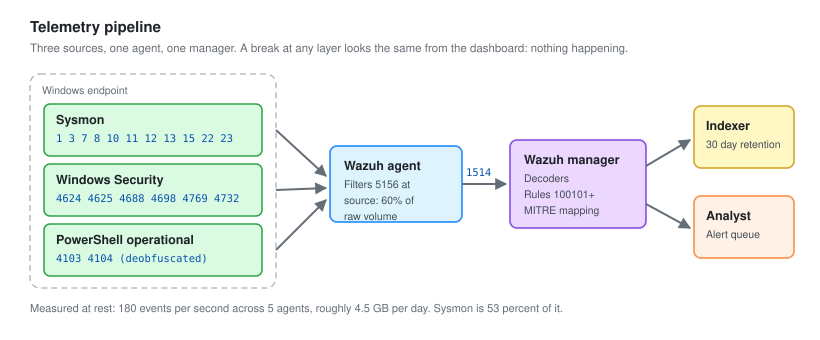

# 02 - Telemetry and Logging

Getting the right events off the endpoints and into the SIEM. This is the part that decides whether every detection after it is possible.

---

## The Problem With Default Logging

A Windows machine out of the box logs almost nothing useful for security.

It records logons. It does not record what processes ran, what they were launched by, what command line they were given, what they connected to, or what they wrote to the registry. Every one of those is the difference between an alert and a blind spot.

Three layers fix it:

| Layer | Provides |
| --- | --- |
| **Advanced audit policy** | Authentication, account changes, privilege use, object access |
| **Sysmon** | Process ancestry, command lines, hashes, network connections, registry writes, LSASS access |
| **PowerShell logging** | The actual script content, including deobfuscated blocks |

Sysmon is the one that matters most. Windows event 4688 gives you a process creation event, but Sysmon event 1 gives you the parent, the command line, the hashes, the user, and the original file name of a renamed binary.



---

## Advanced Audit Policy

Pushed by GPO, linked to the `Corp` OU.

`Computer Configuration > Policies > Windows Settings > Security Settings > Advanced Audit Policy Configuration`

| Category | Subcategory | Setting | Key events |
| --- | --- | --- | --- |
| Account Logon | Credential Validation | Success, Failure | 4776 |
| Account Logon | Kerberos Authentication Service | Success, Failure | 4768, 4771 |
| Account Logon | Kerberos Service Ticket Operations | Success, Failure | 4769 |
| Account Management | User Account Management | Success, Failure | 4720, 4722, 4724, 4725, 4738 |
| Account Management | Security Group Management | Success, Failure | 4728, 4732, 4756 |
| Detailed Tracking | Process Creation | Success | 4688 |
| Logon/Logoff | Logon | Success, Failure | 4624, 4625 |
| Logon/Logoff | Special Logon | Success | 4672 |
| Logon/Logoff | Account Lockout | Success | 4740 |
| Object Access | File Share | Success, Failure | 5140, 5145 |
| Object Access | Removable Storage | Success, Failure | 4663 |
| Policy Change | Audit Policy Change | Success, Failure | 4719 |
| Privilege Use | Sensitive Privilege Use | Success, Failure | 4673, 4674 |
| System | Security System Extension | Success | 7045 |
| DS Access | Directory Service Access | Success, Failure | 4662 (DC only) |

### Two settings that are easy to miss

**Command line in process creation.** Without this, 4688 tells you `powershell.exe` ran. With it, you get the full command line including the encoded payload. This is the single highest value audit setting in Windows.

`Computer Configuration > Administrative Templates > System > Audit Process Creation > Include command line in process creation events: Enabled`

Or by registry:

```powershell
New-ItemProperty -Path 'HKLM:\SOFTWARE\Microsoft\Windows\CurrentVersion\Policies\System\Audit' `
    -Name 'ProcessCreationIncludeCmdLine_Enabled' -Value 1 -PropertyType DWord -Force
```

**Force audit policy subcategory override.** Legacy audit settings silently override the advanced ones unless this is on. Symptom: the policy shows as applied, the events never arrive.

`Security Settings > Local Policies > Security Options > Audit: Force audit policy subcategory settings to override audit policy category settings: Enabled`

### Verify it applied

```powershell
auditpol /get /category:*
gpresult /h C:\temp\gp.html
```

`auditpol` reads the effective policy, not the intended one. If a subcategory shows "No Auditing" here, it does not matter what the GPO says.

### Log size

Default Security log is 20 MB, which on a busy machine rotates in under an hour. Losing events to rotation before the agent ships them is a silent failure.

```powershell
wevtutil sl Security /ms:1073741824       # 1 GB
wevtutil sl System /ms:268435456          # 256 MB
wevtutil sl Application /ms:268435456     # 256 MB
wevtutil sl "Microsoft-Windows-Sysmon/Operational" /ms:1073741824
```

---

## Sysmon

### Install

Using the SwiftOnSecurity configuration as a base, then modified.

```powershell
Invoke-WebRequest -Uri 'https://download.sysinternals.com/files/Sysmon.zip' -OutFile 'C:\temp\Sysmon.zip'
Expand-Archive 'C:\temp\Sysmon.zip' -DestinationPath 'C:\temp\Sysmon'
C:\temp\Sysmon\Sysmon64.exe -accepteula -i C:\temp\sysmonconfig.xml
```

Updating the config later without reinstalling:

```powershell
Sysmon64.exe -c C:\temp\sysmonconfig.xml
```

### Events enabled and why

| ID | Event | Why it earns its place |
| --- | --- | --- |
| 1 | Process creation | Command line, parent, hashes. The backbone of nearly every detection here |
| 3 | Network connection | Which process talked to which address. Catches C2 from an unexpected binary |
| 5 | Process terminated | Needed to bound a process lifetime during timeline reconstruction |
| 7 | Image loaded | DLL side-loading. Very noisy, filtered hard |
| 8 | CreateRemoteThread | Classic process injection |
| 10 | Process access | LSASS access. This is the credential dumping detection |
| 11 | File created | Payload drops in temp and startup folders |
| 12, 13, 14 | Registry | Run key persistence, Defender tampering |
| 15 | File stream created | Mark of the Web, shows a file came from the internet |
| 22 | DNS query | Which process resolved what. Catches DGA and C2 domains |
| 23 | File delete | Anti-forensics, and it archives the deleted file |

### Noise control

Out of the box, event 7 (image loaded) and event 3 (network connection) will bury you. On a single idle Windows 11 machine I was seeing roughly 3,000 image load events per hour, almost all of them Microsoft-signed DLLs loading into Microsoft-signed processes.

The fix is to exclude the normal, not to include the bad. You cannot enumerate every bad DLL. You can enumerate the handful of processes worth watching.

```xml
<RuleGroup name="" groupRelation="or">
  <ImageLoad onmatch="include">
    <!-- Only care about loads into these, everything else is noise -->
    <Image condition="image">powershell.exe</Image>
    <Image condition="image">wscript.exe</Image>
    <Image condition="image">cscript.exe</Image>
    <Image condition="image">mshta.exe</Image>
    <Image condition="image">rundll32.exe</Image>
    <Image condition="image">regsvr32.exe</Image>
  </ImageLoad>
</RuleGroup>
```

Network connections, same approach in reverse. Exclude the browsers and the update services, keep everything else:

```xml
<RuleGroup name="" groupRelation="or">
  <NetworkConnect onmatch="exclude">
    <Image condition="end with">\chrome.exe</Image>
    <Image condition="end with">\msedge.exe</Image>
    <Image condition="end with">\firefox.exe</Image>
    <Image condition="end with">\svchost.exe</Image>
    <Image condition="end with">\MsMpEng.exe</Image>
    <DestinationIp condition="is">127.0.0.1</DestinationIp>
  </NetworkConnect>
</RuleGroup>
```

**Excluding `svchost.exe` is a real trade-off.** It removes most of the noise and it also removes a hiding place, because injected code in svchost will make connections you no longer see. I accepted it here because event 8 (CreateRemoteThread) still catches the injection that would put code there. In a production environment I would exclude by destination instead, keeping svchost visible but dropping traffic to Microsoft-owned ranges.

### The LSASS rule

This is the most valuable single rule in the config.

```xml
<RuleGroup name="" groupRelation="or">
  <ProcessAccess onmatch="include">
    <TargetImage condition="image">lsass.exe</TargetImage>
  </ProcessAccess>
  <ProcessAccess onmatch="exclude">
    <!-- Legitimate LSASS readers. Tuned from observed traffic, not guessed -->
    <SourceImage condition="image">wmiprvse.exe</SourceImage>
    <SourceImage condition="image">MsMpEng.exe</SourceImage>
    <SourceImage condition="image">svchost.exe</SourceImage>
    <SourceImage condition="image">csrss.exe</SourceImage>
    <SourceImage condition="image">wininit.exe</SourceImage>
  </ProcessAccess>
</RuleGroup>
```

Anything left after those exclusions is a process opening a handle to LSASS that has no business doing so. That is Mimikatz, `procdump -ma lsass.exe`, comsvcs.dll minidump, and most of the rest of the credential dumping family.

Two things matter in the resulting event. `GrantedAccess` of `0x1010` or `0x1410` means read plus query, which is a memory read. And `CallTrace` containing `UNKNOWN` means the call came from unbacked memory, which is what injected or reflectively loaded code looks like.

---

## PowerShell Logging

Three settings, all under `Computer Configuration > Administrative Templates > Windows Components > Windows PowerShell`.

| Setting | Event | Value |
| --- | --- | --- |
| Turn on Module Logging | 4103 | Enabled, module names `*` |
| Turn on PowerShell Script Block Logging | 4104 | Enabled |
| Turn on PowerShell Transcription | n/a | Enabled, output to a locked-down share |

**Script block logging is the important one.** PowerShell logs the script block after deobfuscation. An attacker who base64 encodes their payload gets the encoded string in 4688 and the decoded script in 4104. They cannot obfuscate their way past it without disabling the logging, and disabling it is itself a detection.

Registry equivalent:

```powershell
$p = 'HKLM:\SOFTWARE\Policies\Microsoft\Windows\PowerShell\ScriptBlockLogging'
New-Item -Path $p -Force | Out-Null
New-ItemProperty -Path $p -Name 'EnableScriptBlockLogging' -Value 1 -PropertyType DWord -Force
```

**Watch the volume.** Script block logging on a machine running heavy automation generates very large events. Module logging at `*` is worse. In production I would scope module logging to the modules that matter rather than everything.

---

## Wazuh

### Manager

All-in-one install on SIEM01. Manager, indexer and dashboard on one box, which is fine for five agents.

```bash
curl -sO https://packages.wazuh.com/4.9/wazuh-install.sh
sudo bash ./wazuh-install.sh -a
```

The installer prints the admin password once at the end. It is also recoverable from `wazuh-install-files.tar`.

Heap size, because the default guesses badly on a 12 GB box:

```bash
sudo sed -i 's/^-Xms.*/-Xms6g/' /etc/wazuh-indexer/jvm.options
sudo sed -i 's/^-Xmx.*/-Xmx6g/' /etc/wazuh-indexer/jvm.options
sudo systemctl restart wazuh-indexer
```

Half of RAM, never above 32 GB. Above that the JVM loses compressed object pointers and effectively wastes memory.

### Agent deployment

By GPO startup script to the `Corp` OU:

```powershell
$manager = '10.20.20.10'
$key     = '<AGENT_ENROLLMENT_KEY>'
$msi     = 'wazuh-agent-4.9.0.msi'

if (Get-Service -Name 'WazuhSvc' -ErrorAction SilentlyContinue) { return }

Copy-Item "\\DC01\NETLOGON\$msi" "$env:TEMP\$msi" -Force

$args = @(
    '/i', "$env:TEMP\$msi", '/q',
    "WAZUH_MANAGER=$manager",
    "WAZUH_REGISTRATION_PASSWORD=$key",
    "WAZUH_AGENT_GROUP=windows"
)
Start-Process msiexec.exe -ArgumentList $args -Wait -NoNewWindow

Start-Service WazuhSvc
```

The guard clause at the top matters. A startup script runs at every boot, and without it you reinstall the agent on every restart.

Confirm enrollment from the manager:

```bash
sudo /var/ossec/bin/agent_control -l
```

### Telling the agent what to collect

In `agent.conf` for the `windows` group, so it applies centrally rather than per machine:

```xml
<agent_config>
  <localfile>
    <location>Security</location>
    <log_format>eventchannel</log_format>
    <query>Event/System[EventID != 5145 and EventID != 5156]</query>
  </localfile>

  <localfile>
    <location>Microsoft-Windows-Sysmon/Operational</location>
    <log_format>eventchannel</log_format>
  </localfile>

  <localfile>
    <location>Microsoft-Windows-PowerShell/Operational</location>
    <log_format>eventchannel</log_format>
  </localfile>

  <localfile>
    <location>System</location>
    <log_format>eventchannel</log_format>
  </localfile>
</agent_config>
```

The `query` filter drops 5145 and 5156 at the agent. 5156 is the Windows Filtering Platform connection event and on its own it was 60 percent of my total volume. It is filtered at the source rather than at the manager, because filtering at the manager still costs the bandwidth and the disk.

### Volume

Measured over 24 hours with all five agents active and no attack running.

| Source | Events per second | Share |
| --- | --- | --- |
| Sysmon | 96 | 53 percent |
| Windows Security | 58 | 32 percent |
| PowerShell operational | 14 | 8 percent |
| System | 7 | 4 percent |
| Suricata | 5 | 3 percent |
| **Total** | **180** | |

Roughly 4.5 GB a day at rest. Index lifecycle set to delete after 30 days, which keeps the disk under 150 GB.

---

## Validating the Pipeline

Do not assume. Generate a known event and go find it.

```powershell
# On WS11-01, deliberately produce something that must be logged
whoami /priv
Start-Process notepad.exe
```

Then confirm each layer independently:

```powershell
# Layer 1: did Windows log it
Get-WinEvent -LogName Security -MaxEvents 5 -FilterXPath "*[System[EventID=4688]]"

# Layer 2: did Sysmon see it
Get-WinEvent -LogName 'Microsoft-Windows-Sysmon/Operational' -MaxEvents 5 |
    Where-Object { $_.Id -eq 1 }
```

```bash
# Layer 3: did it reach the manager
sudo tail -f /var/ossec/logs/archives/archives.log | grep WS11-01
```

**Check all three.** A break at any layer looks identical from the dashboard, which is to say it looks like nothing happening. The three most common failures are the audit subcategory override not being set, the agent not restarting after a config change, and `<logall>` being off so archives.log stays empty and makes you think nothing arrived.

To see everything the manager receives, including events that match no rule:

```xml
<!-- /var/ossec/etc/ossec.conf -->
<logall>yes</logall>
<logall_json>yes</logall_json>
```

Turn this on while writing rules and off afterwards. It writes every event to disk regardless of whether it alerted, which is exactly what you want when you are trying to work out why your rule did not fire, and exactly what you do not want long term.

---

## What This Costs

Worth saying plainly, because "enable everything" is bad advice.

| Setting | Cost |
| --- | --- |
| Command line auditing | Command lines can contain passwords typed on the line. Anyone with Security log read access sees them |
| Script block logging | Large events, high volume on automation-heavy hosts |
| Module logging at `*` | The heaviest setting here. Scope it in production |
| Sysmon event 7 unfiltered | Thousands of events per hour per host |
| Sysmon event 3 unfiltered | Very high on browser-heavy machines |

Command line auditing is still worth it. The rest need scoping to the hosts and processes where they earn their volume.

---

Next: [03-Detection-Rules.md](03-Detection-Rules.md)
