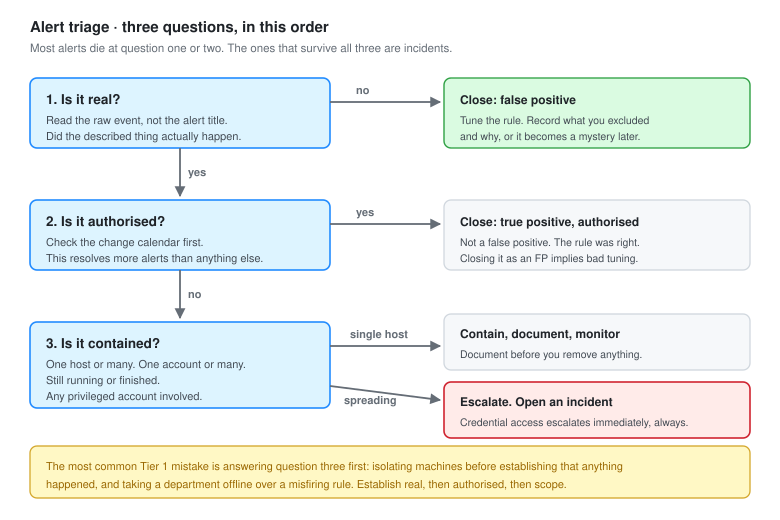

# 04 - Triage Playbooks

Six playbooks for the alerts that actually fire. Each one is written to be worked under pressure by someone who did not write it.

---

## How to Use These

A playbook is not a script you follow blindly. It is the set of questions that stop you forgetting something obvious at 3am.

Every playbook here has the same five parts:

| Part | Purpose |
| --- | --- |
| **What fired** | The alert and what the underlying event actually means |
| **First ten minutes** | The ordered checks that decide real or not |
| **Questions to answer** | What must be in the ticket before it moves anywhere |
| **Escalate when** | Hard criteria, not judgement |
| **Tier 1 containment** | What you are allowed to do yourself |

---

## The Triage Decision



Three questions, in this order, on every alert without exception.

**1. Is it real?** Did the thing the alert describes actually happen, or is the rule misfiring? Read the raw event, not the alert title.

**2. Is it authorised?** It happened, but was it someone doing their job? An administrator running PowerShell is not an incident. Check the change calendar before you check anything else.

**3. Is it contained?** One host or many. One account or many. Still running or finished.

Most alerts die at question one or two. The ones that survive all three are incidents.

**The most common Tier 1 mistake is answering question three first.** You start isolating machines before establishing that anything happened, and you take a department offline over a misfiring rule. Establish real, then authorised, then scope.

---

## Universal First Steps

Before opening any playbook.

```text
1. Claim the alert. Two analysts on one alert is wasted time
2. Note the time you started. Time to triage is a real metric
3. Read the raw event. The alert title is a summary and summaries lose detail
4. Check the change calendar. This resolves more alerts than any other single step
5. Check whether this host or user has fired before today
```

Step four resolves a surprising share of alerts. Patching, deployments and migrations generate exactly the behaviour these rules catch.

---

## Playbook 1: Password Spray

**Alerts:** SOC-1001 (rules 100103, 100104)
**Technique:** T1110.003

### What fired

Eight or more distinct accounts failed authentication from one source inside five minutes.

The shape is what matters. Many accounts, one source, short window. That is somebody trying one password against a user list, which is designed to stay under the lockout threshold on any individual account.

### First ten minutes

```text
1. Identify the source address
   Internal or external
   If internal, which host and who is logged on to it

2. Pull every 4625 from that source in the last hour
   Count distinct target accounts
   Look at the SubStatus code

3. Check for a success
   Any 4624 from that source in the window
   This is the question that changes everything

4. If there was a success, pivot to that account immediately
   What did it do after logging on
   Is the session still active

5. Check whether the accounts targeted look enumerated
   Alphabetical, or matching a naming convention, means a list
```

### Reading the SubStatus code

Sitting in the 4625 event and worth memorising.

| SubStatus | Meaning | What it tells you |
| --- | --- | --- |
| `0xC0000064` | User does not exist | Guessing at names. Early enumeration |
| `0xC000006A` | Wrong password | The account is real. This is the spray |
| `0xC0000234` | Account locked out | Threshold reached |
| `0xC0000072` | Account disabled | Working from a stale list, possibly an old export |
| `0xC0000071` | Password expired | Real account, stale credential |
| `0xC000015B` | Logon type not granted | The account exists and the password may be right |

**A mix of `0xC0000064` and `0xC000006A` means the attacker has a partial list.** They are guessing usernames and some are landing. That is worth knowing because it tells you whether they had inside knowledge.

`0xC000015B` deserves special attention. It means authentication succeeded but the logon type was denied. The password was correct.

### Queries

```powershell
# All failures from one source in the last hour, grouped by account
$since = (Get-Date).AddHours(-1)
Get-WinEvent -FilterHashtable @{LogName='Security'; ID=4625; StartTime=$since} |
    ForEach-Object {
        [pscustomobject]@{
            Time      = $_.TimeCreated
            Account   = $_.Properties[5].Value
            Source    = $_.Properties[19].Value
            SubStatus = '0x{0:X8}' -f $_.Properties[9].Value
        }
    } |
    Where-Object Source -eq '10.20.99.10' |
    Group-Object Account |
    Sort-Object Count -Descending |
    Format-Table Count, Name
```

```powershell
# The question that matters: did anything succeed from that source
Get-WinEvent -FilterHashtable @{LogName='Security'; ID=4624; StartTime=$since} |
    Where-Object { $_.Properties[18].Value -eq '10.20.99.10' } |
    Select-Object TimeCreated, @{n='Account';e={$_.Properties[5].Value}},
                  @{n='LogonType';e={$_.Properties[8].Value}}
```

### Questions to answer

- [ ] Source address, and whether it is internal or external
- [ ] How many distinct accounts, and over what window
- [ ] Did any authentication succeed
- [ ] Do the targeted accounts follow a pattern that implies a list
- [ ] Are any of the targets privileged
- [ ] Is the source a known scanner or a legitimate service

### Escalate when

- Any successful logon from the source, at any point
- The source is internal, because that means something is already inside
- Any privileged account was targeted
- More than 50 distinct accounts, which is a full user list enumeration
- The pattern repeats across days, which means it is deliberate and paced

### Tier 1 containment

| Action | Allowed | Notes |
| --- | --- | --- |
| Block the source IP at the firewall | Yes, if external | Log the rule and the reason |
| Disable a compromised account | Yes, if a success occurred | Tell the account owner and the service desk |
| Force password reset on targeted accounts | Escalate | Mass resets need authorisation |
| Isolate an internal source host | Escalate | Unless already agreed for this alert type |

### Known false positives

Two things produce this shape without being an attack.

A user changes their password while a phone, tablet and mail client still hold the old one. Each device retries, and the failures cluster. The tell is that they all target one account, so it should not reach eight distinct accounts. If it does, check whether shared mailboxes are involved.

A service account password rotates and the consumers were not updated. Every machine using it starts failing at once, which looks like many sources and one account. Inverse shape, same confusion.

---

## Playbook 2: Suspicious PowerShell

**Alerts:** SOC-1003 (rules 100301, 100302, 100303)
**Technique:** T1059.001

### What fired

PowerShell ran with an encoded command, a download cradle, or a hidden window.

### First ten minutes

```text
1. Get the full command line from the Sysmon event 1

2. Get the parent process
   This is the most important field in the whole event
   Office parent means phishing, explorer means the user ran it,
   services means it was a scheduled task or service

3. If encoded, get the decoded content
   Check PowerShell 4104 first, it is already decoded
   Only decode manually if 4104 is missing

4. Read what it actually does
   Downloading, and from where
   Writing to disk, and where
   Creating persistence
   Connecting outbound

5. Check Sysmon 3 for that process ID
   Did it make a network connection, and to what

6. Check Sysmon 11 for that process ID
   Did it write a file, and where
```

### Reading the parent

This decides the severity more than the command line does.

| Parent | Means |
| --- | --- |
| `winword.exe`, `excel.exe` | Phishing document. Treat as compromise |
| `explorer.exe` | The user ran it. Ask them |
| `cmd.exe` | A script or a person at a shell |
| `services.exe` | A service, or a scheduled task |
| `wmiprvse.exe` | Remote execution over WMI. Lateral movement |
| `svchost.exe` | Often a scheduled task |
| `mshta.exe`, `wscript.exe` | Script-based delivery chain |

### Queries

```powershell
# The whole process tree around one event
$pid = 4812
Get-WinEvent -LogName 'Microsoft-Windows-Sysmon/Operational' -MaxEvents 3000 |
    Where-Object { $_.Id -eq 1 } |
    ForEach-Object {
        $x = [xml]$_.ToXml()
        [pscustomobject]@{
            Time    = $_.TimeCreated
            PID     = $x.Event.EventData.Data | Where-Object Name -eq 'ProcessId'     | Select-Object -Expand '#text'
            PPID    = $x.Event.EventData.Data | Where-Object Name -eq 'ParentProcessId' | Select-Object -Expand '#text'
            Image   = $x.Event.EventData.Data | Where-Object Name -eq 'Image'         | Select-Object -Expand '#text'
            Parent  = $x.Event.EventData.Data | Where-Object Name -eq 'ParentImage'   | Select-Object -Expand '#text'
            Cmd     = $x.Event.EventData.Data | Where-Object Name -eq 'CommandLine'   | Select-Object -Expand '#text'
        }
    } |
    Where-Object { $_.PID -eq $pid -or $_.PPID -eq $pid }
```

```powershell
# Decoded script blocks in the last 30 minutes
Get-WinEvent -FilterHashtable @{
    LogName   = 'Microsoft-Windows-PowerShell/Operational'
    ID        = 4104
    StartTime = (Get-Date).AddMinutes(-30)
} | Select-Object TimeCreated, @{n='Script';e={$_.Properties[2].Value}}
```

### Decoding safely

```powershell
$b64 = '<the string after -enc>'
[System.Text.Encoding]::Unicode.GetString([System.Convert]::FromBase64String($b64))
```

Unicode, because `-EncodedCommand` uses UTF-16LE. Decoding as UTF8 produces nulls between every character and sends people looking for an encryption layer that is not there.

**Read the output. Never run it.** Do this on an analysis machine, not on the host you are investigating.

### What to look for in the decoded content

| Indicator | Means |
| --- | --- |
| `IEX`, `Invoke-Expression` | Executing a downloaded string in memory |
| `DownloadString`, `WebClient` | Fetching a payload |
| A raw IP address rather than a hostname | Usually C2. Legitimate software uses names |
| `-nop -w hidden -enc` together | Off-the-shelf tooling |
| `[Reflection.Assembly]::Load` | Loading .NET in memory, no file on disk |
| `Add-MpPreference -ExclusionPath` | Preparing to drop something |
| Base64 inside the decoded output | Another layer. Keep going |

### Questions to answer

- [ ] Full command line, verbatim
- [ ] Parent process and its parent
- [ ] Decoded content, if encoded
- [ ] User context, and whether it was elevated
- [ ] Network connections made by the process
- [ ] Files written by the process
- [ ] Did it survive, or exit immediately

### Escalate when

- The parent is an Office application
- The decoded content contacts an external address
- It writes to a startup or autorun location
- It runs as SYSTEM and was not launched by a known service
- The same command line appears on more than one host

### Tier 1 containment

| Action | Allowed |
| --- | --- |
| Kill the process | Yes, if still running and clearly malicious |
| Collect the file hash and submit for analysis | Yes |
| Block the destination address at the firewall | Yes |
| Isolate the host | Escalate, unless pre-authorised |
| Delete the dropped file | No. It is evidence. Copy it, do not remove it |

---

## Playbook 3: Persistence

**Alerts:** SOC-1004, SOC-1005, SOC-1006
**Techniques:** T1547.001, T1053.005, T1543.003

### What fired

Something established a way to run again after a reboot. A Run key, a scheduled task, or a service.

### The framing that matters

Persistence is never the first thing an attacker does. It is the third or fourth. By the time you see it they already had code execution, and that execution is the thing you actually need to find.

**Do not close a persistence alert by removing the persistence.** You will remove the symptom and leave the access in place, and it will come back.

### First ten minutes

```text
1. What exactly was created
   Run key: the value and where it points
   Task: the name, author, trigger, and the action
   Service: the name and the image path

2. Which process created it
   Sysmon 1 for the parent of the process that made the write
   This is the thread back to initial access

3. Walk backwards
   What was the parent of that
   And its parent
   Keep going until you reach explorer.exe, a service, or a logon

4. Does the target file exist
   Hash it, check reputation
   Note the creation time. It tells you when the intrusion started

5. Search the estate for the same persistence
   Same key, same task name, same service name, same hash
```

### Walking the chain backwards

This is the core skill in this playbook. A worked example from the simulation:

```text
Run key written                 <- the alert
  by powershell.exe (PID 4812)
    parent: powershell.exe (PID 3204)
      parent: WINWORD.EXE (PID 2180)
        parent: explorer.exe
          user opened a document
```

Five steps back from the alert to the actual root cause. The alert said "registry persistence". The truth was "user opened a malicious document".

If you had stopped at the alert and deleted the Run key, Word is still there, the document is still in the mailbox, and the user will open it again.

### Queries

```powershell
# All autorun locations on a host
Get-ItemProperty 'HKLM:\SOFTWARE\Microsoft\Windows\CurrentVersion\Run'
Get-ItemProperty 'HKCU:\SOFTWARE\Microsoft\Windows\CurrentVersion\Run'
Get-ItemProperty 'HKLM:\SOFTWARE\Microsoft\Windows\CurrentVersion\RunOnce'
Get-ItemProperty 'HKLM:\SOFTWARE\Wow6432Node\Microsoft\Windows\CurrentVersion\Run'
Get-ChildItem "$env:APPDATA\Microsoft\Windows\Start Menu\Programs\Startup"
Get-ChildItem "$env:ProgramData\Microsoft\Windows\Start Menu\Programs\Startup"
```

```powershell
# Tasks created recently, excluding the Microsoft-supplied ones
Get-ScheduledTask |
    Where-Object { $_.Date -gt (Get-Date).AddDays(-7) -and $_.TaskPath -notlike '\Microsoft\*' } |
    Select-Object TaskName, TaskPath, Author, State,
        @{n='Action';e={$_.Actions.Execute + ' ' + $_.Actions.Arguments}}
```

```powershell
# Services with an image path outside the normal locations
Get-CimInstance Win32_Service |
    Where-Object { $_.PathName -notmatch 'C:\\Windows|C:\\Program Files' } |
    Select-Object Name, DisplayName, PathName, StartMode, State
```

```powershell
# Every service installation in the last 7 days
Get-WinEvent -FilterHashtable @{LogName='System'; ID=7045; StartTime=(Get-Date).AddDays(-7)} |
    Select-Object TimeCreated, @{n='Service';e={$_.Properties[0].Value}},
                  @{n='Path';e={$_.Properties[1].Value}}
```

### Questions to answer

- [ ] What persistence was created, exactly
- [ ] Which process created it
- [ ] The full ancestry back to a user action or a service
- [ ] When the target file was created
- [ ] File hash and reputation
- [ ] Is the same persistence present on other hosts
- [ ] What else did the creating process do

### Escalate when

- The creating process chain reaches an Office application or a browser
- The persistence runs as SYSTEM
- The same indicator appears on more than one host
- The file hash is unknown to reputation services
- Persistence was created outside working hours

### Tier 1 containment

| Action | Allowed |
| --- | --- |
| Document the persistence in full | Yes, and do this before anything else |
| Copy the target file for analysis | Yes |
| Disable the scheduled task or service | Yes, once documented |
| Delete the Run key | Escalate. Disable first, delete after the investigation |
| Remove the file | No. Quarantine, do not delete |

**Document before you remove.** Screenshot the key, export the task XML, record the service configuration. Once it is gone you cannot answer questions about it, and those questions always come.

---

## Playbook 4: Credential Access

**Alerts:** SOC-1002, SOC-1007
**Techniques:** T1003.001, T1558.003

### What fired

Something accessed LSASS memory, or requested service tickets in a way that indicates Kerberoasting.

### Why this is the most serious playbook

Everything else on this page is one host. Credential theft is every host that credential can reach.

If an attacker dumped LSASS on a machine where a domain administrator had logged on, they now have domain administrator. The compromise is no longer a workstation, it is the directory.

**Treat every credential access alert as domain-wide until proven otherwise.**

### First ten minutes

```text
1. Identify the accessing process
   Name, path, hash, user context

2. Read GrantedAccess
   Anything containing 0x0010 is a memory read
   0x1010 and 0x1410 are the classic dumping masks

3. Read CallTrace
   UNKNOWN in the stack means the call came from unbacked memory
   That is injected or reflectively loaded code and it raises severity

4. Establish who has logged on to this host recently
   Every account that authenticated here is potentially exposed
   4624 for the last 30 days, all logon types

5. Any privileged account in that list changes the scope entirely

6. Check whether the dump succeeded
   Sysmon 11 for a large file written near the event time
   Look for .dmp, but do not rely on the extension
```

### Queries

```powershell
# Every account that has logged on to this host in 30 days
Get-WinEvent -FilterHashtable @{LogName='Security'; ID=4624; StartTime=(Get-Date).AddDays(-30)} |
    ForEach-Object {
        [pscustomobject]@{
            Account   = $_.Properties[5].Value
            LogonType = $_.Properties[8].Value
        }
    } |
    Where-Object { $_.Account -notmatch '\$$|^(SYSTEM|LOCAL SERVICE|NETWORK SERVICE|DWM-|UMFD-)' } |
    Group-Object Account |
    Sort-Object Count -Descending |
    Format-Table Count, Name
```

```powershell
# Which of those are privileged
$exposed = @('vbunny','m.calloway','svc_backup','vampiricbunny')
foreach ($a in $exposed) {
    $groups = (Get-ADUser $a -Properties MemberOf).MemberOf |
              ForEach-Object { (Get-ADGroup $_).Name }
    [pscustomobject]@{
        Account    = $a
        Privileged = [bool]($groups -match 'Admins|Operators')
        Groups     = $groups -join ', '
    }
}
```

```powershell
# Large files written around the event, regardless of extension
Get-WinEvent -LogName 'Microsoft-Windows-Sysmon/Operational' -MaxEvents 2000 |
    Where-Object { $_.Id -eq 11 } |
    Select-Object TimeCreated, Message |
    Select-String -Pattern 'Temp|AppData|ProgramData'
```

### Questions to answer

- [ ] Accessing process, path, hash
- [ ] GrantedAccess mask
- [ ] Does CallTrace contain UNKNOWN
- [ ] User context of the accessing process
- [ ] Every account that logged on to this host in 30 days
- [ ] Are any of them privileged
- [ ] Was a dump file written
- [ ] Is the process still running

### Escalate when

Immediately, every time, with no exception other than a confirmed and documented security product.

There is no version of this alert that a Tier 1 analyst closes alone.

### Tier 1 containment

| Action | Allowed |
| --- | --- |
| Escalate immediately | Yes, do this first |
| Isolate the host | Yes. This is the one alert type where isolating first is correct |
| Kill the accessing process | Yes |
| Preserve memory before reboot | Yes, if you have the tooling. Do not reboot the host |
| Reset exposed credentials | Escalate. Sequence matters, and resetting badly tips the attacker off |

**Do not reboot the host.** A reboot destroys the memory that holds the evidence of what was taken. Isolate it from the network and leave it running.

### If credentials were taken

Not a Tier 1 decision, but worth understanding because you will be asked.

Resetting passwords one at a time, starting with the low value accounts, tells the attacker you are onto them and gives them time to use what is left. The correct sequence is `krbtgt` twice with a delay between, then privileged accounts, then everything else, coordinated rather than spread over days.

---

## Playbook 5: Malware and Endpoint Detection

**Alerts:** Defender detections, SOC-1009
**Techniques:** T1204, T1562.001

### What fired

Defender detected something, or something modified Defender's configuration.

### The distinction that matters

**Defender detected and blocked it.** Good, but not finished. Something delivered it. Find out what.

**Defender detected and failed to remove it.** Active problem. The file is still there.

**Something modified Defender.** Worst of the three. That is a deliberate step taken by someone with code execution, and it means the next thing they drop will not be detected.

### First ten minutes

```text
1. What was detected, by name, and what action was taken

2. Full path of the file
   Downloads means the user fetched it
   Temp or AppData means a process wrote it
   A network share means it may be spreading

3. Which process wrote it
   Sysmon 11, matched on the file path

4. Did it execute
   Sysmon 1 with that image path
   Detection at write time means it never ran
   Detection at execution means it did

5. Hash it, check reputation

6. Search the estate for the same hash and the same filename

7. Confirm Defender is still healthy on that host
```

### Queries

```powershell
# Defender detection history
Get-MpThreatDetection | Select-Object -First 20 |
    Select-Object InitialDetectionTime, ThreatID, Resources, ActionSuccess

# Is Defender actually working
Get-MpComputerStatus |
    Select-Object AMServiceEnabled, RealTimeProtectionEnabled,
                  AntivirusSignatureLastUpdated, QuickScanAge

# Exclusions, which is the field an attacker adds themselves to
Get-MpPreference |
    Select-Object -ExpandProperty ExclusionPath
Get-MpPreference |
    Select-Object -ExpandProperty ExclusionProcess
```

```powershell
# Defender operational log, tampering and detection events
Get-WinEvent -LogName 'Microsoft-Windows-Windows Defender/Operational' -MaxEvents 50 |
    Where-Object { $_.Id -in 1116,1117,5001,5007,5010,5012 } |
    Select-Object TimeCreated, Id, Message
```

Event 5007 is configuration change. Event 5001 is real-time protection disabled. Both are more interesting than most actual detections.

### Questions to answer

- [ ] Threat name and detection method
- [ ] Was the action successful
- [ ] Full file path and how it got there
- [ ] Which process wrote it
- [ ] Did it execute before detection
- [ ] Hash and reputation
- [ ] Present anywhere else in the estate
- [ ] Any exclusions added recently
- [ ] Is Defender healthy now

### Escalate when

- The removal action failed
- It executed before detection
- The same hash appears on more than one host
- Any Defender exclusion or setting was modified
- Real-time protection was disabled at any point
- The file was written by an Office application or a browser process

### Tier 1 containment

| Action | Allowed |
| --- | --- |
| Run a full scan | Yes |
| Submit the hash for reputation checking | Yes |
| Remove an unauthorised exclusion | Yes, after documenting it |
| Block the source URL or address | Yes |
| Re-enable real-time protection | Yes, and find out who disabled it |
| Reimage | Escalate |

---

## Playbook 6: Phishing

**Alerts:** User report, SOC-1008
**Technique:** T1566

### What fired

A user reported an email, or an Office application spawned a shell.

### Two entirely different situations

**User reported, nothing clicked.** Contained. The job is to find who else received it and remove it.

**Something already executed.** Not a phishing ticket any more. It is an intrusion, and you go to playbook 2 and playbook 3.

Rule SOC-1008 firing means the second one. Word does not start PowerShell by accident.

### First ten minutes, reported email

```text
1. Get the original with full headers
   Forwarded as an attachment, not forwarded inline
   Inline forwarding destroys the headers you need

2. Read the headers
   Return-Path against the From address
   SPF, DKIM and DMARC results
   Originating IP and whether it matches the claimed sender

3. Extract the indicators
   Sender address and domain
   URLs, unexpanded
   Attachment names and hashes

4. Search the mail environment for other copies
   Same sender, same subject, same attachment hash

5. Establish who clicked
   Proxy or firewall logs for the URL
   This is the question that decides the severity

6. If anyone clicked, go to playbook 2
```

### Reading headers

| Header | What to check |
| --- | --- |
| `Return-Path` | Different from `From` is a strong signal |
| `Received` | Read bottom up. The bottom one is the origin |
| `Authentication-Results` | SPF, DKIM and DMARC outcomes |
| `Reply-To` | Differing from `From` means replies get redirected |
| `Message-ID` | Domain should match the sending domain |
| `X-Originating-IP` | Geolocate it and compare to the claimed sender |

**DMARC pass does not mean legitimate.** It means the sender controls the domain they claim. An attacker who registers `vbunny1ab.com` will pass DMARC perfectly. Check whether the domain is the right one, not just whether it authenticated.

Domain age is a fast and underused check. A domain registered four days ago that is sending invoices is the whole answer.

### Queries

```powershell
# Exchange Online, find every recipient of the same message
Connect-ExchangeOnline
Get-MessageTrace -SenderAddress 'billing@vbunny1ab.com' `
                 -StartDate (Get-Date).AddDays(-7) -EndDate (Get-Date) |
    Select-Object Received, SenderAddress, RecipientAddress, Subject, Status

# Detail on one message, including what happened to it
Get-MessageTraceDetail -MessageTraceId <id> -RecipientAddress user@vbunnylab.com
```

```text
# URL analysis, from an isolated analysis host only
# Expand the redirect chain without loading the page
curl -sIL 'hxxps://short.example/abc' | grep -i location
```

Write URLs defanged in tickets. `hxxp` rather than `http`, and brackets around the dots. It stops the ticketing system auto-linking it and stops a colleague clicking it by reflex.

### Questions to answer

- [ ] Sender, both display name and actual address
- [ ] SPF, DKIM, DMARC results
- [ ] Domain registration age
- [ ] Full URL list and attachment hashes
- [ ] How many recipients
- [ ] Did anyone click
- [ ] Did anyone submit credentials
- [ ] Did anything execute

### Escalate when

- Anything executed
- Credentials were entered on a linked page
- More than a handful of recipients, which makes it a campaign
- It targets executives or finance, which means it was researched
- It appears to come from an internal address, which means an account is compromised

### Tier 1 containment

| Action | Allowed |
| --- | --- |
| Block the sender and domain | Yes |
| Block the URL at the proxy | Yes |
| Purge the message from mailboxes | Usually escalate. High impact if scoped wrongly |
| Reset the password of anyone who submitted credentials | Yes, and revoke their sessions |
| Warn recipients | Yes, through the agreed channel |

**Revoking sessions matters as much as the password reset.** An attacker with a stolen session token keeps access after the password changes. In Entra ID that is `Revoke-MgUserSignInSession`.

### If someone entered credentials

```text
1. Reset the password immediately
2. Revoke all active sessions
3. Check for new MFA methods registered
4. Check for mailbox rules, particularly forwarding and delete rules
5. Check sign-in logs for unfamiliar locations or devices
6. Check whether the account sent anything
```

Step four is the one that gets missed. The standard playbook for an attacker with mailbox access is to create a rule that forwards everything externally and deletes the copy. Resetting the password does not remove the rule, and the rule keeps working.

---

## What Goes in Every Ticket

Regardless of playbook.

```text
Alert           Rule ID and title
Detected        Timestamp, timezone stated
Triaged         Who, and when they started
Host            Name, IP, and the user logged on
Disposition     True positive / False positive / Benign / Inconclusive

What happened
  Plain language. Two or three sentences.

Evidence
  Event IDs, timestamps, command lines, hashes, addresses.
  Verbatim, not paraphrased.

What I checked that was clean
  The negatives. Written down so nobody repeats them.

Actions taken
  Timestamped.

Escalated to / Closed because
  If closed, the reason must be specific.
  "False positive" alone is not a reason.
```

**The clean checks section is what separates a useful ticket from a thin one.** Recording that DNS was fine, the hash was known good, and no other host was affected saves the next analyst from doing it again. Most tickets only record what was wrong, which means everything that was right gets rediscovered.

---

Next: [05-Attack-Simulation.md](05-Attack-Simulation.md)
