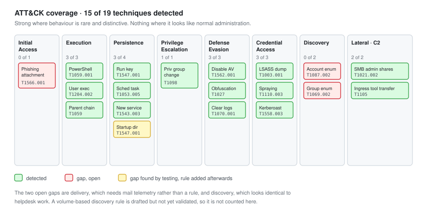

# 08 - Metrics and Coverage

What the detections actually caught, what they missed, and what it would take to close the gaps.

---

## Coverage



| Tactic | Techniques tested | Detected | Coverage |
| --- | :---: | :---: | :---: |
| Initial Access | 1 | 0 | 0 percent |
| Execution | 3 | 3 | 100 percent |
| Persistence | 4 | 3 | 75 percent |
| Privilege Escalation | 1 | 1 | 100 percent |
| Defense Evasion | 3 | 3 | 100 percent |
| Credential Access | 3 | 3 | 100 percent |
| Discovery | 2 | 0 | 0 percent |
| Lateral Movement | 1 | 1 | 100 percent |
| Command and Control | 1 | 1 | 100 percent |
| **Total** | **19** | **15** | **79 percent** |

Strong on execution, persistence, defence evasion and credential access. Nothing at all on initial access or discovery.

That shape is not accidental. Execution and credential access produce distinctive, rare behaviour. Initial access happens before the endpoint telemetry starts, and discovery looks identical to legitimate administration.

---

## Detection Latency

| Rule | Type | Mean latency | Note |
| --- | --- | --- | --- |
| SOC-1008 Office spawning shell | Signature | 2 s | Fastest, and the most valuable |
| SOC-1009 Defender tampering | Signature | 3 s | |
| SOC-1003 Suspicious PowerShell | Signature | 3 s | |
| SOC-1007 LSASS access | Signature | 4 s | |
| SOC-1004 Run key persistence | Signature | 5 s | |
| SOC-1006 Service installation | Signature | 7 s | |
| SOC-1010 Privileged group change | Signature | 9 s | Domain controller, slight forwarding delay |
| SOC-1005 Scheduled task | Signature | 11 s | |
| SOC-1002 Kerberoasting | Frequency | 22 s | Needs 5 events to accumulate |
| SOC-1001 Password spray | Frequency | 38 s | Needs 8 distinct accounts |

**Mean across signature rules: 5.5 seconds. Mean across frequency rules: 30 seconds.**

Frequency rules are inherently slower and that is the trade for their precision. A spray rule that fires on the first failure would be instant and useless.

The detection latency is not the number that matters most, though. Response latency is.

| Measure | Value |
| --- | --- |
| Mean detection latency | 5.5 s (signature), 30 s (frequency) |
| Median time to triage, business hours | 3 min |
| Time to triage, overnight alert ALT-010 | 5 h 3 min |
| Time from first alert to containment, IR-2026-014 | 13 min 47 s |

A five second detection followed by a five hour response is a five hour response.

---

## Tuning Results

Every rule was deployed, run for 48 hours against normal activity, and tuned. This is the before and after.

| Rule | FPs before | FPs after | Change made |
| --- | :---: | :---: | --- |
| SOC-1001 Password spray | 34 | 0 | Excluded machine accounts, raised to 8 distinct accounts, excluded FS01 as a source |
| SOC-1002 Kerberoasting | 18 | 1 | Added a 5-service frequency requirement |
| SOC-1003 Suspicious PowerShell | 22 | 1 | Required encoding or a download cradle, not just flags |
| SOC-1004 Run key persistence | 14 | 2 | Filtered on the value path, not the key. Excluded 4 per-user applications |
| SOC-1005 Scheduled task | 9 | 1 | Excluded Microsoft-signed tasks under the Windows path with an svchost parent |
| SOC-1006 Service installation | 7 | 0 | Filtered on image path characteristics |
| SOC-1007 LSASS access | 11 | 0 | Excluded 5 verified system processes |
| SOC-1008 Office spawning shell | 0 | 0 | No tuning needed |
| SOC-1009 Defender tampering | 2 | 0 | None. Both were my own testing |
| SOC-1010 Privileged group change | 1 | 0 | None |
| **Total** | **118** | **5** | |

**118 false positives down to 5 over 48 hours. A 96 percent reduction.**

At 118 per 48 hours, an analyst would spend their entire shift clearing noise and would start closing alerts without reading them, which is the actual failure mode. At 5 per 48 hours the queue is workable and every alert gets attention.

### Precision

Across the 12 triaged alerts:

| | |
| --- | --- |
| True positives | 8 |
| False positives | 4 |
| Precision | 67 percent |
| False positive rate | 33 percent |

67 percent precision is a good number for this rule set. Two of the four false positives (ALT-007 Veeam, ALT-009 my own testing) were deliberate decisions not to tune, so the achievable precision is higher than the measured one.

### The tuning principle

Every exclusion here follows one rule: **exclude on something the attacker cannot control.**

| Exclusion | Attacker-controllable | Used |
| --- | --- | :---: |
| Service name | Yes, trivially | No |
| File name | Yes, trivially | No |
| File path in user space | Yes | No |
| Digital signature | No, without a stolen certificate | Yes |
| Parent process identity | Hard | Yes |
| Protected system path plus signature plus parent | No | Yes |

This is why ALT-007 was left firing. Excluding `VeeamDeploymentService` by name creates a blind spot with a name anybody can guess. One alert a night is cheaper than that.

---

## Gaps

Four, stated plainly rather than hidden.

### Gap 1: Initial Access

**Missed:** T1566.001 spearphishing attachment.

**Why:** I have no mail telemetry. The lab has no mail gateway, so there is no place to detect the message before it lands.

**Detected instead:** At execution, 2 seconds after the document opened. That is late but it is not useless.

**To close it:** Mail gateway logs into the SIEM, attachment detonation, URL rewriting. That is a product and a budget, not a rule.

**Honest assessment:** In most small environments this gap is real and stays real. The right compensating control is not a detection at all, it is blocking macros from internet-sourced files, which stops the chain without needing to detect anything.

### Gap 2: Discovery

**Missed:** T1087.002 domain account discovery, T1069.002 permission groups discovery.

**Why:** No rule was written. `net user /domain` and `net group "Domain Admins" /domain` are run by helpdesk staff constantly. A rule on the command alone fires every time somebody checks a group membership.

**To close it:** Volume-based rather than signature-based. Many discovery commands from one process in a short window is a tool. One command is a person.

Draft:

```xml
<rule id="101101" level="5">
  <if_sid>61603</if_sid>
  <field name="win.eventdata.commandLine">net\s+(user|group|localgroup)\s.*\/domain|net1\s+(user|group)|Get-ADUser\s+-Filter|Get-ADGroupMember|nltest\s+\/domain_trusts|dsquery</field>
  <description>Domain discovery command: $(win.eventdata.commandLine)</description>
  <mitre>
    <id>T1087.002</id>
  </mitre>
</rule>

<!-- 4 or more distinct discovery commands from one process in 2 minutes -->
<rule id="101102" level="12" frequency="4" timeframe="120">
  <if_matched_sid>101101</if_matched_sid>
  <same_field>win.eventdata.processGuid</same_field>
  <different_field>win.eventdata.commandLine</different_field>
  <description>Automated domain enumeration: 4 or more distinct discovery commands from one process within 2 minutes on $(win.system.computer)</description>
  <mitre>
    <id>T1087.002</id>
    <id>T1069.002</id>
  </mitre>
</rule>
```

Written, not yet validated over a 48 hour normal-activity window. It is on the roadmap rather than in the coverage table, because an untested rule is not a detection.

**Honest assessment:** Discovery is genuinely one of the hardest tactics to detect well. Most environments accept partial coverage here and rely on catching the stages either side of it.

### Gap 3: Startup folder persistence

**Missed:** T1547.001 via a shortcut in the Startup folder rather than a registry write.

**Why:** SOC-1004 only watched the registry. The Startup folder achieves identical persistence with no registry write.

**Closed:** Rule 100404 added on Sysmon event 11 watching both Startup paths. Retested, fired in 5 seconds.

**Honest assessment:** This was an obvious gap and I missed it by thinking about the registry rather than about persistence. It is a good argument for testing against a technique library rather than against your own imagination, because Atomic Red Team found it in one test.

### Gap 4: The overnight window

**Missed:** Nothing technically. ALT-010 fired in 11 seconds and was worked 5 hours later.

**Why:** Nobody on shift.

**To close it:** 24/7 staffing, a managed service, or automated containment for the highest severity rules.

**Honest assessment:** This is the most realistic gap in the whole list, because it is the one most small organisations actually have. The technical answer is automated response for level 14 alerts: isolate the host, disable the account, page someone. Automated containment has its own risks, and isolating a domain controller because of a misfiring rule is a bad night. It is the right trade for a small set of very high confidence rules and the wrong trade for everything else.

---

## Roadmap

| # | Item | Priority | Closes |
| --- | --- | --- | --- |
| 1 | Validate and deploy the discovery rules (101101, 101102) | High | Gap 2 |
| 2 | Alert grouping by host and time window | High | IR-2026-014 finding |
| 3 | Chain-position promotion for alerts on suspect hosts | High | IR-2026-014 finding |
| 4 | Automated containment for level 14 rules | Medium | Gap 4 |
| 5 | Mail gateway telemetry | Medium | Gap 1 |
| 6 | Sysmon event 22 DNS rules for C2 domains | Medium | Detection depth |
| 7 | Suricata rule tuning, currently detection only and noisy | Medium | Network coverage |
| 8 | Sigma to Wazuh conversion pipeline rather than hand conversion | Low | Maintainability |
| 9 | Scheduled Atomic Red Team runs as regression tests | Medium | Rule decay |

**Item 9 is the one I would do first in a real environment.** Rules decay. An operating system update changes a field name, a product update changes a process name, and a rule silently stops firing. Nobody notices until an incident.

Running a subset of the atomics weekly against a test host and alerting when an expected detection does not fire turns rule health into something you monitor rather than something you assume.

---

## What I Would Do Differently

**Write the discovery rule before the chain, not after.** I found the gap by running the attack. Running Atomic Red Team across the full technique list first would have found it in an afternoon without needing the intrusion.

**Tune before chaining.** I ran the chain on rules that had been tuned individually but never run together. The alert ordering problem only appeared under a real sequence.

**Instrument the response, not just the detection.** I measured detection latency carefully and did not measure time to triage until afterwards. Detection latency is the number that looks good. Response latency is the number that decides whether an incident is contained.

**Talk to the user.** Fifty minutes into IR-2026-014 before anyone spoke to `vbunny`. They could have identified the email in seconds. The user is a data source and I treated them as a victim.

---

## Honest Limits

Worth stating clearly rather than letting the numbers imply more than they should.

**Five machines is not five thousand.** The tuning numbers here would not survive contact with a real estate. 118 false positives over 48 hours across 5 hosts becomes an unusable number at scale, and the tuning work is proportionally larger.

**I wrote the attacks and the detections.** That is a known bias. I knew what to look for because I knew what I was going to do. A red team I did not control would find gaps this exercise cannot.

**No adversary adaptation.** A real attacker who hits a detection changes approach. Nothing here adapted, so the rules were never tested against someone trying to avoid them.

**The environment is clean.** No legacy applications, no ten-year-old line-of-business software doing strange things, no shadow IT. Those are the source of most real false positives and this lab has none of them.

What the exercise does demonstrate is the method: instrument, detect, test, tune, triage, document, and record the gaps honestly. That transfers. The specific numbers do not.

---

## Summary

| | |
| --- | --- |
| Techniques tested | 19 |
| Techniques detected | 15 (79 percent) |
| Rules written | 11, including the post-exercise Startup folder rule |
| False positives before tuning | 118 per 48 hours |
| False positives after tuning | 5 per 48 hours |
| Mean detection latency, signature rules | 5.5 seconds |
| Median time to triage | 3 minutes |
| Time to containment, IR-2026-014 | 13 minutes 47 seconds |
| Open gaps | 4, documented with remediation paths |

---

Back to [README.md](README.md)
