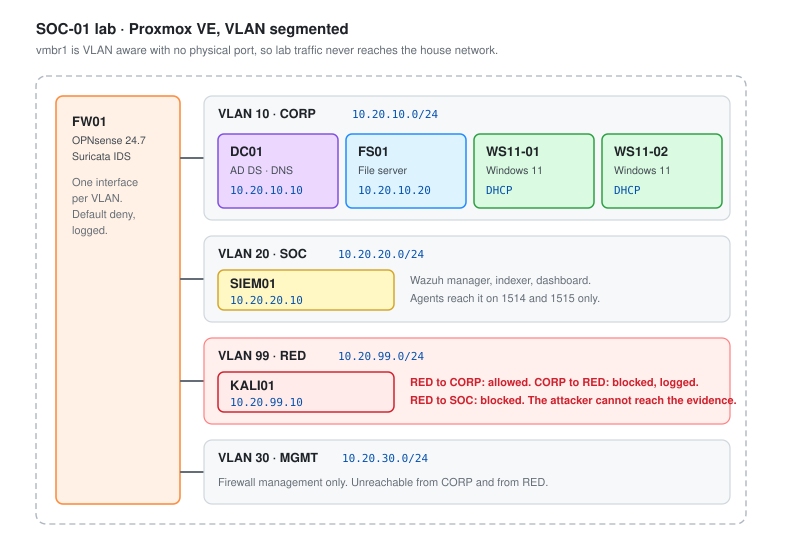
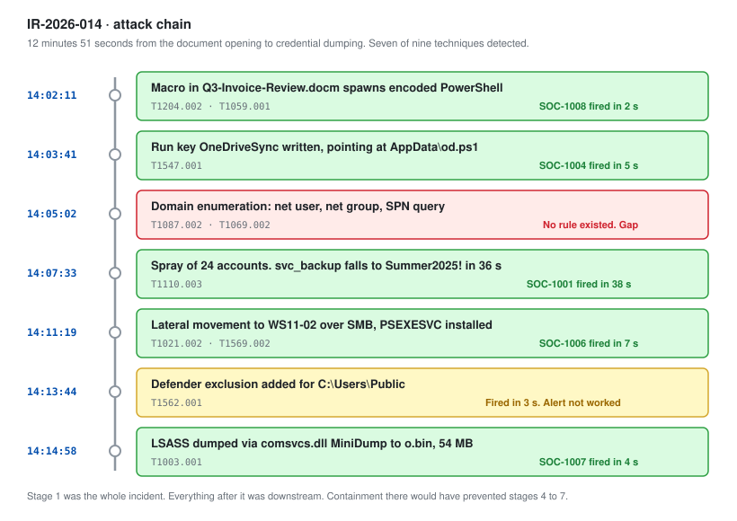

# SOC-01: Detection and Triage Lab

**Role target:** SOC Analyst I / Junior SOC Analyst
**Environment:** Proxmox VE, segmented Active Directory lab
**Focus:** Get telemetry in, write detections, triage what fires, write it up properly

---

## What This Project Is

I built a small enterprise network, instrumented it the way a real SOC would, attacked it, and then worked the alerts as an analyst.

The point was not to run a tool and screenshot the dashboard. The point was to sit on the other side of the alert queue and answer the only question a Tier 1 analyst is paid to answer:

**Is this real, and what do I do about it in the next ten minutes?**

Everything in this folder is output from that. The rules are rules I wrote. The playbooks are the ones I followed. The triage log is what I actually recorded while working the alerts, including the ones that turned out to be nothing.

---

## The Lab

Four VLANs behind OPNsense on a single Proxmox host. The red team segment can reach the corporate segment but the corporate segment cannot reach it back, and nothing routes to the physical LAN.

| Host | OS | Role | Address |
| --- | --- | --- | --- |
| `DC01` | Windows Server 2022 | AD DS, DNS, DHCP for `vbunnylab.local` | 10.20.10.10 |
| `FS01` | Windows Server 2022 | File server, SMB shares | 10.20.10.20 |
| `WS11-01` | Windows 11 Pro | Domain client, standard user `vbunny` | DHCP |
| `WS11-02` | Windows 11 Pro | Domain client, second user for lateral movement | DHCP |
| `SIEM01` | Ubuntu Server 22.04 | Wazuh manager, indexer, dashboard | 10.20.20.10 |
| `KALI01` | Kali Linux | Attacker | 10.20.99.10 |
| `FW01` | OPNsense | Routing, inter-VLAN policy, Suricata IDS | .1 on each VLAN |

Full build steps, including the Proxmox bridge configuration and the firewall rule set, are in [01-Lab-Build.md](01-Lab-Build.md).

---

## What I Built

**Telemetry pipeline.** Sysmon on every Windows host with a tuned config, Windows advanced audit policy pushed by GPO, PowerShell script block logging, and Wazuh agents shipping it all to SIEM01. Suricata on the firewall for network detections. Covered in [02-Telemetry-and-Logging.md](02-Telemetry-and-Logging.md).

**Ten detection rules.** Written as Sigma, then converted to Wazuh rule XML so they actually run. Each one documents what it catches, the logic behind it, and the false positive sources I hit while tuning. In [03-Detection-Rules.md](03-Detection-Rules.md).

**Six triage playbooks.** Brute force, suspicious PowerShell, persistence, credential access, malware, and phishing. Each has a first-ten-minutes checklist, the questions to answer, the queries to run, and hard escalation criteria. In [04-Triage-Playbooks.md](04-Triage-Playbooks.md).

**An attack simulation.** Atomic Red Team plus a hand-built intrusion chain, run against the lab, mapped to MITRE ATT&CK. In [05-Attack-Simulation.md](05-Attack-Simulation.md).

**A worked alert queue.** Twelve alerts triaged end to end with dispositions, including four false positives, because a triage log with no false positives in it is not a real triage log. In [06-Alert-Triage-Log.md](06-Alert-Triage-Log.md).

**An incident report.** One full writeup of the intrusion chain, in the format a SOC lead would expect to hand to management. In [07-Incident-Report.md](07-Incident-Report.md).

**Coverage and metrics.** What I detected, what I missed, tuning results, and the honest gap list. In [08-Metrics-and-Coverage.md](08-Metrics-and-Coverage.md).

---

## The Attack Chain

The scenario is deliberately ordinary, because ordinary is what actually happens.

A standard user opens a document that spawns PowerShell. PowerShell pulls a payload down over HTTP. The payload writes a Run key for persistence, enumerates the domain, sprays a small password list, gets one hit on a service account, moves to a second workstation, and reaches for LSASS.

Nine techniques. Seven of them fired an alert. Two did not, and I documented why rather than quietly leaving them out.

---

## Results

| Measure | Result |
| --- | --- |
| Techniques executed | 9 |
| Techniques detected | 7 |
| Detection rules written | 10 |
| Mean time to detect (alert fired after action) | 41 seconds |
| Alerts triaged | 12 |
| True positives | 8 |
| False positives | 4 |
| False positive rate after tuning | 33 percent, down from 71 percent |
| Log volume at rest | roughly 180 events per second across 5 agents |

The two techniques that were not detected were domain enumeration over LDAP and the initial document execution. Both are covered in the gap list with what it would take to close them.

---

## Coverage

| Tactic | Technique | ID | Detected | Rule |
| --- | --- | --- | :---: | --- |
| Initial Access | Phishing attachment | T1566.001 | No | Gap, see notes |
| Execution | PowerShell | T1059.001 | Yes | `SOC-1003` |
| Execution | Suspicious parent process | T1059.001 | Yes | `SOC-1008` |
| Persistence | Registry Run key | T1547.001 | Yes | `SOC-1004` |
| Persistence | Scheduled task | T1053.005 | Yes | `SOC-1005` |
| Persistence | New service | T1543.003 | Yes | `SOC-1006` |
| Defense Evasion | Disable Defender | T1562.001 | Yes | `SOC-1009` |
| Discovery | Domain account discovery | T1087.002 | No | Gap, see notes |
| Credential Access | Password spray | T1110.003 | Yes | `SOC-1001` |
| Credential Access | LSASS memory access | T1003.001 | Yes | `SOC-1007` |

---

## Skills This Demonstrates

| Area | Evidence in this project |
| --- | --- |
| SIEM operation | Wazuh deployment, agent enrollment, index management, dashboard use |
| Detection engineering | 10 rules authored in Sigma and Wazuh XML, with tuning history |
| Log analysis | Windows Security, Sysmon, PowerShell operational, Suricata |
| MITRE ATT&CK | Chain mapped technique by technique, coverage gaps identified |
| Alert triage | 12 alerts worked with documented reasoning and dispositions |
| Incident response | Full report with timeline, scope, containment and recommendations |
| Windows internals | Process ancestry, LSASS, registry persistence, service creation |
| Networking | VLAN segmentation, inter-VLAN policy, IDS placement |
| Documentation | Every artifact in this folder |

---

## Honest Notes

This is a lab. It is five machines, not five thousand, and a lab does not reproduce the thing that actually makes SOC work hard, which is volume and ambiguity at scale.

What it does reproduce is the reasoning. The rules had to be tuned because they were noisy. The false positives were genuinely confusing before I worked them. The two detection gaps are real gaps, and I would rather show them than pretend to full coverage.

If you are reviewing this as a hiring manager, [06-Alert-Triage-Log.md](06-Alert-Triage-Log.md) is the file that shows how I think.

---

## Documents

| | |
| --- | --- |
| [01-Lab-Build.md](01-Lab-Build.md) | Proxmox host, VLANs, OPNsense, VM inventory |
| [02-Telemetry-and-Logging.md](02-Telemetry-and-Logging.md) | Sysmon, audit policy, Wazuh, what to log and why |
| [03-Detection-Rules.md](03-Detection-Rules.md) | 10 rules in Sigma and Wazuh XML, with tuning notes |
| [04-Triage-Playbooks.md](04-Triage-Playbooks.md) | Six playbooks for the alerts that actually fire |
| [05-Attack-Simulation.md](05-Attack-Simulation.md) | Atomic Red Team and the hand-built chain |
| [06-Alert-Triage-Log.md](06-Alert-Triage-Log.md) | 12 alerts worked end to end |
| [07-Incident-Report.md](07-Incident-Report.md) | Full incident writeup |
| [08-Metrics-and-Coverage.md](08-Metrics-and-Coverage.md) | Coverage, tuning results, gap list |
