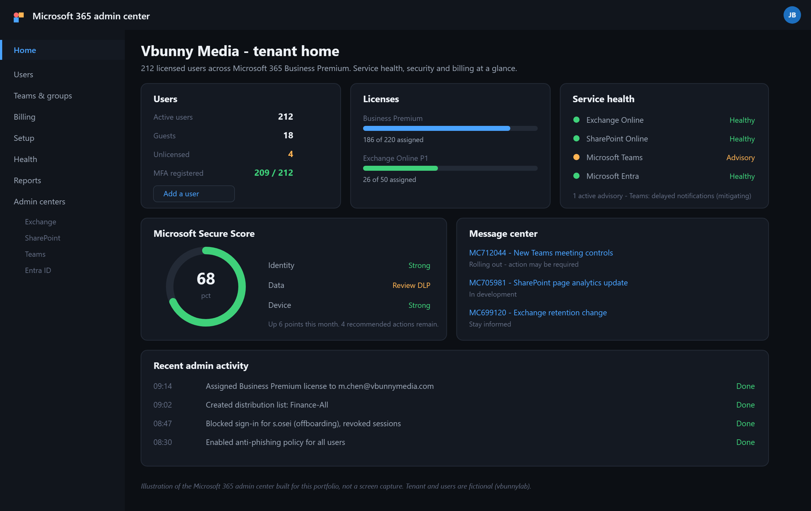

# Microsoft 365 Administration

Day to day administration from the Microsoft 365 admin center. Users, licences, groups, mailbox permissions, and the tickets that come with them.



*The Microsoft 365 admin center: users, licences, service health and Secure Score on the tenant home.*

---

## Which Portal

Five portals, and knowing which one does what saves a lot of clicking.

| Portal | Handles |
| --- | --- |
| [admin.microsoft.com](https://admin.microsoft.com) | Users, licences, billing, service health |
| [entra.microsoft.com](https://entra.microsoft.com) | Identity, conditional access, sign-in logs |
| [admin.exchange.microsoft.com](https://admin.exchange.microsoft.com) | Mail flow, mailboxes, transport rules |
| [intune.microsoft.com](https://intune.microsoft.com) | Devices and apps |
| [security.microsoft.com](https://security.microsoft.com) | Defender, threat policies, quarantine |

The admin center is the front door. Anything security or identity related eventually pushes you into Entra or Defender.

---

## Users

### Create

1. **Users**, **Active users**, **Add a user**.
2. Name, display name, username.
3. Password. Auto-generate, require change on first sign-in.
4. Assign a **licence**.
5. Set **roles** if this is an admin account.
6. Fill in the optional profile fields.

**Fill in department, job title and office.** They look like paperwork. They are what dynamic groups and licence assignment rules run on. A directory with empty attributes means every group has to be maintained by hand.

### Delete and Restore

Deleted users sit in **Users**, **Deleted users** for **30 days**, then go permanently.

Restore puts the account back with its mailbox and OneDrive intact. After 30 days there is nothing to restore.

**Block sign-in rather than deleting** unless you are certain. Blocking is immediate and undoes cleanly.

### Password Reset

**Users**, **Active users**, select, **Reset password**.

Verify who you are talking to first. A reset done for the wrong caller hands over the account.

Better still, enable self-service password reset so users handle their own. That removes both the ticket and the social engineering target. See [Entra ID](../Azure/Entra-ID-Fundamentals.md).

---

## Licences

### Per User

**Users**, **Active users**, select, **Licenses and apps**. Tick the licence, expand **Apps** to turn individual services off.

### Bulk

Select several users, **Manage product licenses**.

### Group-Based, the better way

Assign the licence to a **group** in Entra ID instead. Users get it when they join and lose it when they leave.

**Entra admin center**, **Groups**, select, **Licenses**, **Assignments**.

This is what you want for anything above a handful of users. Onboarding becomes a group membership change, and nobody ends up unlicensed because someone forgot.

### Watching the Count

**Billing**, **Your products** shows assigned against purchased.

Worth checking monthly. Unassigned licences are money going nowhere. Licences assigned to blocked accounts are the same thing.

```powershell
Connect-MgGraph -Scopes 'User.Read.All','Organization.Read.All'
Get-MgSubscribedSku | Select-Object SkuPartNumber,
    @{n='Purchased';e={$_.PrepaidUnits.Enabled}},
    @{n='Assigned';e={$_.ConsumedUnits}}
```

**Usage location has to be set before a licence will assign.** The error when it is missing does not say so.

---

## Groups

Four types, and they are easy to confuse.

| Type | Use | Gets a mailbox? |
| --- | --- | --- |
| **Microsoft 365 group** | Collaboration. Creates a Team, SharePoint site and shared mailbox | Yes |
| **Distribution list** | Email to many people | No |
| **Mail-enabled security** | Permissions and email | No |
| **Security group** | Permissions, licensing, CA targeting | No |

**Creating a Microsoft 365 group creates a lot of things.** A Team, a SharePoint site, a Planner, a shared mailbox. Fine when that is what you want. Not fine when someone just needed an email alias, and you now have an orphaned SharePoint site nobody opens.

For an email alias, use a distribution list.

### Create

**Teams and groups**, **Active teams and groups**, **Add a group**. Pick the type, name it, set owners and members.

**Every group needs at least two owners.** A group with one owner who leaves becomes unmanageable.

---

## Shared Mailboxes

A mailbox several people access, with no licence and no password of its own. `support@`, `info@`, `accounts@`.

### Create

**Teams and groups**, **Shared mailboxes**, **Add a shared mailbox**. Name, address, then add members.

### Permissions

| Permission | Allows |
| --- | --- |
| **Read and manage** (Full Access) | Open the mailbox, read, manage |
| **Send as** | Send appearing as the mailbox |
| **Send on behalf** | Sends as "user on behalf of mailbox" |

Full Access alone does not let someone send. Grant **Send as** too, or you will get a ticket saying replies bounce.

```powershell
Connect-ExchangeOnline
Add-MailboxPermission -Identity 'support@vbunnylab.com' -User 'ballen' -AccessRights FullAccess -InheritanceType All
Add-RecipientPermission -Identity 'support@vbunnylab.com' -Trustee 'ballen' -AccessRights SendAs -Confirm:$false
Get-MailboxPermission -Identity 'support@vbunnylab.com' | Where-Object {$_.User -notlike 'NT AUTHORITY*'}
```

Shared mailboxes are free up to 50 GB. Past that they need a licence.

---

## Delegated Mailbox Access

Giving one person access to another's mailbox, usually for cover or after someone leaves.

**Users**, **Active users**, select, **Mail** tab, **Manage mailbox permissions**.

This is a sensitive change. It gives one employee access to another's email.

- Get written approval from a manager or HR
- Record the approval in the ticket
- Tell the mailbox owner where there is any expectation of privacy
- Set a review date and remove it afterwards

Delegated access that was granted for two weeks of cover and never removed is a common audit finding.

---

## Converting to a Shared Mailbox

Standard offboarding step. Frees the licence while keeping the mail accessible.

1. **Users**, **Active users**, select the leaver.
2. **Mail** tab, **Convert to shared mailbox**.
3. Wait for it to complete.
4. Remove the licence.
5. Grant the manager Full Access and Send as.

```powershell
Set-Mailbox -Identity 'ballen@vbunnylab.com' -Type Shared
```

Block sign-in on the account first, otherwise the person still has a way in.

---

## Contacts

For external people who should appear in the address book.

**Teams and groups**, **Contacts**, **Add a contact**. Name and external email.

That is an organisation-wide contact. Personal contacts live in the user's own Outlook and are not administered centrally.

---

## Service Health

**Health**, **Service health** shows current incidents and advisories.

**Check this first when several users report the same problem.** A tenant-wide Outlook or Teams issue is usually Microsoft, not you, and the incident page will say so. Ten minutes of troubleshooting a Microsoft outage is ten minutes wasted.

**Message center** carries upcoming changes. Worth reading weekly. Features get changed and retired with notice, and the notice arrives here.

---

## Common Tickets

| Symptom | Cause | Fix |
| --- | --- | --- |
| Cannot sign in | Password, blocked, MFA, CA policy | Read the Entra sign-in log |
| No access to a new app | Licence or service plan off | Check Licenses and apps |
| Cannot send from a shared mailbox | Missing Send as | Add the permission |
| Not receiving external mail | Transport rule, spam filter, or DNS | Message trace |
| Licence will not assign | Usage location not set | Set it on the user |
| Removed from a group and still has access | Token cached | Sign out and back in |
| Mailbox full | Quota | Check quota, archive |
| Several users, same issue | Service outage | Check service health |

```powershell
Connect-ExchangeOnline
Get-Mailbox -Identity ballen | Select-Object DisplayName, RecipientTypeDetails, ProhibitSendQuota
Get-MailboxStatistics -Identity ballen | Select-Object DisplayName, TotalItemSize, ItemCount
Get-MessageTrace -SenderAddress someone@external.com -StartDate (Get-Date).AddDays(-2) -EndDate (Get-Date)
```

**Message trace settles most mail arguments.** It shows whether a message reached the tenant and what happened to it. That splits "the sender never sent it" from "we filtered it" in one query.

---

## Admin Roles

| Role | Scope |
| --- | --- |
| Global Administrator | Everything |
| User Administrator | Users, groups, most resets |
| Helpdesk Administrator | Password resets for non-admins |
| Exchange Administrator | Mail |
| Teams Administrator | Teams |
| Billing Administrator | Subscriptions |
| Global Reader | Read-only everywhere |

**Global Administrator is handed out far too easily.** Microsoft recommends fewer than five. Most tenants have more than that because it was quicker than finding the right role.

Global Reader is underused. It covers most investigation work with no ability to change anything, which makes it the right role for a lot of people who currently have more.

---

## Practices

- Group-based licensing rather than per user
- Distribution list for an alias. Microsoft 365 group only when you want the whole set
- Two owners on every group
- Block sign-in before deleting, always
- Convert leavers to shared mailboxes and reclaim the licence
- Document and time-limit delegated mailbox access
- Check service health before troubleshooting a widespread issue
- Review licence counts monthly
- Count your Global Admins and justify each one
