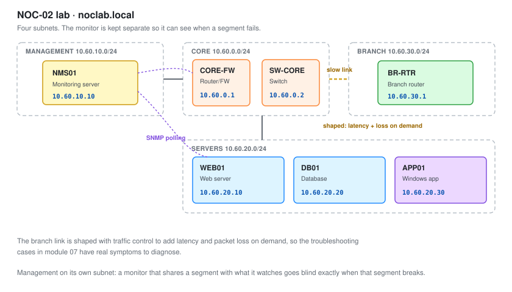
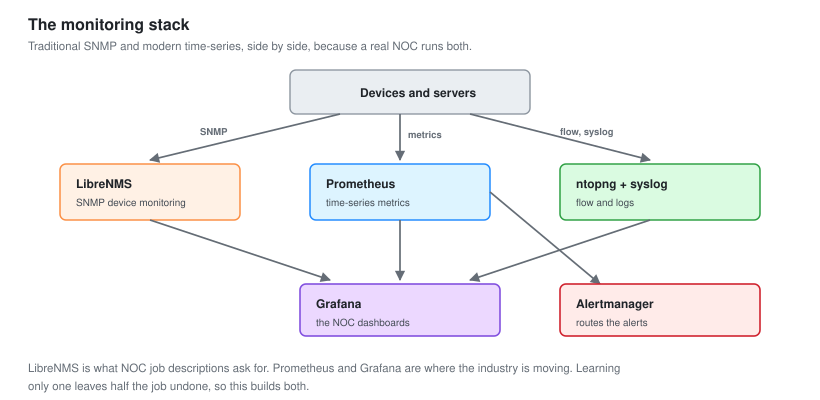

# 01 - Monitoring Lab Build

The network to watch, and the stack that watches it, built from bare metal up.

---

## The Design

A NOC needs something to monitor. A single flat network with one server teaches nothing, because nothing ever goes wrong in an interesting way. This lab is built to have problems worth diagnosing.

Three things had to be true.

**Multiple subnets.** A NOC watches sites and segments, not one LAN. This has a core, a server segment, and a branch across a slower link, so latency and packet loss are real between them.

**Real devices to poll.** SNMP against a router, a switch, and servers, because that is what a NOC monitors and it behaves differently from polling one host.

**Somewhere problems can happen.** A saturable link, a service that can fail, a disk that can fill. The troubleshooting in [module 07](07-Troubleshooting-Playbooks.md) needs genuine faults, not imagined ones.

---

## The Network



Built on Proxmox, the same platform as the other projects.

| Host | Role | OS | Address | Subnet |
| --- | --- | --- | --- | --- |
| `CORE-FW` | Router and firewall | OPNsense | 10.60.0.1 | Core |
| `SW-CORE` | Core switch | Open vSwitch VM | 10.60.0.2 | Core |
| `NMS01` | Monitoring server | Ubuntu 22.04 | 10.60.10.10 | Management |
| `WEB01` | Web server | Ubuntu 22.04 | 10.60.20.10 | Servers |
| `DB01` | Database server | Ubuntu 22.04 | 10.60.20.20 | Servers |
| `APP01` | Application server | Windows Server 2022 | 10.60.20.30 | Servers |
| `BR-RTR` | Branch router | OPNsense | 10.60.30.1 | Branch |

### The subnets

| Subnet | Purpose | Range |
| --- | --- | --- |
| Core | Routing and switching | 10.60.0.0/24 |
| Management | The monitoring server, out of band | 10.60.10.0/24 |
| Servers | The things being served | 10.60.20.0/24 |
| Branch | A remote site across a slower link | 10.60.30.0/24 |

**Management is its own subnet on purpose.** A monitoring server that shares a subnet with the things it monitors goes blind exactly when that subnet has a problem. Keeping it separate means it can still see and alert when a monitored segment is in trouble.

---

## Building the Branch Link

The branch is what makes latency and packet loss real. It sits across a link that can be shaped to behave like a slow or lossy WAN.

On the Proxmox host, the branch link is shaped with `tc` (traffic control) to add delay and loss on demand.

```bash
# Add 40ms of latency to the branch link, the way a real WAN has
tc qdisc add dev veth-branch root netem delay 40ms

# Add packet loss, for the packet-loss troubleshooting case
tc qdisc change dev veth-branch root netem delay 40ms loss 2%

# Remove it to restore normal
tc qdisc del dev veth-branch root
```

**This is how the troubleshooting cases in [module 07](07-Troubleshooting-Playbooks.md) get real symptoms.** Injecting 2 percent packet loss on the branch link produces exactly the intermittent, hard-to-pin-down problem a NOC actually gets called about, and it can be turned on and off to practise diagnosis.

---

## The Monitoring Stack



A real NOC runs traditional SNMP monitoring and modern time-series monitoring side by side, so this builds both.

| Tool | Layer | Why |
| --- | --- | --- |
| LibreNMS | SNMP device monitoring | The traditional NOC tool. Auto-discovers and polls devices |
| Prometheus | Time-series metrics | Modern, fast, great for servers and services |
| node_exporter, snmp_exporter | Metric collectors | Feed Prometheus |
| Grafana | Dashboards | The NOC screens, fed by both |
| ntopng | Flow analysis | Who is using the bandwidth |
| rsyslog | Log aggregation | Device and system logs in one place |
| Alertmanager | Alert routing | The right alert to the right person |

### Why both, honestly

LibreNMS is what NOC job descriptions ask for. It auto-discovers network devices over SNMP and understands their MIBs, which Prometheus does not do as easily.

Prometheus and Grafana are where the industry is moving, especially for servers, services and containers.

**Learning only one leaves half the job undone.** A Tier 2 NOC analyst is expected to work in whatever the shop runs, and increasingly that is a mix. Building both here is deliberate.

---

## Installing LibreNMS

On NMS01. LibreNMS has an install script, but the manual path teaches what the pieces are.

```bash
# Dependencies: web server, database, PHP, SNMP tools
sudo apt update
sudo apt install -y nginx-full mariadb-server php-fpm php-cli php-snmp \
    php-mysql snmp snmpd rrdtool fping git composer

# Clone LibreNMS
cd /opt
sudo git clone https://github.com/librenms/librenms.git
```

The full setup (database, web config, cron poller) follows the official install guide. The key concept is the **poller**, a cron job that polls every device over SNMP on a schedule and stores the results.

```bash
# The poller runs every 5 minutes by default, via cron
*/5 * * * * librenms /opt/librenms/librenms-cron.sh
```

**The poller interval is a real trade-off.** Poll every 5 minutes and you miss a 2-minute spike entirely. Poll every 30 seconds and you multiply the load on both the monitor and the devices. Five minutes is the default for a reason, and knowing when to poll faster is a Tier 2 judgement covered in [module 02](02-Metrics-and-SNMP.md).

---

## Installing Prometheus and Grafana

```bash
# Prometheus
sudo useradd --no-create-home --shell /bin/false prometheus
# download, extract, and configure /etc/prometheus/prometheus.yml

# Grafana
sudo apt install -y apt-transport-https software-properties-common
# add the Grafana repo, then:
sudo apt install -y grafana
sudo systemctl enable --now grafana-server
```

The Prometheus config defines what to scrape.

```yaml
# /etc/prometheus/prometheus.yml
global:
  scrape_interval: 30s

scrape_configs:
  - job_name: 'servers'
    static_configs:
      - targets: ['10.60.20.10:9100', '10.60.20.20:9100']  # node_exporter

  - job_name: 'network-snmp'
    static_configs:
      - targets: ['10.60.0.1', '10.60.0.2', '10.60.30.1']
    metrics_path: /snmp
    params:
      module: [if_mib]
    relabel_configs:
      - source_labels: [__address__]
        target_label: __param_target
      - target_label: __address__
        replacement: 127.0.0.1:9116   # snmp_exporter
```

**`scrape_interval` is the Prometheus equivalent of the poller interval.** Same trade-off, faster default. 30 seconds catches most spikes without overwhelming anything at this scale.

---

## Enabling SNMP on the Devices

Nothing gets monitored until it answers SNMP.

### On the servers

```bash
sudo apt install -y snmpd
```

```text
# /etc/snmp/snmpd.conf
agentAddress udp:161
rocommunity NOClab_ro 10.60.10.10     # read-only, only from the monitor
sysLocation Lab
sysContact noc@noclab.local
```

```bash
sudo systemctl restart snmpd
```

### On OPNsense

Services, then SNMP, enable it, set a read-only community, and bind it to the management interface only.

**The community string is a password, and `public` is the default everyone knows.** Leaving it at `public` is the SNMP equivalent of leaving a blank admin password. Every device here uses a non-default read-only string, bound to only accept queries from the monitoring server. That is both good practice and a NOC finding when you discover a device that did not do it.

### Confirm it answers

```bash
# From NMS01, ask a device for its system description
snmpwalk -v2c -c NOClab_ro 10.60.0.1 sysDescr

# Walk its interfaces
snmpwalk -v2c -c NOClab_ro 10.60.0.1 ifDescr
```

If those return data, the device is monitorable. If they time out, SNMP is not enabled, the community is wrong, or a firewall is blocking UDP 161. Those three are the entire troubleshooting tree for "why will this device not monitor."

---

## Syslog

Devices and servers send their logs to one place, so a NOC does not log into each device to read them.

```bash
# On NMS01, rsyslog listens for remote logs
# /etc/rsyslog.conf
module(load="imudp")
input(type="imudp" port="514")

# Store per-device
$template RemoteLogs,"/var/log/remote/%HOSTNAME%/%PROGRAMNAME%.log"
*.* ?RemoteLogs
```

Then each device points its logging at 10.60.10.10.

**Centralised syslog is the difference between "check every device" and "check one place."** When a link flaps at 3am, the log entry is already on the monitoring server, timestamped, next to everything else that happened at that moment.

---

## Build Order

1. Proxmox host, the four subnets, OPNsense as the core router
2. The branch router across the shaped link
3. The servers, each with SNMP enabled
4. NMS01, the monitoring server
5. LibreNMS, then discover the devices
6. Prometheus and Grafana, then the exporters
7. ntopng for flow, rsyslog for logs
8. Confirm every device is polling before building dashboards

**Step 8 is the gate.** Building dashboards on top of devices that are not fully polling gives you dashboards full of gaps that look like outages. Confirm the data is flowing first, then visualise it.

---

## Verify

Before moving on, all of these should pass.

```bash
# Every device answers SNMP from the monitor
for d in 10.60.0.1 10.60.0.2 10.60.30.1 10.60.20.10 10.60.20.20; do
  echo -n "$d: "; snmpget -v2c -c NOClab_ro $d sysName.0 2>/dev/null || echo "NO RESPONSE"
done

# Prometheus is scraping its targets
curl -s localhost:9090/api/v1/targets | grep -o '"health":"[a-z]*"' | sort | uniq -c

# LibreNMS has discovered the devices
# (check the web interface, or the poller log)
tail /opt/librenms/logs/librenms.log
```

**Every device up, every Prometheus target healthy, LibreNMS polling all of them.** That is the baseline. Everything after this builds on it.

---

Next: [02-Metrics-and-SNMP.md](02-Metrics-and-SNMP.md)
