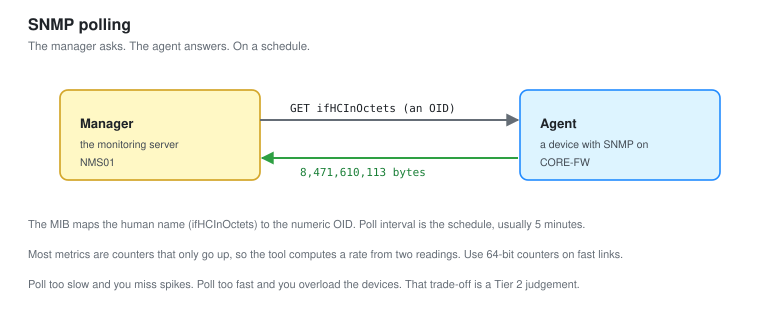
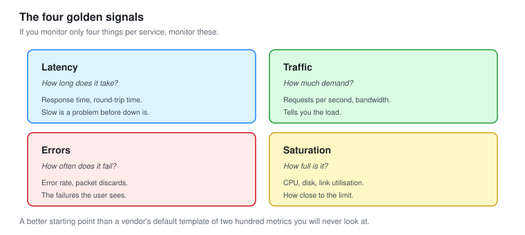

# 02 - Metrics and SNMP

What to measure, how SNMP gets it, and which numbers actually mean something.

---

## The Problem With "Monitor Everything"

You can collect thousands of metrics from a single device. Almost all of them are useless most of the time.

**A Tier 2 NOC analyst knows which few metrics matter, and ignores the rest until they are needed.** Collecting everything and alerting on everything is how a NOC ends up with 340 alerts a week that nobody reads. Collecting what matters is the start of a NOC that works.

---

## How SNMP Works



SNMP (Simple Network Management Protocol) is how the monitoring server asks a device how it is doing.

```text
Monitoring server (manager)  --- "what is your CPU?" --->  Device (agent)
                             <--- "43 percent" ----------
```

The manager polls. The agent answers. Every metric has an address called an **OID** (Object Identifier), a string of numbers, and the map of what those numbers mean is a **MIB** (Management Information Base).

```bash
# Ask by name (the MIB translates it to the OID)
snmpget -v2c -c NOClab_ro 10.60.0.1 sysUpTime.0

# The same thing by raw OID
snmpget -v2c -c NOClab_ro 10.60.0.1 1.3.6.1.2.1.1.3.0
```

**You rarely type raw OIDs.** The MIB translates human names to OIDs. But when a device uses a vendor MIB the monitoring tool does not have, you get raw OIDs back and have to find the MIB. That is a real Tier 2 task and it is worth knowing why it happens.

### SNMP versions

| Version | Security | Use |
| --- | --- | --- |
| v1 | Community string, plaintext | Avoid, legacy only |
| v2c | Community string, plaintext | Common, fine on a trusted management network |
| v3 | Username, authentication, encryption | The correct choice, more setup |

**v2c sends the community string in plaintext.** On a segregated management network that is acceptable. Anywhere else, v3 with authentication and encryption is the right answer, and finding v1 or v2c in use on a production network is a finding worth raising.

---

## The Metrics That Matter

Not everything. These.

### For a network device (router, switch)

| Metric | Why it matters | Alert when |
| --- | --- | --- |
| Interface in/out utilisation | Saturation causes slowness | Sustained over 80 percent |
| Interface errors and discards | A failing link or duplex mismatch | Any sustained increase |
| CPU utilisation | An overloaded device drops packets | Sustained over 85 percent |
| Memory utilisation | Out of memory means crashes | Over 90 percent |
| Interface operational status | The link is down | Changes to down |
| Uptime | A reboot you did not expect | Drops (device restarted) |

### For a server

| Metric | Why it matters | Alert when |
| --- | --- | --- |
| CPU | Overload | Sustained over 90 percent |
| Memory | Out of memory kills processes | Over 90 percent |
| Disk space | A full disk stops everything | Over 85 percent |
| Disk I/O wait | Slow storage makes everything slow | Sustained high |
| Network throughput | Saturation | Approaching link speed |
| Service or port up | The thing it exists to do | Port not answering |

### For a service

| Metric | Why | Alert when |
| --- | --- | --- |
| Response time | Slow is a problem before down is | Over the SLA threshold |
| Error rate | Failures the user sees | Above baseline |
| Availability | Up or down | Down |

**The word "sustained" appears everywhere on purpose.** A CPU that hits 95 percent for two seconds is normal. A CPU that holds 95 percent for ten minutes is a problem. The difference between those two is the difference between a useful alert and noise, and it is covered in [module 04](04-Alerting-and-Noise-Reduction.md).

---

## The Four Golden Signals



There is a simpler way to think about what to monitor, borrowed from Google's site reliability practice. Four signals cover most of what matters.

| Signal | Question | Example |
| --- | --- | --- |
| **Latency** | How long does it take | Response time, round-trip time |
| **Traffic** | How much demand | Requests per second, bandwidth |
| **Errors** | How often does it fail | Error rate, packet discards |
| **Saturation** | How full is it | CPU, disk, link utilisation |

**If you monitor only four things per service, monitor these.** They catch most real problems, and they are a better starting point than a vendor's default template of two hundred metrics you will never look at. Start here, add specifics as you learn what breaks.

---

## Counters, and the Trap in Them

Most network metrics are **counters**, not gauges. This trips up everyone once.

A gauge is a current value: CPU is 43 percent right now.

A counter only ever goes up: this interface has passed 8,471,220,113 bytes since it booted. That raw number is useless. What you want is the **rate**: bytes per second, which is the difference between two readings divided by the time between them.

```text
Reading at 10:00:00   bytes = 8,471,220,113
Reading at 10:00:30   bytes = 8,471,610,113
Difference = 390,000 bytes over 30 seconds = 13,000 bytes/sec
```

**The monitoring tool does this for you, but you have to understand it.** Two things go wrong. A counter can wrap around to zero when it hits its maximum, producing a huge false spike, which is why 64-bit counters exist and matter. And if a poll is missed, the rate calculation is wrong for that interval. Knowing this is why a Tier 2 analyst does not panic at a single impossible spike on a graph.

### 32-bit versus 64-bit counters

A 32-bit counter on a fast interface wraps around in minutes, making the rate calculation unreliable. The 64-bit versions (the `ifHC` counters, "high capacity") do not.

```bash
# Use the high-capacity counters on anything above 100 Mbps
snmpwalk -v2c -c NOClab_ro 10.60.0.1 ifHCInOctets
```

**Polling the 32-bit counter on a gigabit link is a classic mistake.** The graph looks wrong, full of impossible spikes, and the cause is that the counter wrapped between polls. Using the 64-bit counter fixes it. This is exactly the kind of thing that separates someone who runs the tool from someone who understands it.

---

## Thresholds, and Why Static Ones Are Not Enough

The simplest alert is a static threshold: alert when CPU is over 85 percent. It works, until it does not.

| Static threshold problem | Example |
| --- | --- |
| Normal varies by device | 70 percent CPU is fine on one server, alarming on another |
| Normal varies by time | 80 percent bandwidth at 2pm is fine, at 3am is not |
| It catches the symptom, not the change | A server that jumps from 20 to 60 percent is more interesting than one steady at 80 |

**A static threshold is a fine start and a poor finish.** [Module 04](04-Alerting-and-Noise-Reduction.md) covers baselining and rate-of-change, which catch the problems static thresholds miss. For now, a static threshold with a "sustained for N minutes" condition is a reasonable baseline.

---

## Building a Baseline

Before you can say what is abnormal, you have to know what is normal. Collect a week of data and look at it.

```promql
# In Prometheus: average CPU by hour of day over a week
avg_over_time(cpu_usage[1h])
```

**A week reveals the daily and weekly pattern.** Backups run at 2am and spike disk I/O. Traffic peaks at 9am and 2pm. The batch job runs on Sundays. None of those are problems, but a threshold that does not know about them alerts on all of them. Knowing the normal pattern is what lets you alert only on departures from it.

---

## What I Chose to Monitor

Applying all of the above, the actual metric set for this lab.

| Device type | Metrics collected | Metrics ignored |
| --- | --- | --- |
| Routers | Interface rates, errors, CPU, memory, uptime, session count | Per-protocol counters, most of the MIB |
| Switch | Port rates, errors, port status | Spanning-tree detail unless troubleshooting |
| Linux servers | The four golden signals, plus disk and I/O wait | Per-process detail unless troubleshooting |
| Windows server | Golden signals, service status, disk | Most of the WMI surface |
| Services | Latency, error rate, availability | Internal detail unless troubleshooting |

**The "ignored" column is as considered as the "collected" one.** Everything ignored can be turned on when a specific problem needs it. Collecting it all the time, all the time, is what buries the signal. A Tier 2 analyst collects the vital signs continuously and reaches for the detail only when diagnosing.

---

## Checklist

- [ ] SNMP working on every device, v3 or v2c on a trusted network only
- [ ] Non-default community strings, bound to the monitor
- [ ] 64-bit counters used on anything above 100 Mbps
- [ ] The four golden signals collected per service
- [ ] "Sustained for N minutes" on utilisation metrics, not instant
- [ ] A week of baseline data collected before setting thresholds
- [ ] The daily and weekly pattern understood
- [ ] Detail metrics available but not collected continuously

---

Next: [03-Dashboards-and-Visualization.md](03-Dashboards-and-Visualization.md)
