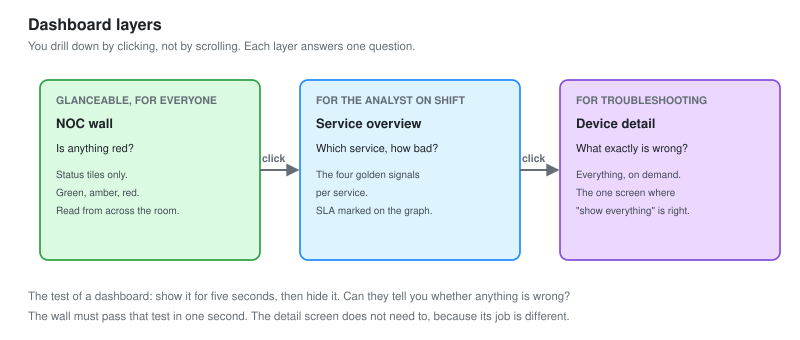
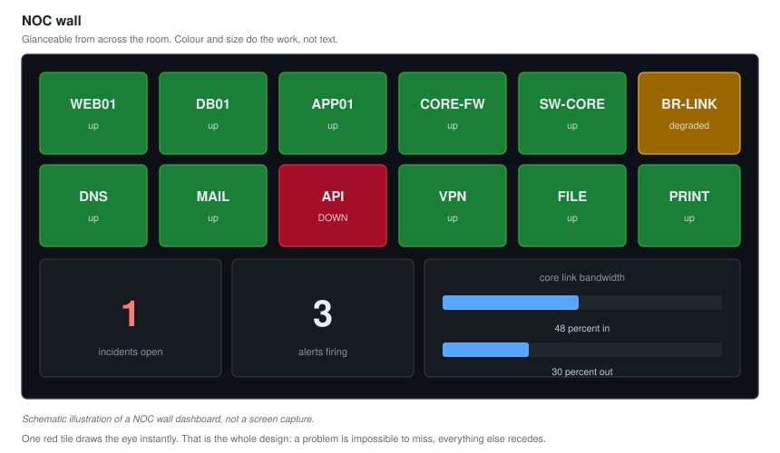

# 03 - Dashboards and Visualization

Building NOC screens that make a problem obvious in a glance, instead of burying it in a wall of graphs.

---

## The Point of a Dashboard

A dashboard exists to answer one question fast: **is anything wrong, and if so, where?**

A dashboard that shows every metric answers nothing, because the eye cannot find the problem in the noise. The skill is choosing what goes on the screen and what stays one click away.

**Most NOC dashboards are bad, and they are bad in the same way: too much on one screen.** Fixing that is a Tier 2 contribution.

---

## The Layers of Dashboard

A NOC needs different views for different moments. Build them as layers, from the wall-mounted overview down to the single-service detail.



| Layer | Audience | Answers | Detail |
| --- | --- | --- | --- |
| **NOC wall** | Everyone, glanceable | Is anything red | Minimal, status only |
| **Service overview** | The analyst on shift | Which service, how bad | Golden signals per service |
| **Device detail** | Whoever is troubleshooting | What exactly is wrong | Everything, on demand |

**You drill down, you do not scroll.** The wall shows a red tile. You click it to the service overview. You click the bad signal to the device detail. Each layer answers one question and hands you to the next, rather than showing everything at once.

---

## The NOC Wall

The screen on the wall, or the first tab an analyst opens. It has one job: make a problem impossible to miss.



*Schematic illustration of a NOC wall dashboard, not a screen capture.*

### What goes on it

```text
A status tile per critical service and device
  Green  = fine
  Amber  = degraded
  Red    = down or breaching

A single "current incidents" count
A single "alerts firing" count
Top-level bandwidth on the core links
That is nearly all.
```

### What does not go on it

Line graphs of individual metrics. Tables of numbers. Anything that requires reading rather than glancing.

**The NOC wall is read from across the room.** If understanding it requires walking up and reading axis labels, it is a service dashboard, not a wall. Colour and size do the work. Red and large means look here now.

### Building it in Grafana

Grafana's Stat and State Timeline panels are built for this.

```text
Panel type:  Stat
Value:       up{service="web01"}
Thresholds:  0 = red, 1 = green
Display:     large, coloured background
```

The whole wall is a grid of these. One tile per thing that matters, coloured by health.

---

## The Service Overview

One click down. For each service, the four golden signals, so the analyst can see not just that it is unhealthy but how.

```text
WEB01 service overview
  Latency        a line graph, with the SLA threshold drawn on it
  Traffic        requests per second
  Errors         error rate, with baseline
  Saturation     CPU, memory, disk on one panel
```

**Draw the threshold on the graph.** A latency graph is far more useful with a horizontal line showing where the SLA sits. The eye instantly sees whether the line is above or below it, without reading numbers. A graph with no reference line makes you remember what "good" was.

---

## The Device Detail

The deepest layer, for troubleshooting. Here you do show everything, because someone is actively diagnosing and needs it all.

```text
CORE-FW detail
  Every interface, in and out rates
  Interface errors and discards
  CPU and memory
  Session count
  Recent syslog from this device
```

**This is the one screen where "show everything" is correct**, because its audience is one person actively hunting a specific fault, not a room glancing for anything wrong. Context decides how much detail belongs, and the mistake is using this density on the wall.

---

## Colour, Used Properly

Colour is the fastest signal the eye reads. Waste it and the dashboard stops working.

| Rule | Why |
| --- | --- |
| Green, amber, red only for health | If everything is coloured, nothing stands out |
| Red means action needed, now | Red for "slightly elevated" trains people to ignore red |
| Consistent everywhere | Red must mean the same thing on every panel |
| Consider colour blindness | Red and green look identical to some. Add shape or position |

**The most common dashboard mistake is colour everywhere.** Rainbow graphs, coloured backgrounds on healthy panels, red used for "high but fine." When everything is coloured, the eye has nothing to lock onto, and the actual problem hides in plain sight. Reserve colour for meaning.

---

## What the Graph Shape Tells You

A Tier 2 analyst reads the shape, not just the number.

| Shape | Means |
| --- | --- |
| Flat line, then a step up | A change happened. Correlate with what changed |
| Sawtooth, regular | Something cyclic. A backup, a batch job, a cache flush |
| Gradual climb, never resets | A leak. Memory, disk, connections. Will end in an outage |
| Spiky, irregular | Bursty load. Usually normal, sometimes a retry storm |
| Flat at the maximum | Saturation. The metric is capped and demand exceeds supply |

**A gradual climb that never resets is the most important shape to recognise.** Memory that only ever goes up is a leak, and it will cause an outage on a predictable schedule. Spotting the slope early turns a 3am outage into a scheduled restart at a civilised hour. That is the difference between reacting and operating.

---

## Annotations

The best dashboards mark events on the timeline, so a graph shows not just what happened but what happened alongside it.

```text
A deployment at 14:00, marked on every graph
A change window, shaded
An incident, from the moment it opened
```

**When latency jumps at 14:02 and a deployment is marked at 14:00, the investigation is nearly over.** Annotations turn "something changed" into "this changed it." Grafana pulls them from a deployment log, a change calendar, or the alerting system automatically.

---

## The Dashboards I Built

Four, following the layers.

| Dashboard | Layer | Purpose |
| --- | --- | --- |
| NOC Wall | Wall | Everything, red or green, glanceable |
| Network Overview | Service | Core links, device health, the golden signals |
| Server Fleet | Service | Every server's golden signals in a grid |
| Device Detail (templated) | Detail | One dashboard, pick any device from a dropdown |

**The templated detail dashboard is the Tier 2 touch.** Rather than a separate dashboard per device, one dashboard with a device dropdown. Select any device and it repopulates. Fewer dashboards to maintain, and every device gets the same consistent detail view. Grafana template variables make this a single build that covers the whole fleet.

```text
Variable:  $device = query(label_values(instance))
Every panel filters on:  instance = "$device"
```

---

## The Test of a Dashboard

Before a dashboard is done, it passes one test.

**Show it to someone for five seconds, then hide it. Can they tell you whether anything is wrong?**

If yes, the dashboard works. If they need to study it, it is too dense for its layer. The NOC wall must pass this test in one second. A device detail screen does not need to, because its job is different.

---

## Checklist

- [ ] Dashboards built as layers: wall, service, detail
- [ ] The wall is glanceable from across the room
- [ ] You drill down by clicking, not by scrolling
- [ ] Colour reserved for health, consistent everywhere
- [ ] SLA thresholds drawn on the graphs
- [ ] Events annotated on the timeline
- [ ] A single templated dashboard covers the whole fleet
- [ ] Every dashboard passes the five-second test for its layer

---

Next: [04-Alerting-and-Noise-Reduction.md](04-Alerting-and-Noise-Reduction.md)
