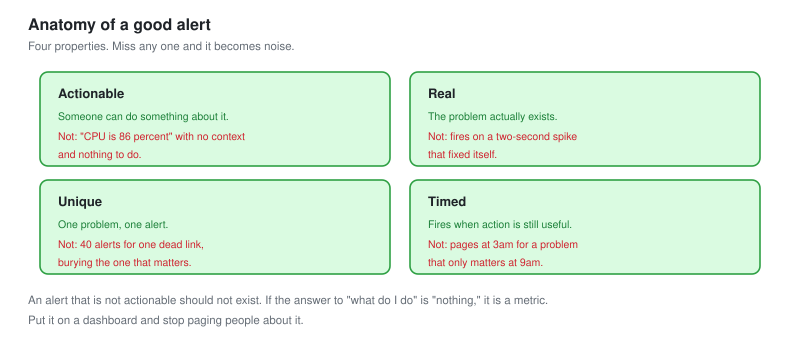
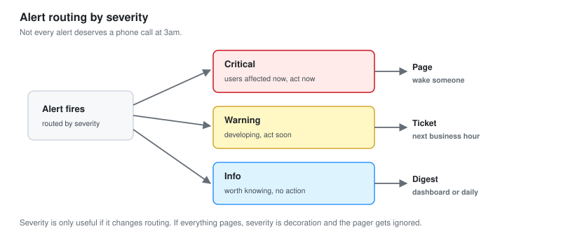

# 04 - Alerting and Noise Reduction

The single hardest and most valuable NOC skill: alerts that fire on real problems and stay quiet the rest of the time.

This is the flagship of the project. A NOC lives or dies by its alerting.

---

## The Problem

A NOC that gets 340 alerts a week does not read 340 alerts a week. It reads the first fifty, gets numb, and starts closing the rest without looking. Then the one alert that mattered arrives, gets closed with the rest, and the outage happens anyway.

**Alert noise does not just waste time. It hides the real alert.** This is called alert fatigue, and it is the most common serious problem in a real NOC.

Fixing it is the highest-value thing a Tier 2 analyst does, and it is what this module is about.

---

## The Starting State

When the monitoring was first switched on with default alerting, one week produced this.

| Category | Alerts per week | Actionable |
| --- | --- | --- |
| Interface flapping (one bad cable) | 118 | The first one |
| CPU spikes (backups, batch jobs) | 74 | None |
| Disk warnings (same disk, every poll) | 61 | The first one |
| A device rebooting during a patch window | 22 | None, it was planned |
| Duplicate alerts for one root cause | 40 | The root cause only |
| Genuine, actionable problems | 25 | 25 |
| **Total** | **340** | **~26** |

**Of 340 alerts, about 26 were worth acting on.** That is a 92 percent noise rate, and it is completely normal for untuned monitoring. The job is to cut the 314 without losing the 26.

---

## The Anatomy of a Good Alert



Before reducing noise, define what a good alert is. Four properties.

| Property | Means | Bad alert version |
| --- | --- | --- |
| **Actionable** | Someone can do something about it | "CPU is 86 percent" with no context |
| **Real** | The problem actually exists | Fires on a two-second spike |
| **Unique** | One problem, one alert | 40 alerts for one dead link |
| **Timed** | Fires when action is still useful | Fires at 3am for a 9am problem |

**An alert that is not actionable should not exist.** If the answer to "what do I do about this" is "nothing" or "wait and see," it is not an alert, it is a metric. Put it on a dashboard and stop paging people about it. This one principle removes a huge share of noise.

---

## Technique 1: Require Duration

The biggest single win. Most noise is momentary.

A CPU that touches 90 percent for one poll is normal. A CPU that holds above 90 percent for ten minutes is a problem. The fix is to require the condition to persist.

```yaml
# Alertmanager / Prometheus: the 'for' clause is the whole trick
- alert: HighCPU
  expr: cpu_usage > 90
  for: 10m          # must be true for 10 minutes straight
  labels:
    severity: warning
```

**The `for` clause removed 74 of the CPU alerts in one line.** Every backup spike, every batch job, every momentary peak stopped alerting, because none of them held for ten minutes. The genuine overloads did hold, and they still fired. One clause, most of a category gone.

---

## Technique 2: Deduplicate

One root cause should produce one alert, not forty.

When the core link went down, it produced: the link-down alert, plus unreachable alerts for everything behind it, plus latency alerts, plus service-down alerts. Forty alerts, one cause.

**Alertmanager groups related alerts, and dependency awareness suppresses the downstream ones.**

```yaml
# Group alerts by the incident, not fire each one separately
route:
  group_by: ['alertname', 'site']
  group_wait: 30s        # wait 30s to collect related alerts
  group_interval: 5m
```

And dependency suppression: if the core link is down, do not also alert that everything behind it is unreachable. That is not new information, it is the same outage.

```yaml
# Inhibition: if the parent is down, mute the children
inhibit_rules:
  - source_matchers: [alertname="LinkDown", role="core"]
    target_matchers: [alertname="Unreachable"]
    equal: ['site']
```

**Dependency suppression turned the 40-alert link outage into 1 alert.** The analyst sees "core link down" and knows everything behind it is affected, rather than scrolling through forty symptoms of one cause.

---

## Technique 3: Flap Detection

A flapping interface (up, down, up, down) generates an alert on every transition. One bad cable produced 118 alerts in a week.

The fix is to detect the flapping itself as one problem, rather than alerting on each transition.

```text
If a link changes state more than N times in M minutes:
  Fire ONE alert: "interface flapping"
  Suppress the individual up/down alerts
```

**"This link flapped 118 times this week" is one useful alert.** 118 separate up-and-down alerts is noise that hides it. Same information, and the single flap alert is the one that gets the cable replaced, because it names the actual problem.

---

## Technique 4: Maintenance Windows

Planned work should not alert. A device rebooting during a patch window is expected, not an incident.

```text
Before planned work:
  Set a maintenance window on the affected devices
  Alerts are suppressed for the duration
  They resume automatically after
```

**22 alerts a week were planned reboots.** A maintenance window suppresses them, and just as importantly, it means the alerts that fire during the window are unplanned and worth looking at. Without windows, planned and unplanned work look identical.

---

## Technique 5: Alert Only on Symptoms, Not Causes

A subtle one. Alert on what the user experiences, not on every internal metric.

**Symptom:** the website is slow. That affects users. Alert.

**Cause:** one of four web servers has high CPU. If the site is still fast because the other three are handling it, the user does not care, and neither should the pager.

```text
Alert on:  the service is slow or down     (symptom, user-facing)
Dashboard: individual server CPU           (cause, for diagnosis)
```

**Symptom-based alerting cuts noise and improves relevance at the same time.** You stop paging for internal states that have no user impact, and every alert that does fire means someone is actually affected. The cause metrics are still there on the dashboard for when you need to diagnose the symptom.

---

## Technique 6: Severity, and Routing by It

Not every alert deserves a phone call at 3am.



| Severity | Means | Route |
| --- | --- | --- |
| **Critical** | Users affected now, action needed now | Page, wake someone |
| **Warning** | A problem developing, action needed soon | Ticket, next business hour |
| **Info** | Worth knowing, no action | Dashboard or a daily digest |

```yaml
route:
  routes:
    - matchers: [severity="critical"]
      receiver: pager
    - matchers: [severity="warning"]
      receiver: ticket-queue
    - matchers: [severity="info"]
      receiver: daily-digest
```

**Severity is only useful if it changes routing.** If everything pages, severity is decoration. A disk at 85 percent is a warning, it becomes a ticket, someone handles it tomorrow. A disk at 99 percent on a database is critical, it pages, someone acts now. Same metric, different severity, different response.

---

## The Result

Applying all six techniques, one week later.

| Category | Before | After | Technique |
| --- | :---: | :---: | --- |
| Interface flapping | 118 | 3 | Flap detection |
| CPU spikes | 74 | 2 | Require duration |
| Disk warnings | 61 | 4 | Deduplicate, symptom-based |
| Planned reboots | 22 | 0 | Maintenance windows |
| Duplicate root causes | 40 | 0 | Dependency suppression |
| Genuine problems | 25 | 13 | Symptom-based (some were internal) |
| **Total** | **340** | **22** | |

**340 down to 22, a 94 percent reduction, with no real problem lost.** The 22 remaining are nearly all actionable. Every one of the techniques is reversible and documented, so if something was over-suppressed it can be tuned back.

---

## The Danger, Stated Honestly

Noise reduction can go too far. Suppress too much and you miss the real problem, which is worse than noise.

**The safeguard is that suppression is targeted, not blanket.**

- Duration requires the problem to persist, it does not ignore it
- Deduplication groups related alerts, it does not drop unrelated ones
- Flap detection alerts once, it does not go silent
- Maintenance windows are time-boxed and expire

**Every technique here removes redundant signal, not signal.** The test is whether a genuine new problem still fires, and after tuning, the emulated outages in [module 07](07-Troubleshooting-Playbooks.md) all still alerted. If they had not, the tuning went too far and would be pulled back.

---

## Reviewing Alerts, Continuously

Alert tuning is not a one-time pass. It is a habit.

```text
Weekly:  which alerts fired most, and were they actionable
         which alerts never fired (are they broken, or is it quiet)
         which incidents had no alert (a coverage gap)
```

**"Which incidents had no alert" is the most important review question.** Noise reduction is about the alerts that fired. This asks about the problems that happened with no alert at all, which is the opposite failure and the more dangerous one. A quiet NOC might be well-tuned, or it might be blind. This review tells you which.

---

## Checklist

- [ ] Every alert is actionable, real, unique and well-timed
- [ ] Utilisation alerts require a duration, not an instant
- [ ] Related alerts are grouped, downstream ones suppressed
- [ ] Flapping is detected as one problem
- [ ] Planned work is covered by maintenance windows
- [ ] Alerts fire on symptoms, causes stay on the dashboard
- [ ] Severity routes to different destinations
- [ ] Suppression is targeted and reversible, never blanket
- [ ] Alerts reviewed weekly, including incidents that had no alert

---

Next: [05-Network-Traffic-Analysis.md](05-Network-Traffic-Analysis.md)
