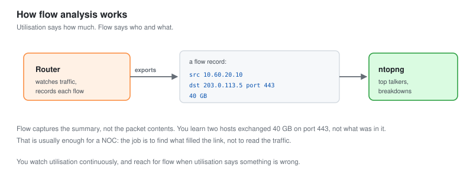
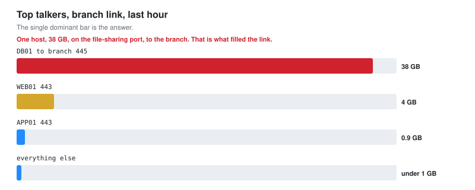

# 05 - Network Traffic Analysis

Working out who is using the bandwidth, and why a link is full.

---

## The Question a NOC Gets Asked

"The internet is slow." Or "the branch link is saturated." Or "something is using all our bandwidth."

Metrics tell you the link is full. They do not tell you what filled it. Traffic analysis answers that.

**Utilisation says how much. Flow analysis says who and what.** A NOC needs both, and the second is where a Tier 2 analyst earns the title.

---

## Utilisation Versus Flow

| Utilisation (SNMP) | Flow (NetFlow) |
| --- | --- |
| The link is 95 percent full | Host X sent 40 GB to Y |
| A number per interface | A record per conversation |
| Cheap, always on | Heavier, sampled |
| Tells you there is a problem | Tells you the cause |

You watch utilisation continuously. You reach for flow when utilisation says something is wrong.

---

## How Flow Works



A router watching traffic records a summary of each conversation: source, destination, port, protocol, and bytes. It exports these records to a collector, which turns them into "top talkers" and traffic breakdowns.

```text
Router sees traffic  ->  records flows  ->  exports to collector (ntopng)
                                              |
                                              v
                                    "10.60.20.10 sent 40GB to 203.0.113.5"
```

**Flow does not capture the packet contents, only the summary.** You learn that two hosts exchanged 40 GB on port 443, not what was in it. That is usually enough for a NOC: the job is to find what filled the link, not to read the traffic. Reading contents is a different task with different tools and different authorisation.

### Enabling flow export

On OPNsense, the NetFlow export goes to the collector.

```text
Reporting > NetFlow
  Listening interfaces: the ones to monitor
  Destination: 10.60.10.10:2055   (ntopng)
  Version: NetFlow v9 or IPFIX
```

On ntopng, it listens for the flows and builds the analysis.

```bash
ntopng -i tcp://10.60.10.10:2055 --community
```

---

## Top Talkers

The first question when a link is full: who is on it.



```text
Top talkers on the branch link, last hour:
  10.60.20.20  ->  10.60.30.50   38 GB   port 445 (SMB)
  10.60.20.10  ->  various        4 GB   port 443
  ... everything else             under 1 GB each
```

**One host, 38 GB, on the file-sharing port, to the branch.** That is the answer. Something is doing a large file transfer to the branch site and filling the link. Now you can ask why: a backup misconfigured to run over the WAN, a user copying a huge dataset, or a sync gone wrong.

**Flow turns "the link is full" into "this host, this destination, this protocol."** That is the difference between reporting a problem and diagnosing one.

---

## Reading Traffic by Protocol

The breakdown by port and protocol tells you the shape of the traffic.

| What you see | Likely meaning |
| --- | --- |
| Mostly 443 | Web and encrypted traffic, usually normal |
| A spike on 445 across a WAN | File copy or backup over a link not meant for it |
| Sustained UDP to one external host | Possibly streaming, possibly something worse |
| Many small flows to many destinations | Could be normal, could be a scan or a beacon |
| One host, many destinations, port 25 | A mail server, or a compromised host sending spam |

**The protocol shape is a fast triage.** Before drilling into any single flow, the protocol mix tells you whether this looks like normal business traffic or something odd. A branch link that is suddenly 90 percent SMB is not normal, whatever the specific hosts.

---

## Baseline Traffic

As with metrics, you cannot spot abnormal without knowing normal.

```text
Normal for this network:
  Business hours:  web traffic peaks, steady database replication
  Overnight:       backups run, higher disk-to-disk traffic
  The branch link: light during the day, backup sync at night
```

**A 38 GB transfer to the branch at 2pm is abnormal. The same transfer at 2am might be the normal backup.** Time context changes everything. This is why the baseline from [module 02](02-Metrics-and-SNMP.md) matters for traffic too, not just for utilisation.

---

## A Worked Analysis

The branch link alerted as saturated at 14:00, during business hours, which is abnormal for it.

### Step 1: confirm from utilisation

```text
Branch link, in-utilisation: flat at 98 percent since 13:52
```

Real, and sustained. Not a spike.

### Step 2: who, from flow

```text
Top talker: 10.60.20.20 (DB01) -> 10.60.30.50, 34 GB, port 445
```

DB01 is sending a large amount of data to a host at the branch, over SMB.

### Step 3: why

Pivoted to what 10.60.30.50 is: a backup target at the branch. Checked the backup schedule: the nightly database backup was misconfigured to run at 14:00 instead of 02:00, and to copy over the WAN instead of locally.

### Step 4: the fix, and the root cause

**Immediate:** the backup was paused, the link cleared.

**Root cause:** the schedule was wrong and the target was wrong. Fixed both: backup at 02:00, to a local target, replicated to the branch out of hours.

**This is the Tier 2 pattern.** Tier 1 would report "branch link saturated" and maybe pause the transfer. Tier 2 finds it is a misconfigured backup, fixes the schedule and the target, and it never saturates the link again. The difference is finding root cause, which is [module 07](07-Troubleshooting-Playbooks.md).

---

## When Traffic Analysis Becomes Security

A NOC watching flow sometimes sees something that is not a performance problem at all.

| Flow pattern | Performance reading | Security reading |
| --- | --- | --- |
| Large upload to an unknown external host | Bandwidth hog | Possible data exfiltration |
| Regular small connections to one external IP | Odd traffic | Possible command and control beacon |
| A host suddenly talking to hundreds of others | Broadcast storm | Possible scanning or worm |
| Traffic on a port nothing should use | Misconfiguration | Possible tunnelling |

**The NOC sees the traffic first, because it is watching the wire for performance.** When flow shows a large upload to an unfamiliar external host, the right move is not to shrug at the bandwidth, it is to flag it to the SOC. This is the crossover from [SOC-03](../SOC-Analyst-2/), and the handoff is covered in [module 06](06-Incident-and-Escalation.md).

**A Tier 2 NOC analyst who recognises the security reading of a traffic pattern is more valuable than one who only sees bandwidth.**

---

## Checklist

- [ ] Flow export enabled on the core and branch routers
- [ ] A collector (ntopng) receiving and analysing flows
- [ ] You reach for flow when utilisation shows a problem
- [ ] Top talkers identify the host, destination and protocol
- [ ] Protocol shape used as a fast triage
- [ ] Traffic read against a time-of-day baseline
- [ ] You find root cause, not just the current talker
- [ ] You recognise when a traffic pattern is a security signal

---

Next: [06-Incident-and-Escalation.md](06-Incident-and-Escalation.md)
