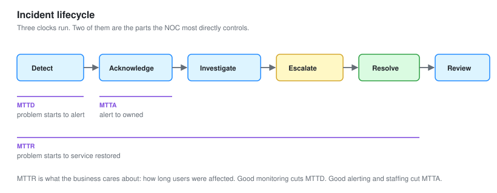

# 06 - Incident and Escalation

Running a NOC incident: the bridge call, the escalation, the timeline, and the metrics that get measured.

---

## What a NOC Incident Is

An incident is an unplanned interruption or degradation. The website is down. The branch link is dead. A database is not responding.

The NOC is usually first to know, because the NOC is watching. What happens in the next few minutes decides how long the outage lasts.

**A NOC is judged on how fast it detects, responds to, and resolves incidents.** Those three times are the core metrics, and this module is about running an incident so they stay low.

---

## The Incident Lifecycle



```text
Detect  ->  Acknowledge  ->  Investigate  ->  Escalate (if needed)  ->  Resolve  ->  Review
```

Three clocks run against these.

| Clock | From | To | Called |
| --- | --- | --- | --- |
| Time to detect | Problem starts | Alert fires | MTTD |
| Time to acknowledge | Alert fires | Someone owns it | MTTA |
| Time to resolve | Problem starts | Service restored | MTTR |

**MTTR is the one the business cares about, because it is how long users were affected.** MTTD and MTTA are the parts the NOC most directly controls. Good monitoring cuts MTTD. Good alerting and staffing cut MTTA. Both feed MTTR.

---

## Severity

Not every incident is all hands. Severity decides the response.

| Severity | Means | Response |
| --- | --- | --- |
| **P1 / Critical** | Major service down, many users | Bridge call, escalate immediately, all focus |
| **P2 / High** | Significant degradation or a single critical service | Investigate now, escalate if not quickly resolved |
| **P3 / Medium** | Minor or partial, workaround exists | Ticket, handle in order |
| **P4 / Low** | Minimal impact | Scheduled work |

**Getting severity right early sets the whole response.** Call a P1 a P3 and it sits in a queue while users suffer. Call a P3 a P1 and you wake people for nothing, which is its own kind of alert fatigue. The impact and the number of users affected set the severity, not how alarming the alert sounded.

---

## The First Ten Minutes

When a P1 fires, the first ten minutes matter most. A structured start beats a panicked one.

```text
1. Acknowledge. Own it. Stop it sitting unowned
2. Confirm it is real. Read the alert, check the dashboard
3. Establish scope. One service, one site, or everything
4. Open the incident. Start the timeline and the record
5. Communicate. Tell the stakeholders it is known and being worked
6. Investigate, or escalate if it is beyond the NOC
```

**Step 5 is the one under-trained NOCs skip.** Users and managers do not know the NOC is already on it unless told. Silence reads as nobody noticing, and it generates a flood of "is anyone looking at this" that distracts from fixing it. One early "we are aware and investigating" buys the room to work.

---

## The Bridge Call

For a major incident, a bridge is a call or chat where everyone working it coordinates. The NOC often runs it.

### Running it well

| Do | Why |
| --- | --- |
| Name a single incident lead | One person drives, others do not talk over each other |
| Keep a running timeline | What was tried, at what time, and the result |
| One person communicates out | Stakeholders get one consistent story |
| Park side discussions | The bridge is for coordination, not debugging in public |
| State facts, not blame | Blame slows the fix and poisons the review |

**The incident lead does not fix the problem, they coordinate the people fixing it.** Trying to do both is how bridges descend into chaos. The lead tracks who is doing what, keeps the timeline, and shields the workers from the "any update?" traffic so they can concentrate.

---

## The Timeline

Every incident gets a timeline, written as it happens, not reconstructed after.

```text
13:52  Branch link utilisation hit 98 percent (monitoring)
13:54  P2 alert fired
13:56  NOC acknowledged
13:58  Confirmed real, sustained, not a spike
14:01  Flow analysis: DB01 sending 34GB to branch on SMB
14:05  Identified: misconfigured backup running over the WAN
14:07  Backup paused, link began to clear
14:12  Link back to normal, service restored
14:30  Root cause fixed: backup rescheduled and re-targeted
```

**A timeline written live is accurate. One written from memory afterwards is wrong in ways you cannot detect.** The timeline is what the review works from, what proves MTTR, and what a stakeholder reads to understand what happened. It costs seconds to keep and saves the whole review.

---

## When to Escalate

The NOC does not fix everything. Knowing when to hand off is a skill, not a failure.

| Escalate to | When |
| --- | --- |
| Network engineering | A device config or routing problem beyond NOC access |
| Server or application team | The issue is in the application, not the network |
| The vendor or ISP | The fault is in a circuit or a device under support |
| The SOC | The pattern looks like a security incident, not a fault |
| Management | A P1 with business impact, per the escalation policy |

**A good escalation includes everything already established, so the next team does not start over.**

```text
What is broken, and the user impact
When it started, and the timeline so far
What has been checked, including what was ruled out
The current best guess
What the NOC has already tried
```

**A bad escalation just moves the ticket and restarts the clock.** The next team re-runs every check the NOC already did, because none of it was written down. The timeline and the "what was ruled out" list are what make an escalation useful instead of a reset.

---

## The Handoff to the SOC

The NOC-to-SOC handoff deserves its own note, because it is easy to miss.

The NOC watches for performance. Sometimes a performance anomaly is actually a security incident wearing a performance disguise.

| The NOC sees | It might be |
| --- | --- |
| A large outbound transfer | Data exfiltration |
| A host talking to a strange external IP on a timer | Command and control |
| A device rebooting for no scheduled reason | Compromise, or hardware failure |
| A sudden traffic pattern change | An attack, or a legitimate change |

**When a performance anomaly has a plausible security reading, the NOC flags it to the SOC rather than closing it as a bandwidth issue.** This is the crossover with [SOC-03](../SOC-Analyst-2/). The NOC does not have to diagnose the security side, it has to recognise that it might be one and hand it over. That recognition is a Tier 2 trait.

---

## After the Incident: the Review

The incident is not over when the service is back. The review is what stops it happening again.

Same structure as the SOC incident review, because the principles are the same.

```text
1. What happened?           facts, from the timeline
2. When did we know?        MTTD, MTTA, MTTR
3. What worked?             say it
4. What did not?            honestly
5. Root cause?              not the symptom, the cause
6. What are we changing?    with an owner and a date
```

### No blame

**The moment the review becomes about who caused it, people stop being honest, and the review learns nothing.** The backup was misconfigured. The point is not who misconfigured it, it is that the change process let a WAN-crossing backup get scheduled without review, and that process is what changes. Fix the system, not the person.

### Root cause, not symptom

The link saturation was the symptom. Pausing the backup fixed the symptom. The root cause was a backup scheduled wrong and pointed at the wrong target. Fixing the schedule and target is what stops it recurring.

**A NOC that only fixes symptoms works the same incident forever.** A Tier 2 NOC fixes root causes and the incident stops coming back. Two recurring problems eliminated this way are in [module 07](07-Troubleshooting-Playbooks.md).

---

## The Metrics That Get Reported

At the end of a period, the NOC reports its numbers.

| Metric | What it shows |
| --- | --- |
| Incidents by severity | The shape of the workload |
| MTTD, MTTA, MTTR | How fast the NOC detects, owns, and resolves |
| Repeat incidents | Whether root causes are being fixed |
| Availability per service | The SLA number ([module 08](08-Capacity-and-Reporting.md)) |
| Escalations | How much the NOC resolves versus passes on |

**Repeat incidents is the quality metric.** Falling MTTR is good. But an MTTR of ten minutes on the same incident every week is worse than an MTTR of an hour on an incident that then never returns. Repeat incidents measure whether the NOC is fixing causes or just symptoms, which is the whole Tier 2 distinction.

---

## Checklist

- [ ] Incidents get a severity that matches user impact
- [ ] The first ten minutes are structured, not panicked
- [ ] Stakeholders are told early, before they ask
- [ ] A bridge has one lead who coordinates, not debugs
- [ ] The timeline is written live, not reconstructed
- [ ] Escalations carry everything already established
- [ ] Performance anomalies with a security reading go to the SOC
- [ ] Every incident gets a blameless review
- [ ] Root causes are fixed, and repeat incidents are tracked

---

Next: [07-Troubleshooting-Playbooks.md](07-Troubleshooting-Playbooks.md)
