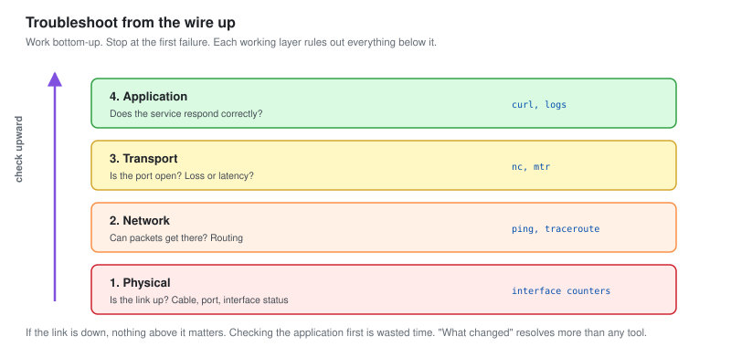

# 07 - Troubleshooting Playbooks

Five network problems worked end to end. The method underneath, then the cases.

This is the file that shows how I find root cause, not just how I clear a symptom.

---

## The Method

Every network problem is diagnosed the same way: work up the layers, from the physical wire to the application, and stop at the first thing that is broken.



```text
1. Physical    Is the link up? Cable, port, interface status
2. Network     Can packets get there? ping, traceroute, routing
3. Transport   Is the port open? Is there loss or latency?
4. Application  Does the service respond correctly?
```

**Work bottom-up and stop at the first failure.** If the link is down, nothing above it matters and checking the application is wasted time. If ping works but the service does not, the problem is above the network layer. Each layer that works rules out everything below it, which is what makes this fast.

### The universal first questions

```text
What changed?          Most problems follow a change
When did it start?     Correlate with the timeline and annotations
Who is affected?       One user, one site, or everyone. Scope points at cause
Is it constant or intermittent?   Constant is easier. Intermittent is the hard one
```

**"What changed" resolves more incidents than any tool.** A network that worked yesterday and fails today usually failed because something changed: a config push, a new device, a patch, a cable moved. Finding the change is often the whole diagnosis.

---

## Case 1: The Branch Link Is Slow

| | |
| --- | --- |
| **Symptom** | Users at the branch report everything is slow |
| **Type** | Saturation |

### Diagnosis

```text
Layer 1: link is up, no errors
Layer 2: ping to branch works, but round-trip time is high and variable
Layer 3: the link utilisation is at 98 percent
```

Sustained saturation. The link is full. Now the question is what filled it, which is flow analysis.

```text
Flow: DB01 sending 34GB to a branch host on SMB, in business hours
```

### Root cause

A database backup misconfigured to run at 14:00 over the WAN instead of at 02:00 locally.

### Fix

**Symptom:** paused the backup, link cleared.
**Root cause:** rescheduled to 02:00, re-targeted to a local disk, replicated to the branch out of hours.

**This is the case from [module 05](05-Network-Traffic-Analysis.md), and it is here to show the layered method reaching the same place.** Bottom-up, the failure was at the saturation level, and flow analysis found the cause. The link never saturated in business hours again.

---

## Case 2: Intermittent Packet Loss

| | |
| --- | --- |
| **Symptom** | The branch reports occasional dropouts, but it works most of the time |
| **Type** | Packet loss, intermittent (the hard kind) |

### Why intermittent is hard

A constant failure is easy: it is always there to see. An intermittent one hides. By the time you look, it is working again. The trick is to measure continuously so you catch it in the act.

```bash
# A continuous ping that records loss over time
mtr --report --report-cycles 1000 10.60.30.1
```

```text
Host              Loss%   Snt   Last   Avg
10.60.0.1          0.0%   1000    1     1
10.60.30.1         2.1%   1000   41    44
```

**2.1 percent loss on the branch link, and it is consistent over 1000 packets.** Intermittent to a user, steady to a measurement. The smokeping-style continuous latency graph showed the same: a steady low level of loss, not a spike.

### Diagnosis

```text
Layer 1: interface shows a slowly rising error counter
```

The error counter on the branch interface was climbing. A physical problem: a marginal cable or a failing optic, dropping a small fraction of frames.

### Root cause

A degrading physical link. Not down, not clean, just marginal.

### Fix

Replaced the cable. Error counter stopped rising, loss went to zero.

**Intermittent packet loss is where continuous measurement earns its place.** A spot-check ping would have shown 0 percent loss most times you ran it. The continuous graph showed the steady 2 percent that a user experienced as "sometimes it drops." Measure over time, and the intermittent becomes visible.

---

## Case 3: A Service Is Down

| | |
| --- | --- |
| **Symptom** | WEB01 is not responding |
| **Type** | Outage |

### Diagnosis, bottom-up

```text
Layer 1: WEB01 interface is up
Layer 2: ping to WEB01 works. The host is alive
Layer 3: port 443 is not answering (nc -zv 10.60.20.10 443 fails)
Layer 4: the web service is down, but the server is up
```

The host is fine. The network to it is fine. The service on it has stopped. That narrows it from "the server is down" to "the web service crashed," which is a completely different fix.

```bash
# On WEB01
systemctl status nginx     # inactive (dead)
journalctl -u nginx --since "10 min ago"
#  ->  failed to bind to port 443: address already in use
```

### Root cause

A previous nginx process did not shut down cleanly and still held the port, so the new one could not start.

### Fix

**Symptom:** killed the stale process, started nginx, service back.
**Root cause:** the deployment script did not wait for the old process to release the port. Fixed the script to wait and verify before starting the new one.

**Bottom-up diagnosis turned "the server is down" into "the web service failed to bind a port."** Those need different people and different fixes. Pinging first, before logging into anything, saved chasing a network problem that did not exist.

---

## Case 4: A Flapping Interface

| | |
| --- | --- |
| **Symptom** | Intermittent alerts about a link going up and down |
| **Type** | Flapping |

### Diagnosis

```text
Syslog on SW-CORE, filtered to the interface:
  14:02:11  interface GigabitEthernet0/3 down
  14:02:19  interface GigabitEthernet0/3 up
  14:04:33  interface GigabitEthernet0/3 down
  14:04:41  interface GigabitEthernet0/3 up
  ... 118 times this week
```

A link cycling up and down. Each cycle is brief, which is why users saw brief dropouts and the NOC got 118 alerts (before the flap detection from [module 04](04-Alerting-and-Noise-Reduction.md)).

### Root cause

Traced the port to a device with a failing network card that reset itself every few minutes. Not the cable, not the switch, the endpoint.

### Fix

Replaced the failing network card in the endpoint. Flapping stopped.

**Flapping is where centralised syslog earns its place.** The pattern only became obvious with every up-and-down event in one timestamped place. Logging into the switch would have shown the current state, not the history of 118 transitions that named the problem.

---

## Case 5: Everything at One Site Is Slow, Nothing Is Broken

| | |
| --- | --- |
| **Symptom** | The whole branch is sluggish, but every check passes |
| **Type** | Degradation with no obvious fault (the frustrating kind) |

### Diagnosis

```text
Layer 1: link up, no errors
Layer 2: ping works, latency normal
Layer 3: no loss, no saturation on the main link
Layer 4: services respond, just slowly
```

Everything passed. This is the case that separates methodical from lucky. When the obvious checks are clean, widen the view.

```text
Looked at latency over time, not just current:
  Latency was fine on average, but had a repeating spike every 30 seconds
```

A periodic latency spike, invisible to a spot check, visible on the continuous graph. Correlated it with flow.

```text
Flow at each spike: a burst of traffic from a monitoring tool
  polling every device at once, every 30 seconds
```

### Root cause

**The monitoring itself.** A misconfigured poller was hitting every device simultaneously every 30 seconds, and the synchronised burst briefly saturated the branch link each time.

### Fix

Spread the polling out so devices are queried in a staggered pattern rather than all at once. The periodic spike disappeared.

**This is the most instructive case, because the monitoring was the problem.** A Tier 2 analyst has to be willing to suspect their own tools. The continuous latency graph found the periodic spike, flow tied it to the polling, and the fix was to the monitoring configuration, not the network. Assuming the tools are innocent would have left this unsolved.

---

## The Two Recurring Problems Eliminated

Across these cases, two problems had been happening repeatedly before this work.

| Problem | Before | Root cause fix | After |
| --- | --- | --- | --- |
| Branch saturation in business hours | Weekly | Backup rescheduled and re-targeted | Stopped |
| Interface flap alerts | 118 a week | Failing card replaced, flap detection added | Stopped |

**Tier 1 would have cleared these every time they recurred. Tier 2 made them stop recurring.** That is the distinction the whole project is built around, and these two are the concrete proof of it.

---

## The Troubleshooting Toolkit

The commands that do most of the work, worth knowing cold.

| Tool | Answers |
| --- | --- |
| `ping` | Is it reachable, and how far |
| `traceroute` / `mtr` | Where does the path break, and where is the loss |
| `nc -zv host port` | Is the port open |
| `snmpwalk` | What does the device say about itself |
| Interface counters | Errors, discards, utilisation |
| Continuous latency graph | Intermittent problems a spot check misses |
| Flow analysis | Who is using the bandwidth |
| Centralised syslog | What happened, and when, across everything |

**`mtr` is the single most useful one for a NOC.** It combines ping and traceroute and runs continuously, so it shows exactly which hop on the path is losing packets or adding latency, over time. Most network problems reveal themselves in an `mtr` run.

---

## Checklist

- [ ] Diagnose bottom-up, layer by layer, stop at the first failure
- [ ] Ask what changed, when, who is affected, constant or intermittent
- [ ] Measure intermittent problems continuously, not with spot checks
- [ ] Use centralised syslog to see patterns over time
- [ ] Use flow to find what is using a saturated link
- [ ] Be willing to suspect the monitoring itself
- [ ] Fix the root cause, not just the symptom
- [ ] Track recurring problems until they stop recurring

---

Next: [08-Capacity-and-Reporting.md](08-Capacity-and-Reporting.md)
