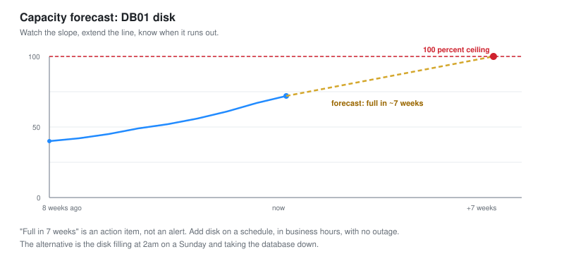

# 08 - Capacity and Reporting

Forecasting growth before it becomes an outage, and reporting availability in numbers the business understands.

---

## Two Jobs in One

Capacity planning and reporting are both about the long view, not the incident in front of you.

**Capacity planning** answers "when will this run out?" before it does.
**Reporting** answers "how did we do?" in numbers a manager can act on.

Both are Tier 2 work, because both require understanding trends rather than reacting to alerts.

---

## Capacity Planning

An outage caused by running out of capacity is the most avoidable kind, because it announces itself weeks in advance if anyone is watching the trend.



### The idea

Every finite resource has a trend. Disk fills. Bandwidth grows. Connections increase. Watch the slope, extend the line, and you know when it hits the ceiling.

```text
Disk on DB01:
  8 weeks ago:  40 percent
  Now:          72 percent
  Slope:        +4 percent per week
  Ceiling:      100 percent
  Forecast:     full in about 7 weeks
```

**"Full in 7 weeks" is an action item, not an alert.** It is time to add disk, or clean up, on a schedule, in business hours, with no outage. The alternative is the disk filling at 2am on a Sunday and taking the database down. Capacity planning turns a future outage into a scheduled task.

### Doing it with the data you have

```promql
# Prometheus: predict when disk hits 100 percent, based on the last week's trend
predict_linear(disk_used_percent[1w], 7 * 24 * 3600) 
```

`predict_linear` extends the recent trend forward. This one asks: at the current rate, what will disk be in 7 days. Alert when the forecast crosses the ceiling, not when the disk is already full.

```yaml
- alert: DiskWillFill
  expr: predict_linear(disk_used_percent[1w], 14 * 24 * 3600) > 100
  for: 1h
  labels:
    severity: warning
  annotations:
    summary: "Disk on {{ $labels.instance }} forecast to fill within 2 weeks"
```

**This alert fires two weeks before the problem, not during it.** That is the whole point of capacity planning: convert a future emergency into present, unhurried work.

### The resources worth forecasting

| Resource | Fills because | Lead time you want |
| --- | --- | --- |
| Disk | Logs, data, backups grow | Weeks |
| Bandwidth | The business grows | Months, it means buying a bigger link |
| Memory | More load, more services | Weeks |
| Connection or session limits | More users | Weeks |
| IP address pool | More devices | Months |

**Bandwidth needs the longest lead time, because fixing it means procurement.** A disk you can add next week. A bigger internet circuit takes an ISP months to provision. The bigger the fix, the earlier you need to see it coming, which is why the trend view matters more for the slow-to-fix resources.

---

## Availability and SLA

The headline number the business asks for: how much of the time was the service up.

### The nines

Availability is quoted in nines, and the nines are less forgiving than they look.

| Availability | Downtime per year | Downtime per month |
| --- | --- | --- |
| 99 percent | 3.65 days | 7.2 hours |
| 99.9 percent ("three nines") | 8.76 hours | 43 minutes |
| 99.99 percent ("four nines") | 52 minutes | 4.3 minutes |
| 99.999 percent ("five nines") | 5.26 minutes | 26 seconds |

**Each extra nine is roughly ten times harder and more expensive.** The gap between 99.9 and 99.99 percent is the gap between "a person can respond to an outage" and "the response must be automatic," because 4 minutes a month does not allow for a human to wake up. Knowing what a nine costs is what lets a NOC talk sensibly about SLA targets.

### Measuring it

```promql
# Availability of a service over 30 days, from up/down samples
avg_over_time(up{service="web01"}[30d]) * 100
```

```text
WEB01 availability, last 30 days:  99.94 percent
  Downtime: 26 minutes across 2 incidents
  SLA target: 99.9 percent
  Result: met
```

**Report against the target, not in isolation.** "99.94 percent" means nothing on its own. "99.94 percent against a 99.9 percent target, so we met it" is a report. The target is what makes the number a pass or a fail.

### The honest part of availability

**What counts as downtime is a real question, and reporting it honestly matters.**

- Does planned maintenance count against availability? Usually not, if it was in an agreed window.
- Does partial degradation count? If the site was up but slow, was it "available"?
- Does one user's problem count, or only estate-wide outages?

**Defining downtime before you report it is what keeps the number honest.** A NOC that quietly excludes inconvenient outages produces a number nobody trusts. Agree the definition, apply it consistently, and the availability figure means something.

---

## The Reports a NOC Produces

Different reports for different audiences, same discipline as the SOC dashboards.

| Report | Audience | Contains |
| --- | --- | --- |
| Daily shift report | Next shift | Open incidents, what to watch, planned work |
| Weekly operations | NOC lead | Incident counts, MTTR, top alerts, capacity flags |
| Monthly SLA | Management | Availability per service against target |
| Capacity forecast | Management, procurement | What runs out and when |

### Writing for the audience

**The monthly SLA report has no graphs of individual metrics.** Management does not read a bandwidth graph. It reads "every service met its SLA except the branch link, which was down 40 minutes due to a failed card, now replaced." One sentence per service, the number, and the plain-language reason for any miss.

The weekly operations report is the opposite: it is for the NOC lead, and it does have the graphs, the top alerts, and the capacity trends, because its reader acts on them.

**Same principle as [SOC-02](../SOC-Analyst-1/09-Workbooks-and-Reporting.md): write the report for who reads it, not for who wrote it.**

---

## The Capacity Report, Worked

The forecast report for one month, as it would go to management.

```text
CAPACITY FORECAST  -  next 90 days

ACTION NEEDED SOON
  DB01 disk        forecast full in 7 weeks
                   Action: add 200GB, schedule for week 3. No outage risk if done.

WATCH
  Core internet    growing 3 percent per month. At current rate, hits
                   80 percent of the circuit in about 6 months. Begin
                   procurement conversation now given ISP lead times.

HEALTHY
  All other monitored resources are within normal trends and have
  more than 6 months of headroom.
```

**"Action needed, watch, healthy" is the shape management can act on.** It does not make them read trend graphs. It tells them what needs a decision now, what needs a decision soon, and what needs nothing. The detail is available if they ask, but the summary is what drives the action.

---

## Checklist

- [ ] Every finite resource has a trend being watched
- [ ] Forecasts alert before the ceiling, with weeks of lead time
- [ ] Bandwidth is forecast with the longest lead time, for procurement
- [ ] Availability measured and reported against a target
- [ ] What counts as downtime is defined and applied consistently
- [ ] Reports are written for their audience, not their author
- [ ] The capacity report says what needs action, and when

---

Next: [09-Automation-and-Runbooks.md](09-Automation-and-Runbooks.md)
