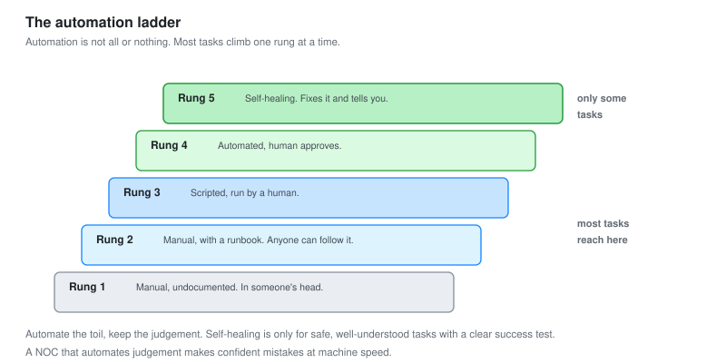

# 09 - Automation and Runbooks

Turning the things a NOC does by hand, over and over, into things that happen by themselves.

---

## Toil

Toil is work that is manual, repetitive, and adds no lasting value. Clearing the same alert every night. Restarting the same service every week. Running the same check every shift.

**Toil is the thing a Tier 2 NOC analyst automates away.** Tier 1 does the toil. Tier 2 notices the toil, writes the runbook for it, and then automates the runbook. Every hour of toil removed is an hour available for the work that needs a human.

---

## The Ladder from Manual to Automatic



Automation is not all or nothing. It is a ladder, and most tasks climb it one rung at a time.

| Rung | State | Example |
| --- | --- | --- |
| 1 | Manual, undocumented | Someone knows how to fix it, in their head |
| 2 | Manual, with a runbook | Anyone can fix it by following steps |
| 3 | Scripted, run by a human | The steps are a script someone runs |
| 4 | Automated, human approves | The system proposes the fix, a human clicks yes |
| 5 | Self-healing | The system fixes it and tells you it did |

**Most tasks should climb to rung 2 or 3, and only some to rung 5.** The goal is not to automate everything, it is to automate the safe, repetitive, well-understood things, and to keep a human in the loop for the rest. Knowing which task belongs on which rung is the judgement.

---

## Start With Runbooks

Before automating anything, write it down. A runbook is the manual version, and it is the thing you automate from.

### What a good runbook has

```text
TITLE      Restart the web service on WEB01
WHEN       Alert: WEB01 port 443 not responding, service confirmed down
CHECK      Confirm it is the service, not the host or network
            (ping works, port 443 does not answer)
STEPS      1. SSH to WEB01
            2. systemctl status nginx   (confirm it is dead)
            3. Check the port is free: ss -tlnp | grep 443
            4. If a stale process holds it, kill it
            5. systemctl start nginx
            6. Confirm: curl -I localhost:443
VERIFY     The service answers, the alert clears
ESCALATE   If it will not start, or crashes again within 10 minutes,
            escalate to the application team with the journalctl output
```

**A runbook makes a task repeatable by anyone, which is the prerequisite for automating it.** You cannot safely automate a task you cannot describe. Writing the runbook forces you to define exactly when it applies, what to check first, and when to stop and escalate. That definition is what the automation needs.

---

## What to Automate, and What Not To

Not everything should be automated. The decision matters.

| Automate | Do not automate |
| --- | --- |
| Frequent, repetitive tasks | Rare tasks (not worth the effort) |
| Well-understood, low-risk fixes | Anything where the wrong move causes damage |
| Tasks with a clear success test | Tasks that need judgement |
| Data gathering and enrichment | Decisions with real consequences |

**The dangerous automation is the one that acts without a way to know it was wrong.** Automatically restarting a service is safe: if it works, good, if not, it escalates. Automatically failing over to a backup site is not something to trigger without a human, because the cost of doing it wrongly is enormous. Match the automation level to the blast radius.

---

## The Three I Automated

### Automation 1: Stale process cleanup (rung 5, self-healing)

The web service occasionally failed to start because a stale process held the port ([module 07](07-Troubleshooting-Playbooks.md), case 3). Low risk, well understood, clear success test. A good candidate for full automation.

```bash
#!/bin/bash
# Triggered by the "port 443 down but host up" alert
# Safe because: it only acts if the exact known condition is present,
# and it verifies success, and it escalates on failure.

if ping -c1 -W2 10.60.20.10 >/dev/null && ! nc -zv -w2 10.60.20.10 443 2>/dev/null; then
    stale=$(ssh web01 "ss -tlnp | grep ':443' | grep -o 'pid=[0-9]*'")
    if [ -n "$stale" ]; then
        ssh web01 "sudo systemctl restart nginx"
        sleep 5
        if nc -zv -w2 10.60.20.10 443 2>/dev/null; then
            echo "Auto-resolved: nginx restarted, service up. Notifying NOC."
        else
            echo "Auto-remediation FAILED. Escalating to app team."
        fi
    fi
fi
```

**It is safe to self-heal because it checks the exact condition, verifies the result, and escalates on failure.** It cannot make things worse: if the condition is not exactly what it expects, it does nothing, and if the fix does not work, a human gets called. That is the shape a self-healing automation has to have.

### Automation 2: Alert enrichment (rung 4)

When an alert fires, gather the context a human would gather anyway, and attach it. The human still decides, but they decide with the facts already in front of them.

```text
On any alert, automatically attach:
  Recent syslog from the affected device
  The relevant dashboard link
  Whether there is a change or maintenance window active
  Recent related alerts
```

**This does not fix anything. It removes the five minutes of gathering that every incident starts with.** The analyst opens the alert and the context is already there, the same idea as the SOAR enrichment in [SOC-02](../SOC-Analyst-1/06-SOAR-Automation.md). Enrichment is the safest automation there is, because it only adds information and never acts.

### Automation 3: The daily health check (rung 3 to 4)

Every morning someone used to run a set of checks: are all devices reporting, any capacity flags, any overnight incidents. That is scripted now and runs itself, posting a summary.

```text
Every morning at 07:00, automatically:
  Confirm every device polled overnight (no silent monitoring gaps)
  Run the capacity forecast, flag anything under 8 weeks
  Summarise overnight alerts and incidents
  Post to the NOC channel
```

**The most valuable check in it is "did every device poll overnight."** A monitoring gap is invisible: a device that stopped reporting looks the same as a device with nothing to report. The daily check catches the silent gap, which is the NOC version of the "a SIEM that stopped receiving logs looks like a quiet day" problem from the SOC projects.

---

## The Result

| Task | Before | After | Rung reached |
| --- | --- | --- | :---: |
| Stale process restart | Manual, per occurrence | Self-healing, notifies | 5 |
| Alert enrichment | 5 min gathering per alert | Automatic | 4 |
| Daily health check | 20 min per shift, manual | Automatic summary | 3 to 4 |

**Roughly an hour of toil removed per day, and one class of silent failure now caught.** The stale-process fix resolves itself before a human is even paged. The enrichment means every remaining alert arrives with its context. The health check catches monitoring gaps that used to go unnoticed until they mattered.

---

## The Limit of Automation

A caution, because automation can be taken too far.

**Automate the toil, keep the judgement.** The tasks that got automated here are repetitive and well understood, with clear success tests and small blast radii. The tasks that stayed manual need a human: deciding severity, running a bridge, choosing whether to fail over, talking to a stakeholder.

**A NOC that automates judgement makes confident mistakes at machine speed.** The right target is a NOC where the boring, repetitive work happens by itself, and the humans spend their time on the problems that actually need thinking. That is what these three automations move toward, and it is the Tier 2 goal.

---

## Checklist

- [ ] Repetitive tasks are identified as toil worth removing
- [ ] Every automation starts as a written runbook
- [ ] Automation level matches the task's risk and blast radius
- [ ] Self-healing automations check the condition, verify, and escalate on failure
- [ ] Enrichment automation attaches context without acting
- [ ] A daily automated check catches silent monitoring gaps
- [ ] Judgement tasks stay with humans, deliberately

---

Back to [README.md](README.md)
