# NOC-03: Network Reliability Engineering and Incident Command

**Role target:** NOC Analyst III, Tier 3, Network Reliability Lead
**Theme:** Stop watching the network and stop just building the monitoring. Run the reliability of the whole thing, and command the outages.
**Environment:** The same self-owned Proxmox lab as [NOC-02](../NOC-Analyst-2/), `noclab.local`, `10.60.0.0/24`, now run as a reliability function
**Stack:** LibreNMS, Prometheus, Grafana, Alertmanager, NetBox, Ansible, a public status page

> Everything in this folder is a lab I own and built. No real company, network or data is involved. It shows the consoles and decisions behind running network reliability, so a non-technical reader can see what the work looks like and a technical reader can see I know what each screen shows.

---

## What A Tier 3 NOC Does Differently

Each level of this portfolio climbs the same ladder. A junior watches the board and escalates. A Tier 2 builds the monitoring and tunes the noise. A Tier 3 runs reliability as a function: commands the major outages, owns the service-level objectives, builds the network from a single source of truth, and reports uptime to leadership in money, not milliseconds.

| | Tier 1 Junior | NOC-02 Tier 2 | **NOC-03 Tier 3, this project** |
| --- | --- | --- | --- |
| Alerts | Watches and escalates | Tunes the noise out | **Owns the whole alerting strategy** |
| Outages | Follows the runbook | Finds the root cause | **Commands the major outage, end to end** |
| Reliability | A number on a screen | A dashboard that is built | **Service-level objectives and an error budget** |
| Config | Reads it | Checks it | **Builds it from one source of truth, no drift** |
| Audience | The ticket | The dashboard | **The executive, in uptime and cost** |
| Measured by | Tickets | Noise reduced | **Availability, MTTR, error budget burn** |

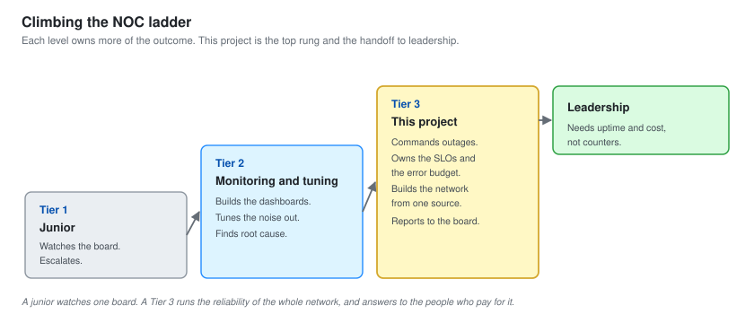

---

## The Environment

This is the same network that the earlier NOC project was built on, now operated as a reliability function. The monitoring from [NOC-02](../NOC-Analyst-2/) is still here. What is new is the layer above it: objectives, automation, and a single source of truth for the network itself.

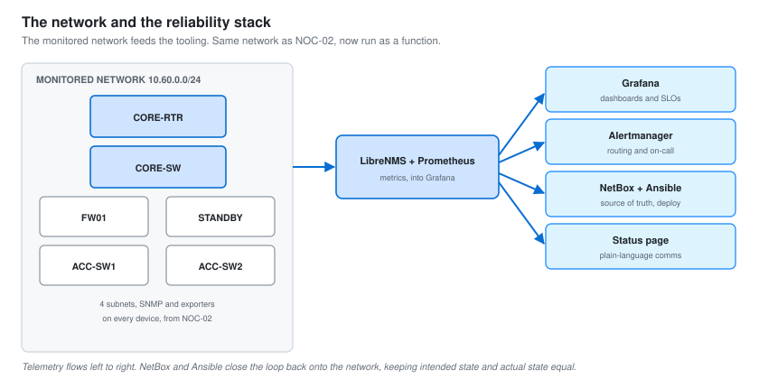

| Layer | Tool | Role |
| --- | --- | --- |
| Monitoring | LibreNMS, Prometheus, Grafana | Metrics, graphs, the four golden signals, from NOC-02 |
| Alerting | Alertmanager | Routing, grouping, inhibition, on-call escalation |
| Source of truth | NetBox | The intended state of every device, interface and IP |
| Automation | Ansible | Pushes config from NetBox, so intended equals actual |
| Communication | Status page | What is broken, in plain language, for everyone |

The network discovers itself. This is the live map LibreNMS builds from what it finds, which is also how the capstone outage was first seen: a link going red on the map before anyone phoned in.

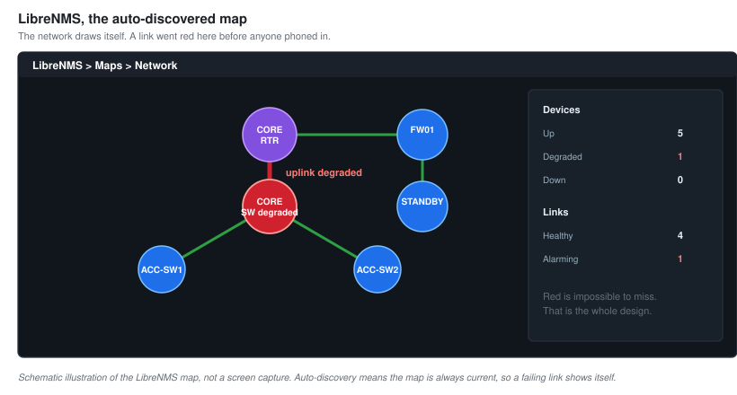

---

## Capstone: A Major Outage, Run As Incident Commander

The clearest proof of a Tier 3 is a real outage handled from the chair that runs it. This is a partial network outage against the lab, worked end to end with me as incident commander: not fixing every box myself, but directing the response, owning the decisions, and keeping everyone informed.

### What Happened

A core uplink degraded and started dropping packets. The redundant path should have taken over automatically and did not, because the standby device had drifted out of its intended configuration during an undocumented change weeks earlier. Half the network lost reliable connectivity for twenty-two minutes. The monitoring caught the degradation in three minutes, and a major incident was declared.

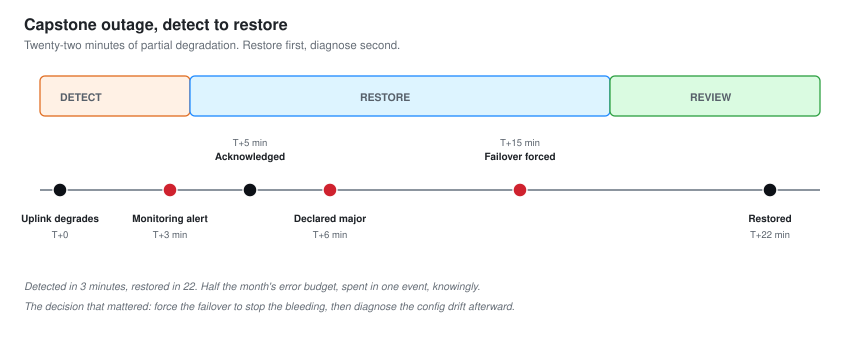

| Measure | Value |
| --- | --- |
| Mean time to detect | 3 minutes, monitoring caught the packet loss |
| Mean time to acknowledge | 2 minutes |
| Major incident declared | T plus 6 minutes |
| Service restored | T plus 22 minutes |
| Root cause | Config drift on the standby path, failover never triggered |
| Error budget consumed | Half the month, in one event |
| Fixes from the review | 3, including automated failover testing |

### Running The Response

Commanding an outage is a different job from fixing one. The engineer answers "what is broken". The commander decides "what do we do, in what order, who does it, and who do we tell", while keeping leadership and users informed. This is the war-room board I ran the outage from.

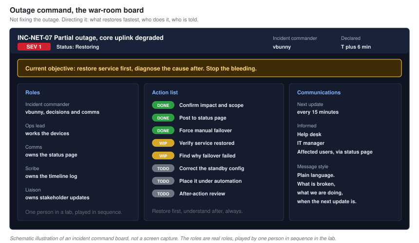

The three questions that drive every outage decision:

1. **What is the impact?** Half the network, degraded not down, no data loss.
2. **What is the fastest safe restore?** Manually force the failover, do not wait to understand the root cause first.
3. **What do we tell people?** Post to the status page immediately, update every fifteen minutes.

Restoring service came before understanding the cause. That order matters. You stop the bleeding, then you diagnose. A commander who insists on understanding first while users sit down has the priorities backwards.

### Keeping Everyone Informed

An outage nobody is told about is twice as damaging, because the help desk drowns and trust evaporates. The status page is how a mature function communicates: plainly, early, and often.

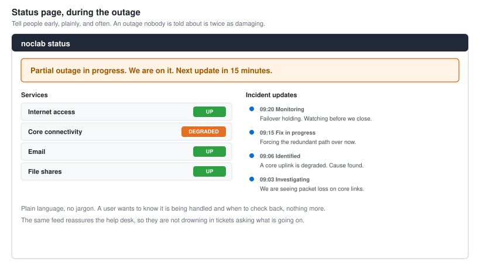

---

## Service-Level Objectives And The Error Budget

A Tier 3 stops measuring the network in raw uptime and starts measuring it in objectives the business agreed to. An SLO is a promise. The error budget is how much you are allowed to break that promise before it is a problem, and it is the single most useful idea a reliability function has.

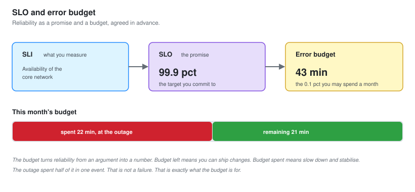

The headline SLO for this network is 99.9 percent availability, which is forty-three minutes of downtime a month. The capstone outage spent twenty-two of them in one event. That is not a disaster, it is exactly what the budget is for, and it is why the next change freeze was not needed: there was still budget left, spent knowingly.

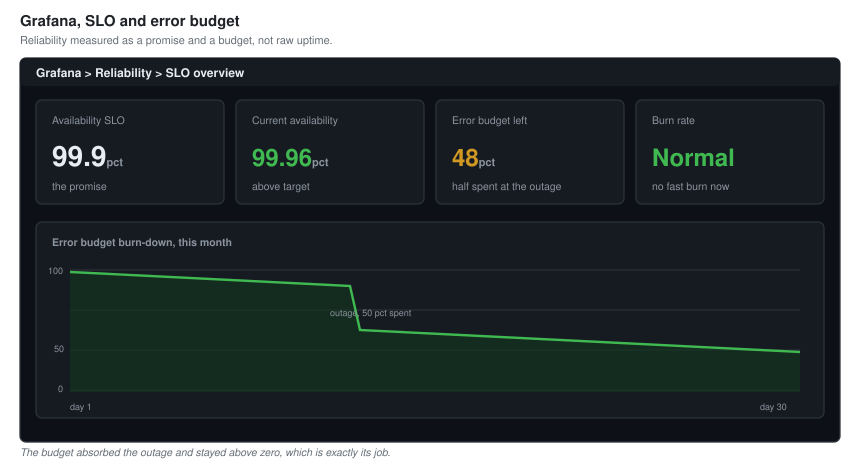

**The error budget turns reliability from an argument into a number.** When there is budget, you can move fast and ship changes. When it is spent, you slow down and spend the effort on stability instead. It replaces "is it reliable enough" shouting matches with a figure everyone agreed to in advance.

### Seeing The Capacity Wall Before You Hit It

Reliability is not only about today. A Tier 3 forecasts when a link, a core or a service will run out of headroom, and schedules the upgrade before it becomes an outage. This is the capacity planning view that turns a trend line into a date.

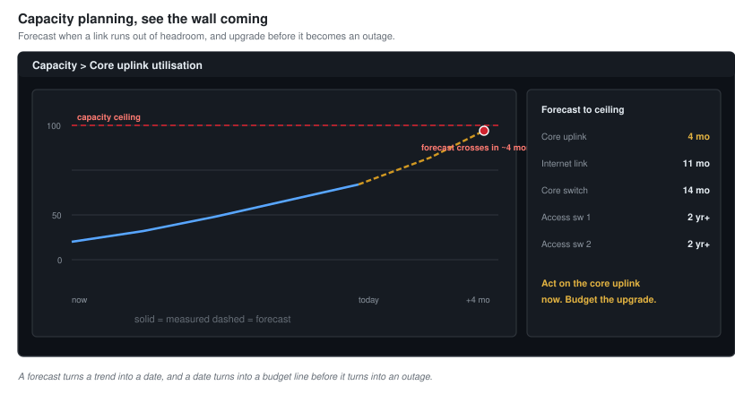

---

## Alerting As A Strategy, Not A Pile Of Rules

NOC-02 tuned the alert noise down. A Tier 3 owns the whole alerting strategy: what pages a human at 3am, what waits for morning, and how alerts route to the right person without waking the wrong one.

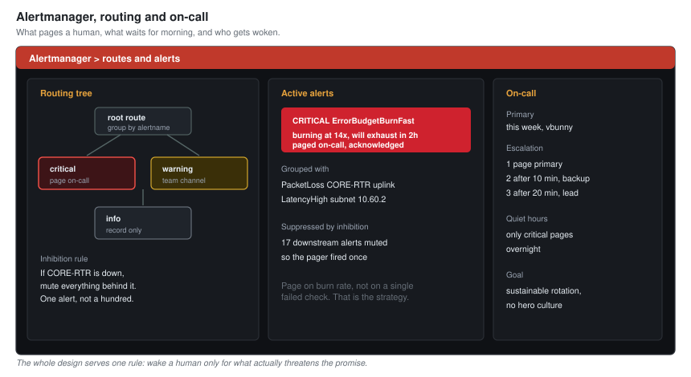

The principle that matters most at this level is burn-rate alerting. Do not page on a single failed check. Page when the error budget is burning fast enough to run out, because that is the only thing that actually threatens the promise. It is the difference between an alert that means "look now" and a hundred that mean nothing.

---

## The Network As Code: One Source Of Truth

The capstone outage was caused by config drift: a device whose real configuration no longer matched what anyone intended, because of an undocumented change. The permanent fix is not "be more careful". It is to make drift impossible by building every device from a single source of truth.

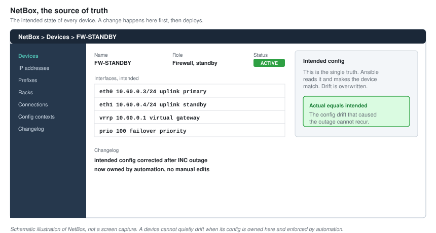

NetBox holds the intended state of every device, interface and address. Ansible reads that intended state and pushes it to the devices, so what is running is always what was designed. A change happens in NetBox first, then gets deployed, never the other way round.

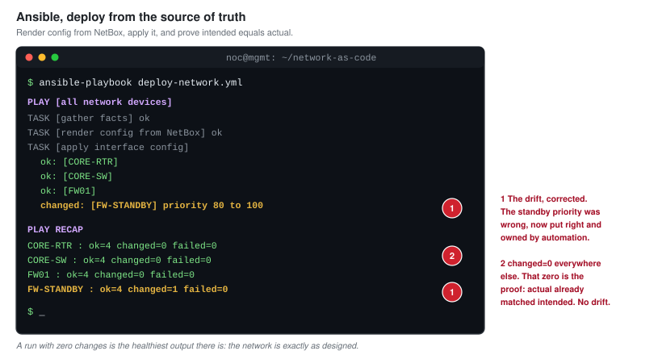

**This is the fix that actually closes the outage.** After it, a device cannot quietly drift, because the automation would overwrite the drift on the next run and flag the difference. The standby path that failed to take over can no longer silently fall out of configuration, because its configuration is no longer maintained by hand.

---

## Change Management That Prevents The Next One

The drift came from an undocumented change. A reliability function fixes the class of problem, not just the instance, so a lightweight change process was put in place: every change recorded, with a rollback plan, deployed in a window, through the automation rather than by hand.

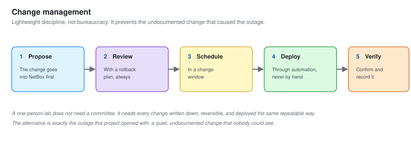

This is deliberately not heavy bureaucracy. A one-person lab does not need a committee. It needs the discipline that every change is written down, reversible, and deployed the same repeatable way, because the alternative is exactly the outage this project opened with.

---

## Observability: More Than Up Or Down

A senior function does not just know whether a device is up. It can answer why something is slow, using the three pillars of observability together.

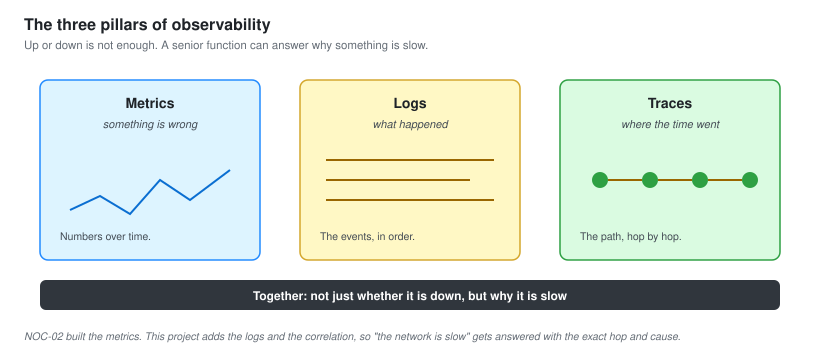

Metrics say something is wrong. Logs say what happened. Traces say where the time went. NOC-02 built the metrics. This project adds the logs and the correlation, so a "the network is slow" report can be answered with "here is the exact hop and the exact cause", not a shrug.

---

## Metrics And Maturity, For Leadership

The final job of a Tier 3 is translation: turning the network's reliability into numbers a non-technical executive can act on. This is the trend that matters most, and where the function sits on the maturity model.

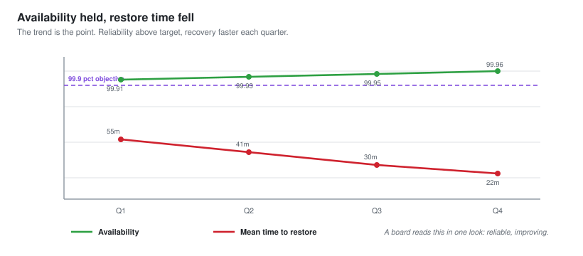

The headline is the trend. Availability holding above the objective, mean time to restore falling as runbooks and automation improve, and the error budget being spent deliberately rather than blown by surprise. A board does not want a graph of interface counters. They want to know the network is reliable enough and getting more so, and that is what this answers.

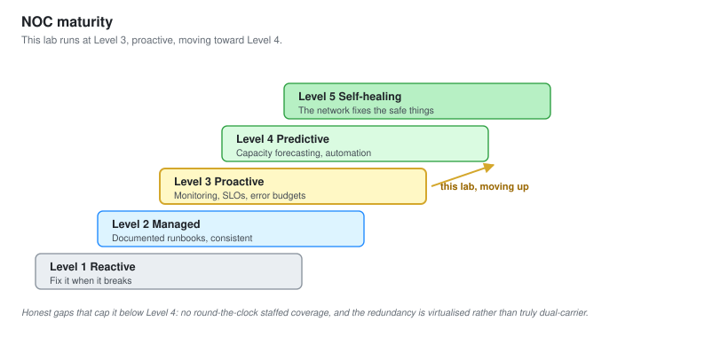

This lab operates at Level 3, measured and proactive, moving toward Level 4. The honest gaps: no 24 by 7 staffed coverage, because it is one person, and the redundancy is virtualised, so a real dual-carrier failover is modelled rather than truly tested. Those are stated plainly, because a reliability lead who oversells their resilience gets found out by the first real outage.

---

## Leading The Function

A Tier 3 is also where the function itself is run. The work that does not show up in a tool:

- **The on-call program**, a rotation that is sustainable, with clear escalation and no hero culture.
- **Runbooks** so a junior can restore at 3am what a senior restores at noon.
- **Blameless after-action reviews**, so an outage makes the network better instead of making someone a scapegoat.
- **Mentoring**, handing a Tier 1 the root-cause work and reviewing it, so they become a Tier 2.

The after-action from the capstone outage produced three concrete changes: the standby config corrected and placed under automation, monitoring added for the standby path specifically, and an automated monthly failover test, so the next time the redundancy is needed it is known to work rather than hoped to.

---

## Skills This Demonstrates

| Area | Evidence |
| --- | --- |
| Incident command | A major outage run end to end, with timeline, decisions and communication |
| Reliability engineering | Service-level objectives, error budgets, burn-rate alerting |
| Network as code | NetBox as source of truth, Ansible deployment, drift eliminated |
| Alerting strategy | Routing, inhibition, on-call, paging on burn rate not noise |
| Observability | Metrics, logs and traces used together to answer why |
| Change management | A lightweight, reversible, repeatable change process |
| Leadership reporting | Availability and MTTR trends, a maturity assessment for a board |
| People leadership | On-call rotation, runbooks, mentoring, blameless reviews |
| Honesty | Real gaps named: no 24 by 7, virtualised redundancy |

---

## Honest Notes

**This is one person in a lab, not a staffed NOC.** The roles in the war-room board are roles I played in sequence, not a team at once. What transfers is knowing the roles exist and how the decisions flow between them. The scale is simulated. The method is real.

**The redundancy is virtualised.** The failover, the standby path and the carrier links are all modelled on one Proxmox host. A real dual-carrier, dual-hardware failover behaves in ways a lab cannot fully reproduce. The config-drift root cause and its fix, however, are exactly the same in the real world.

**The outage was authored.** I built the scenario, so I knew the cause. A real major outage is against something nobody scripted. The commander's method, the restore-before-diagnose decision, and the communication are what carry over, and those hold whether the outage was authored or not.

---

Back to the [portfolio home](../README.md).
