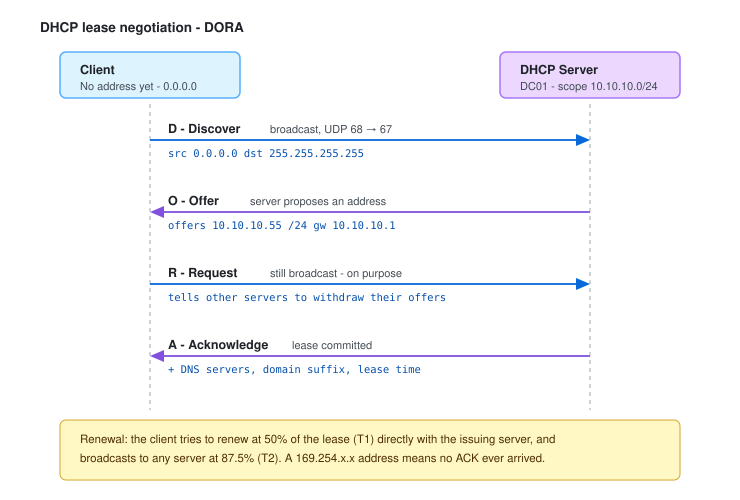
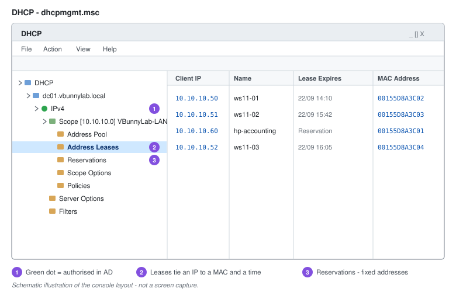

# DHCP

DHCP hands out IP addresses and the settings that go with them - subnet mask, default gateway, DNS servers, domain suffix. Without it, every device needs manual configuration, and every subnet change becomes a desk-to-desk job.

The part worth understanding properly is the negotiation. Most DHCP faults are diagnosable purely from knowing which of the four messages stopped arriving.



---

## Lab Environment

| Item | Value |
| --- | --- |
| Subnet | `10.10.10.0/24` |
| Gateway | `10.10.10.1` |
| DC01 (AD DS, DNS, DHCP) | `10.10.10.10` |
| Scope range | `10.10.10.50` - `10.10.10.200` |
| Reserved for infrastructure | `10.10.10.1` - `10.10.10.49` |

---

## The Four Messages

| Step | Direction | What happens |
| --- | --- | --- |
| **Discover** | Client → broadcast | Client has no address. Sends from `0.0.0.0` to `255.255.255.255` looking for any server. |
| **Offer** | Server → client | Server reserves a candidate address and proposes it, along with the scope options. |
| **Request** | Client → broadcast | Client accepts one offer. Still broadcast, deliberately - it tells every *other* DHCP server to withdraw its offer. |
| **Acknowledge** | Server → client | Lease is written to the database and confirmed. Client applies the address and options. |

A client that ends up with a `169.254.x.x` APIPA address never received an ACK. Either no server answered, the scope is exhausted, or the broadcast never crossed the subnet.

> **Across subnets:** DHCP relies on broadcasts, and routers do not forward them. A client on a different subnet to the server needs an **IP helper address** (DHCP relay) configured on the router interface.

---

## Installing the DHCP Role

1. **Server Manager** → **Manage** → **Add Roles and Features**.
2. **Next** past *Before you begin*.
3. **Role-based or feature-based installation** → **Next**.
4. Select the destination server → **Next**.
5. Tick **DHCP Server** → **Add Features** → **Next**.
6. **Next** through Features and the DHCP notes → **Install**.

### Post-Deployment Configuration

1. Click the **notification flag** in Server Manager → **Complete DHCP configuration**.
2. **Next** past the description.
3. Supply credentials with rights to authorise the server in AD → **Commit**.

> **Authorisation matters.** In a domain, a Windows DHCP server will not serve addresses until it is authorised in Active Directory. This exists specifically to stop an unauthorised server from handing out addresses and redirecting clients - a rogue DHCP server is a straightforward way to become the default gateway for a subnet and see traffic that was never meant to pass through it.

Manage the role from **Server Manager** → **Tools** → **DHCP**.

---

## Terminology

These four get conflated constantly. They are distinct:

| Term | Meaning |
| --- | --- |
| **Scope** | The range of addresses a server can issue on one subnet. |
| **Address pool** | What is actually issuable - the scope range minus any exclusions. |
| **Exclusion** | Addresses inside the scope range the server will never hand out. Used for statically assigned devices. |
| **Reservation** | A specific address permanently bound to one MAC address. The client still leases it via DORA, but always receives the same address. |
| **Lease** | The time-limited grant of an address to a client, with an expiry. |

---

## Creating a Scope

1. In the DHCP console, expand the server → right-click **IPv4** → **New Scope**.
2. **Next** past the welcome page.
3. **Name**: `VBunnyLab-LAN`; description optional → **Next**.
4. **IP Address Range**:
   - Start: `10.10.10.50`
   - End: `10.10.10.200`
   - Length: `24` - subnet mask fills in as `255.255.255.0`
5. **Add Exclusions and Delay** - exclude anything statically addressed inside that range. Nothing to exclude here, since infrastructure sits below `.50`. → **Next**
6. **Lease Duration** - see below → **Next**.
7. **Configure DHCP Options now** → **Yes** → **Next**.
8. **Router (Default Gateway)**: `10.10.10.1` → **Add** → **Next**.
9. **Domain Name and DNS Servers**: parent domain `vbunnylab.local`, DNS server `10.10.10.10` → **Next**.
10. **WINS Servers**: leave empty - WINS is legacy → **Next**.
11. **Activate Scope** → **Yes** → **Next** → **Finish**.

A scope that was created but never activated issues nothing. If clients are getting APIPA addresses immediately after setup, check this first.

### Lease Duration

The default is 8 days. What to use depends on the population:

| Environment | Suggested | Why |
| --- | --- | --- |
| Wired corporate LAN | 8 days | Stable devices; long leases reduce DHCP traffic. |
| Wireless / BYOD | 4-24 hours | High churn. Long leases exhaust the pool with devices that left the building. |
| Guest network | 1-2 hours | Maximum turnover, minimum retention. |

Shorter leases also shrink the window in which a stale lease record misrepresents who held an address - which matters when you are working backwards from an IP in a log.

---

## Reservations

Use a reservation when a device needs a consistent address but you would rather manage it centrally than configure it on the device - printers, scanners, IP cameras, lab appliances.

1. Expand the scope → right-click **Reservations** → **New Reservation**.
2. Fill in:
   - **Reservation name**: `HP-Printer-Accounting`
   - **IP address**: `10.10.10.60`
   - **MAC address**: `00155D8A3C01` - no separators
   - **Description**: `Accounting floor printer`
   - **Supported types**: Both
3. **Add**.

Find a device's MAC from the existing lease in **Address Leases**, or on the client with `ipconfig /all` (*Physical Address*).

---

## Client Configuration

1. **Control Panel** → **Network and Internet** → **Network and Sharing Center**.
2. **Change adapter settings** → right-click the adapter → **Properties**.
3. **Internet Protocol Version 4 (TCP/IPv4)** → **Properties**.
4. Select **Obtain an IP address automatically** and **Obtain DNS server address automatically** → **OK**.

Or in PowerShell:

```powershell
Get-NetIPInterface -AddressFamily IPv4
Set-NetIPInterface -InterfaceAlias 'Ethernet' -Dhcp Enabled
Set-DnsClientServerAddress -InterfaceAlias 'Ethernet' -ResetServerAddresses
ipconfig /renew
```

---



---

## Verification

On the client:

```powershell
ipconfig /all
```

Confirm *DHCP Enabled: Yes*, the expected address, the correct gateway and DNS server, and the lease obtained/expiry times.

Force a fresh negotiation:

```powershell
ipconfig /release
ipconfig /renew
```

On the server:

```powershell
Get-DhcpServerv4Scope
Get-DhcpServerv4Lease -ScopeId 10.10.10.0
Get-DhcpServerv4Reservation -ScopeId 10.10.10.0
Get-DhcpServerInDC                      # which servers are authorised in AD
```

---

## Troubleshooting

**Client has a 169.254.x.x address** - no ACK was received. Check in order: is the scope activated, is the server authorised in AD, is the pool exhausted, does the broadcast reach the server (relay/helper on routed subnets).

**Client gets an address from the wrong subnet** - usually a second, unauthorised DHCP server. `Get-DhcpServerInDC` lists the authorised ones; anything else answering is rogue.

**Pool exhausted** - check **Address Leases** for devices that no longer exist. Shorten the lease duration, or widen the scope.

**Address conflicts** - a statically assigned device inside the scope range with no matching exclusion. Enable **Conflict detection attempts** (scope properties → Advanced) as a stopgap, then fix the exclusion.

**Reservation not applied** - the MAC is wrong, or the client holds an existing lease for a different address. Delete the active lease and renew from the client.

---

## Security Notes

- **Rogue DHCP servers** are a practical attack: whoever assigns the gateway and DNS server controls where traffic goes. AD authorisation stops rogue *Windows* servers; it does nothing about a Linux box or a consumer router plugged into a wall port. **DHCP snooping** on managed switches is the control that actually covers this.
- **Lease logs are evidence.** The DHCP audit log ties an address to a MAC and a timestamp, which is how you turn an IP in a security alert into a physical device.
- **Reservations are not access control.** They make addressing predictable; they do not stop anything from setting an address manually. Use 802.1X for port-level control.
- **Scope options carry DNS.** Anything that can change scope options can redirect resolution for every client on the subnet - treat write access to DHCP as sensitive.
