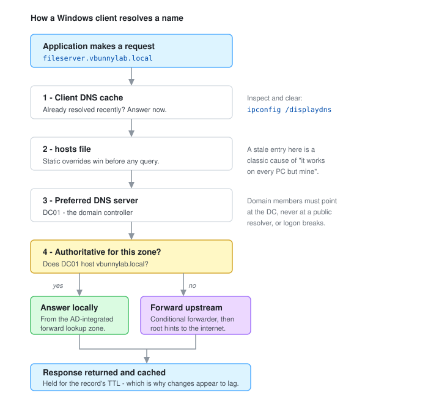
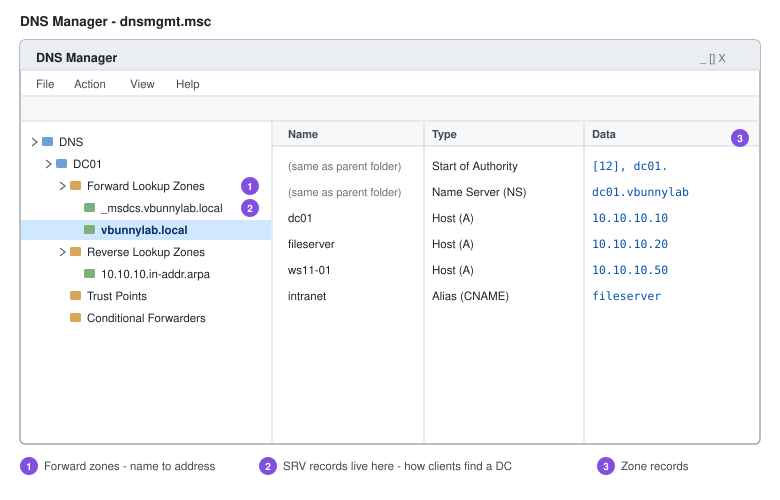

# DNS

DNS resolves names to addresses. In an Active Directory environment it does considerably more than that - domain controllers publish their services as SRV records, and clients find a DC to authenticate against by querying DNS. Break DNS on a domain member and you don't lose the internet, you lose logon, Group Policy, and replication.

That dependency is why DNS is the first thing I check when a domain-joined machine starts behaving strangely, and why domain members must point at a domain controller rather than at a public resolver.



---

## Lab Environment

| Item | Value |
| --- | --- |
| Domain | `vbunnylab.local` |
| Subnet | `10.10.10.0/24` |
| Gateway | `10.10.10.1` |
| DC01 (AD DS + DNS) | `10.10.10.10` |
| Reverse zone | `10.10.10.in-addr.arpa` |

---

## Before Installing: Static Addressing

A DNS server has to be reachable at a predictable address. Install the role on a host with a DHCP-assigned address and resolution breaks the first time the lease changes.

1. **Server Manager** → **Local Server** → click the `Ethernet0` link.
2. Open **Internet Protocol Version 4 (TCP/IPv4)** → **Properties**.
3. Select **Use the following IP address** and set:
   - IP address `10.10.10.10`
   - Subnet mask `255.255.255.0`
   - Default gateway `10.10.10.1`
   - Preferred DNS server `127.0.0.1` - the DC resolves through itself
4. Leave IPv6 enabled.

> **On IPv6:** disabling IPv6 on domain controllers is a common habit but Microsoft does not recommend it - several components assume it is present. Leave it enabled unless you have a specific, tested reason not to.

Return to **Local Server** to confirm the address took effect.

---

## Installing the DNS Server Role

Promoting a server to a domain controller installs DNS automatically. These steps cover installing it standalone - useful when building a member DNS server or practising the role wizard.

1. **Server Manager** → **Manage** → **Add Roles and Features**.
2. **Next** past *Before you begin*.
3. **Role-based or feature-based installation** → **Next**.
4. Select the target server → **Next**.
5. Under **Server Roles**, tick **DNS Server** → **Add Features** → **Next**.
6. **Next** through Features and the DNS notes → **Install**.

Manage it afterwards from **Server Manager** → **Tools** → **DNS**.

---

## Zones

A zone is the portion of the namespace a server is authoritative for - the part it answers from its own records instead of asking someone else.

### Forward Lookup Zone

Maps names to addresses: `fileserver.vbunnylab.local` → `10.10.10.20`.

1. Right-click **Forward Lookup Zones** → **New Zone** → **Next**.
2. **Primary zone** → **Next**.
3. **Zone name**: `vbunnylab.local` → **Next**.
4. Accept the default zone file → **Next**.
5. **Dynamic updates**: for a standalone primary zone, choose **Do not allow dynamic updates** → **Finish**.

> **In production:** an AD-integrated zone is the better choice. It replicates with AD rather than by zone transfer, and it supports **secure dynamic updates** - domain members register their own records, while anything not authenticated to the domain is refused. Allowing *insecure* dynamic updates lets any host on the network overwrite records, including the ones clients use to locate a domain controller.

### Reverse Lookup Zone

Maps addresses back to names. Not required for clients to function, but it matters for logging, mail reputation checks, and any investigation where you have an IP from a log and need to know what it was.

1. Right-click **Reverse Lookup Zones** → **New Zone** → **Next**.
2. **Primary zone** → **Next**.
3. **IPv4 Reverse Lookup Zone** → **Next**.
4. **Network ID**: `10.10.10` - the wizard builds `10.10.10.in-addr.arpa` → **Next**.
5. Accept the default zone file → **Next**.
6. **Do not allow dynamic updates** → **Next** → **Finish**.

---

## Records

| Type | Purpose | Example |
| --- | --- | --- |
| **A** | Name to IPv4 address | `fileserver` → `10.10.10.20` |
| **AAAA** | Name to IPv6 address | `fileserver` → `fd00::20` |
| **PTR** | Address back to name | `10.10.10.20` → `fileserver.vbunnylab.local` |
| **CNAME** | Alias to another name | `intranet` → `fileserver.vbunnylab.local` |
| **MX** | Mail routing for the domain | priority 10 → mail host |
| **SRV** | Service location - how clients find a DC | `_ldap._tcp.dc._msdcs.vbunnylab.local` |

### Creating an A Record

1. Right-click the `vbunnylab.local` zone → **New Host (A or AAAA)**.
2. **Name**: `fileserver`
3. **IP address**: `10.10.10.20`
4. Tick **Create associated pointer (PTR) record** - this populates the reverse zone in the same step.
5. **Add Host**.

### Creating a PTR Record Manually

Only needed when the A record was created without the associated pointer.

1. Right-click `10.10.10.in-addr.arpa` → **New Pointer (PTR)**.
2. **Host IP address**: `10.10.10.20`
3. **Host name**: **Browse** to the A record, or type `fileserver.vbunnylab.local`.
4. **OK**.

---



---

## Verification

Check forward resolution:

```powershell
Resolve-DnsName fileserver.vbunnylab.local
```

Check reverse resolution:

```powershell
Resolve-DnsName 10.10.10.20 -Type PTR
```

Confirm the domain controller's SRV records are published. This is the check that matters most, because it is what clients use to find a DC:

```powershell
Resolve-DnsName -Type SRV _ldap._tcp.dc._msdcs.vbunnylab.local
```

Query a specific server rather than whatever the client happens to be configured with:

```powershell
Resolve-DnsName fileserver.vbunnylab.local -Server 10.10.10.10
```

`nslookup` does the same job interactively and is worth knowing, since it exists on systems where PowerShell is not convenient:

```text
nslookup
> server 10.10.10.10
> fileserver.vbunnylab.local
> 10.10.10.20
> exit
```

---

## Troubleshooting

Work down the resolution order in the diagram above - each step rules out the one before it.

**Resolution fails entirely**

```powershell
Get-DnsClientServerAddress          # is the client pointed at the DC?
Test-NetConnection 10.10.10.10 -Port 53
```

**Resolves to the wrong address**

```powershell
ipconfig /displaydns                # inspect the client cache
ipconfig /flushdns                  # clear it
Get-Content $env:SystemRoot\System32\drivers\etc\hosts
```

A stale `hosts` entry beats every DNS server in the environment, and produces the classic "works on every machine except this one."

**Works by IP, fails by name** - a resolution problem, not connectivity. Confirm the A record exists and that the client is querying the server you think it is.

**Changes not taking effect** - records are cached for their TTL, on the client and on any forwarder in the path. Flush the client, and clear the server cache from the DNS console (**Action** → **Clear Cache**) if needed.

**Domain-joined machine cannot log on or apply Group Policy** - almost always DNS. Confirm the client points at a DC and that the `_msdcs` SRV records resolve.

---

## Security Notes

DNS decides where traffic goes, which makes it worth hardening even in a lab.

- **Secure dynamic updates only.** Insecure updates let any host register or overwrite records, including the SRV records used to locate a domain controller.
- **Restrict recursion.** An internal server that answers recursive queries from outside the network can be abused for amplification attacks.
- **Control zone transfers.** Default to none, or restrict to named secondary servers. An unrestricted transfer hands over a complete map of the internal network.
- **Enable DNS logging.** Query and analytic logs surface lookups for domains nobody visited deliberately - one of the more reliable early signals of a compromised host.
- **Watch the forwarders.** Changing a forwarder is a quiet way to redirect an entire network's traffic, and it rarely shows up in day-to-day monitoring.
