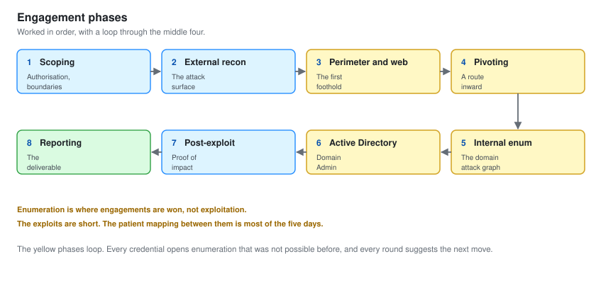

# 01 - Scoping and Rules of Engagement

This is the document that separates a penetration test from a crime. It comes first because it should.

A junior tester is handed a scope. A penetration tester writes one, negotiates it, and holds the line on it when the exploitation gets exciting. This file is that work: the authorisation, the boundaries, the methodology, and the lab that stands in for the client.

---

## Authorisation

Everything in scope is mine. The hosts, the domain, the applications and the network all run on my own Proxmox server. The client name, "Harbor Retail Group", is invented to give the engagement a realistic shape, and the external segment is a simulated perimeter on my own hardware, not the public internet.

No third party was touched. No real person was phished, called or profiled. No real data exists to steal.

I am labouring the point because the point is the job. The skill a client pays for is not the exploit. It is trusting you with access to the thing that runs their business and knowing you will stay inside the lines. A tester who cannot be trusted with scope is worth nothing no matter how good the shell.

---

## The Engagement, Stated As A Client Would Receive It

The rest of this section is written as though Harbor Retail Group were real and had signed for the work. That framing is the point of the exercise. A penetration tester has to produce these documents before touching anything, and producing them well is half the job.

### Objectives

Harbor asked three questions.

1. Can an attacker on the internet get into our internal network.
2. If they do, can they reach the customer database.
3. What would we see while it happened.

The engagement is designed to answer those three questions in that order, and the report is structured to answer them for a reader who is not technical.

### Scope

| | |
| --- | --- |
| **External** | The perimeter range `172.16.5.0/24`. The customer web application. The staff VPN portal |
| **Internal** | The corporate range `10.70.10.0/24` and the server range `10.70.20.0/24`, reachable only after a foothold is earned |
| **Domain** | `harbor.local`, all hosts and accounts within it |
| **Application** | The customer web app, tested grey box with a supplied low-privileged account |
| **Explicitly out** | The Proxmox host and its management network, any denial of service, and social engineering of real staff |

### Rules of Engagement

| | |
| --- | --- |
| **Testing window** | Recorded as a two-week window with active testing on weekdays. In the lab it is any time, but the window is documented as though agreed |
| **Point of contact** | A named technical contact who can be reached if something breaks. Recorded here as a role, not a person |
| **Stop conditions** | Evidence of a pre-existing compromise, or any instability on a production system, halts testing and triggers a call |
| **Data handling** | Impact is proven, never caused. Access to sensitive data is demonstrated with a single record and a count, not by copying the set |
| **Permitted** | Enumeration, exploitation, privilege escalation, lateral movement, pivoting, credential attacks |
| **Forbidden** | Denial of service, destructive payloads, ransomware simulation, and taking real data off site |

### The "Prove, Do Not Cause" Rule

This one deserves its own line because it is where inexperienced testers do damage. The goal of reaching the customer database is to prove it can be reached. That is shown by reading one record and reporting the row count. It is not shown by dumping the table, and it is never shown by changing or deleting anything.

The same rule governs the whole engagement. Get Domain Admin, then stop and document it. Do not go on to demonstrate what Domain Admin can destroy. The client already knows.

---

## Methodology

The engagement follows a standard structure, worked in order, with a loop through the middle. It is close to the PTES and OWASP testing guides without being a slave to either.

| Phase | Produces |
| --- | --- |
| Scoping | This document. Authorisation and boundaries |
| External recon | Attack surface. What is exposed and worth attacking |
| Perimeter and web | The first foothold, earned from outside |
| Pivoting | A route from the perimeter into the internal network |
| Internal enumeration | The domain attack graph |
| Active Directory | Domain Admin |
| Post-exploitation | Proof of impact against the objective |
| Reporting | The deliverable |

The middle phases loop. Every new credential opens enumeration that was not possible before, and every round of enumeration suggests the next exploit. **Enumeration is where engagements are won.** The exploits are short. The patient mapping between them is most of the five days.

---

## The Lab Build

The environment models a retailer with a public storefront, an internal corporate network, and a segmented server network for the systems that hold customer data. It is built on Proxmox VE.

### Segments

| Segment | Range | Purpose |
| --- | --- | --- |
| Perimeter | `172.16.5.0/24` | Public-facing services. The web app, the VPN, the webmail portal |
| Corporate | `10.70.10.0/24` | Staff workstations, the domain controller, the certificate authority, the file server |
| Server VLAN | `10.70.20.0/24` | The customer database and the internal app. Meant to be the most protected segment |

The three segments are separate Proxmox bridges. A pfSense firewall routes between them. The intended design is sound: the perimeter should not reach the corporate LAN, and only specific corporate hosts should reach the server VLAN. The engagement is largely the story of where that intended design was not actually enforced.

### The Seeded Weaknesses

A lab is only useful if it contains realistic mistakes. These were built in deliberately, each one modelled on something common in real small enterprises:

- A customer web app running an outdated framework with an unauthenticated file-upload handler.
- A firewall rule on the perimeter that was meant to be temporary and allows the web server to reach the corporate LAN.
- An AD Certificate Services template configured so that low-privileged users can request certificates for any identity.
- A SQL service account with a weak, crackable password and a Kerberos service principal name.
- A local administrator password reused across three servers.
- Domain administrators who log on to ordinary workstations.

None of these is exotic. Every one of them is on the list of findings that real internal tests produce again and again. The lab is realistic precisely because the mistakes are boring.

### Hosts

The full host list is in the [README](README.md). The build steps, the pfSense rules, the Proxmox bridge layout and the seeded configuration for each weakness are captured as they were made, so the environment is reproducible.

---

## What Good Scoping Prevents

Two failures, both common, both avoidable at this stage.

**Scope creep during exploitation.** Once you have a foothold, every adjacent system looks interesting. A written scope is what stops "interesting" from becoming "out of bounds". When step 4 of the attack path revealed the perimeter could reach the corporate LAN, the right move was to note it as a finding and confirm it was in scope before crossing, which it was. If it had not been, the test would have stopped there and the finding would still have been the headline.

**A report nobody can act on.** Scoping is where you learn who reads the report and what they can change. Harbor's three questions shaped the whole document. The executive summary answers them in plain language, and the technical findings answer them in detail. A report that is a wall of tool output, with no line drawn back to what the business asked, is a report that gets filed and forgotten.

Next: [02-External-Reconnaissance.md](02-External-Reconnaissance.md).
