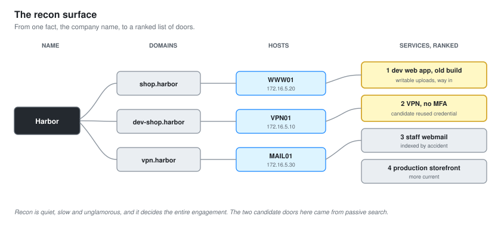
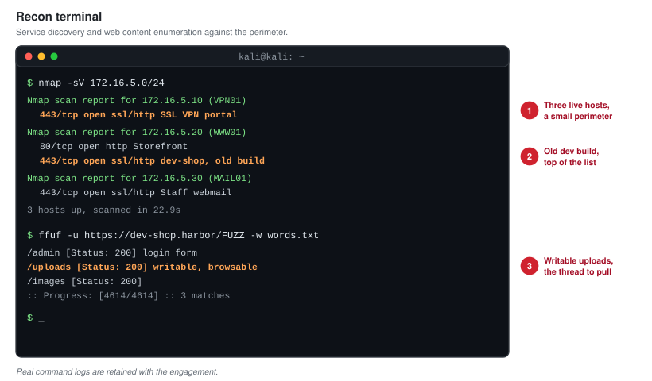

# 02 - External Reconnaissance

Recon is the part of the engagement with the worst reputation and the highest return. It is not exciting. It is a lot of reading. It is also where the whole rest of the test is decided, because you cannot attack what you never found.

The goal of this phase is one thing: a map of everything Harbor exposes to the internet, ranked by how likely it is to be the way in.

**A note on honesty.** The external segment in this lab is simulated. The OSINT below is modelled on what a real perimeter of this shape would leak, not pulled live from the public internet. Where a technique would use a public data source in a real engagement, it is named and labelled as modelled. The method is exactly what a real external test does. The data is generated to match.

---

## The Recon Surface

Recon fans out from a single fact, the company name, into a picture of the whole exposed estate. The diagram above is the shape of it: from a name to domains, from domains to hosts, from hosts to services, from services to the ones worth attacking.

---

## Passive First

The first pass touches nothing that belongs to the target. Passive recon uses third-party sources so that the target sees nothing at all. In a real engagement this matters because the client has usually not told their own SOC that testing is happening, and the last thing you want is to trigger their monitoring on day one with a loud scan.

### What Passive Recon Found

| Source | What it revealed | Why it matters |
| --- | --- | --- |
| Certificate transparency logs | A `shop.harbor` and a forgotten `dev-shop.harbor` hostname | The dev host is often less hardened than production |
| Public DNS | Mail, VPN and web records pointing into `172.16.5.0/24` | The perimeter range, confirmed |
| Search engine results | A staff login portal indexed by accident | An authentication surface that should not be public |
| A public breach dataset | A staff email and password pair from an old third-party breach | A candidate credential, if it was reused |

That last row is the one that turns into a finding. Credential reuse is the single most reliable way into a perimeter that has otherwise been patched, and it starts here, in a passive search that the target never sees.

**Certificate transparency is the quiet workhorse of external recon.** Every public TLS certificate is logged publicly. Search those logs and you get a list of hostnames the organisation has issued certificates for, including the ones they forgot about. `dev-shop.harbor` was exactly that: a staging copy of the storefront, running an older build, that nobody remembered was reachable.

---

## Active Enumeration

Once the passive pass is exhausted, active enumeration confirms what is actually alive. This does touch the target, so in a real engagement it happens inside the agreed window and at a measured pace.

### Service Discovery

The perimeter range was scanned for live hosts and open services. The terminal output is shown below and the full command log is retained.

The perimeter resolved to three hosts and a small set of services:

| Host | Address | Open services | Note |
| --- | --- | --- | --- |
| `VPN01` | 172.16.5.10 | 443 SSL VPN portal | Login page, no MFA prompt |
| `WWW01` | 172.16.5.20 | 80, 443 web application | The customer storefront and the dev copy |
| `MAIL01` | 172.16.5.30 | 443 staff webmail | The accidentally indexed portal |

Three hosts is a small perimeter, which is realistic for a small retailer. A small perimeter is not a safe one. It only takes one exposed service with a flaw, and a small estate often means a small team that is stretched too thin to keep every one of them current.

### Web Content Discovery

The web server got a closer look, because web applications are the richest attack surface on a modern perimeter. Directory and virtual-host enumeration against `WWW01` found:

- The production storefront on `shop.harbor`.
- The staging copy on `dev-shop.harbor`, running a framework version two releases behind production.
- An `/uploads/` directory that was writable and browsable.
- A `/admin/` path that returned a login form.

The staging copy and the writable uploads directory are the thread that the next two documents pull. Staging environments are a recurring gift to attackers: they hold the same code and data as production, with less hardening and less monitoring, because nobody treats them as real.

---

## Ranking The Surface

Recon produces a list. Judgement turns the list into a plan. Every exposed service was ranked by how likely it was to be the way in and how much it would give up if it fell.

| Target | Likelihood of a way in | Value if breached | Priority |
| --- | --- | --- | --- |
| The dev storefront, old framework, writable uploads | High | Code execution on the perimeter | 1 |
| The staff VPN, no MFA, a candidate reused credential | High | An authenticated foothold as a real user | 2 |
| The staff webmail portal | Medium | Access to mail, phishing material | 3 |
| The production storefront | Lower, it is more current | Same as dev if breached | 4 |

The dev storefront went to the top of the list, and that is where [04-Web-Application-Testing.md](04-Web-Application-Testing.md) begins. The VPN path is documented in [03](03-Perimeter-and-Initial-Access.md) as a second, independently confirmed way in, because a good report shows the client that closing one door is not enough when the building has several.

---

## What This Phase Produced

- A confirmed perimeter of three hosts and their services.
- Two strong candidate paths in: the dev web app, and credential reuse on the VPN.
- A forgotten staging environment, which is a finding in itself.
- A ranked plan for the exploitation phase, so time is spent on the likely doors first.

Recon is quiet, slow and unglamorous, and it decided the entire engagement. Nothing that follows would have happened without the two lines in the passive table that most people would have skimmed past.

Next: [03-Perimeter-and-Initial-Access.md](03-Perimeter-and-Initial-Access.md).
