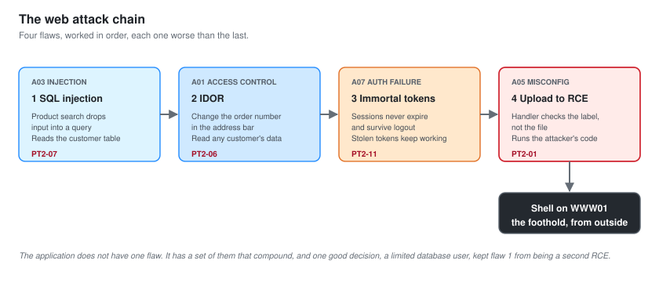
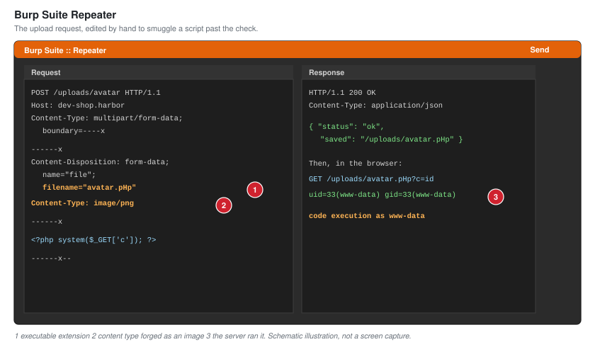

# 04 - Web Application Testing

The customer web application is the richest attack surface Harbor exposes, and it is where the primary foothold was earned. This document is the grey-box application test: a supplied low-privileged customer account, and the mandate to find out how bad the application is once someone is inside it.

Web testing is what most separates a penetration tester from a network-only junior. It is a different discipline, closer to development than to network attacks, and it rewards understanding how the application is built rather than which tool to run.

---

## The Web Attack Chain

Four findings, worked in order, each one worse than the last, ending in code execution on the server. That progression is the story to tell a client: the application does not have one flaw, it has a set of them that compound.

| Step | Flaw | OWASP category | Finding |
| --- | --- | --- | --- |
| 1 | The product search is injectable | A03 Injection | PT2-07 |
| 2 | Order records can be read across accounts | A01 Broken Access Control | PT2-06 |
| 3 | Session tokens never expire | A07 Auth Failures | PT2-11 |
| 4 | The upload handler runs what you upload | A05 Misconfiguration | PT2-01 |

---

## Working With Burp Suite

The whole application test ran through Burp Suite as an intercepting proxy. Every request the browser made passed through Burp, where it could be read, modified and replayed. That is the core loop of web testing: see the real request, change one thing, send it again, watch what changes in the response.

The schematic above is the file-upload request caught in Burp's Repeater, with the filename and content type being changed to smuggle a script past a check that only looked at the form field. That single request is the whole of finding PT2-01, and it is worth showing because it is what web exploitation actually looks like: not a tool firing on its own, but a person reading one request and understanding why the change works.

---

## Step 1: SQL Injection In Search

The product search endpoint took a query string and, it turned out, dropped it into a database query without parameterising it. A single quote in the search box produced a database error, which is the classic first sign.

The injection was confirmed by hand first, then characterised with sqlmap to establish its depth safely. It was a UNION-based injection that allowed reading from other tables in the same database, including the customer table.

**This is finding PT2-07.** It is scored high rather than critical because in this application the database user was correctly limited and could not write or reach the operating system. Correct database permissions turned what could have been a second route to code execution into a serious but contained data-exposure issue. That is worth telling the client as a thing they got right, because it changed the severity.

The verbose database error that revealed the injection in the first place is finding PT2-17, disclosure through error messages.

---

## Step 2: Insecure Direct Object Reference

The application let a logged-in customer view their order history at a URL that ended in an order number. Changing the order number in the URL returned somebody else's order, including their name, address and the last four digits of a card.

No check tied the order to the account requesting it. The application trusted that if you knew the number, you were allowed to see it. Order numbers were sequential, so an attacker could walk the entire order history of every customer by counting.

**This is finding PT2-06.** It is the kind of flaw that leaks a customer database one record at a time, quietly, without ever tripping an injection filter or an upload check, because every request is technically a valid, authenticated action. It is scored high for the volume and sensitivity of the data it exposes.

It is also the flaw that regulators and journalists understand, which is worth remembering when writing the executive summary. "An attacker could read every customer's order by changing a number in the address bar" needs no translation for a board.

---

## Step 3: Session Tokens That Never Die

While testing authentication, the session token issued at login was captured and set aside. Hours later, after logging out, the old token still worked. The application invalidated nothing on logout and set no expiry, so a token, once captured, was good more or less forever.

**This is finding PT2-11.** On its own it is medium severity. In combination it is worse, because it means any token stolen through the IDOR, the injection or a captured request keeps working long after it should. Findings interact, and the report says so.

---

## Step 4: File Upload To Remote Code Execution

The customer account could upload a profile picture. The upload handler checked the form's declared content type and the file extension in the form field. It did not check the actual file, and it saved uploads into the browsable `/uploads/` directory found during recon, under a predictable name.

The bypass was the oldest one in web testing. A script file was sent with the content type of an image and an extension the server would still execute. The handler saw an image in the fields it checked, accepted it, and wrote an executable script into a directory the web server would happily run.

Requesting the uploaded file executed it. That is code execution on `WWW01`, as the web server's user, from an ordinary customer account.

**This is finding PT2-01, the critical that starts the attack path.** The framework running the app was two versions behind and its own advisories described exactly this class of handler weakness, which is finding PT2-16. A current framework would not have made the mistake easy.

### From Code Execution To A Stable Foothold

The initial execution was a single command at a time through a web request, which is awkward to work with. It was upgraded to a proper interactive session, and then stabilised, so the rest of the engagement had a reliable position on `WWW01` to work from.

At this point the tester had a shell on a perimeter host, running as an unprivileged service account, from nothing but a company name five days earlier. The next question is the one that decides whether this is a bad day or a catastrophe for Harbor: can this perimeter host reach anything that matters. That is [05-Pivoting-and-Tunneling.md](05-Pivoting-and-Tunneling.md).

---

## What The Application Test Showed

- The application had four distinct flaws that compounded, not one.
- One correct decision, limiting the database user, downgraded a would-be critical to a high. Good controls change severity, and the report credits them.
- The critical was a file upload, the most tested weakness in web security, made easy by an out-of-date framework.
- Every finding was confirmed by hand, then characterised with tooling, never the other way round. A tool result you cannot explain is not a finding, it is a guess.

Next: [05-Pivoting-and-Tunneling.md](05-Pivoting-and-Tunneling.md).
