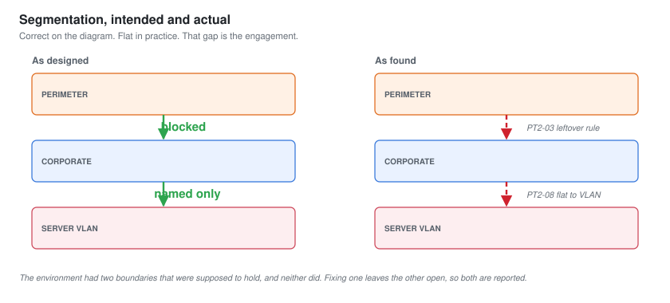
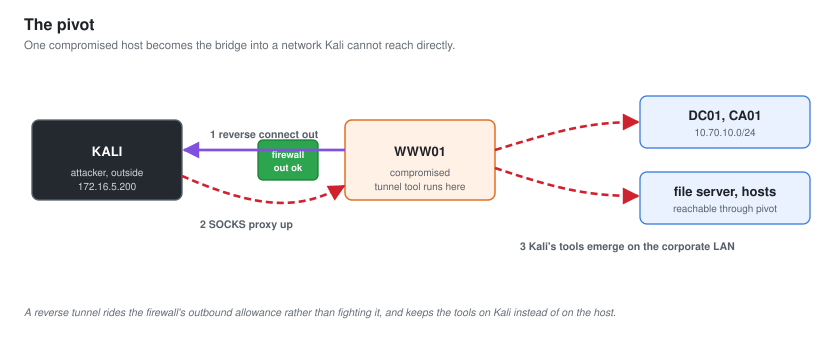

# 05 - Pivoting and Tunneling

A foothold on a perimeter host is only as valuable as what it can reach. This document is about crossing the boundary that was supposed to stop exactly this: getting from the compromised web server on the perimeter into the internal corporate network.

Pivoting is one of the clearest lines between a junior and a penetration tester. The junior gets a shell. The penetration tester turns one shell into a route through the whole environment.

---

## The Boundary That Should Have Held

Harbor's design was correct on paper. The perimeter segment `172.16.5.0/24` should not be able to reach the corporate segment `10.70.10.0/24`. A firewall sat between them for that reason. If the design had been enforced, the story would end here: a defaced or abused web server, a bad day, but the internal network untouched.

It was not enforced. From the shell on `WWW01`, the corporate range answered.

---

## Confirming The Reachability

The first move after any foothold is to understand where you are and what you can see. From the web server, this meant checking its own network position and then testing what it could reach.

The web server had a route to the corporate LAN. A firewall rule that was almost certainly meant to be temporary, to let the web team reach an internal resource during a deployment, had been left in place. It allowed the perimeter web host to open connections into `10.70.10.0/24`.

**This is finding PT2-03, and it is one of the three criticals.** A single flat rule turned a contained web compromise into a route to the domain. It is worth dwelling on in the report because it is invisible day to day. Nothing breaks. The web app works, the internal resource is reachable, and the only symptom is that the wall between the internet and the corporate network has a hole in it that nobody remembers making.

---

## Building The Tunnel

The shell on `WWW01` could reach the corporate LAN, but the tester's Kali box could not. The web server had to become the bridge. That is what a pivot is: routing the attacker's traffic through a compromised host so that tools running on Kali can reach networks only the compromised host can see.

A lightweight tunnelling tool was uploaded to `WWW01` and connected back to a listener on Kali, establishing a SOCKS proxy. From that point, tools on Kali could be pointed through the proxy and would emerge onto the corporate network as though they were running on the web server itself.

The approach and the reasoning:

| Choice | Reasoning |
| --- | --- |
| A single reverse connection out from the web server | The perimeter firewall allowed outbound, as most do. A reverse tunnel rides that allowance rather than fighting it |
| A SOCKS proxy rather than per-port forwards | The internal enumeration to come would touch many hosts and ports. A SOCKS proxy carries all of it through one tunnel |
| Traffic kept low and paced | A perimeter host suddenly generating a flood of internal connections is exactly what a NOC notices. See [09-Detection-and-OPSEC.md](09-Detection-and-OPSEC.md) |

With the proxy up, the internal network was reachable from Kali through the web server. The engagement had crossed from the perimeter into the corporate LAN.

---

## Why Tunnels Beat Uploading Tools

There is a cruder approach: upload every tool to the web server and run it locally. It works, and it is louder, messier and leaves far more behind. Every tool copied to the host is an artefact for a defender to find and a file for antivirus to flag.

Tunnelling keeps the tools on Kali and sends only their traffic across. The compromised host stays close to how it was found, which is both cleaner tradecraft and kinder to a production system you do not fully understand. On a real engagement, the less you change on a box that runs someone's business, the better.

---

## What The Pivot Established

- The perimeter could reach the corporate LAN, which it was designed not to. That is critical PT2-03.
- A SOCKS tunnel through the web server gave Kali a working route onto the internal network.
- The route was built to be quiet, because the point of the next phase is patient enumeration, and patient enumeration is ruined by a loud pivot that gets the foothold cut off.

The tester was now positioned on the corporate network, reaching it through a single compromised perimeter host, with no domain credentials yet. That is exactly the position the internal enumeration phase begins from, and it is very close to where the junior project [PT-01](../Junior-Penetration-Tester/) started by assumption. The difference is that this one was earned across two network boundaries.

Next: [06-Internal-Enumeration.md](06-Internal-Enumeration.md).
