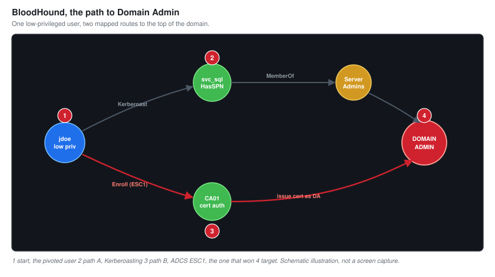

# 06 - Internal Enumeration

The tester is now on the corporate network, reaching it through the tunnel built in [05](05-Pivoting-and-Tunneling.md), with no domain credentials. This document is the patient work of turning that position into a map of the domain and a plan to own it.

This is the same phase the junior project begins from, and the technique overlaps. The difference here is that everything runs through a pivot, which changes how you work: slower, quieter, and with tools chosen because they cope with being proxied.

---

## Working Through A Proxy

Every command in this phase went through the SOCKS tunnel. That imposes discipline. Proxied scans are slower, so broad noisy sweeps are out. The work is targeted: identify the domain controller first, then enumerate deliberately, rather than scanning the whole range and hoping.

It also keeps the footprint small, which matters because a compromised perimeter host generating a storm of internal traffic is the thing most likely to get the whole foothold noticed and cut. Restraint here is not just tidiness, it is self-preservation for the engagement.

---

## Finding The Ground

The first targets were the domain controllers and the shape of the domain. Enumeration against the corporate range identified the core infrastructure:

| Host | Address | Role |
| --- | --- | --- |
| `DC01` | 10.70.10.10 | Domain controller, DNS, `harbor.local` |
| `CA01` | 10.70.10.12 | Enterprise certificate authority |
| `SRV-FILE01` | 10.70.10.20 | File server |
| `WS-101` | 10.70.10.101 | IT administrator workstation |
| `WS-102` | 10.70.10.102 | Finance workstation |

The presence of `CA01`, an Active Directory Certificate Services host, was noted immediately. AD CS is a common and often overlooked path to Domain Admin, and its presence moved certificate abuse to the top of the list of things to check once a domain credential was in hand.

---

## Getting A First Domain Credential

Enumeration without credentials only goes so far. The web server had been compromised as a local service account, not a domain user, so the first goal on the internal network was any valid domain credential, however unprivileged.

Two low-effort techniques were available and both are staples of internal testing.

**SMB and LDAP with no credentials.** The domain controller was checked for anonymous access. It permitted enough unauthenticated enumeration to pull a list of domain users, which becomes the input to everything else. A user list plus a weak password policy is a spraying attack waiting to happen.

**Name resolution poisoning.** With a position on the corporate LAN, broadcast name-resolution traffic could be answered. Windows hosts that fail to resolve a name over DNS fall back to LLMNR and NBT-NS, broadcasting to the whole subnet, and a listener can answer and capture the authentication that follows. That is finding PT2-13, and it produced a captured credential hash for a standard user.

The captured hash was for a service account used by a scheduled task on a workstation. It cracked quickly against a wordlist because the password policy permitted weak passwords, which is finding PT2-15. That gave the first authenticated domain foothold: a low-privileged domain user.

---

## Mapping The Domain With BloodHound

A single domain credential, however unprivileged, unlocks the most valuable tool in internal testing. BloodHound collects the relationships in a domain, who can log on where, who administers what, which accounts have which rights, and maps the paths from where you are to where you want to be.

The collector was run through the tunnel as the low-privileged user, and the data was loaded into BloodHound on Kali.

BloodHound turned a list of accounts and machines into a graph, and the graph made two paths to Domain Admin obvious.

### Path A: The Kerberoastable Service Account

One service account, `svc_sql`, had a Kerberos service principal name. That means any domain user can request a service ticket for it, and the ticket is encrypted with the account's password hash, which can be taken offline and cracked. If the password is weak, the account falls. BloodHound flagged that `svc_sql` was also a member of a group with rights worth having.

### Path B: The Certificate Authority

BloodHound and a follow-up check with a certificate-focused tool confirmed that a certificate template on `CA01` was misconfigured. Low-privileged users could enrol, and the template let the requester specify the identity the certificate was for. That is the ESC1 condition, and it is a direct path from any domain user to Domain Admin.

Two paths is better than one. Path A is the classic, and it was worked first because it is reliable and quiet. Path B is faster and more powerful, and it is the one that took the domain. Both are documented in [07-Active-Directory-Attack-Path.md](07-Active-Directory-Attack-Path.md), because a client should see every route, not only the one that happened to win.

---

## Findings From Enumeration

| Observation | Finding |
| --- | --- |
| Anonymous enumeration of domain users permitted | Folded into PT2-13 context |
| LLMNR and NBT-NS enabled, credentials captured | PT2-13 |
| Password policy permits weak, crackable passwords | PT2-15 |
| SMB signing not required, enabling relay attacks | PT2-12 |
| A Kerberoastable service account with rights | PT2-05 |
| An AD CS template vulnerable to ESC1 | PT2-02 |

---

## What Enumeration Produced

- The layout of the domain, including the certificate authority that would end the engagement.
- A first low-privileged domain credential, from name-resolution poisoning and a weak password.
- A BloodHound graph showing two independent paths to Domain Admin.
- A plan for the next phase that did not rely on luck.

The tester now had everything needed to take the domain and had not yet used the loudest technique available. That restraint is deliberate, and the next document spends it carefully.

Next: [07-Active-Directory-Attack-Path.md](07-Active-Directory-Attack-Path.md).
