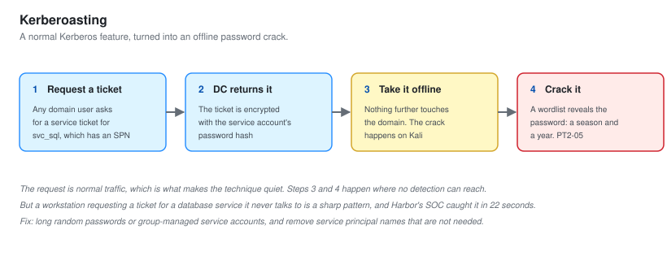
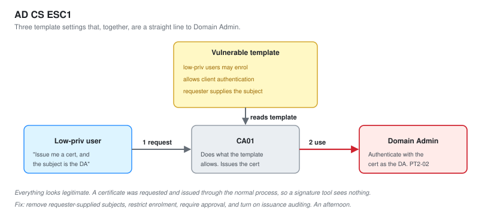
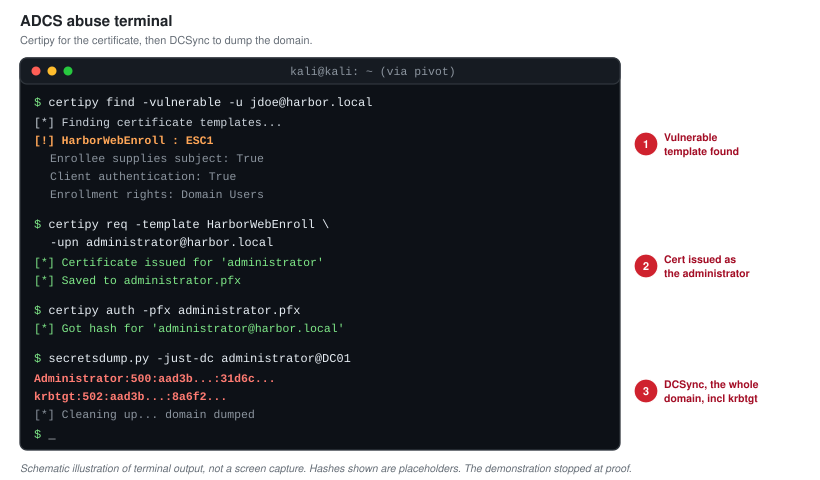

# 07 - Active Directory Attack Path

Enumeration in [06](06-Internal-Enumeration.md) produced a low-privileged domain user and two mapped paths to Domain Admin. This document walks both and takes the domain.

Active Directory is where most internal engagements are won, because most organisations run on it and most have accumulated the same handful of misconfigurations. The two here, a Kerberoastable service account and a vulnerable certificate template, are among the most common findings in real internal tests.

---

## Path A: Kerberoasting

Kerberoasting abuses a normal feature of Kerberos. Any authenticated user can request a service ticket for any account that has a service principal name. The ticket is encrypted with the target account's password hash. Request the ticket, take it offline, and try to crack it. Nothing about the request is abnormal, which is what makes the technique quiet.

`svc_sql` had a service principal name, so as the low-privileged user a service ticket was requested for it. The ticket was cracked offline against a wordlist, and the password fell: it was a season and a year, the single most common shape of a bad service account password.

**This is finding PT2-05.** The account mattered for two reasons. First, service accounts are often over-privileged because it was easier than working out the least privilege they needed. Second, this one had rights on the server VLAN, which is where the crown jewels live, so it became useful again in [08](08-Post-Exploitation-and-Impact.md).

Kerberoasting was worked first because it is reliable and because the request itself is normal traffic. It is also the one step of the whole path that the blue team caught immediately, which is covered in [09](09-Detection-and-OPSEC.md). That is not a contradiction: the request is normal, but requesting a ticket for a service account from a workstation that never talks to it is a pattern a good detection catches, and Harbor's did.

---

## Path B: AD Certificate Services, ESC1

The certificate authority was the faster and more powerful path, and it is the one that took the domain.

AD CS issues certificates based on templates. A template defines who may enrol and what the resulting certificate can be used for. The template on `CA01` had a dangerous combination of settings, known as ESC1:

- Low-privileged domain users were allowed to enrol.
- The template permitted client authentication, so a certificate from it could be used to log in.
- The template let the requester specify the subject, meaning the enrolling user could ask for a certificate that identified them as any account they named, including a domain administrator.

Put together, those settings mean any domain user can request a certificate that says they are the domain administrator, and then use it to authenticate as the domain administrator. It is a direct line from the bottom of the domain to the top, and it does not involve cracking anything.

### Working ESC1

Using the low-privileged domain user, a certificate was requested from the vulnerable template with the subject set to a domain administrator account. The CA, doing exactly what its template told it to, issued the certificate.

That certificate was then used to authenticate to the domain controller and retrieve the domain administrator's credential material. The account was now controlled.

**This is finding PT2-02, the second critical.** AD CS abuse is dangerous precisely because it looks legitimate. A certificate was requested and issued through the normal process. There was no exploit of a software bug, no cracked password, nothing that a signature-based tool would flag. The certificate authority was asked to do something it was configured to allow, and it complied. That is why it is often missed, and why [09](09-Detection-and-OPSEC.md) records that Harbor had no auditing on it at all.

---

## DCSync: Taking The Whole Domain

With domain administrator control, the last step was to demonstrate full domain compromise. A domain controller will replicate account data, including password hashes, to anything that has the right to ask, and a domain administrator has that right. Requesting that replication for the whole directory is called DCSync.

DCSync was run to retrieve the credential material for the domain, including the `krbtgt` account. Control of `krbtgt` means control of Kerberos itself, which means the ability to forge tickets for any account. At that point the domain is not just compromised, it is owned at the root, and any claim of having cleaned it up afterwards would be hard to trust.

Per the "prove, do not cause" rule from [01](01-Scoping-and-Rules-of-Engagement.md), the demonstration stopped there. The point was proven. Nothing was forged, changed or persisted.

---

## Two Paths, One Outcome

| Path | Technique | Noise | Result |
| --- | --- | --- | --- |
| A | Kerberoasting `svc_sql` | Caught by the blue team | A privileged service account |
| B | AD CS ESC1 on `CA01` | Silent, no auditing | Domain Admin |

Both worked. Reporting both matters, because if Harbor fixes only the one that took the domain, the other is still a route in. A client wants the map, not just the winning move.

**Time from the web foothold to Domain Admin: 2 hours 40 minutes.** Most of that was the patient enumeration in [06](06-Internal-Enumeration.md). The exploitation itself, once the paths were mapped, was quick, which is normal. The map is the work. The moves are fast once you have it.

---

## Where This Leaves Harbor

The domain is compromised. That is severe, but on its own it is abstract to a business. The question Harbor actually asked was whether an attacker could reach the customer database on the protected server VLAN. Domain Admin makes that reachable, and [08-Post-Exploitation-and-Impact.md](08-Post-Exploitation-and-Impact.md) proves it, carefully, and then stops.

Next: [08-Post-Exploitation-and-Impact.md](08-Post-Exploitation-and-Impact.md).
