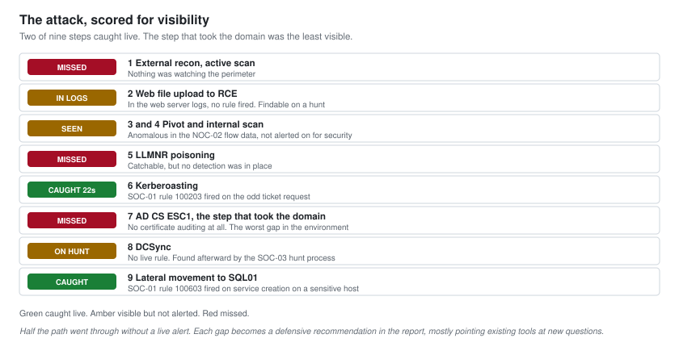

# 09 - Detection and OPSEC

Harbor's third question was "what would we see". This document answers it by walking the attack path again from the defender's chair. Every step is scored on how visible it was, what caught it, and what a defender should have seen but did not.

A penetration tester who can only attack writes half a report. A tester who understands detection writes remediation that includes "and here is how you would have caught this", which is the advice a security team can actually use. This is the document that makes the engagement worth more than a list of holes.

The detections referenced here are the ones I built in the blue team projects in this same portfolio: [SOC-01](../Junior-SOC-Analyst/), [SOC-02](../SOC-Analyst-1/) and [SOC-03](../SOC-Analyst-2/). Using my own detections to grade my own attack is the point. It is the same environment from both sides.

---

## The Attack Path, Scored For Visibility

| Step | Technique | Visible? | Caught by | Verdict |
| --- | --- | --- | --- | --- |
| 1 | External recon, active scan | Yes, if watched | Nothing at Harbor | Missed |
| 2 | Web file upload to RCE | In logs, not alerted | Web server logs | Missed live, findable on hunt |
| 3 | Perimeter reaches corporate LAN | Yes, as new traffic | NOC-02 traffic view | Anomalous, not alerted |
| 4 | SOCKS pivot and internal scan | Yes, as odd flows | NOC-02 traffic view | Anomalous, not alerted |
| 5 | LLMNR poisoning | Yes | Nothing at Harbor | Missed |
| 6 | Kerberoasting | Yes | SOC-01 rule 100203 | Caught, 22 seconds |
| 7 | AD CS ESC1 | Barely | Nothing, no ADCS audit | Missed |
| 8 | DCSync | Yes, if audited | SOC-03 hunt | Missed live, found on hunt |
| 9 | Lateral movement to SQL01 | Yes | SOC-01 rule 100603 | Caught on service creation |

Two live catches out of nine steps. That is the honest headline, and it is the finding a security team needs most.

---

## What Was Caught, And Why

**Kerberoasting, caught in 22 seconds.** This is the one that worked well. A workstation requesting a service ticket for a database service account it never normally talks to is a sharp, catchable pattern, and the SOC-01 rule fired on it. The attack still succeeded, because the cracking happens offline where no detection reaches, but the request was seen. That is the right model: you cannot always stop the technique, but you can know it happened.

**Lateral movement to SQL01, caught on service creation.** Moving to the database server created a service, and service creation on a sensitive host is monitored. The SOC-01 rule fired. Again, the move succeeded, but it was visible.

Both catches share a property: they fire on the artefact the technique leaves, not on the technique's intent. That is the durable way to build detections, and it is why these two held up against a real attack path.

---

## What Went Through Silently, And Why It Matters

**AD CS ESC1 was the worst gap.** The step that actually took the domain was the least visible one. Harbor had no auditing on the certificate authority at all, so the certificate request that made the tester a domain administrator looked exactly like every legitimate certificate request. This is common and it is dangerous, and it is the single strongest defensive recommendation in the report: turn on certificate issuance auditing and alert on requests where the subject does not match the requester.

**The pivot was visible but not alerted.** A perimeter web server suddenly opening connections into the corporate LAN, and then a spray of internal connections, is exactly the kind of anomaly the NOC-02 traffic analysis surfaces. It showed up in the flow data. Nobody was watching the flow data for security signals, because at Harbor it was a NOC availability tool, not a security one. The recommendation is not a new product, it is pointing an existing tool at a new question.

**DCSync was catchable and not caught live.** Replication requests from a host that is not a domain controller are a well-known DCSync signature. Harbor had no live rule, but the SOC-03 threat-hunting process found it after the fact by looking for exactly that pattern. That is the value of hunting: it catches the things your live rules missed, and it turns each catch into the next live rule.

---

## OPSEC: How The Attack Stayed Quiet

The engagement was run to be realistic about what an attacker would do to avoid detection, within the rules that forbid anything destructive.

| Choice | Why it reduced noise |
| --- | --- |
| Passive recon before active | The target sees nothing during the loudest-in-theory phase |
| A single reverse tunnel, outbound | Rides the firewall's existing allowance rather than opening new holes |
| Tools kept on Kali, not uploaded | Fewer files on disk for antivirus and responders to find |
| Kerberoasting before louder options | A normal-looking request, worked before anything aggressive |
| ESC1 over password attacks for the final step | A legitimate-looking certificate request beats a brute force every time |
| Paced internal scanning | Avoided the connection-rate spike a NOC would notice |

The point of documenting this is not to teach evasion. It is to show the defender what quiet looks like, so they can build detection that catches the quiet version, not just the loud one. A detection that only catches a noisy attacker is a detection that catches nobody who is trying.

---

## The Defensive Recommendations

These come out of the detection analysis and go into the report as their own section, because they are worth as much to Harbor as the vulnerability fixes:

1. **Audit AD Certificate Services.** Log issuance, alert when the certificate subject does not match the requester. This closes the blind spot on the step that took the domain.
2. **Point the flow data at security questions.** The NOC already has the traffic visibility. Alert on a perimeter host initiating internal connections, and on internal hosts crossing into the server VLAN.
3. **Alert on DCSync.** Replication from a non-domain-controller is a high-fidelity signal. Make it a live rule, not just a hunt.
4. **Detect LLMNR poisoning, then disable LLMNR.** Detection and prevention together.
5. **Keep the two rules that worked.** Kerberoasting and sensitive-host service creation both earned their place. Do not let a tuning cycle quietly remove them.

---

## Why This Section Exists

Most penetration test reports stop at the findings. This one grades itself against a real detection program because that is what makes a tester valuable beyond the test. The client does not only learn what is broken. They learn what their monitoring can and cannot see, which of their existing tools could be pointed at the problem, and where to spend the next dollar of defensive effort.

That is the whole argument for hiring someone who has worked both sides. The report is not just "here is how I got in". It is "here is how I got in, here is what you saw, here is what you missed, and here is the cheapest way to see it next time".

Next: [10-Findings-Report.md](10-Findings-Report.md).
