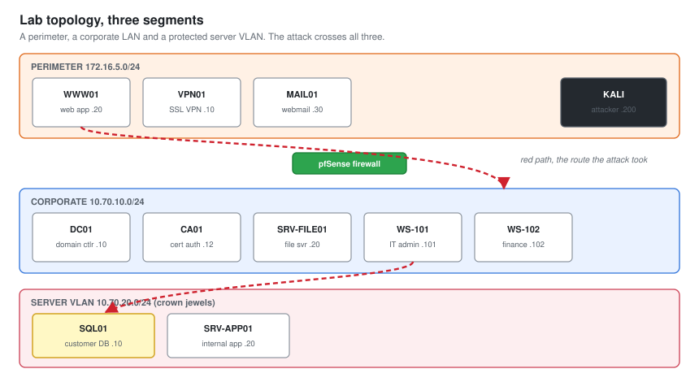
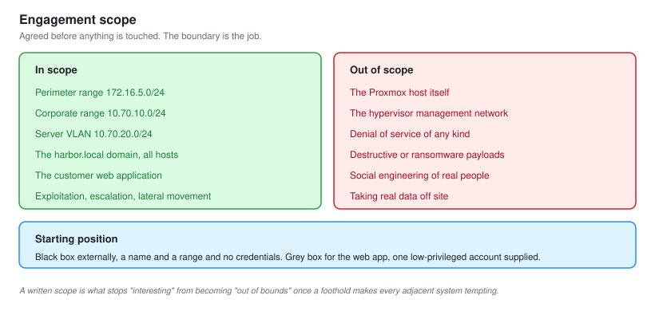
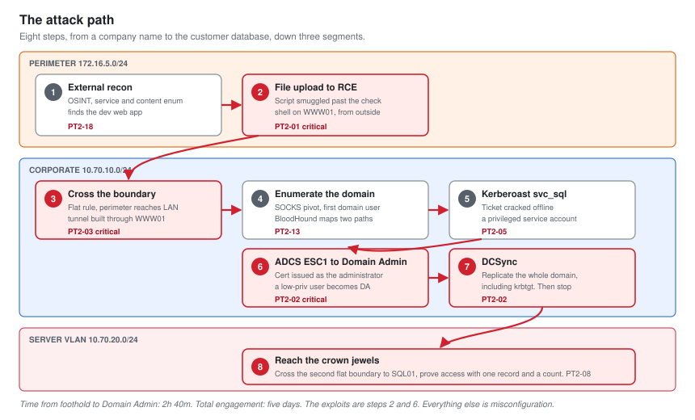
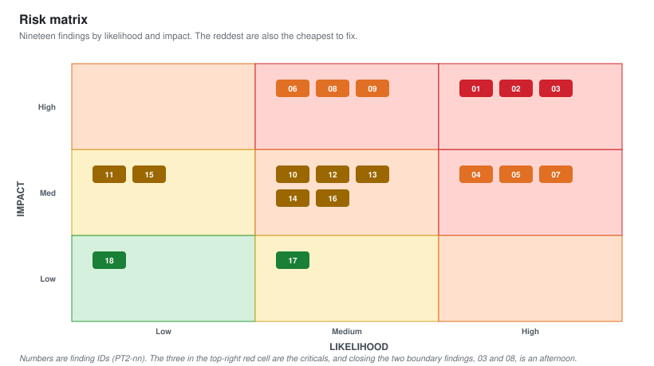

# PT-02: External to Internal Penetration Test

**Role target:** Penetration Tester
**Engagement type:** Full scope. External perimeter, web application, internal network, Active Directory
**Environment:** Self-owned Proxmox lab modelling a client, `harbor.local`
**Deliverable:** A findings report with an executive summary, written the way a business receives it

---

## Authorisation

This assessment was carried out against a lab environment I own and built myself. Every host, account, application and service in scope belongs to me and runs on my own hardware. The client, "Harbor Retail Group", is fictional and exists only to give the engagement a shape.

No third party system, network, domain or account was touched at any point. The external segment is a simulated perimeter on my own hardware, not the public internet.

**That statement is the first thing in this document on purpose.** The line between a penetration tester and a criminal is written authorisation, a defined scope, and the discipline to stay inside it. Everything in this folder assumes that as the starting point, and [01-Scoping-and-Rules-of-Engagement.md](01-Scoping-and-Rules-of-Engagement.md) is about nothing else.

---

## What This Project Is

A full-scope penetration test, scoped, run and reported the way a real engagement is.

The junior project next door, [PT-01](../Junior-Penetration-Tester/), started from an assumed breach already inside the network. This one starts from nothing, on the outside, with a company name and a domain. It earns the foothold from the perimeter, chains a web flaw into the internal network, pivots across a segmented environment, takes the domain, and reaches the data the business actually cares about.

That is the difference the title is paid for. A junior is handed a position and works from it. A penetration tester scopes the engagement, finds the way in, chains vulnerabilities across boundaries, and writes the report a CISO reads to a board.

**The report in [10-Findings-Report.md](10-Findings-Report.md) is the deliverable.** Everything else exists to produce it and to prove it was earned honestly.

---

## The Environment

Three network segments, the way a real small enterprise is built: a public-facing perimeter, an internal corporate LAN, and a segmented server network holding the sensitive data.

| Host | OS | Role | Segment | Address |
| --- | --- | --- | --- | --- |
| `WWW01` | Ubuntu 22.04 | Customer web application | Perimeter | 172.16.5.20 |
| `VPN01` | Linux appliance | SSL VPN portal | Perimeter | 172.16.5.10 |
| `MAIL01` | Windows Server 2022 | Staff webmail portal | Perimeter | 172.16.5.30 |
| `DC01` | Windows Server 2022 | Domain controller, `harbor.local` | Corporate | 10.70.10.10 |
| `CA01` | Windows Server 2022 | Enterprise certificate authority | Corporate | 10.70.10.12 |
| `SRV-FILE01` | Windows Server 2022 | File server | Corporate | 10.70.10.20 |
| `WS-101` | Windows 11 | IT administrator workstation | Corporate | 10.70.10.101 |
| `WS-102` | Windows 11 | Finance workstation | Corporate | 10.70.10.102 |
| `SQL01` | Windows Server 2022 | Customer database, the crown jewels | Server VLAN | 10.70.20.10 |
| `SRV-APP01` | Windows Server 2022 | Internal line-of-business app | Server VLAN | 10.70.20.20 |
| `KALI` | Kali Linux | Testing platform, starts external | Perimeter | 172.16.5.200 |

The environment is built to resemble a retailer that grew faster than its security. Some things are done well. Several are not, in the specific ways real organisations get them wrong.

Build details are in [01-Scoping-and-Rules-of-Engagement.md](01-Scoping-and-Rules-of-Engagement.md).

---

## Scope and Rules of Engagement

| | |
| --- | --- |
| **In scope** | The perimeter range `172.16.5.0/24`, the internal ranges `10.70.10.0/24` and `10.70.20.0/24`, the `harbor.local` domain, and the customer web application |
| **Out of scope** | The Proxmox host, the hypervisor management network, denial of service, and any social engineering of real people |
| **Starting position** | Black box. A company name, one public domain, and the perimeter range. No credentials |
| **Web application** | Grey box. A low-privileged customer account was provided, as a client would for an application test |
| **Testing window** | Any, this is my own lab. A real engagement window is recorded in [01](01-Scoping-and-Rules-of-Engagement.md) as though it were agreed |
| **Permitted** | Enumeration, exploitation, privilege escalation, lateral movement, pivoting, credential attacks, data access to prove impact |
| **Not permitted** | Denial of service, destructive payloads, ransomware simulation, exfiltrating real data. Impact is proven, not caused |
| **Evidence handling** | Command output and screenshots retained. No real customer data exists. The database holds generated records |

**Black box external, grey box web.** That split is deliberate and it is what clients buy. The external test answers "can someone get in from the internet". The grey-box web test answers "how bad is the application once they have an account", which you cannot answer thoroughly by guessing at it from outside.

---

## The Attack Path

Eight steps from an unauthenticated position on the internet to the customer database on the most protected segment.

| # | Step | Technique | Finding |
| --- | --- | --- | --- |
| 1 | Map the perimeter and find the customer web app | OSINT, subdomain and service enumeration | PT2-18 |
| 2 | Get code execution on the web server | Unauthenticated file upload to RCE | PT2-01 |
| 3 | Reach the internal LAN from the perimeter | Flat segmentation, DMZ host routes inward | PT2-03 |
| 4 | Tunnel in and enumerate the domain | SOCKS pivot, BloodHound | PT2-08 |
| 5 | Recover a service account password | Kerberoasting | PT2-05 |
| 6 | Escalate to Domain Admin | AD Certificate Services misconfiguration, ESC1 | PT2-02 |
| 7 | Dump the domain | DCSync | PT2-02 |
| 8 | Reach the crown-jewel database | Lateral movement to the server VLAN | PT2-08 |

**Time from external foothold to Domain Admin: 2 hours 40 minutes. Total engagement: five days.**

The five days is the honest number and it is the more important one. Most of an external-to-internal test is patient enumeration, not the exploit. The two chained software flaws are steps 2 and 6. Everything between them is misconfiguration and weak segmentation, which is what real environments hand you.

---

## Results

| | |
| --- | --- |
| Findings | 19 |
| Critical | 3 |
| High | 6 |
| Medium | 7 |
| Low | 2 |
| Informational | 1 |
| Perimeter breached from the internet | Yes |
| Domain compromise achieved | Yes |
| Crown-jewel data reached | Yes |
| Time to Domain Admin after foothold | 2 hours 40 minutes |
| Findings requiring a patch | 3 of 19 |
| Findings fixed by configuration or design | 16 of 19 |

**The last row is the headline.** Sixteen of nineteen findings are configuration, policy, segmentation or design. They cost decisions, not budget. The three that need a patch are the web framework, the file-upload handler, and a library on the VPN appliance.

---

## Findings Summary

| ID | Finding | Severity | CVSS |
| --- | --- | --- | --- |
| **PT2-01** | Unauthenticated file upload leads to remote code execution | **Critical** | 9.8 |
| **PT2-02** | Certificate template permits escalation to Domain Admin (ESC1) | **Critical** | 9.1 |
| **PT2-03** | Perimeter web server can reach the internal domain | **Critical** | 9.0 |
| **PT2-04** | Breach-exposed password reused for staff VPN access | High | 8.8 |
| **PT2-05** | Kerberoastable service account with a crackable password | High | 8.1 |
| **PT2-06** | Insecure direct object reference exposes other customers' data | High | 8.2 |
| **PT2-07** | SQL injection in the product search endpoint | High | 8.1 |
| **PT2-08** | Crown-jewel server VLAN reachable from a corporate workstation | High | 7.5 |
| **PT2-09** | Local administrator password reused across servers | High | 8.0 |
| **PT2-10** | SSL VPN permits unlimited login attempts and has no MFA | Medium | 6.5 |
| **PT2-11** | Web session tokens do not expire or rotate | Medium | 6.1 |
| **PT2-12** | SMB signing not required | Medium | 6.5 |
| **PT2-13** | LLMNR and NBT-NS enabled, permitting credential interception | Medium | 6.5 |
| **PT2-14** | Sensitive data readable on an open internal file share | Medium | 6.5 |
| **PT2-15** | Password policy permits short and predictable passwords | Medium | 5.3 |
| **PT2-16** | Outdated web framework with known vulnerabilities | Medium | 5.9 |
| **PT2-17** | Verbose errors disclose stack traces and internal paths | Low | 3.7 |
| **PT2-18** | Legacy TLS and weak ciphers on the perimeter | Low | 3.7 |
| **PT2-19** | Domain administrators authenticate to lower-tier hosts | Informational | n/a |

**PT2-19 is marked informational and it is the one I would fix first.** It is not a vulnerability, it is a practice, so it has no CVSS score. It is also the control that turns a single compromised workstation into a domain compromise. Tiered administration would have blunted steps 5 through 8.

Full detail, evidence and remediation for each is in [10-Findings-Report.md](10-Findings-Report.md).

---

## Documents

| | |
| --- | --- |
| [01-Scoping-and-Rules-of-Engagement.md](01-Scoping-and-Rules-of-Engagement.md) | Scope, rules of engagement, authorisation, methodology, the lab build |
| [02-External-Reconnaissance.md](02-External-Reconnaissance.md) | OSINT, attack surface mapping, subdomain and service enumeration |
| [03-Perimeter-and-Initial-Access.md](03-Perimeter-and-Initial-Access.md) | Perimeter services, the VPN, credential exposure, two ways in |
| [04-Web-Application-Testing.md](04-Web-Application-Testing.md) | Auth flaws, IDOR, SQL injection, file upload to RCE |
| [05-Pivoting-and-Tunneling.md](05-Pivoting-and-Tunneling.md) | Crossing from the perimeter into the internal network |
| [06-Internal-Enumeration.md](06-Internal-Enumeration.md) | AD recon through the tunnel, BloodHound, the attack graph |
| [07-Active-Directory-Attack-Path.md](07-Active-Directory-Attack-Path.md) | Kerberoasting, ADCS ESC1, DCSync to Domain Admin |
| [08-Post-Exploitation-and-Impact.md](08-Post-Exploitation-and-Impact.md) | Reaching the server VLAN and proving access to the data |
| [09-Detection-and-OPSEC.md](09-Detection-and-OPSEC.md) | What was noisy, what the blue team caught, what went through |
| [10-Findings-Report.md](10-Findings-Report.md) | **The deliverable.** Executive summary, 19 findings, remediation |
| [11-Remediation-and-Retest.md](11-Remediation-and-Retest.md) | Fixes applied, and the retest that proves them |
| [CAPTURE-LIST.md](CAPTURE-LIST.md) | Screenshot checklist for the running lab |

---

## Skills This Demonstrates

| Area | Evidence |
| --- | --- |
| Engagement management | Scoping, rules of engagement, client communication, an executive summary a board can read |
| External assessment | OSINT, attack surface mapping, perimeter service testing |
| Web application testing | Auth bypass, IDOR, SQL injection, file upload to RCE, mapped to OWASP |
| Network penetration | Pivoting, SOCKS tunnelling, crossing segmentation boundaries |
| Active Directory attacks | Kerberoasting, AD CS abuse, DCSync, tiered-access failures |
| Vulnerability chaining | A single path from the internet to the crown jewels, not isolated findings |
| Detection awareness | What each step looks like to a defender, cross-referenced to the SOC projects |
| Tooling | Nmap, ffuf, Burp Suite, sqlmap, netexec, BloodHound, Certipy, Impacket, chisel, Hashcat |
| Reporting | 19 findings scored with CVSS, business risk framed for non-technical readers, remediation costed by effort |
| Retesting | Fixes verified, the incomplete ones called out and corrected |

---

## The Blue Team Half

This lab is the same kind of environment as [SOC-01](../Junior-SOC-Analyst/), [SOC-02](../SOC-Analyst-1/) and [SOC-03](../SOC-Analyst-2/), and that is deliberate.

A penetration tester who understands detection writes better reports, because the remediation advice includes "and here is how you would have caught this". [09-Detection-and-OPSEC.md](09-Detection-and-OPSEC.md) records which steps of the attack path the defensive tooling would catch, which went through silently, and what a Tier 2 hunt from [SOC-03](../SOC-Analyst-2/) would have surfaced.

| Attack step | Detected by | Result |
| --- | --- | --- |
| File upload to RCE | Web server logs, no rule | **Missed live**, findable on hunt |
| Kerberoasting | SOC-01 rule 100203 | Caught, 22 seconds |
| ADCS certificate abuse | Nothing | **Missed**, no ADCS auditing |
| DCSync | SOC-03 hunt, no live rule | **Missed live**, found on hunt |
| Lateral movement to SQL01 | SOC-01 rule 100603 | Caught on service creation |
| SOCKS pivot traffic | NOC-02 traffic analysis | Anomalous, not alerted |

Half the path went through without a live alert. Those gaps are real, they are documented rather than hidden, and each one is written up as a defensive recommendation in the report.

---

## Honest Notes

**This is a lab I built, so I knew where some of the weaknesses were.** That is a genuine bias and it is worth stating plainly. A real engagement is against an environment nobody has handed you a map to. What transfers is the method: enumerate before you exploit, chain deliberately, prove impact without causing it, and write it so the person fixing it knows exactly what to do on Monday.

**The environment is small.** Ten hosts across three segments. A real enterprise is thousands across dozens. The technique selection is the same. The time budgeting, the noise, and the political care around production systems are not, and no lab teaches those.

**The external segment is simulated.** It behaves like a perimeter, but it is not exposed to the real internet and it never was. The OSINT in [02](02-External-Reconnaissance.md) is therefore modelled, not live, and it is labelled that way where it matters.

**One finding was luck.** PT2-14, sensitive data on an open share, turned up while looking for something else. It is recorded that way rather than dressed up as a planned discovery, because that is how it happened and how a great many real findings happen.
