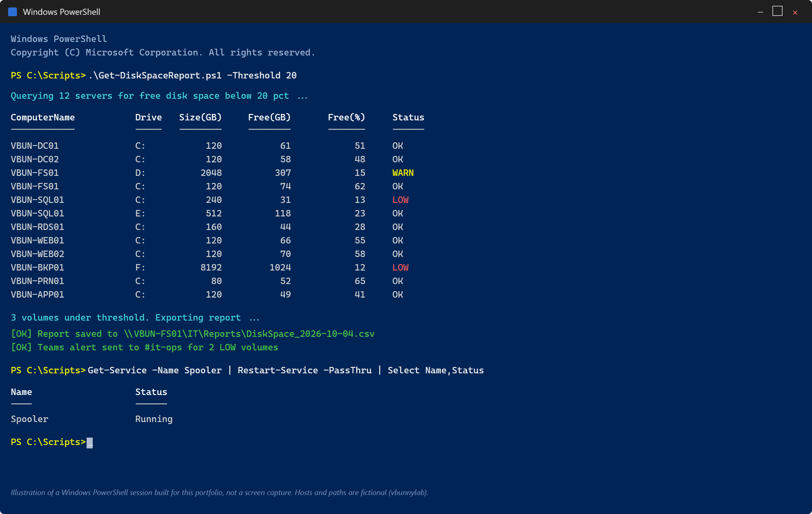

# PowerShell Fundamentals

PowerShell is the difference between doing something once and doing it to five hundred machines. It is also, in a security context, the thing attackers reach for most often, which makes reading it as well as writing it part of the job.

This document covers the language itself. For applied Active Directory automation, see [PowerShell Automation](Powershell-Automation.md).



*A real working session: a disk space report across every server, formatted output, then exporting the result and alerting on the volumes that are low.*

---

## Versions

| | Windows PowerShell 5.1 | PowerShell 7.x |
| --- | --- | --- |
| Ships with | Every Windows install | Separate download |
| Runtime | .NET Framework | .NET (cross-platform) |
| Platforms | Windows only | Windows, macOS, Linux |
| Updates | Security fixes only | Actively developed |
| `ActiveDirectory` module | Native | Works via compatibility layer |

Both are installed side by side. `powershell.exe` is 5.1, `pwsh.exe` is 7. Scripts that must run on any Windows host without prerequisites should target **5.1**, because it is guaranteed to be there. Everything in this repository is written against 5.1 for that reason.

```powershell
$PSVersionTable
```

Install 7.x from the [official releases page](https://github.com/PowerShell/PowerShell/releases), take the `.msi` for x64, and pair it with VS Code plus the PowerShell extension.

---

## The Core Idea: Objects, Not Text

This is the concept everything else rests on. Unix shells pipe **text** between commands, so you parse strings with `awk` and `sed`. PowerShell pipes **objects** with typed properties.

```powershell
Get-Process | Where-Object WorkingSet -gt 100MB | Select-Object Name, Id, WorkingSet
```

Nothing is being string-matched. `WorkingSet` is an actual number being compared numerically, which is why `100MB` works as a literal.

```powershell
Get-Process | Get-Member            # what properties and methods exist?
Get-Process | Select-Object -First 1 | Format-List *
```

**`Get-Member` is the most useful cmdlet in PowerShell.** When you do not know what you can do with something, pipe it there and read what comes back.

### Discovery

```powershell
Get-Command -Noun Service              # everything that acts on services
Get-Command -Module ActiveDirectory
Get-Help Get-ADUser -Full
Get-Help Get-ADUser -Examples          # usually the fastest route
Update-Help                            # once, elevated
```

Cmdlets follow `Verb-Noun` with an approved verb list (`Get-Verb`). Once you know the pattern, `Get-`, `Set-`, `New-`, `Remove-`, `Test-` against a noun is a reasonable guess and is usually right.

---

## Variables

```powershell
$name    = 'VBunny'                 # string
$count   = 42                       # int
$enabled = $true                    # bool
$today   = Get-Date                 # DateTime object
$users   = Get-LocalUser            # collection

$name.GetType().Name                # what am I actually holding?
[int]$number = 10                   # typed; assigning a string now fails
```

**Single vs double quotes matters.** Single quotes are literal; double quotes expand variables:

```powershell
$user = 'ballen'
'Hello $user'                       # Hello $user
"Hello $user"                       # Hello ballen
"Upper: $($user.ToUpper())"         # subexpression for anything beyond a bare variable
```

The `$( )` subexpression is needed whenever you want a property or method call inside a string. `"$user.Length"` gives `ballen.Length`, not `6`.

### Automatic Variables

| Variable | Holds |
| --- | --- |
| `$_` / `$PSItem` | Current pipeline object |
| `$?` | Did the last command succeed |
| `$LASTEXITCODE` | Exit code of the last native executable |
| `$Error` | Array of recent errors, newest first |
| `$null` | Nothing |
| `$PSScriptRoot` | Directory of the running script |
| `$env:COMPUTERNAME` | Environment variables live under `$env:` |

> **Variable names are case-insensitive.** `$Count` and `$count` are the same variable. This is a genuine source of bugs when a short lowercase name silently overwrites something set earlier in the script.

---

## Operators

```powershell
5 -eq 5        # equal                 -ne  not equal
5 -gt 3        # greater than          -lt  less than
5 -ge 5        # greater or equal      -le  less or equal

'abc' -like    'a*'          # wildcard
'abc' -match   '^a.c$'       # regex, also populates $Matches
'a','b' -contains 'a'        # does the collection contain this
'a' -in @('a','b')           # is this in the collection

-not $true ; $true -and $false ; $true -or $false
```

> **`-eq` is case-insensitive by default.** Use `-ceq`, `-clike`, `-cmatch` when case matters. This trips people up in comparisons against usernames and paths.

---

## Arrays and Hashtables

```powershell
$servers = @('DC01', 'FILE01', 'WS11-01')
$servers[0]                          # DC01
$servers[-1]                         # WS11-01, last element
$servers += 'WS11-02'                # rebuilds the array; fine for small sets
$servers.Count
```

For anything large, `+=` on an array is quadratic because it copies the whole thing every time. Use a list:

```powershell
$list = New-Object System.Collections.Generic.List[string]
$list.Add('DC01')
```

Hashtables are key/value pairs, and are the backbone of splatting:

```powershell
$server = @{
    Name = 'DC01'
    IP   = '10.10.10.10'
    Role = 'AD DS, DNS, DHCP'
}

$server['Name']
$server.Name
$server.Keys
$server.ContainsKey('IP')

# [ordered] preserves insertion order, which matters when a human reads the output
$params = [ordered]@{ Name = 'Barry Allen'; Enabled = $true }
```

---

## The Pipeline

```powershell
Get-ChildItem C:\Logs |
    Where-Object { $_.LastWriteTime -lt (Get-Date).AddDays(-30) } |
    Sort-Object Length -Descending |
    Select-Object Name, Length, LastWriteTime -First 10
```

| Cmdlet | Does |
| --- | --- |
| `Where-Object` | Filters |
| `Select-Object` | Picks properties, `-First`/`-Last`, `-Unique` |
| `Sort-Object` | Orders |
| `Group-Object` | Buckets by a property |
| `Measure-Object` | Count, sum, average |
| `ForEach-Object` | Acts on each item |
| `Export-Csv` | Writes objects to CSV |

> **Filter left, format right.** Filter as early in the pipeline as possible, ideally with the cmdlet's own `-Filter` parameter, which pushes the work to the server rather than pulling everything back and discarding most of it. `Get-ADUser -Filter "Department -eq 'IT'"` is dramatically faster than `Get-ADUser -Filter * | Where-Object Department -eq 'IT'` in a large directory.

> **`Format-*` cmdlets end the pipeline.** `Format-Table` emits formatting instructions, not objects, so nothing useful can come after it. Use them last, never before `Export-Csv`.

---

## Flow Control

```powershell
if ($free -lt 10GB) {
    Write-Warning 'Low disk space'
} elseif ($free -lt 50GB) {
    Write-Host 'Getting tight'
} else {
    Write-Host 'Fine'
}

switch ($status) {
    'Running' { 'Service is up' }
    'Stopped' { 'Service is down' }
    default   { "Unexpected: $status" }
}

foreach ($server in $servers) {
    Write-Host "Checking $server"
}

# pipeline form, streams rather than loading everything first
$servers | ForEach-Object { Test-NetConnection $_ -Port 445 }
```

---

## Functions

```powershell
function Test-ServerHealth {
    <#
    .SYNOPSIS
        Reports reachability and uptime for one or more servers.
    .EXAMPLE
        'DC01','FILE01' | Test-ServerHealth
    #>
    [CmdletBinding()]
    param(
        [Parameter(Mandatory, ValueFromPipeline)]
        [string[]] $ComputerName,

        [ValidateRange(1, 300)]
        [int] $TimeoutSeconds = 5
    )

    process {
        foreach ($computer in $ComputerName) {
            $online = Test-Connection -ComputerName $computer -Count 1 -Quiet -ErrorAction SilentlyContinue

            [pscustomobject]@{
                ComputerName = $computer
                Online       = $online
                CheckedAt    = Get-Date
            }
        }
    }
}
```

What makes this a real function rather than a snippet:

- **`[CmdletBinding()]`** enables `-Verbose`, `-ErrorAction` and the rest of the common parameters for free
- **`[Parameter(Mandatory)]`** prompts rather than failing obscurely
- **`ValueFromPipeline`** plus a `process` block means it accepts pipeline input
- **`[ValidateRange]`** rejects bad input at the boundary instead of halfway through
- **Emitting `[pscustomobject]`** rather than `Write-Host` means the output can be filtered, sorted and exported

> **`Write-Host` writes to the screen and nothing else.** It cannot be captured, piped or redirected. Use `Write-Output` (or just emit the object) for data, `Write-Verbose` for progress, `Write-Warning` for problems. `Write-Host` is for deliberate console formatting only, such as the summary block at the end of a report script.

### Splatting

```powershell
$params = @{
    Name              = 'Barry Allen'
    SamAccountName    = 'ballen'
    UserPrincipalName = 'ballen@vbunnylab.local'
    Path              = 'OU=IT,OU=VBunnyLab,DC=vbunnylab,DC=local'
    Enabled           = $true
}
New-ADUser @params
```

Note the `@` rather than `$` at the call site. Splatting keeps long parameter lists readable and lets you build parameters conditionally before calling.

---

## Error Handling

```powershell
try {
    $user = Get-ADUser -Identity 'ballen' -ErrorAction Stop
    Write-Verbose "Found $($user.Name)"
}
catch [Microsoft.ActiveDirectory.Management.ADIdentityNotFoundException] {
    Write-Warning 'No such user'
}
catch {
    Write-Error "Unexpected: $($_.Exception.Message)"
}
finally {
    Write-Verbose 'Done'
}
```

> **`try/catch` only catches *terminating* errors.** Most cmdlets raise non-terminating errors by default, which sail straight past `catch`. **`-ErrorAction Stop` is what makes the catch block work.** This is the single most common PowerShell error-handling mistake.

```powershell
$ErrorActionPreference = 'Stop'      # script-wide; use deliberately
$Error[0] | Format-List * -Force     # full detail on the last error
```

> Setting `$ErrorActionPreference = 'Stop'` also makes a native executable writing to stderr abort the script, even when it exited successfully. Wrap external commands, or reset the preference around them.

### Safety Rails

```powershell
function Remove-StaleProfile {
    [CmdletBinding(SupportsShouldProcess, ConfirmImpact = 'High')]
    param([Parameter(Mandatory)][string] $Path)

    if ($PSCmdlet.ShouldProcess($Path, 'Remove profile directory')) {
        Remove-Item $Path -Recurse -Force
    }
}
```

`SupportsShouldProcess` gives the function `-WhatIf` and `-Confirm` at no cost. **Any script that deletes, disables or modifies should support `-WhatIf`.** Running a bulk operation against production without a dry run first is how outages start.

---

## Credentials

Never put a password in a script.

```powershell
# prompt at runtime
$cred = Get-Credential

# prompt for just a password
$securePw = Read-Host 'Password' -AsSecureString

# for unattended work, store encrypted to the running user and machine
$cred.Password | ConvertFrom-SecureString | Set-Content .\cred.txt
$secure = Get-Content .\cred.txt | ConvertTo-SecureString
$cred   = New-Object System.Management.Automation.PSCredential('VBUNNYLAB\svc-task', $secure)
```

`ConvertFrom-SecureString` uses DPAPI, so the file can only be decrypted by the **same user on the same machine**. That is a real boundary, but it is not a secrets manager: anyone who compromises that account on that host can decrypt it. For anything beyond a lab, use a group Managed Service Account (gMSA) so there is no password to store at all.

```powershell
# a plaintext password in a script is readable by anyone who can read the file,
# and ends up in source control, backups and transcripts
$bad = ConvertTo-SecureString 'Passw0rd!' -AsPlainText -Force   # don't
```

---

## Common Tasks

```powershell
# files
Get-ChildItem C:\Logs -Recurse -Filter *.log |
    Where-Object Length -gt 10MB |
    Sort-Object Length -Descending

New-Item -Path C:\Temp\report.txt -ItemType File -Force
Get-Content C:\Temp\report.txt -Tail 20 -Wait          # like tail -f
Remove-Item C:\Temp\old -Recurse -Force -WhatIf        # dry run first

# export for a ticket or a report
Get-Service | Where-Object Status -eq 'Running' |
    Select-Object Name, DisplayName, StartType |
    Export-Csv .\services.csv -NoTypeInformation

# network
Test-NetConnection dc01.vbunnylab.local -Port 389
Resolve-DnsName vbunnylab.local

# remote
Invoke-Command -ComputerName DC01, FILE01 -ScriptBlock { Get-Service Spooler }
Enter-PSSession -ComputerName DC01

# events
Get-WinEvent -FilterHashtable @{ LogName = 'Security'; ID = 4625 } -MaxEvents 20
```

> `Get-WinEvent -FilterHashtable` filters at the source. `Get-WinEvent -LogName Security | Where-Object Id -eq 4625` pulls the entire log across the wire first and can take minutes on a busy domain controller.

---

## Reading PowerShell, Not Just Writing It

PowerShell is the most common post-exploitation tool on Windows, which means recognising hostile scripts is a working skill.

Markers worth knowing on sight:

```powershell
-EncodedCommand <base64>      # obfuscated payload; decode before judging
-ExecutionPolicy Bypass       # execution policy is not a security boundary
-WindowStyle Hidden           # no console for the user to see
-NoProfile                    # skips profile scripts that might log or interfere
IEX (New-Object Net.WebClient).DownloadString('http://...')   # fileless download-and-run
FromBase64String              # decoding an embedded payload
```

Decode a captured encoded command rather than guessing at it:

```powershell
$b64 = '<base64 string from the log>'
[Text.Encoding]::Unicode.GetString([Convert]::FromBase64String($b64))
```

**Execution policy is not a security control.** Microsoft is explicit about this: it prevents accidental execution, and is bypassed with a single flag. Real controls are script block logging, constrained language mode, application control (WDAC/AppLocker) and code signing.

Enable the logging that makes this visible:

```powershell
# Event 4104 captures deobfuscated script block content, often the only
# record of what actually ran
Get-WinEvent -FilterHashtable @{ LogName = 'Microsoft-Windows-PowerShell/Operational'; ID = 4104 } -MaxEvents 20 |
    Select-Object TimeCreated, Message
```

Script block logging is configured under **Computer Configuration > Administrative Templates > Windows Components > Windows PowerShell > Turn on PowerShell Script Block Logging**. The baseline audit in [Security/tools](../Security/tools/) checks for it.

---

## Practices Worth Keeping

- **Full cmdlet names in scripts, aliases only when typing interactively.** `Remove-Item` reads clearly in six months; `ri` does not.
- **Emit objects, not formatted text.** It keeps the output usable by whatever comes next.
- **`-WhatIf` on anything destructive**, and run it first.
- **Comment-based help on every function.** It turns `Get-Help` into real documentation.
- **Filter at the source**, with `-Filter` rather than `Where-Object`, wherever the cmdlet supports it.
- **Never hardcode credentials.**
- **Test against one object before running against all of them.**
- **Keep scripts ASCII where possible.** Windows PowerShell 5.1 reads `.ps1` files as ANSI unless they carry a UTF-8 BOM, so a stray smart quote or dash breaks parsing on someone else's machine.
