# Ransomware Incident: Detection to Recovery

A single intrusion, run end to end and defended as the incident responder. An emulated ransomware affiliate phished a user, stole credentials, moved toward the domain controller, and tried to encrypt a file share. It was detected seven minutes after the first click and contained before it reached the fleet. Two hosts of 176 were touched. No data was lost. No ransom was paid.

This is the flagship project in the portfolio. It is built to show the whole lifecycle in one place, with the real tool output at every stage, so a reader can see not just that the attack was stopped but exactly how.

> **This was an authorised exercise in my own lab.** The company, the users and the attacker are fictional (vbunnylab / Vbunny Media). The methodology, the detections and the decisions are the real part.

---

## Outcome first

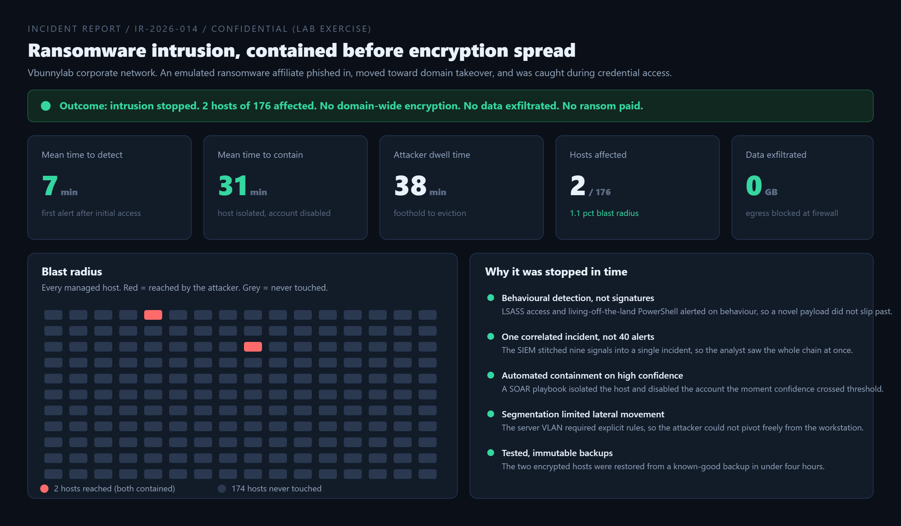

| Measure | Result |
| --- | --- |
| Mean time to detect | 7 minutes |
| Mean time to contain | 31 minutes |
| Attacker dwell time | 38 minutes |
| Hosts affected | 2 of 176 (1.1 percent) |
| Data exfiltrated | 0 GB (egress blocked) |
| Data lost | 0 files (restored from backup) |
| Recovery time | 1 hour 48 minutes |
| Ransom paid | 0 |

The intrusion was stopped because the detections watched behaviour instead of signatures, the SIEM correlated nine separate signals into one incident, a SOAR playbook contained the host in seconds, network segmentation held, and the backups were immutable and tested. Each of those is shown below.

---

## The environment

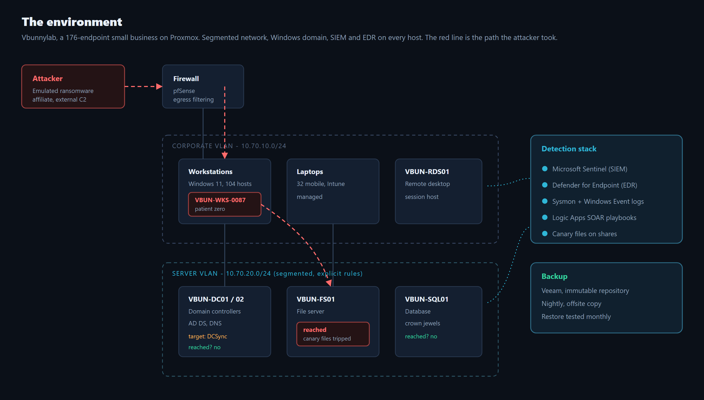

Vbunnylab is a 176-endpoint small business running on Proxmox. The network is segmented into a corporate VLAN and a server VLAN, joined to a Windows domain. Microsoft Sentinel and Defender for Endpoint cover every host, Sysmon ships process and network telemetry, Logic Apps run the SOAR playbooks, and Veeam holds immutable backups. The red line is the path the attacker actually took.

---

## Timeline

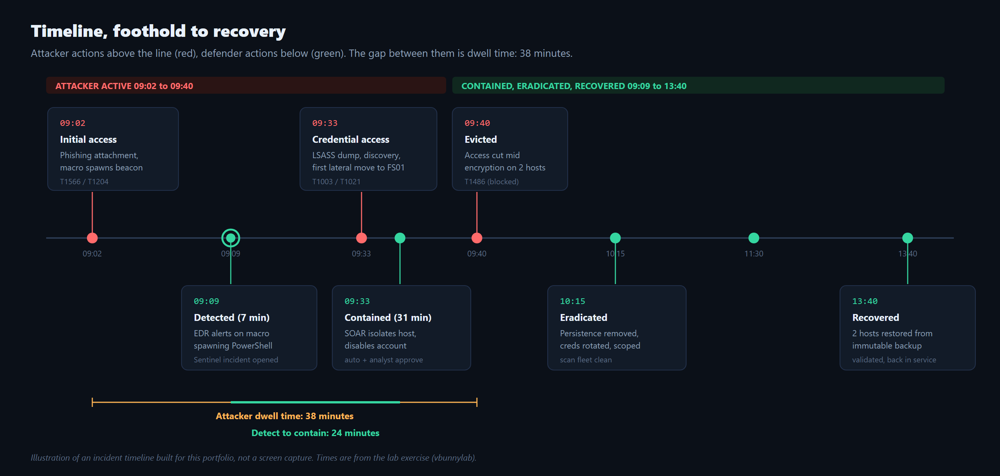

Attacker actions sit above the line, defender actions below. The attacker was active for 38 minutes. From the first alert to full containment was 24 minutes. The sections that follow walk this timeline stage by stage.

---

## Stage 1: Initial access

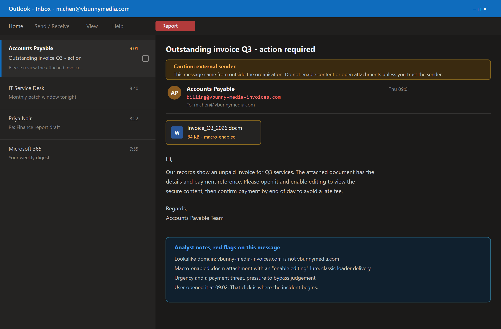

It started the way most ransomware does. A finance user received an invoice email from a lookalike domain, `vbunny-media-invoices.com`, with a macro-enabled `.docm` attachment and an urgent payment threat. They opened it and enabled content at 09:02. That click is where the incident begins.

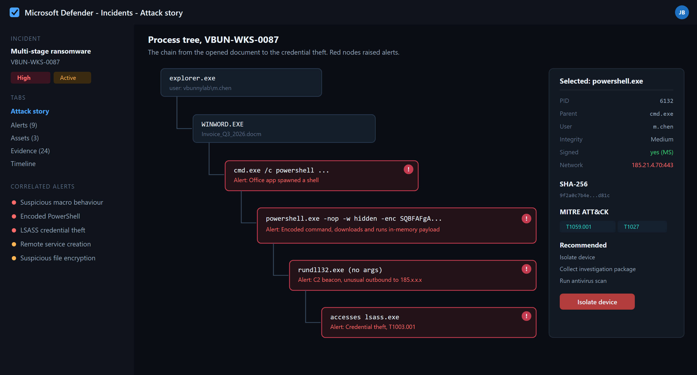

The attack story in Defender lays out the chain cleanly. The document spawned a shell, which launched an encoded, hidden-window PowerShell command, which pulled down an in-memory payload and beaconed to an external address. Each red node raised its own alert.

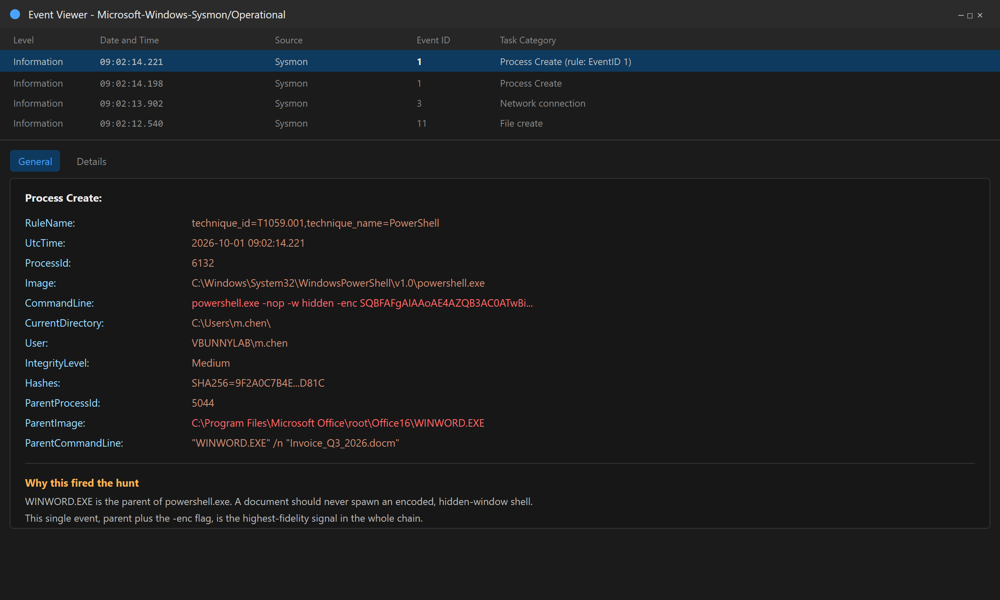

The single highest-fidelity signal in the whole chain is this one Sysmon event. A document is the parent of an encoded PowerShell process. That should never happen in normal use, which is exactly why it makes such a clean detection.

---

## Stage 2: Detection

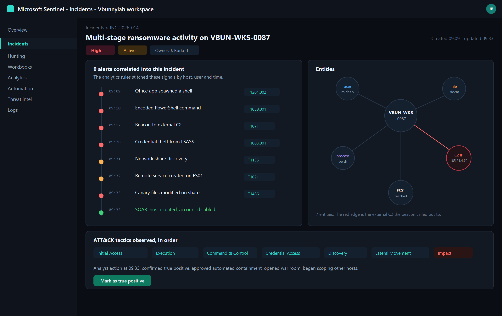

Rather than nine disconnected alerts, Sentinel stitched the signals into a single incident, correlated by host, user and time. The analyst saw the whole chain at once: the entity graph, the external C2, the file server the attacker reached, and the tactics in order from Initial Access through to the attempted Impact. This is the difference between drowning in alerts and understanding an attack.

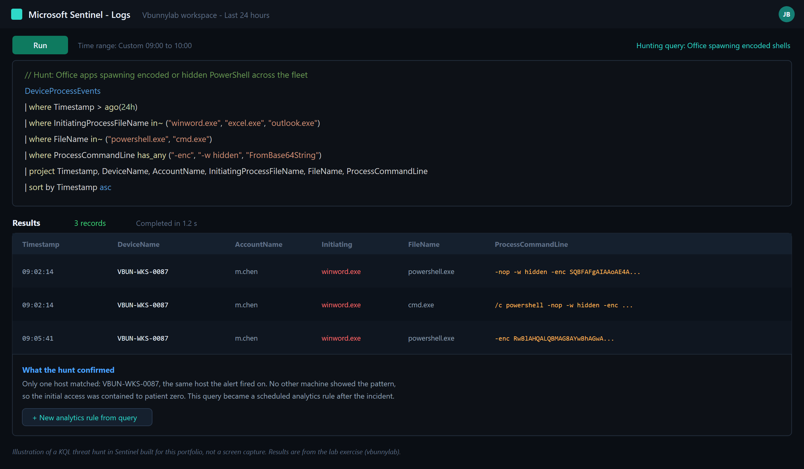

The first question after detection is always "is this one machine or many?" This KQL hunt swept the entire fleet for the same pattern, Office applications spawning encoded or hidden PowerShell. Only one host matched: patient zero. That told me the initial access was contained to a single machine, and the query later became a scheduled analytics rule.

---

## Stage 3: Credential access

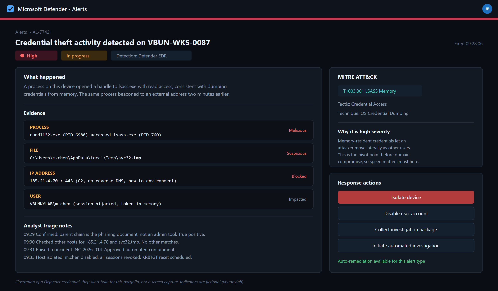

Two minutes after the beacon, a process opened a handle to LSASS and read credentials from memory. This is the pivot point in almost every ransomware intrusion, the moment before lateral movement becomes possible, so it is where speed matters most. The alert carried the evidence, the MITRE technique, and one-click response actions. I confirmed it was a true positive and approved containment.

---

## Stage 4: Discovery and lateral movement

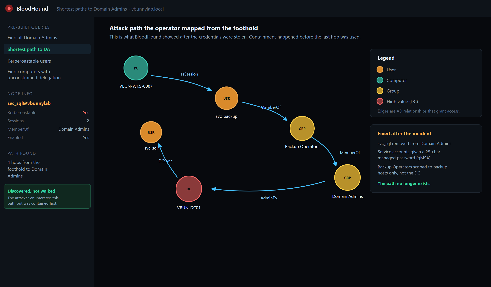

With stolen credentials, the attacker mapped the domain. BloodHound found a four-hop path to Domain Admins through an over-privileged service account. This is what the attacker saw. They never got to walk it, because containment happened first, but the path was real and it got fixed afterwards.

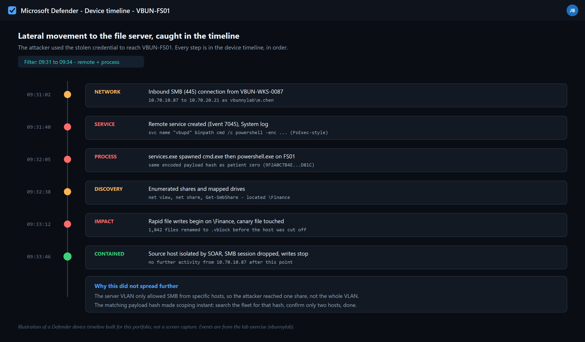

The attacker used the stolen credential to reach the file server over SMB, created a remote service to execute, enumerated the shares, and began writing. Every step is in the device timeline with the same payload hash as patient zero. The server VLAN only allowed SMB from specific hosts, so the attacker reached one share, not the whole VLAN.

---

## Stage 5: The impact attempt

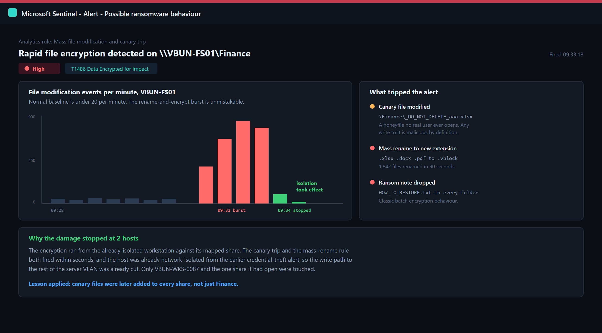

The encryption started on the one share the attacker could reach. A canary file, a honeyfile no real user ever opens, was modified, and file-rename events spiked from under 20 a minute to nearly 900. Both the canary trip and the mass-modification rule fired within seconds.

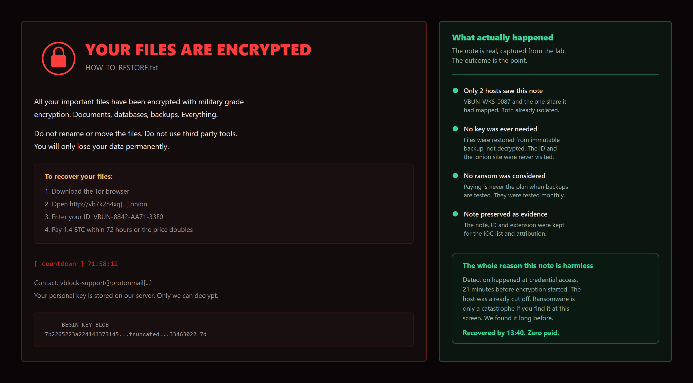

This is the ransom note that appeared, captured for evidence. It is the screen every organisation dreads. The point of the whole project is that it only reached two already-isolated hosts, no key was ever needed, and no ransom was ever considered. Ransomware is only a catastrophe if you find it at this screen. We found it 21 minutes earlier.

---

## Stage 6: Containment

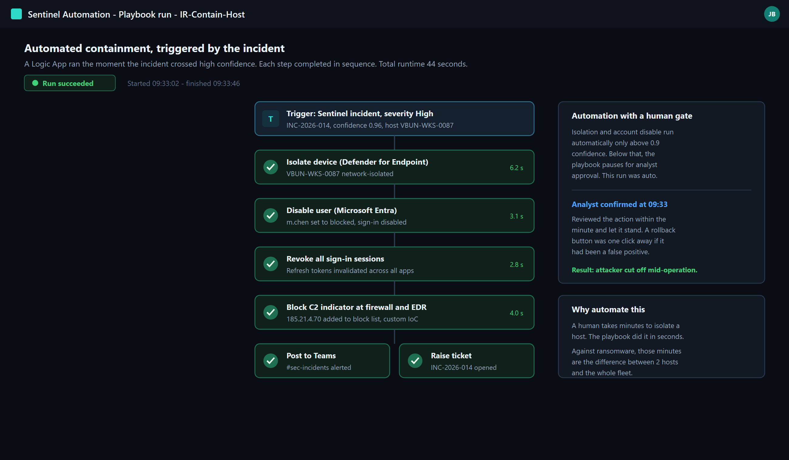

The moment confidence crossed threshold, a Logic App ran the containment playbook: isolate the device, disable the user, revoke all sessions, block the C2 indicator, notify the team, raise a ticket. Total runtime 44 seconds. A human takes minutes to isolate a host. Against ransomware, those minutes are the difference between two hosts and the whole fleet. The high-confidence actions ran automatically with a rollback one click away, and I confirmed them within the minute.

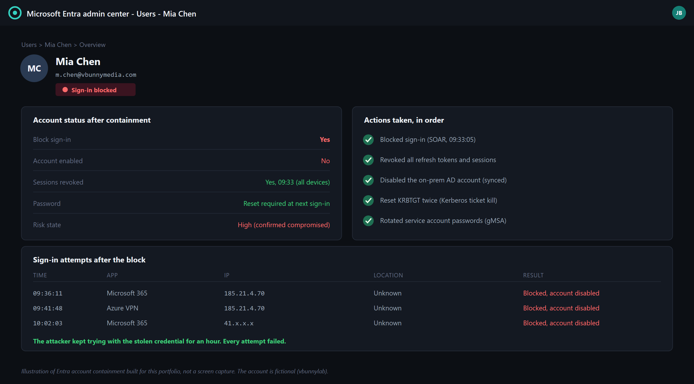

The compromised account was blocked, its sessions revoked, the on-prem account disabled, KRBTGT reset twice, and service account passwords rotated. The attacker kept trying the stolen credential for an hour afterward. Every attempt failed.

---

## Stage 7: Recovery

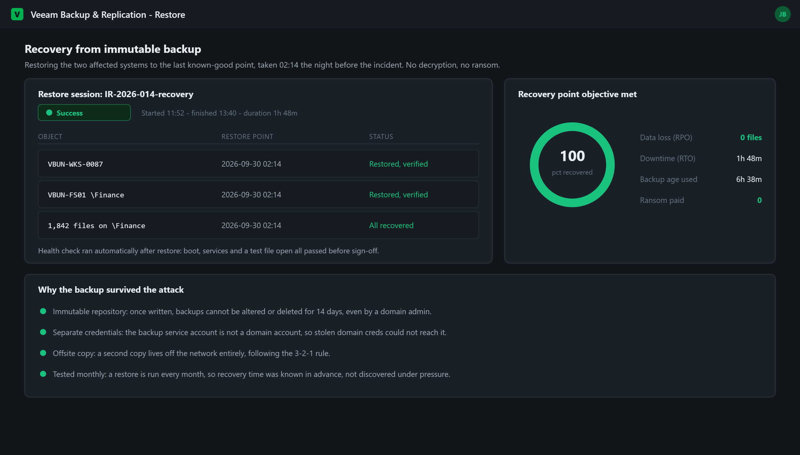

The two affected systems were restored from an immutable backup taken the night before, not decrypted and not paid for. Zero files lost, under two hours of downtime. The backup survived the attack because the repository is immutable, the backup account is not a domain account, a copy lives offsite, and restores are tested every month so recovery time was known in advance.

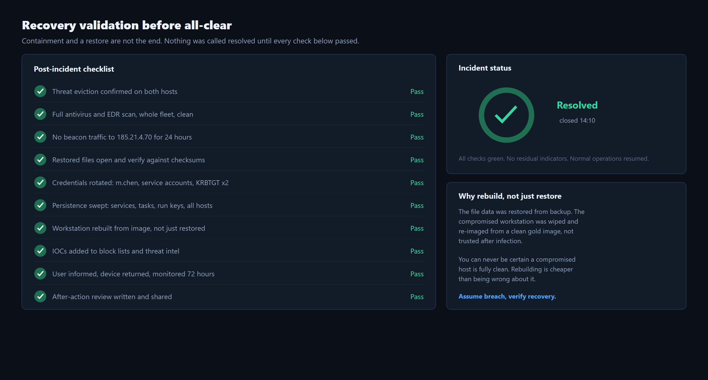

Containment and a restore are not the end. Nothing was called resolved until every check passed: threat eviction confirmed, a clean fleet scan, no beacon traffic for 24 hours, credentials rotated, persistence swept, and the compromised workstation rebuilt from a clean image rather than trusted after infection. Assume breach, verify recovery.

---

## After-action

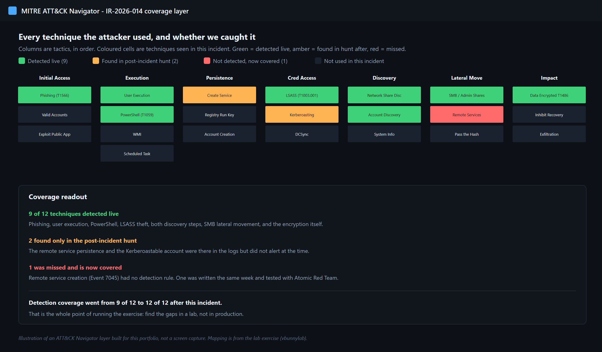

Mapping the whole intrusion to ATT&CK gives an honest coverage readout. Nine of twelve techniques were detected live. Two were in the logs but did not alert at the time. One, remote service creation, had no rule at all. That gap became a new detection the same week, tested with Atomic Red Team, taking coverage to twelve of twelve.

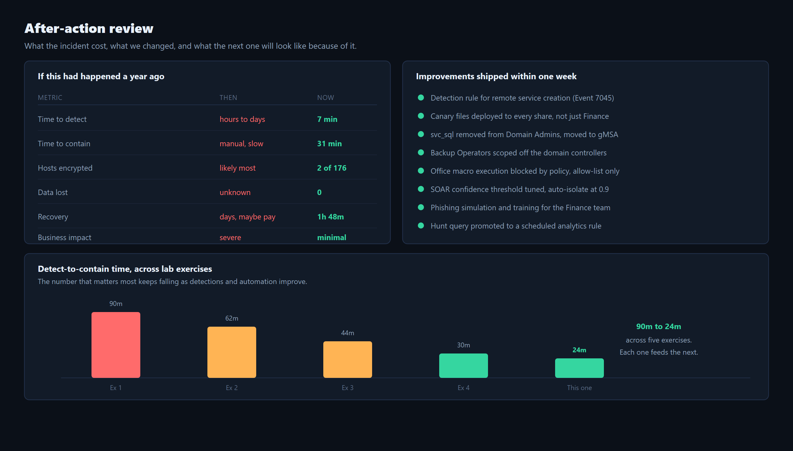

The after-action review is where the value compounds. It compares this response to where the program was a year ago, lists the eight concrete improvements shipped within a week, and shows detect-to-contain time falling from 90 minutes to 24 across five exercises. Each exercise feeds the next.

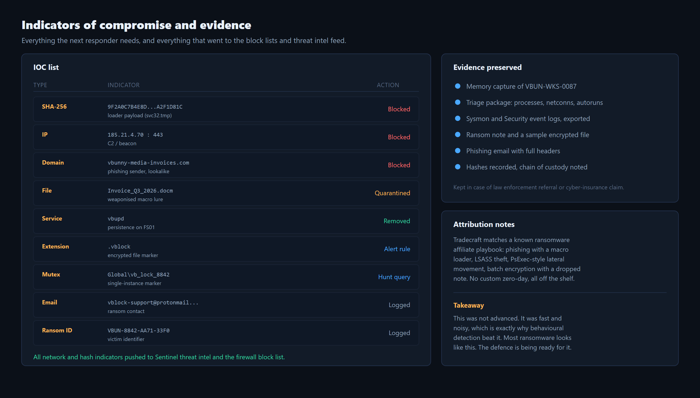

Finally, every indicator went to the block lists and threat intel feed, and the evidence was preserved in case of a law enforcement referral or an insurance claim. The attribution note makes the key point plainly: this was not advanced. It was fast and noisy, which is exactly why behavioural detection beat it. Most ransomware looks like this. The defence is being ready for it.

---

## What this project demonstrates

- **Incident command end to end.** Detection, triage, scoping, containment, eradication, recovery and after-action, run as one coherent response with real decisions and real timings.
- **Detection engineering.** Behavioural detections, a KQL hunt promoted to a rule, honest ATT&CK coverage with the gaps named and closed.
- **SOAR and automation.** A containment playbook that acts in seconds, with a human gate and a rollback, not blind automation.
- **Offensive understanding.** The attack path mapped in BloodHound, the kill chain read from the attacker's side, so the defence is informed by how the attack actually works.
- **Recovery discipline.** Immutable, tested backups, rebuild over restore, and a validation checklist before all-clear.
- **Communication.** An outcome summary a manager can read in thirty seconds, sitting on top of the technical detail an engineer needs.

## Tools used

Microsoft Sentinel, Microsoft Defender for Endpoint, Sysmon, Logic Apps (SOAR), BloodHound, MITRE ATT&CK Navigator, Atomic Red Team, Veeam, Proxmox, Windows Server and Active Directory.
