# PT-03: Red Team Operation and Adversary Emulation

**Role target:** Senior Penetration Tester, Red Team Operator, Red Team Lead
**Theme:** Stop testing for vulnerabilities. Emulate a real adversary, quietly, and measure whether the defence can see you.
**Environment:** The same self-owned Proxmox lab the SOC projects defend, `vbunnylab.local`, run as an authorised red team engagement
**Scored against:** My own blue-team detections in [SOC-01](../Junior-SOC-Analyst/), [SOC-03](../SOC-Analyst-2/) and [SOC-04](../SOC-Analyst-3/)

> Everything in this folder is a lab I own and built. No real company, person or data is involved, and nothing here is a weapon. The tools and techniques are described at the level a report describes them, not as working code. The whole point of this engagement is defensive: emulate an adversary to find where the detection is blind, then fix it.

---

## Authorisation And Intent

This is an authorised red team engagement against infrastructure I own. Every host, account and service belongs to me and runs on my own hardware. The emulation is of a threat actor's behaviour, not a real intrusion against a real target, and its purpose is to improve the defence.

**This folder contains no malware, no working evasion code and no operational payloads.** It describes methodology the way a professional report does, so a hiring manager can see I understand red team operations and, just as importantly, that I understand the responsibility that comes with them. A red team operator who cannot be trusted is not employable no matter how good the tradecraft.

The engagement was run with deconfliction in mind: the blue team, which is me wearing the other hat from the SOC projects, knew an exercise was possible but not when or how. That is what makes the detection scores in this folder honest.

---

## What A Red Team Operator Does Differently

This is the top of the offensive ladder in this portfolio. A junior tester follows a methodology. A penetration tester scopes and chains vulnerabilities. A red team operator emulates a specific adversary against a defended environment, stays quiet, and measures the defence.

| | PT-01 Junior | PT-02 Pentester | **PT-03 Red Team, this project** |
| --- | --- | --- | --- |
| Goal | Find vulnerabilities | Chain them to impact | **Emulate an adversary and test the defence** |
| Scope | Given a position | Full scope, loud is fine | **Objective-based, stealth is the point** |
| Measure of success | Findings | Domain Admin | **Dwell time before detection** |
| The defence | Not considered | Noted afterward | **The whole target of the exercise** |
| Tooling | Standard tools | Standard tools | **C2, redirectors, emulation of real TTPs** |
| Deliverable | A findings report | A business report | **A detection improvement plan** |

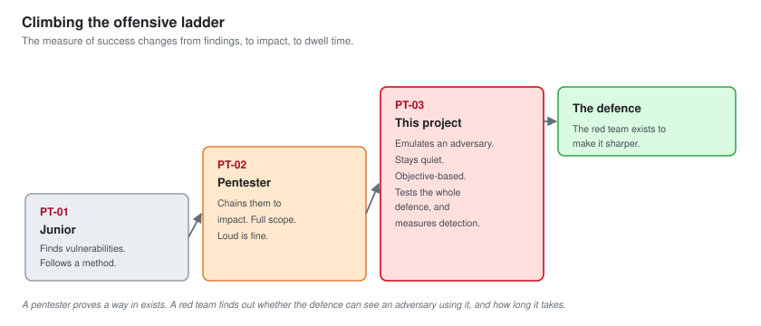

---

## Objective-Based, Not Vulnerability-Based

A penetration test asks "what is broken". A red team operation asks "can a real adversary achieve their goal before we catch them". The difference changes everything about how the work is run.

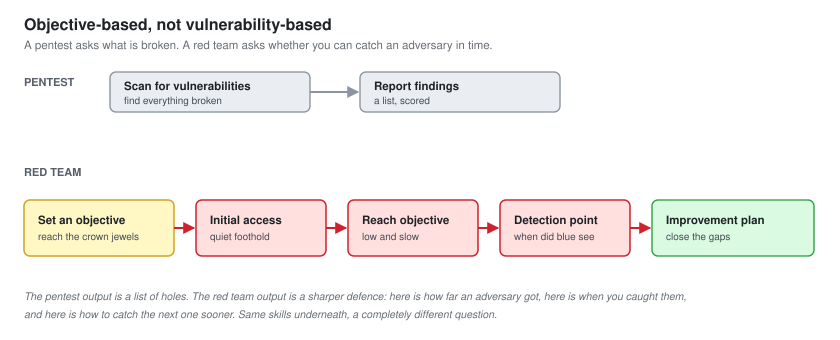

The objective for this operation, agreed in advance, was to reach the customer database and demonstrate the staging a ransomware affiliate would do before encryption, while staying under the detection threshold for as long as possible. Not to cause damage. To find out how far an adversary gets, and when the defence notices.

---

## Emulating A Real Adversary

A red team is only useful if it behaves like the threat the organisation actually faces. This operation emulated a financially motivated ransomware affiliate: the most likely real threat to a small retailer like the lab models.

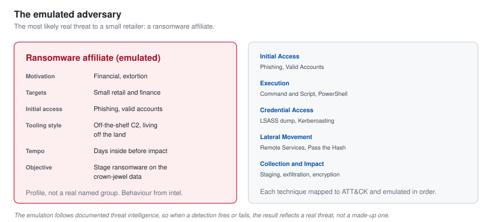

The actor's known behaviour, drawn from threat intelligence in the same [OpenCTI](../SOC-Analyst-3/) platform the blue side runs, was mapped to ATT&CK and emulated technique by technique. This is adversary emulation, not improvisation: the operation follows what the real actor is documented to do, so the detection results mean something.

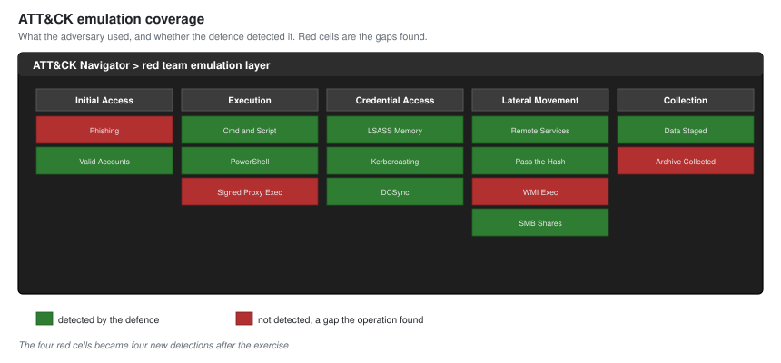

---

## The Command And Control Infrastructure

A red team operates through infrastructure built to survive discovery and to look like normal traffic. The point of describing it here is not the setup, it is the tradecraft, because every choice is also a detection opportunity for the blue team.

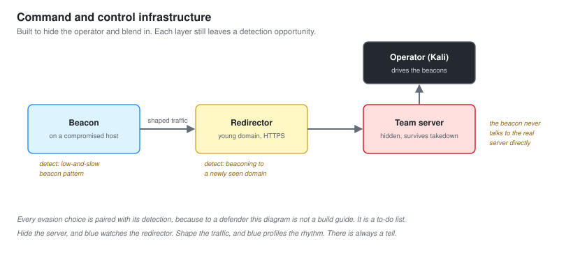

| Choice | Why the operator does it | How blue should catch it |
| --- | --- | --- |
| Redirectors in front of the C2 | Hide the real server, survive takedown | Watch for beaconing to young domains |
| A malleable profile mimicking normal web traffic | Blend the beacon into ordinary noise | Profile the regularity, jitter still shows |
| Long beacon sleep with jitter | Stay under volume-based detection | Hunt on low-and-slow connection patterns |
| Living off the land, built-in tools | Avoid dropping files that get flagged | Behavioural detection, not file signatures |

**Every evasion choice is paired with its detection.** That pairing is the entire value of a red team to a defender. The table above is not a how-to for hiding. It is a to-do list for the blue team, and that is how it is presented in the report.

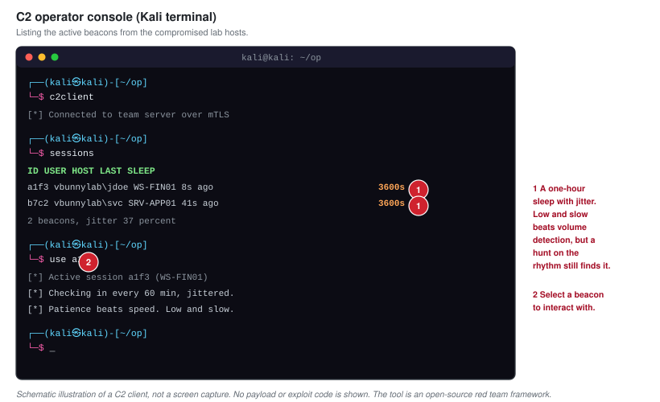

---

## The Operation

The operation ran over several days, deliberately slowly, because speed is what gets an adversary caught. This is the path from initial access to the objective, with the point where the defence first noticed it marked.

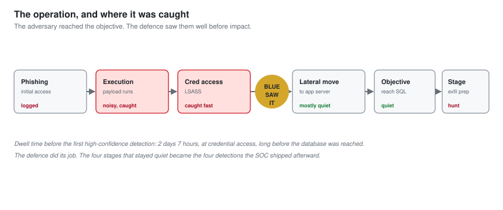

### Initial Access

Access was gained through a simulated phishing campaign against lab accounts, tracked in a phishing framework. In a real engagement this is the most sensitive phase and the most tightly scoped. Here, the targets were my own lab identities.

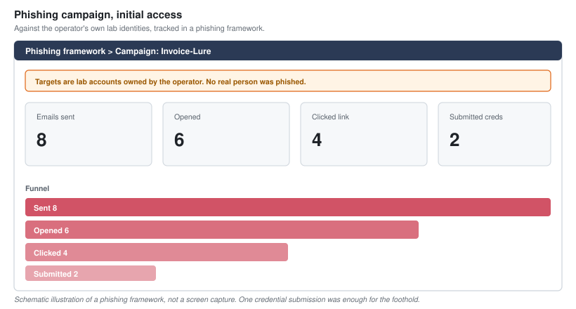

### Working The Beacon

Once a foothold was established, the operation proceeded through a beacon: enumerate quietly, escalate, move laterally, and reach the objective, all while keeping the traffic low and slow.

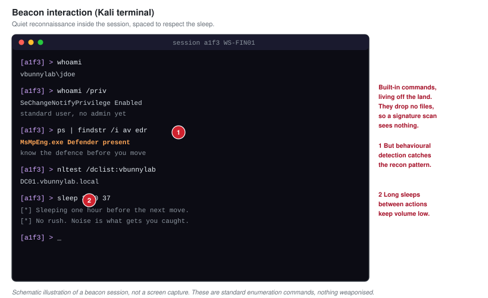

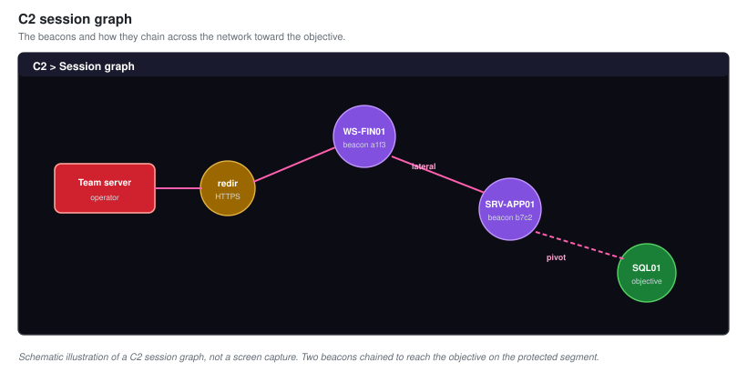

---

## Defense Evasion, Paired With Detection

A red team operator knows how defences work in order to test them, and the honest way to document evasion is alongside the detection that beats it. This is not a catalogue of tricks. It is a map of where this defence was blind and how to fix it.

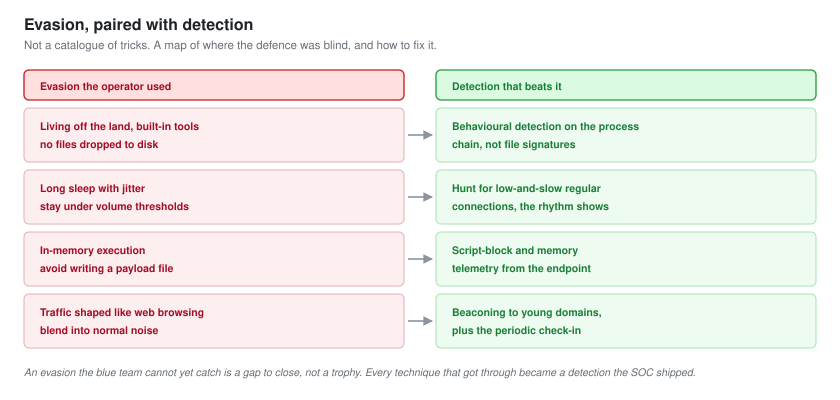

The guiding honesty: an evasion that the blue team cannot yet catch is a gap to be closed, not a trophy. Every technique that got through became a detection the SOC shipped afterward.

---

## The Purple Team Scorecard

This is the result that matters, and it is what makes the whole portfolio join up. The operation was scored against the detections I built in the blue-team projects. How far did the adversary get, and when did the defence see it.

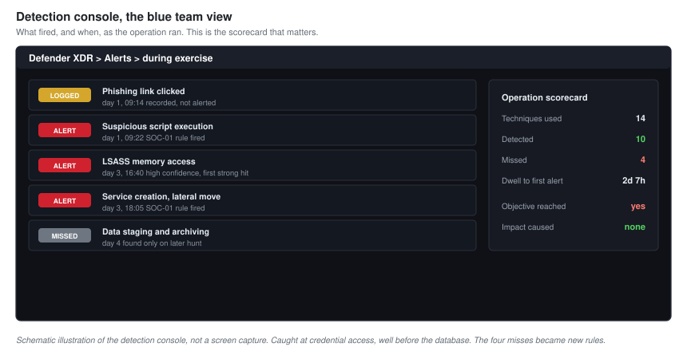

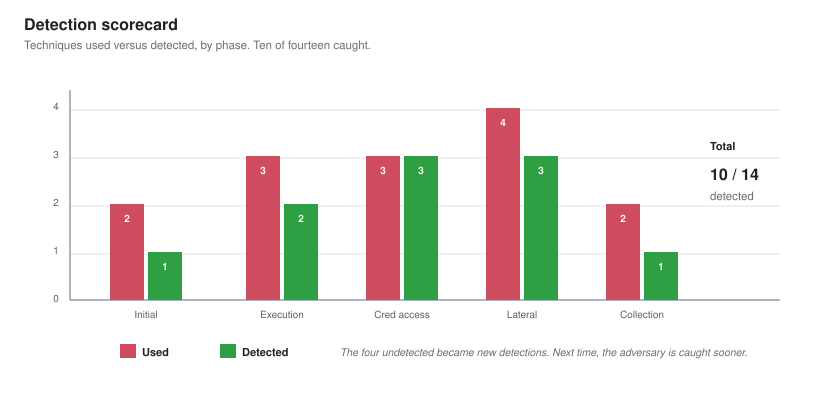

| Phase | TTPs used | Detected | First detection |
| --- | --- | --- | --- |
| Initial access | 2 | 1 | Phishing link click, logged not alerted |
| Execution | 3 | 2 | Suspicious script, SOC-01 rule |
| Credential access | 3 | 3 | LSASS access, caught fast |
| Lateral movement | 4 | 3 | Service creation, SOC-01 rule |
| Collection and staging | 2 | 1 | Large internal transfer, hunt only |
| **Total** | **14** | **10 of 14** | **Dwell time: 2 days 7 hours** |

**The adversary reached the objective, and the defence caught them before impact.** Ten of fourteen techniques were detected, and the first high-confidence detection came at the credential access stage, well before the database was reached. The four that got through are the deliverable: each became a new detection, closing the gap for the next real adversary.

### Deconfliction With The Blue Team

A red team operation that burns the blue team's time chasing a ghost is a failure. Deconfliction is the discipline of coordinating so that when blue detects something, they can confirm whether it is the exercise or a real intrusion, without the red team tipping their hand prematurely.

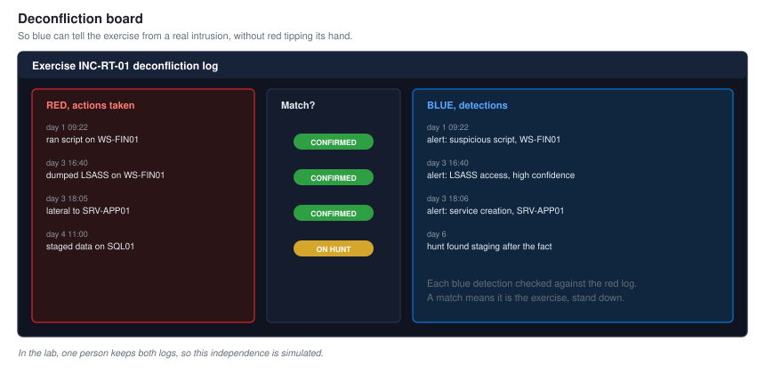

---

## Reporting To Executives

The final deliverable is not a list of techniques. It is a story a board can act on: an adversary like the ones targeting your industry got this far, you caught them here, and here is what to fix so next time you catch them sooner.

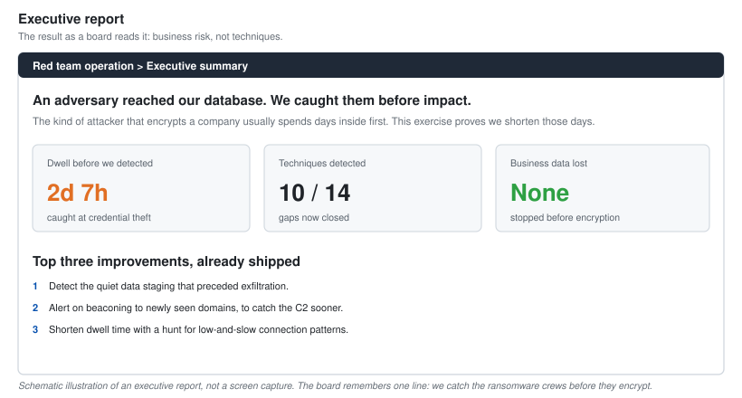

The headline a board remembers: the attack that encrypts a company usually spends days inside first. This exercise proves the defence shortens those days, and the detection improvements shorten them further. That is reliability against the single threat most likely to put a small retailer out of business.

---

## Metrics And Maturity

The measure of a red team program is not whether it gets in. A good red team always gets in eventually. The measure is whether the defence detects faster over time: dwell time falling exercise after exercise.

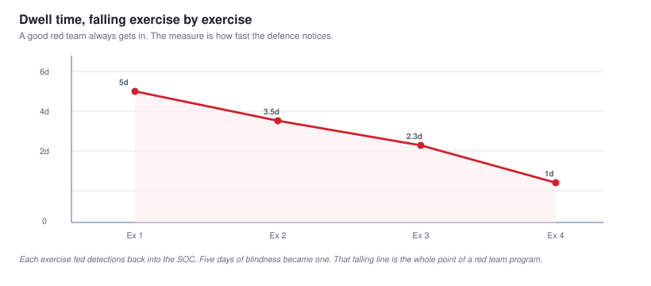

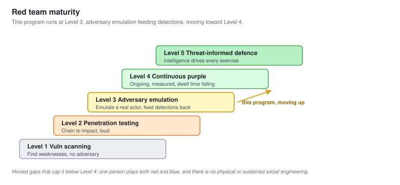

This program operates at Level 3, emulating specific adversaries and feeding detections back. The honest gaps: it is one person playing both sides, so the deconfliction is simulated, and there is no physical or sustained social engineering, which a full-scope real red team would include.

---

## Skills This Demonstrates

| Area | Evidence |
| --- | --- |
| Adversary emulation | A specific threat actor emulated technique by technique, mapped to ATT&CK |
| Red team operations | Objective-based engagement, C2, redirectors, OPSEC, long-haul tradecraft |
| Evasion, understood defensively | Every technique paired with the detection that beats it |
| Purple teaming | The operation scored against a real detection program, gaps closed |
| Both sides of the fence | Red team scored against blue team detections I built myself |
| Executive communication | A report that frames the result as business risk and reliability |
| Professional conduct | Authorised, deconflicted, non-destructive, prove not cause |
| Program thinking | Dwell time as the metric, maturity measured over exercises |

---

## The Whole Portfolio, Joined Up

This is the capstone of the offensive side, and it closes the loop on everything else here. The same person who built the detections in [SOC-01](../Junior-SOC-Analyst/) and [SOC-03](../SOC-Analyst-2/), ran the SOC as a function in [SOC-04](../SOC-Analyst-3/), and kept the network reliable in [NOC-03](../NOC-Analyst-3/) also ran the red team that tested all of it.

**That is the argument the portfolio makes.** Not "I can attack" or "I can defend", but "I understand both well enough that each makes the other sharper". A defender who has operated as an adversary builds better detections. An operator who has built detections knows exactly what to avoid, and exactly what to recommend fixing.

---

## Honest Notes

**It is one person playing both sides.** The deconfliction, the blue team's surprise, and the independence of the detection scoring are all limited by the fact that I knew both the attack and the defence. I have been as honest as I can about which detections fired on their own merits, but a real red team is independent of the blue team, and that independence is something a lab cannot fully reproduce.

**Nothing here is weaponised.** The C2, the evasion and the payloads are described, not provided. That is deliberate and it is the correct way to present this work. The skill being demonstrated is operating a red team responsibly, and responsibility includes not publishing a toolkit.

**The adversary was emulated, not real.** The TTPs follow documented threat intelligence, but a real actor adapts in ways an emulation does not. The method, the OPSEC discipline, and the pairing of every technique with its detection are what carry over.

---

Back to the [portfolio home](../README.md).
