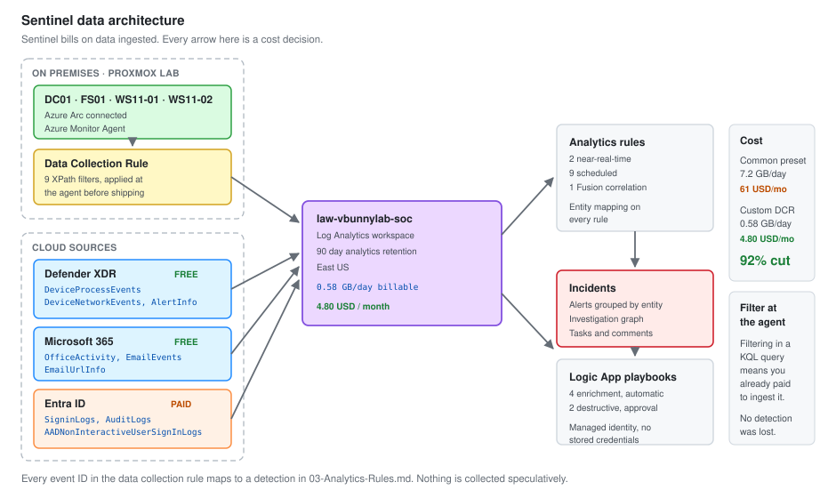

# 01 - Sentinel Workspace Build

Standing up Microsoft Sentinel, connecting nine data sources, onboarding on-premises machines through Azure Arc, and keeping the bill under five dollars a month.

---

## The Thing Nobody Tells You First

**Sentinel bills on data ingested, not on features used.**

Everything else in this document follows from that. A connector you enable without thinking about volume is a connector that costs money every hour of every day. Turning on Security Events at "All Events" across four machines cost me 61 dollars in the first month. Filtering the same sources properly brought it to 4.80.

This is not a lab problem. It is the single largest operational decision in any Sentinel deployment, and a SOC 1 analyst who understands it is more useful than one who does not.



---

## Prerequisites

| Item | How I got it | Cost |
| --- | --- | --- |
| Microsoft 365 E5 tenant | Microsoft 365 Developer Program, 25 licences, renews every 90 days | Free |
| Azure subscription | Pay-as-you-go, linked to the same tenant | Pay per use |
| Sentinel free trial | 10 GB per day for 31 days on a new workspace | Free for 31 days |
| Defender for Endpoint P2 | Included in E5 | Free with E5 |

The developer tenant renews only if there is activity in it. Log in and do something once a month or it lapses and takes the whole lab with it.

---

## Workspace

Sentinel sits on top of a Log Analytics workspace. Get the workspace right and Sentinel is a checkbox.

```bash
az group create \
  --name rg-vbunnylab-soc \
  --location eastus

az monitor log-analytics workspace create \
  --resource-group rg-vbunnylab-soc \
  --workspace-name law-vbunnylab-soc \
  --location eastus \
  --retention-time 90 \
  --sku PerGB2018
```

Then enable Sentinel on it:

```bash
az sentinel onboarding-state create \
  --resource-group rg-vbunnylab-soc \
  --workspace-name law-vbunnylab-soc \
  --name default
```

### Decisions made at creation time

| Decision | Chosen | Why |
| --- | --- | --- |
| Region | East US | Must match where most data originates. Cross-region egress is billed |
| Retention | 90 days analytics | 90 is the free tier ceiling for Sentinel. Anything beyond it is charged |
| SKU | PerGB2018 | Commitment tiers start at 100 GB per day. Not a lab number |
| One workspace or several | One | Cross-workspace queries work but complicate every rule |

**Region is the one you cannot change later.** Moving a workspace means rebuilding it and losing the data. Pick the region your data sources live in.

### Retention, and the part that catches people

Sentinel gives 90 days of analytics retention free. After that you pay per GB per month.

There are three tiers and they behave differently:

| Tier | Queryable | Cost | Use for |
| --- | --- | --- | --- |
| **Analytics** | Full KQL, powers analytics rules | Highest | Anything a detection runs against |
| **Basic** | Limited KQL, no joins, 8 day retention | About 20 percent of analytics | High-volume, low-value logs |
| **Archive** | Must be restored or searched first | Cheapest | Compliance, long tail |

A table in Basic cannot be used by an analytics rule. Put something in Basic and your detection silently stops working against it. That is a real failure mode and it does not announce itself.

---

## Azure Arc

The Proxmox machines are not in Azure. Arc makes them behave as if they are, which means the Azure Monitor Agent and data collection rules work on them exactly as they do on Azure VMs.

### Onboarding a server

Generate the script from the portal, or run it directly:

```powershell
# On each Windows host, elevated
$env:SUBSCRIPTION_ID = "<subscription-guid>"
$env:RESOURCE_GROUP  = "rg-vbunnylab-soc"
$env:TENANT_ID       = "<tenant-guid>"
$env:LOCATION        = "eastus"

Invoke-WebRequest `
  -Uri "https://gbl.his.arc.azure.com/azcmagent-windows" `
  -TimeoutSec 30 `
  -OutFile "$env:TEMP\install_windows_azcmagent.ps1"

& "$env:TEMP\install_windows_azcmagent.ps1"

& "$env:ProgramW6432\AzureConnectedMachineAgent\azcmagent.exe" connect `
  --resource-group $env:RESOURCE_GROUP `
  --tenant-id $env:TENANT_ID `
  --location $env:LOCATION `
  --subscription-id $env:SUBSCRIPTION_ID
```

Check it took:

```powershell
& "$env:ProgramW6432\AzureConnectedMachineAgent\azcmagent.exe" show
```

Status should read `Connected`. Anything else and the agent will not receive data collection rules.

### What Arc needs to reach

This is where most onboarding failures happen. The agent needs outbound HTTPS to a specific set of endpoints, and a default-deny firewall will block it.

| Endpoint | Purpose |
| --- | --- |
| `*.his.arc.azure.com` | Agent identity and hybrid identity service |
| `*.guestconfiguration.azure.com` | Guest configuration |
| `management.azure.com` | Resource management |
| `login.microsoftonline.com` | Authentication |
| `*.ods.opinsights.azure.com` | Log ingestion |
| `*.oms.opinsights.azure.com` | Workspace onboarding |
| `*.monitoring.azure.com` | Metrics and DCR delivery |

In the SOC-01 lab that meant adding an outbound allow rule on the CORP interface. Worth noting in your own build that this is the one place the lab reaches the internet deliberately.

**Symptom of getting this wrong:** the agent installs, reports `Connected`, and no data ever arrives. The connection to Arc and the connection to the workspace are separate paths, and one can work while the other does not.

---

## Data Collection Rules

This is where the cost is won or lost.

A DCR tells the Azure Monitor Agent what to collect and where to send it. Filtering here means the data never leaves the machine, so you are not billed for it. Filtering in a KQL query afterwards means you paid to ingest it first.

### The expensive version

Sentinel's Security Events connector offers presets. The one called "All Events" does exactly that.

```text
All Events        ~12 GB/day per server    Unusable
Common            ~1.8 GB/day per server   Still heavy
Minimal           ~0.2 GB/day per server   Misses things you need
Custom            what you choose          Correct answer
```

I started on Common across four machines. That was the 61 dollar month.

### The custom DCR I actually use

XPath filtering, which runs in the Windows event subsystem before anything is shipped.

```json
{
  "properties": {
    "dataSources": {
      "windowsEventLogs": [
        {
          "name": "securityEvents",
          "streams": ["Microsoft-SecurityEvent"],
          "xPathQueries": [
            "Security!*[System[(EventID=4624 or EventID=4625 or EventID=4648)]]",
            "Security!*[System[(EventID=4672 or EventID=4720 or EventID=4726)]]",
            "Security!*[System[(EventID=4728 or EventID=4732 or EventID=4756)]]",
            "Security!*[System[(EventID=4688)]]",
            "Security!*[System[(EventID=4698 or EventID=4699)]]",
            "Security!*[System[(EventID=4768 or EventID=4769 or EventID=4771)]]",
            "Security!*[System[(EventID=1102)]]",
            "System!*[System[(EventID=7045)]]",
            "Microsoft-Windows-Sysmon/Operational!*[System[(EventID=1 or EventID=3 or EventID=10 or EventID=11 or EventID=13 or EventID=22)]]"
          ]
        }
      ]
    }
  }
}
```

Nine XPath expressions. Every event ID in there maps to a detection in [03-Analytics-Rules.md](03-Analytics-Rules.md). Nothing is collected speculatively.

### Testing an XPath before deploying it

Do this on the machine. A wrong XPath in a DCR fails silently and you find out days later.

```powershell
Get-WinEvent -LogName Security -FilterXPath "*[System[(EventID=4624 or EventID=4625)]]" -MaxEvents 5
```

If that returns events, the expression is valid. If it errors, the DCR would have failed too.

### Result

| Stage | Volume across 4 hosts | Monthly cost |
| --- | --- | --- |
| Security Events on Common | 7.2 GB/day | 61 USD |
| Custom DCR, 9 XPath filters | 0.58 GB/day | 4.80 USD |
| **Reduction** | **92 percent** | |

**No detection lost.** Every rule that worked before still works, because the filter was built from the rules rather than guessed at.

---

## Data Connectors

Nine, in the order I enabled them.

| # | Connector | Tables | Cost | Why |
| --- | --- | --- | --- | --- |
| 1 | Microsoft Defender XDR | `DeviceEvents`, `DeviceProcessEvents`, `DeviceNetworkEvents`, `AlertInfo`, `AlertEvidence` | **Free** | The single highest value connector. Free with E5 |
| 2 | Microsoft Entra ID | `SigninLogs`, `AuditLogs`, `AADNonInteractiveUserSignInLogs` | Charged | Identity is where most incidents start |
| 3 | Microsoft Entra ID Protection | `SecurityAlert` | Free | Risky sign-in and risky user detections |
| 4 | Azure Activity | `AzureActivity` | Free | Control plane changes |
| 5 | Microsoft 365 | `OfficeActivity` | **Free** | Exchange, SharePoint, Teams audit |
| 6 | Defender for Office 365 | `EmailEvents`, `EmailUrlInfo`, `EmailAttachmentInfo` | Free | The phishing work in document 05 |
| 7 | Windows Security Events via AMA | `SecurityEvent` | Charged | The custom DCR above |
| 8 | Threat Intelligence | `ThreatIntelligenceIndicator` | Free | Enrichment in document 06 |
| 9 | Syslog via AMA | `Syslog` | Charged | OPNsense firewall from the SOC-01 lab |

### Free is doing a lot of work in that table

Connectors 1, 3, 4, 5, 6 and 8 cost nothing to ingest. That is not a technicality, it is the whole strategy for a lab and it is worth knowing in an interview.

Defender XDR data in particular is free into Sentinel. `DeviceProcessEvents` alone gives you process ancestry across every onboarded endpoint, which is most of what Sysmon provided in SOC-01, at no ingestion cost.

**The design that follows:** lean as hard as possible on the free connectors, and pay only for what they cannot give you. `SecurityEvent` is charged, so it is filtered to nine XPath expressions. `SigninLogs` is charged and kept in full, because identity telemetry is worth it.

### Verifying a connector is actually flowing

The connector page shows a green tick long before data arrives. Check the table.

```kql
// Which tables have data, and how much, over the last day
union withsource=TableName *
| where TimeGenerated > ago(1d)
| summarize Events = count(), Latest = max(TimeGenerated) by TableName
| order by Events desc
```

```kql
// Per-table ingestion volume and cost driver
Usage
| where TimeGenerated > ago(7d)
| where IsBillable == true
| summarize BillableGB = sum(Quantity) / 1000 by DataType
| order by BillableGB desc
```

That second query is the one to run weekly. It is how you find the connector that quietly became expensive.

---

## Cost Control

Four controls, in order of how much they save.

### 1. Filter at the agent

Covered above. 92 percent of the saving came from here.

### 2. Set a daily cap

A backstop, not a strategy. It stops a runaway from becoming a bill.

```bash
az monitor log-analytics workspace update \
  --resource-group rg-vbunnylab-soc \
  --workspace-name law-vbunnylab-soc \
  --daily-quota-gb 1
```

**Understand what the cap does.** When it trips, ingestion stops for the rest of the day. Your detections stop seeing data. A cap is a financial control that creates a security gap, so set it high enough that it only catches genuine runaways, and alert on it.

```kql
// Did the cap trip
Operation
| where OperationCategory == "Data Collection Status"
| where TimeGenerated > ago(7d)
| project TimeGenerated, Detail
```

### 3. Move high-volume, low-value tables to Basic

`Syslog` from the firewall is the candidate here. High volume, rarely queried, never used by an analytics rule.

Before moving anything, check nothing depends on it:

```kql
// Which tables do my analytics rules actually read
SecurityAlert
| where TimeGenerated > ago(30d)
| summarize count() by AlertName, ProductName
```

### 4. Set a budget alert

```bash
az consumption budget create \
  --budget-name sentinel-monthly \
  --amount 15 \
  --time-grain Monthly \
  --category Cost \
  --resource-group rg-vbunnylab-soc
```

Fifteen dollars against a four dollar run rate. Enough headroom for a normal month, low enough to notice a problem in days rather than at the end of the billing period.

---

## Table Reference

The tables worth knowing by name, because every query in this project uses them.

| Table | Contains | Source |
| --- | --- | --- |
| `SecurityEvent` | Windows Security log | AMA via DCR |
| `SigninLogs` | Interactive Entra ID sign-ins | Entra connector |
| `AADNonInteractiveUserSignInLogs` | Token refresh, background auth | Entra connector |
| `AuditLogs` | Directory changes | Entra connector |
| `DeviceProcessEvents` | Process creation with full ancestry | Defender XDR |
| `DeviceNetworkEvents` | Outbound connections by process | Defender XDR |
| `DeviceLogonEvents` | Logons as Defender sees them | Defender XDR |
| `DeviceFileEvents` | File create, modify, delete | Defender XDR |
| `DeviceRegistryEvents` | Registry writes | Defender XDR |
| `EmailEvents` | Message delivery and disposition | Defender for Office |
| `EmailUrlInfo` | URLs inside messages | Defender for Office |
| `OfficeActivity` | Exchange, SharePoint, Teams audit | M365 connector |
| `SecurityAlert` | Alerts from all connected products | Multiple |
| `SecurityIncident` | Sentinel incidents and their lifecycle | Sentinel |
| `ThreatIntelligenceIndicator` | IOCs for enrichment | TI connector |
| `Usage` | Ingestion volume per table | Built in |
| `Heartbeat` | Agent health | AMA |

**`AADNonInteractiveUserSignInLogs` is the one people miss.** Token refreshes and background authentication land there, not in `SigninLogs`. An attacker using a stolen refresh token shows up in the non-interactive table and nowhere else. A detection built only on `SigninLogs` will not see it.

---

## Health Monitoring

A SIEM that has stopped receiving data looks exactly like a quiet day.

```kql
// Agents that have gone silent
Heartbeat
| summarize LastSeen = max(TimeGenerated) by Computer
| extend MinutesSilent = datetime_diff('minute', now(), LastSeen)
| where MinutesSilent > 30
| order by MinutesSilent desc
```

```kql
// Connectors that have stopped, compared against their own baseline
union withsource=TableName *
| where TimeGenerated > ago(7d)
| summarize Events = count() by TableName, bin(TimeGenerated, 1d)
| order by TableName asc, TimeGenerated asc
```

Both of these are analytics rules in [03-Analytics-Rules.md](03-Analytics-Rules.md), not queries you remember to run. Silent failure is the failure mode that matters, and it has to alert on its own.

---

## Build Order

Order matters. Each step depends on the one before.

1. **Resource group and workspace.** Region first, it cannot change
2. **Enable Sentinel** on the workspace
3. **Free connectors first.** Defender XDR, M365, Azure Activity, Identity Protection, TI. Confirm data arrives before spending anything
4. **Azure Arc** on the four Proxmox machines. Confirm `Connected`
5. **Test the XPath filters locally** with `Get-WinEvent` before building the DCR
6. **Build the custom DCR** and associate it with the Arc machines
7. **Verify volume** with the `Usage` query before leaving it running overnight
8. **Daily cap and budget alert.** Both, before you sleep on it
9. **Analytics rules**, once you know what tables actually have data
10. **Automation**, last

**Steps 5 and 7 are the ones people skip.** Skipping 5 means a DCR that collects nothing. Skipping 7 means finding out the cost at the end of the month rather than the end of the day.

---

## What Went Wrong

Three things, recorded because they are the useful part.

**Arc said Connected, no data arrived.** The Arc control plane and the workspace ingestion path are different endpoints. The firewall allowed one and not the other. Diagnosed with `azcmagent check`, which tests every required endpoint individually and names the one failing.

**The first DCR collected nothing.** An XPath expression had a typo in the channel name, `Security!` written as `Securty!`. The DCR deployed successfully, reported healthy, and silently matched nothing. Now I test every expression with `Get-WinEvent -FilterXPath` first.

**Sixty-one dollars.** Security Events on Common across four machines for a month. Painful, and the most useful thing that happened in the build, because it forced the DCR work that is now the strongest part of this project.

---

Next: [02-KQL-Query-Library.md](02-KQL-Query-Library.md)
