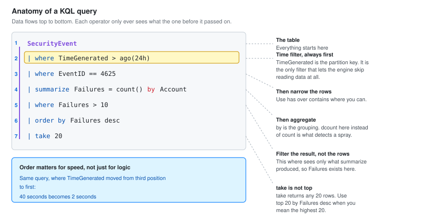

# 02 - KQL Query Library

Fifty queries, ordered as a learning progression. Each one says what it answers and when you would reach for it.

This is the file I actually work from. It is here because "knows KQL" appears in nearly every SOC Analyst I job description, and a library is better evidence of that than a claim.

---

## How a KQL Query Is Shaped



Every query is a table name followed by operators joined with pipes. Data flows left to right, and each operator only ever sees what the one before it passed on.

```kql
SecurityEvent                              // 1. the table
| where TimeGenerated > ago(24h)           // 2. narrow the time first
| where EventID == 4625                    // 3. then narrow the data
| summarize Failures = count() by Account  // 4. then aggregate
| where Failures > 10                      // 5. then filter the result
| order by Failures desc                   // 6. then sort
```

**Order matters for speed, not just for logic.** Filter on `TimeGenerated` first, always. It is the partition key, so it is the one filter that lets the engine skip reading data at all. A `where` on any other column still has to read everything.

### The operators that cover most work

| Operator | Does |
| --- | --- |
| `where` | Filters rows |
| `project` | Chooses columns. `project-away` drops them |
| `extend` | Adds a calculated column |
| `summarize` | Aggregates, with `by` for grouping |
| `join` | Combines two tables on a key |
| `union` | Stacks tables on top of each other |
| `order by` / `sort by` | Sorts. Same thing, two spellings |
| `take` / `limit` | Returns any N rows, not the first N |
| `top` | Returns the N highest by a column. Use this, not `take` |
| `distinct` | Unique values |
| `mv-expand` | Turns one row with an array into many rows |
| `parse` | Pulls fields out of a string |
| `let` | Names a value or a subquery for reuse |

**`take` does not mean "first".** It means "any", and it is not deterministic. Use `top 10 by TimeGenerated desc` when you mean the most recent ten.

---

## Level 1: Getting Oriented

The queries you run when you have no idea what is in front of you.

### Q01. What tables have data

```kql
union withsource=TableName *
| where TimeGenerated > ago(24h)
| summarize Events = count(), Latest = max(TimeGenerated) by TableName
| order by Events desc
```

First query on any unfamiliar Sentinel workspace. Tells you what is connected and what is not.

### Q02. What does this table look like

```kql
SecurityEvent
| take 10
```

Ten arbitrary rows. You are reading column names, not results.

### Q03. What columns exist

```kql
SecurityEvent
| getschema
| project ColumnName, ColumnType
```

Faster than scrolling sideways through `take 10`.

### Q04. What event IDs am I actually receiving

```kql
SecurityEvent
| where TimeGenerated > ago(7d)
| summarize Count = count() by EventID, Activity
| order by Count desc
```

Run this after building a data collection rule. It confirms the filter did what you meant.

### Q05. Which machines are reporting

```kql
Heartbeat
| where TimeGenerated > ago(1h)
| summarize LastSeen = max(TimeGenerated) by Computer, OSType
| order by LastSeen asc
```

### Q06. Which machines have gone quiet

```kql
Heartbeat
| summarize LastSeen = max(TimeGenerated) by Computer
| extend MinutesSilent = datetime_diff('minute', now(), LastSeen)
| where MinutesSilent > 30
| order by MinutesSilent desc
```

A silent agent and a quiet day look identical on a dashboard. This is the difference.

### Q07. What is this costing me

```kql
Usage
| where TimeGenerated > ago(30d)
| where IsBillable == true
| summarize BillableGB = round(sum(Quantity) / 1000, 3) by DataType
| order by BillableGB desc
```

Weekly habit. Finds the connector that quietly became expensive.

### Q08. Ingestion trend by day

```kql
Usage
| where TimeGenerated > ago(30d)
| where IsBillable == true
| summarize GB = sum(Quantity) / 1000 by bin(TimeGenerated, 1d)
| render timechart
```

A step change on a specific day means somebody enabled something.

### Q09. All alerts in the last week

```kql
SecurityAlert
| where TimeGenerated > ago(7d)
| summarize Count = count() by AlertName, AlertSeverity, ProductName
| order by Count desc
```

### Q10. Open incidents right now

```kql
SecurityIncident
| where Status != "Closed"
| project TimeGenerated, IncidentNumber, Title, Severity, Status, Owner
| order by Severity asc, TimeGenerated desc
```

---

## Level 2: Filtering and Shaping

Narrowing down to the rows that matter and making the output readable.

### Q11. Failed logons, readable

```kql
SecurityEvent
| where TimeGenerated > ago(24h)
| where EventID == 4625
| project TimeGenerated, Computer, TargetAccount, IpAddress, LogonTypeName, SubStatus
| order by TimeGenerated desc
```

`project` is what turns a wall of 200 columns into something you can read.

### Q12. Exclude the noise you know about

```kql
SecurityEvent
| where TimeGenerated > ago(24h)
| where EventID == 4625
| where TargetAccount !endswith "$"                 // machine accounts
| where TargetAccount !in ("SYSTEM", "ANONYMOUS LOGON")
| project TimeGenerated, Computer, TargetAccount, IpAddress, SubStatus
```

`!endswith "$"` removes computer accounts, which fail constantly during normal operation and drown everything else.

### Q13. Decode the failure reason

```kql
SecurityEvent
| where TimeGenerated > ago(24h)
| where EventID == 4625
| extend Reason = case(
    SubStatus == "0xc0000064", "Account does not exist",
    SubStatus == "0xc000006a", "Wrong password",
    SubStatus == "0xc0000234", "Account locked out",
    SubStatus == "0xc0000072", "Account disabled",
    SubStatus == "0xc0000071", "Password expired",
    SubStatus == "0xc000015b", "Logon type not granted",
    strcat("Unmapped: ", SubStatus))
| project TimeGenerated, TargetAccount, IpAddress, Reason
```

`case()` is how you turn hex codes into something a human can triage. Worth keeping as a `let` and reusing.

### Q14. Case-insensitive contains

```kql
DeviceProcessEvents
| where TimeGenerated > ago(24h)
| where ProcessCommandLine contains "invoke-webrequest"
| project TimeGenerated, DeviceName, AccountName, ProcessCommandLine
```

`contains` is case-insensitive. `contains_cs` is not. Use `has` instead when matching a whole word, because it is indexed and much faster.

### Q15. `has` versus `contains`

```kql
DeviceProcessEvents
| where TimeGenerated > ago(24h)
| where ProcessCommandLine has "mimikatz"      // fast, whole-word, indexed
| project TimeGenerated, DeviceName, ProcessCommandLine
```

`has` matches whole terms and uses the index. `contains` matches substrings and scans. On a large table the difference is minutes.

### Q16. Multiple conditions, readable

```kql
DeviceProcessEvents
| where TimeGenerated > ago(24h)
| where FileName in~ ("powershell.exe", "pwsh.exe")
| where ProcessCommandLine has_any ("-enc", "-encodedcommand", "frombase64string")
| project TimeGenerated, DeviceName, AccountName, InitiatingProcessFileName, ProcessCommandLine
```

`in~` is case-insensitive membership. `has_any` takes a list and is far cleaner than six `or` clauses.

### Q17. Parse a field out of a string

```kql
SecurityEvent
| where TimeGenerated > ago(24h)
| where EventID == 4688
| parse CommandLine with * "-File " ScriptPath " " *
| where isnotempty(ScriptPath)
| project TimeGenerated, Computer, Account, ScriptPath
```

### Q18. Regex extraction

```kql
DeviceNetworkEvents
| where TimeGenerated > ago(24h)
| extend Domain = extract(@"https?://([^/:]+)", 1, RemoteUrl)
| where isnotempty(Domain)
| project TimeGenerated, DeviceName, Domain, RemoteUrl
```

`extract` takes a regex, a capture group number, and a column. Group 1 is the first set of parentheses.

### Q19. Work with time properly

```kql
SigninLogs
| where TimeGenerated > ago(7d)
| extend HourOfDay = datetime_part("hour", TimeGenerated)
| extend DayOfWeek = dayofweek(TimeGenerated)
| where HourOfDay < 6 or HourOfDay > 20
| project TimeGenerated, UserPrincipalName, HourOfDay, IPAddress, ResultType
```

Out-of-hours activity is one of the cheapest useful signals there is.

### Q20. Dynamic fields

```kql
SigninLogs
| where TimeGenerated > ago(24h)
| extend City    = tostring(LocationDetails.city)
| extend Country = tostring(LocationDetails.countryOrRegion)
| extend Browser = tostring(DeviceDetail.browser)
| extend OS      = tostring(DeviceDetail.operatingSystem)
| project TimeGenerated, UserPrincipalName, City, Country, Browser, OS, IPAddress
```

**Dynamic columns need casting.** `LocationDetails.city` is not a string until you make it one, and comparisons against it silently fail if you skip `tostring()`. This catches everybody once.

---

## Level 3: Aggregation

Counting, grouping, and finding the shape in the data.

### Q21. Count by one thing

```kql
SecurityEvent
| where TimeGenerated > ago(24h)
| where EventID == 4625
| summarize Failures = count() by TargetAccount
| order by Failures desc
| take 20
```

### Q22. Count distinct

```kql
SecurityEvent
| where TimeGenerated > ago(1h)
| where EventID == 4625
| summarize
    Attempts = count(),
    DistinctAccounts = dcount(TargetAccount),
    Accounts = make_set(TargetAccount, 20)
  by IpAddress
| where DistinctAccounts >= 8
| order by DistinctAccounts desc
```

**This is password spray detection in one query.** Many distinct accounts from one source is a spray. Many attempts on one account is a brute force. `dcount` is what separates them.

`make_set` collects the actual values into an array so the alert carries the evidence, capped at 20 so it does not become unreadable.

### Q23. Several aggregations at once

```kql
SigninLogs
| where TimeGenerated > ago(7d)
| summarize
    Total     = count(),
    Failed    = countif(ResultType != 0),
    Succeeded = countif(ResultType == 0),
    Countries = dcount(tostring(LocationDetails.countryOrRegion)),
    FirstSeen = min(TimeGenerated),
    LastSeen  = max(TimeGenerated)
  by UserPrincipalName
| extend FailureRate = round(todouble(Failed) / todouble(Total) * 100, 1)
| where Total > 10
| order by FailureRate desc
```

`countif` aggregates conditionally, which saves running two queries and joining them.

### Q24. Time buckets

```kql
SecurityEvent
| where TimeGenerated > ago(7d)
| where EventID == 4625
| summarize Failures = count() by bin(TimeGenerated, 1h)
| render timechart
```

`bin()` rounds timestamps into buckets. It is the basis of every trend chart and every anomaly query.

### Q25. Two dimensions at once

```kql
DeviceProcessEvents
| where TimeGenerated > ago(7d)
| summarize Count = count() by DeviceName, bin(TimeGenerated, 1d)
| render timechart
```

### Q26. Percentiles, not averages

```kql
SecurityIncident
| where TimeGenerated > ago(30d)
| where Status == "Closed"
| extend MinutesToClose = datetime_diff('minute', ClosedTime, CreatedTime)
| summarize
    Median = percentile(MinutesToClose, 50),
    P90    = percentile(MinutesToClose, 90),
    P99    = percentile(MinutesToClose, 99),
    Mean   = avg(MinutesToClose)
  by Severity
```

**Report the median and the 90th percentile, not the mean.** One incident that stayed open over a weekend drags the mean into uselessness. The median tells you what a normal incident looks like and P90 tells you how bad the bad ones get.

### Q27. First seen, which finds new things

```kql
DeviceProcessEvents
| where TimeGenerated > ago(30d)
| summarize FirstSeen = min(TimeGenerated), Count = count() by SHA256, FileName
| where FirstSeen > ago(1d)
| where Count < 5
| order by FirstSeen desc
```

New and rare together is a strong hunting signal. New alone is noisy, because software updates constantly.

### Q28. Rank within a group

```kql
SigninLogs
| where TimeGenerated > ago(30d)
| where ResultType == 0
| summarize Count = count() by UserPrincipalName, IPAddress
| summarize TopIPs = make_list(pack('ip', IPAddress, 'count', Count), 5) by UserPrincipalName
```

### Q29. Pivot into columns

```kql
SecurityEvent
| where TimeGenerated > ago(7d)
| where EventID in (4624, 4625, 4634, 4672)
| summarize Count = count() by Computer, tostring(EventID)
| evaluate pivot(EventID, sum(Count))
```

`evaluate pivot()` turns rows into columns, which is what makes a readable summary table.

### Q30. Summarize then filter

```kql
DeviceNetworkEvents
| where TimeGenerated > ago(24h)
| where isnotempty(RemoteUrl)
| extend Domain = tostring(split(RemoteUrl, "/")[2])
| summarize Devices = dcount(DeviceName), Hits = count() by Domain
| where Devices == 1 and Hits > 50
| order by Hits desc
```

One device hitting one domain 50 times is more interesting than 50 devices hitting it once. The second is a popular website. The first might be a beacon.

---

## Level 4: Joins and Lookups

Combining tables, which is where KQL gets genuinely useful.

### Q31. Basic inner join

```kql
SecurityEvent
| where TimeGenerated > ago(24h)
| where EventID == 4625
| project FailTime = TimeGenerated, Account, IpAddress
| join kind=inner (
    SecurityEvent
    | where TimeGenerated > ago(24h)
    | where EventID == 4624
    | project SuccessTime = TimeGenerated, Account, IpAddress
  ) on Account, IpAddress
| where SuccessTime > FailTime
| project Account, IpAddress, FailTime, SuccessTime
```

Failures followed by a success from the same source and account. That is a guessed password.

### Q32. Join kinds, and the one that matters

```kql
// leftanti: rows in the left table with NO match on the right
DeviceInfo
| where TimeGenerated > ago(1d)
| distinct DeviceName
| join kind=leftanti (
    DeviceProcessEvents
    | where TimeGenerated > ago(1d)
    | distinct DeviceName
  ) on DeviceName
```

Devices reporting inventory but sending no process events. That is an agent that is half broken, which is worse than one that is off, because the dashboard shows it as healthy.

| Kind | Returns |
| --- | --- |
| `inner` | Rows matching in both |
| `leftouter` | All left rows, right columns null when unmatched |
| `leftanti` | Left rows with no match. **The hunting join** |
| `rightanti` | Right rows with no match |
| `fullouter` | Everything |

**`leftanti` is the one to learn.** Finding what is missing is usually more interesting than finding what is present.

### Q33. Join a spray to its success, across tables

```kql
let SprayWindow = 1h;
let SprayThreshold = 8;
let Sprays =
    SecurityEvent
    | where TimeGenerated > ago(SprayWindow)
    | where EventID == 4625
    | where TargetAccount !endswith "$"
    | summarize DistinctAccounts = dcount(TargetAccount) by IpAddress
    | where DistinctAccounts >= SprayThreshold;
SecurityEvent
| where TimeGenerated > ago(SprayWindow)
| where EventID == 4624
| where LogonType in (3, 10)
| join kind=inner Sprays on IpAddress
| project TimeGenerated, IpAddress, CompromisedAccount = TargetAccount, DistinctAccounts
```

**`let` at the top is how you keep a query readable.** Named thresholds at the top mean you tune the rule by editing one line, not by hunting through the logic.

### Q34. Enrich with threat intelligence

```kql
let TI =
    ThreatIntelligenceIndicator
    | where TimeGenerated > ago(14d)
    | where Active == true
    | where isnotempty(NetworkIP)
    | project IndicatorIP = NetworkIP, ThreatType, Description, ConfidenceScore;
DeviceNetworkEvents
| where TimeGenerated > ago(24h)
| where isnotempty(RemoteIP)
| join kind=inner TI on $left.RemoteIP == $right.IndicatorIP
| project TimeGenerated, DeviceName, InitiatingProcessFileName, RemoteIP, ThreatType, ConfidenceScore
```

`$left` and `$right` let you join on columns with different names.

### Q35. Union across similar tables

```kql
union SigninLogs, AADNonInteractiveUserSignInLogs
| where TimeGenerated > ago(24h)
| where UserPrincipalName == "vbunny@vbunnylab.com"
| project TimeGenerated, Type, UserPrincipalName, IPAddress, AppDisplayName, ResultType
| order by TimeGenerated desc
```

**Always union these two for identity work.** Interactive sign-ins go in one, token refreshes and background auth go in the other. A stolen refresh token appears only in the non-interactive table.

### Q36. Lookup against a watchlist

```kql
let VIPs = _GetWatchlist('HighValueAccounts') | project UserPrincipalName = SearchKey;
SigninLogs
| where TimeGenerated > ago(24h)
| where ResultType == 0
| join kind=inner VIPs on UserPrincipalName
| summarize Signins = count(), Countries = make_set(tostring(LocationDetails.countryOrRegion))
  by UserPrincipalName
```

Watchlists are how you keep a maintained list of executives, service accounts or critical assets out of the query text.

### Q37. Inline lookup without a watchlist

```kql
let CriticalServers = dynamic(["DC01", "FS01"]);
SecurityEvent
| where TimeGenerated > ago(24h)
| where Computer has_any (CriticalServers)
| where EventID in (4720, 4728, 4732, 4756, 1102)
| project TimeGenerated, Computer, Activity, Account, TargetAccount
```

### Q38. Correlate across products

```kql
let SuspiciousDevices =
    SecurityAlert
    | where TimeGenerated > ago(24h)
    | where AlertSeverity in ("High", "Medium")
    | mv-expand todynamic(Entities)
    | where tostring(Entities.Type) == "host"
    | project DeviceName = tostring(Entities.HostName);
DeviceProcessEvents
| where TimeGenerated > ago(24h)
| join kind=inner SuspiciousDevices on DeviceName
| summarize Processes = make_set(FileName, 30) by DeviceName
```

`mv-expand` turns the `Entities` array into one row per entity, which is how you get hostnames and accounts out of an alert.

---

## Level 5: Hunting and Anomaly Detection

The queries that find things no rule was written for.

### Q39. Office spawning a shell

```kql
DeviceProcessEvents
| where TimeGenerated > ago(7d)
| where InitiatingProcessFileName in~ (
    "winword.exe", "excel.exe", "powerpnt.exe", "outlook.exe", "msaccess.exe", "onenote.exe")
| where FileName in~ (
    "cmd.exe", "powershell.exe", "pwsh.exe", "wscript.exe", "cscript.exe",
    "mshta.exe", "rundll32.exe", "regsvr32.exe", "certutil.exe", "bitsadmin.exe")
| project TimeGenerated, DeviceName, AccountName,
          Parent = InitiatingProcessFileName, Child = FileName, ProcessCommandLine
| order by TimeGenerated desc
```

The SOC-01 rule, rewritten in KQL. Still the highest signal to noise ratio of anything here.

### Q40. LSASS access

```kql
DeviceEvents
| where TimeGenerated > ago(7d)
| where ActionType == "OpenProcessApiCall"
| where FileName =~ "lsass.exe"
| where InitiatingProcessFileName !in~ (
    "MsMpEng.exe", "wmiprvse.exe", "csrss.exe", "wininit.exe", "services.exe")
| project TimeGenerated, DeviceName, InitiatingProcessFileName,
          InitiatingProcessCommandLine, InitiatingProcessAccountName
```

### Q41. Impossible travel

```kql
let TimeWindow = 1d;
SigninLogs
| where TimeGenerated > ago(TimeWindow)
| where ResultType == 0
| extend Country = tostring(LocationDetails.countryOrRegion)
| where isnotempty(Country)
| summarize
    Countries = make_set(Country),
    CountryCount = dcount(Country),
    IPs = make_set(IPAddress, 10),
    FirstSeen = min(TimeGenerated),
    LastSeen = max(TimeGenerated)
  by UserPrincipalName
| where CountryCount > 1
| extend MinutesApart = datetime_diff('minute', LastSeen, FirstSeen)
| where MinutesApart < 240
| order by MinutesApart asc
```

**This produces false positives and you should know why before you deploy it.** A VPN, a mobile device roaming, and a cloud service authenticating on the user's behalf all look like impossible travel. Treat it as a hunting query, not an alert, until you have tuned out your own VPN egress addresses.

### Q42. New country for a user

```kql
let Baseline =
    SigninLogs
    | where TimeGenerated between (ago(30d) .. ago(1d))
    | where ResultType == 0
    | summarize KnownCountries = make_set(tostring(LocationDetails.countryOrRegion))
      by UserPrincipalName;
SigninLogs
| where TimeGenerated > ago(1d)
| where ResultType == 0
| extend Country = tostring(LocationDetails.countryOrRegion)
| join kind=inner Baseline on UserPrincipalName
| where Country !in (KnownCountries)
| project TimeGenerated, UserPrincipalName, Country, IPAddress, AppDisplayName
```

Better than impossible travel, because it compares against the user's own history rather than against a physics assumption.

### Q43. Beaconing, by timing regularity

```kql
DeviceNetworkEvents
| where TimeGenerated > ago(24h)
| where isnotempty(RemoteIP)
| where RemoteIPType == "Public"
| summarize
    Connections = count(),
    TimeDeltas = make_list(TimeGenerated)
  by DeviceName, RemoteIP, InitiatingProcessFileName
| where Connections > 20
| extend Intervals = array_iff(
    array_length(TimeDeltas) > 1,
    series_subtract(array_slice(TimeDeltas, 1, -1), array_slice(TimeDeltas, 0, -2)),
    dynamic([]))
| extend StdDev = series_stats_dynamic(Intervals).stdev
| extend Mean   = series_stats_dynamic(Intervals).avg
| where Mean > 0
| extend Jitter = StdDev / Mean
| where Jitter < 0.15
| project DeviceName, RemoteIP, InitiatingProcessFileName, Connections, Mean, Jitter
| order by Jitter asc
```

**Low jitter is the whole idea.** A human browsing produces irregular intervals. A beacon checking in every 60 seconds produces near-zero variance. Jitter under 0.15 means the interval barely moves, which software does and people do not.

### Q44. Built-in anomaly detection

```kql
SecurityEvent
| where TimeGenerated > ago(14d)
| where EventID == 4625
| make-series Failures = count() default=0
  on TimeGenerated from ago(14d) to now() step 1h by Computer
| extend (Anomalies, Score, Baseline) = series_decompose_anomalies(Failures, 2.0, -1, 'linefit')
| mv-expand TimeGenerated, Failures, Anomalies, Score, Baseline
| where toint(Anomalies) != 0
| project Computer, TimeGenerated = todatetime(TimeGenerated),
          Failures = toint(Failures), Expected = toint(Baseline), Score = todouble(Score)
| order by Score desc
```

`series_decompose_anomalies` learns the normal pattern, including daily and weekly cycles, and flags departures from it. The `2.0` is the sensitivity threshold. Lower it and you get more alerts.

This is how you catch "more failures than usual for this machine at this hour on this day" without hardcoding a number that is wrong for half your estate.

### Q45. Rare process in the environment

```kql
let Lookback = 30d;
let RareThreshold = 3;
DeviceProcessEvents
| where TimeGenerated > ago(Lookback)
| summarize
    Devices = dcount(DeviceName),
    Executions = count(),
    FirstSeen = min(TimeGenerated),
    DeviceList = make_set(DeviceName, 5)
  by FileName, FolderPath
| where Devices <= RareThreshold
| where FolderPath !startswith "C:\\Program Files"
| where FolderPath !startswith "C:\\Windows\\WinSxS"
| order by Devices asc, Executions asc
```

Rarity is the hunting signal. Malware is rare by definition. So is a legitimate tool one engineer installed, which is why this is a hunt and not an alert.

### Q46. Living off the land binaries

```kql
let LOLBins = dynamic([
    "certutil.exe", "bitsadmin.exe", "regsvr32.exe", "rundll32.exe", "mshta.exe",
    "msiexec.exe", "installutil.exe", "regasm.exe", "regsvcs.exe", "msbuild.exe",
    "cmstp.exe", "wmic.exe", "forfiles.exe", "pcalua.exe", "curl.exe"]);
DeviceProcessEvents
| where TimeGenerated > ago(7d)
| where FileName in~ (LOLBins)
| where ProcessCommandLine has_any ("http", "ftp", "\\\\", "-urlcache", "-decode", "javascript:", "scrobj")
| project TimeGenerated, DeviceName, AccountName, FileName,
          Parent = InitiatingProcessFileName, ProcessCommandLine
| order by TimeGenerated desc
```

These are signed Microsoft binaries, so allowlisting does not stop them. The command line is the only place the intent shows.

### Q47. Persistence written in the last day

```kql
DeviceRegistryEvents
| where TimeGenerated > ago(1d)
| where ActionType in ("RegistryValueSet", "RegistryKeyCreated")
| where RegistryKey has_any (
    @"CurrentVersion\Run",
    @"CurrentVersion\RunOnce",
    @"Winlogon\Shell",
    @"Winlogon\Userinit")
| where RegistryValueData has_any ("AppData", "Temp", "ProgramData", "Public",
                                   "powershell", "cmd.exe", "wscript", "mshta", "rundll32")
| project TimeGenerated, DeviceName, InitiatingProcessFileName,
          RegistryKey, RegistryValueName, RegistryValueData
```

### Q48. Mailbox forwarding rules

```kql
OfficeActivity
| where TimeGenerated > ago(7d)
| where Operation in ("New-InboxRule", "Set-InboxRule", "UpdateInboxRules")
| extend Params = tostring(Parameters)
| where Params has_any ("ForwardTo", "ForwardAsAttachmentTo", "RedirectTo", "DeleteMessage")
| project TimeGenerated, UserId, ClientIP, Operation, Params
| order by TimeGenerated desc
```

**This is the query that catches business email compromise.** The standard play after stealing a mailbox is a rule that forwards everything out and deletes the copy. A password reset does not remove the rule, and the rule keeps working.

### Q49. Consent granted to an application

```kql
AuditLogs
| where TimeGenerated > ago(30d)
| where OperationName has_any ("Consent to application", "Add app role assignment")
| extend App  = tostring(TargetResources[0].displayName)
| extend User = tostring(InitiatedBy.user.userPrincipalName)
| extend Perms = tostring(TargetResources[0].modifiedProperties)
| project TimeGenerated, User, App, Result, Perms
| order by TimeGenerated desc
```

Illicit consent grants are how an attacker keeps mailbox access after the password changes and the sessions are revoked. The token belongs to the app, not the user.

### Q50. Everything one user did

```kql
let Target = "vbunny@vbunnylab.com";
let Window = 7d;
union isfuzzy=true
    (SigninLogs
     | where UserPrincipalName =~ Target
     | project TimeGenerated, Source = "Signin", Detail = strcat(AppDisplayName, " from ", IPAddress), Result = tostring(ResultType)),
    (AADNonInteractiveUserSignInLogs
     | where UserPrincipalName =~ Target
     | project TimeGenerated, Source = "NonInteractive", Detail = AppDisplayName, Result = tostring(ResultType)),
    (OfficeActivity
     | where UserId =~ Target
     | project TimeGenerated, Source = "Office", Detail = Operation, Result = ResultStatus),
    (AuditLogs
     | where tostring(InitiatedBy.user.userPrincipalName) =~ Target
     | project TimeGenerated, Source = "Directory", Detail = OperationName, Result = tostring(Result)),
    (DeviceProcessEvents
     | where AccountUpn =~ Target
     | project TimeGenerated, Source = "Process", Detail = ProcessCommandLine, Result = "")
| where TimeGenerated > ago(Window)
| order by TimeGenerated desc
```

**The single most useful query in this file during an investigation.** One user, one timeline, every source. `isfuzzy=true` means it still runs if one of those tables is not present in the workspace, which matters because a query that errors out mid-incident is worse than one that returns partial results.

---

## Things That Cost Me Time

Recorded because each one took longer than it should have.

**`take` is not `top`.** `take 10` returns any ten rows. I spent an hour convinced a detection was broken because `take` kept showing me old events.

**Dynamic columns need casting.** `LocationDetails.countryOrRegion == "US"` silently matches nothing. `tostring(LocationDetails.countryOrRegion) == "US"` works. No error either way.

**`join` defaults to `innerunique`, not `inner`.** The default deduplicates the left side, which quietly drops rows. Always state the kind explicitly.

**Time filter first, always.** Same query, `where TimeGenerated` moved from third position to first: 40 seconds down to 2.

**`SigninLogs` is not all sign-ins.** Non-interactive authentication is a separate table. A detection built on `SigninLogs` alone misses refresh token abuse entirely.

**`contains` on a large table is slow.** `has` uses the term index. Switching one query from `contains` to `has` took it from timing out to under a second.

---

## Saving Queries

Anything run more than twice becomes a saved function.

```kql
// Save as a function named FailedLogonsDecoded
SecurityEvent
| where EventID == 4625
| extend Reason = case(
    SubStatus == "0xc0000064", "Account does not exist",
    SubStatus == "0xc000006a", "Wrong password",
    SubStatus == "0xc0000234", "Account locked out",
    SubStatus == "0xc0000072", "Account disabled",
    strcat("Unmapped: ", SubStatus))
```

Then use it as a table:

```kql
FailedLogonsDecoded
| where TimeGenerated > ago(1h)
| summarize count() by Reason, TargetAccount
```

Functions are how a query library stops being a text file and starts being a tool.

---

Next: [03-Analytics-Rules.md](03-Analytics-Rules.md)
