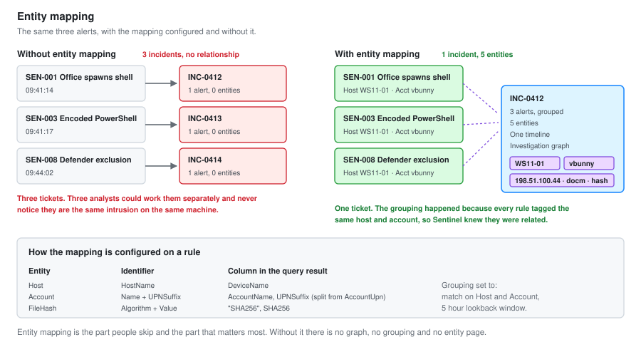

# 03 - Analytics Rules

Twelve detections running in Sentinel. Rule logic in KQL, entity mapping configured, and the tuning that made them usable.

---

## What Makes a Sentinel Rule Different

A Wazuh rule matches an event and produces an alert. A Sentinel analytics rule does more, and the extra parts are where most of the value sits.

| Part | What it does | What happens if you skip it |
| --- | --- | --- |
| **Query** | Finds the thing | Nothing works |
| **Entity mapping** | Tags accounts, hosts, IPs in the result | No investigation graph, no grouping, no UEBA |
| **Grouping** | Folds related alerts into one incident | 200 alerts instead of 1 incident |
| **Custom details** | Surfaces key fields on the incident | Analyst opens the raw logs for every alert |
| **Alert details** | Dynamic title and description | Every alert has the same generic name |

**Entity mapping is the part people skip and the part that matters most.** Without it, Sentinel does not know that the alert about `WS11-01` and the alert about `vbunny@vbunnylab.com` are related. With it, they become one incident with a graph you can pivot through.



---

## Rule Types

| Type | Runs | Lookback | Use for |
| --- | --- | --- | --- |
| **Scheduled** | Every 5 min to 14 days | Up to 14 days | Nearly everything |
| **Near-real-time (NRT)** | Every minute, automatically | 1 minute | Critical, single-event detections |
| **Microsoft security** | On alert from a connected product | n/a | Passing Defender alerts through |
| **Fusion** | Continuous, ML | Correlates across sources | Multi-stage attack detection |
| **Anomaly** | Continuous, ML | Learns a baseline | Behavioural drift |

NRT rules have real limits. No `join`, no `union`, one table, and they cannot look back further than the last minute. That rules out anything frequency-based. Use them for the detections where 60 seconds matters and the logic is simple.

---

## SEN-001: Office Application Spawning a Shell

**Type:** NRT
**Severity:** High
**Tactics:** Initial Access, Execution
**Techniques:** T1566.001, T1059

### Query

```kql
DeviceProcessEvents
| where InitiatingProcessFileName in~ (
    "winword.exe", "excel.exe", "powerpnt.exe", "outlook.exe",
    "msaccess.exe", "onenote.exe", "visio.exe")
| where FileName in~ (
    "cmd.exe", "powershell.exe", "pwsh.exe", "wscript.exe", "cscript.exe",
    "mshta.exe", "rundll32.exe", "regsvr32.exe", "certutil.exe",
    "bitsadmin.exe", "curl.exe", "schtasks.exe")
| extend
    AccountName = tostring(split(AccountUpn, "@")[0]),
    UPNSuffix   = tostring(split(AccountUpn, "@")[1])
| project
    TimeGenerated, DeviceName, AccountName, UPNSuffix, AccountUpn,
    ParentProcess = InitiatingProcessFileName,
    ChildProcess  = FileName,
    ProcessCommandLine,
    InitiatingProcessCommandLine,
    FileHash = SHA256
```

### Entity mapping

| Entity | Identifier | Value |
| --- | --- | --- |
| Host | HostName | `DeviceName` |
| Account | Name | `AccountName` |
| Account | UPNSuffix | `UPNSuffix` |
| Process | CommandLine | `ProcessCommandLine` |
| FileHash | Algorithm / Value | `SHA256` / `FileHash` |

### Configuration

```yaml
kind: NRT
severity: High
enabled: true
suppressionEnabled: false
incidentConfiguration:
  createIncident: true
  groupingConfiguration:
    enabled: true
    reopenClosedIncident: false
    lookbackDuration: PT5H
    matchingMethod: Selected
    groupByEntities:
      - Host
      - Account
alertDetailsOverride:
  alertDisplayNameFormat: "Office process {{ParentProcess}} spawned {{ChildProcess}} on {{DeviceName}}"
  alertDescriptionFormat: "{{AccountUpn}} ran {{ProcessCommandLine}}"
customDetails:
  ParentProcess: ParentProcess
  CommandLine: ProcessCommandLine
```

### Why NRT

This is the alert that fires at minute zero of an intrusion. In SOC-01 the same detection fired two seconds after the document opened, and everything else in the chain was downstream of it.

A five minute scheduled rule would give an attacker five minutes. NRT gives them sixty seconds. For this one detection that trade is worth the NRT limitations.

### Tuning

None. Zero false positives in 30 days.

Word has no legitimate reason to start PowerShell. If a business genuinely has a macro that does this, exclude that one macro by hash rather than softening the rule. A detection this clean is worth protecting.

---

## SEN-002: Password Spray

**Type:** Scheduled, every 15 minutes, 1 hour lookback
**Severity:** High
**Technique:** T1110.003

### Query

```kql
let SprayThreshold = 8;
let Window = 1h;
let Failures =
    SecurityEvent
    | where TimeGenerated > ago(Window)
    | where EventID == 4625
    | where LogonType in (3, 10)
    | where TargetAccount !endswith "$"
    | where IpAddress !in ("-", "::1", "127.0.0.1")
    | summarize
        Attempts         = count(),
        DistinctAccounts = dcount(TargetAccount),
        TargetedAccounts = make_set(TargetAccount, 25),
        FirstAttempt     = min(TimeGenerated),
        LastAttempt      = max(TimeGenerated)
      by IpAddress, Computer
    | where DistinctAccounts >= SprayThreshold;
let Successes =
    SecurityEvent
    | where TimeGenerated > ago(Window)
    | where EventID == 4624
    | where LogonType in (3, 10)
    | project SuccessTime = TimeGenerated, IpAddress, CompromisedAccount = TargetAccount;
Failures
| join kind=leftouter Successes on IpAddress
| extend Compromised = isnotempty(CompromisedAccount)
| extend AccountName = tostring(split(CompromisedAccount, "\\")[1])
| project
    TimeGenerated = LastAttempt,
    IpAddress, Computer, Attempts, DistinctAccounts,
    TargetedAccounts, Compromised, CompromisedAccount, AccountName, SuccessTime
```

### Entity mapping

| Entity | Identifier | Value |
| --- | --- | --- |
| IP | Address | `IpAddress` |
| Host | HostName | `Computer` |
| Account | Name | `AccountName` |

### Dynamic severity

The rule fires at High. A second rule with the same logic and `| where Compromised == true` fires at Critical.

**A spray is something you investigate. A spray with a success is an active compromise.** They deserve different severities and different response times, so they are two rules rather than one.

### Tuning

| Version | Threshold | FPs in 7 days | Change |
| --- | :---: | :---: | --- |
| v1 | 3 accounts | 41 | Machine accounts dominated |
| v2 | 3 accounts | 12 | Excluded `$` accounts |
| v3 | 5 accounts | 4 | Morning SMB churn from FS01 |
| v4 | 8 accounts | 0 | Excluded local loopback sources |

---

## SEN-003: Impossible Travel

**Type:** Scheduled, hourly, 6 hour lookback
**Severity:** Medium
**Technique:** T1078.004

### Query

```kql
let MaxHours = 4;
let TrustedIPs = dynamic(["203.0.113.10", "203.0.113.11"]);   // corporate VPN egress
SigninLogs
| where TimeGenerated > ago(6h)
| where ResultType == 0
| where IPAddress !in (TrustedIPs)
| extend Country = tostring(LocationDetails.countryOrRegion)
| extend City    = tostring(LocationDetails.city)
| where isnotempty(Country)
| summarize
    Countries    = make_set(Country),
    Cities       = make_set(City, 10),
    IPs          = make_set(IPAddress, 10),
    Apps         = make_set(AppDisplayName, 10),
    CountryCount = dcount(Country),
    FirstSeen    = min(TimeGenerated),
    LastSeen     = max(TimeGenerated)
  by UserPrincipalName
| where CountryCount > 1
| extend HoursApart = datetime_diff('hour', LastSeen, FirstSeen)
| where HoursApart <= MaxHours
| extend AccountName = tostring(split(UserPrincipalName, "@")[0])
| extend UPNSuffix   = tostring(split(UserPrincipalName, "@")[1])
```

### The honest note on this rule

**This rule produces false positives and I deployed it anyway, at Medium, knowing that.**

A VPN, a phone roaming onto a different carrier, and a cloud service authenticating on the user's behalf all look like impossible travel. The `TrustedIPs` list handles the corporate VPN. It does not handle the rest.

Two things make it worth keeping. It is Medium, so it does not wake anyone. And it correlates well: impossible travel alone is noise, but impossible travel on an account that also triggered SEN-002 or SEN-009 is a strong signal, and Sentinel's grouping puts them in one incident automatically.

[Q42](02-KQL-Query-Library.md) in the query library, new country versus the user's own baseline, is a better detection. It is not deployed as a rule yet because 30 days of baseline was not available when the workspace was built.

---

## SEN-004: LSASS Memory Access

**Type:** Scheduled, every 5 minutes, 15 minute lookback
**Severity:** High
**Technique:** T1003.001

### Query

```kql
DeviceEvents
| where TimeGenerated > ago(15m)
| where ActionType == "OpenProcessApiCall"
| where FileName =~ "lsass.exe"
| where InitiatingProcessFileName !in~ (
    "MsMpEng.exe", "wmiprvse.exe", "csrss.exe", "wininit.exe",
    "services.exe", "SenseIR.exe", "MsSense.exe")
| extend AccountName = tostring(split(InitiatingProcessAccountUpn, "@")[0])
| project
    TimeGenerated, DeviceName,
    SourceProcess = InitiatingProcessFileName,
    SourceCommandLine = InitiatingProcessCommandLine,
    SourcePath = InitiatingProcessFolderPath,
    AccountName,
    InitiatingProcessAccountUpn,
    SHA256 = InitiatingProcessSHA256
```

### Companion rule, the living-off-the-land route

```kql
DeviceProcessEvents
| where TimeGenerated > ago(15m)
| where ProcessCommandLine has_all ("comsvcs.dll", "MiniDump")
    or ProcessCommandLine has_any ("procdump", "-ma lsass", "sqldumper")
| project TimeGenerated, DeviceName, AccountName, FileName, ProcessCommandLine
```

### Why both

The first rule catches the handle being opened, which every credential dumping technique has to do. The second catches the specific command lines, which is faster to read during triage because the intent is written out in plain text.

Running both means an analyst gets an alert that says what happened and an alert that says how, and Sentinel groups them into one incident.

### Escalation

Automatic. This rule triggers playbook `PB-Isolate-Device` in [06-SOAR-Automation.md](06-SOAR-Automation.md), which posts to Teams and offers isolation behind an approval button.

There is no version of this alert that a Tier 1 analyst closes alone.

---

## SEN-005: Mailbox Forwarding Rule Created

**Type:** Scheduled, hourly, 1 hour lookback
**Severity:** High
**Technique:** T1114.003

### Query

```kql
OfficeActivity
| where TimeGenerated > ago(1h)
| where Operation in ("New-InboxRule", "Set-InboxRule", "UpdateInboxRules")
| extend Params = tostring(Parameters)
| where Params has_any ("ForwardTo", "ForwardAsAttachmentTo", "RedirectTo")
| extend
    ForwardTarget = extract(@"""Name"":""(?:ForwardTo|RedirectTo)"",""Value"":""([^""]+)""", 1, Params),
    RuleName      = extract(@"""Name"":""Name"",""Value"":""([^""]+)""", 1, Params),
    DeletesCopy   = Params has "DeleteMessage"
| extend AccountName = tostring(split(UserId, "@")[0])
| extend UPNSuffix   = tostring(split(UserId, "@")[1])
| project TimeGenerated, UserId, AccountName, UPNSuffix, ClientIP,
          Operation, RuleName, ForwardTarget, DeletesCopy, Params
```

### Why this is High

This is the signature move in business email compromise. An attacker with mailbox access creates a rule that forwards everything to an external address and deletes the local copy, so the user never sees the replies.

**Resetting the password does not remove the rule.** Revoking sessions does not remove the rule. The rule is a mailbox object and it survives both, which means a BEC response that stops at the password reset leaves the attacker reading mail.

`DeletesCopy` being true raises this from suspicious to near-certain. There is no legitimate workflow where a user forwards mail externally and deletes their own copy of it.

---

## SEN-006: Privileged Role Assignment

**Type:** Scheduled, every 15 minutes
**Severity:** High
**Technique:** T1098

### Query

```kql
let PrivilegedRoles = dynamic([
    "Global Administrator", "Privileged Role Administrator", "Security Administrator",
    "Exchange Administrator", "SharePoint Administrator", "User Administrator",
    "Application Administrator", "Cloud Application Administrator",
    "Privileged Authentication Administrator", "Hybrid Identity Administrator"]);
AuditLogs
| where TimeGenerated > ago(15m)
| where OperationName has_any ("Add member to role", "Add eligible member to role")
| extend
    Role       = tostring(TargetResources[0].modifiedProperties[1].newValue),
    TargetUser = tostring(TargetResources[0].userPrincipalName),
    Actor      = tostring(InitiatedBy.user.userPrincipalName),
    ActorIP    = tostring(InitiatedBy.user.ipAddress)
| extend Role = replace_string(Role, '"', '')
| where Role has_any (PrivilegedRoles)
| extend AccountName = tostring(split(TargetUser, "@")[0])
| extend UPNSuffix   = tostring(split(TargetUser, "@")[1])
| project TimeGenerated, Actor, ActorIP, TargetUser, AccountName, UPNSuffix, Role, Result
```

### On-premises equivalent

```kql
SecurityEvent
| where TimeGenerated > ago(15m)
| where EventID in (4728, 4732, 4756)
| where TargetUserName has_any (
    "Domain Admins", "Enterprise Admins", "Schema Admins", "Administrators",
    "Account Operators", "Backup Operators", "Server Operators", "DnsAdmins")
| project TimeGenerated, Computer, Actor = SubjectUserName,
          AddedAccount = MemberName, Group = TargetUserName
```

`DnsAdmins` is in that list deliberately. It does not sound privileged, and membership allows loading an arbitrary DLL into a service running as SYSTEM on a domain controller. It is a documented path to Domain Admin and it is routinely left out of monitoring.

---

## SEN-007: Illicit Consent Grant

**Type:** Scheduled, hourly
**Severity:** High
**Technique:** T1528

### Query

```kql
let RiskyPermissions = dynamic([
    "Mail.Read", "Mail.ReadWrite", "Mail.Send",
    "Files.Read.All", "Files.ReadWrite.All",
    "Directory.Read.All", "Directory.ReadWrite.All",
    "User.Read.All", "User.ReadWrite.All",
    "Application.ReadWrite.All", "RoleManagement.ReadWrite.Directory"]);
AuditLogs
| where TimeGenerated > ago(1h)
| where OperationName has_any ("Consent to application", "Add delegated permission grant",
                               "Add app role assignment to service principal")
| extend
    App         = tostring(TargetResources[0].displayName),
    Actor       = tostring(InitiatedBy.user.userPrincipalName),
    ActorIP     = tostring(InitiatedBy.user.ipAddress),
    Permissions = tostring(TargetResources[0].modifiedProperties)
| where Permissions has_any (RiskyPermissions)
| extend AdminConsent = Permissions has "AllPrincipals"
| project TimeGenerated, Actor, ActorIP, App, AdminConsent, Permissions, Result
```

### Why this matters more than it looks

An attacker who gets a user to consent to a malicious application has access that **survives a password reset and a session revocation**, because the token belongs to the application rather than to the user's session.

It is the persistence technique that beats the standard identity response playbook. If you reset a compromised account and the attacker still has mailbox access an hour later, this is why.

`AdminConsent` being true means the grant covers the whole tenant, not one user. That is a Critical, not a High.

---

## SEN-008: Defender Tampering

**Type:** NRT
**Severity:** High
**Technique:** T1562.001

### Query

```kql
DeviceProcessEvents
| where ProcessCommandLine has_any (
    "Set-MpPreference", "Add-MpPreference", "Remove-MpPreference",
    "DisableRealtimeMonitoring", "DisableIOAVProtection",
    "DisableBehaviorMonitoring", "ExclusionPath", "ExclusionProcess",
    "ExclusionExtension")
| where ProcessCommandLine !has "-ExclusionPath 'C:\\AtomicRedTeam'"   // documented test path
| extend AccountName = tostring(split(AccountUpn, "@")[0])
| project TimeGenerated, DeviceName, AccountName, AccountUpn,
          FileName, ProcessCommandLine,
          Parent = InitiatingProcessFileName
```

### Companion: event log cleared

```kql
SecurityEvent
| where EventID == 1102
| project TimeGenerated, Computer, Account = SubjectUserName, Activity
```

### The lesson from SOC-01

In [IR-2026-014](../Junior-SOC-Analyst/07-Incident-Report.md), a Defender exclusion alert fired at 14:13:47 and sat unworked. Seventy-one seconds later the attacker used that exclusion to write an LSASS dump.

**An exclusion is not the attack. It is the step immediately before the attack.** Treat it as such: by the time you see this, assume code execution already happened and work backwards.

This is NRT rather than scheduled specifically because of that 71 seconds.

---

## SEN-009: Legacy Authentication

**Type:** Scheduled, hourly
**Severity:** Medium
**Technique:** T1078.004

### Query

```kql
union SigninLogs, AADNonInteractiveUserSignInLogs
| where TimeGenerated > ago(1h)
| where ClientAppUsed in (
    "Exchange ActiveSync", "IMAP4", "POP3", "SMTP", "MAPI Over HTTP",
    "Other clients", "Exchange Web Services", "Authenticated SMTP",
    "Exchange Online PowerShell")
| where ResultType == 0
| extend Country = tostring(LocationDetails.countryOrRegion)
| summarize
    Signins   = count(),
    Apps      = make_set(ClientAppUsed),
    IPs       = make_set(IPAddress, 10),
    Countries = make_set(Country)
  by UserPrincipalName
| extend AccountName = tostring(split(UserPrincipalName, "@")[0])
| extend UPNSuffix   = tostring(split(UserPrincipalName, "@")[1])
```

### Why

Legacy authentication protocols do not support MFA. An attacker with a valid password and no second factor uses IMAP or SMTP and walks straight past conditional access.

The right fix is a conditional access policy blocking legacy auth outright. This rule is what you run until that is deployed, and afterwards it catches the exception that somebody carved out and forgot about.

---

## SEN-010: Multi-Stage Attack (Fusion)

**Type:** Fusion
**Severity:** Set by Microsoft
**Configuration:** Enabled, no query

Fusion correlates low-fidelity signals across products into a single high-fidelity incident. It has no query because the model is Microsoft's.

What it caught in this lab: a legacy authentication sign-in (SEN-009, Medium) followed 40 minutes later by a mailbox forwarding rule (SEN-005, High), on the same account. Individually, one is noise and the other is an alert. Together they are a business email compromise, and Fusion raised them as one incident named accordingly.

**Worth enabling, worth not relying on.** It only correlates what it already knows about, and it needs volume to be useful. In a small environment it fires rarely.

---

## SEN-011: Data Connector Stopped

**Type:** Scheduled, every 4 hours
**Severity:** Medium
**Technique:** n/a, this is health monitoring

### Query

```kql
let Lookback = 7d;
let Threshold = 0.4;
union withsource=TableName *
| where TimeGenerated > ago(Lookback)
| summarize Events = count() by TableName, Day = bin(TimeGenerated, 1d)
| summarize
    Baseline = avg(Events),
    Latest   = arg_max(Day, Events)
  by TableName
| extend LatestCount = Events
| where Baseline > 100
| where LatestCount < Baseline * Threshold
| project TableName, Baseline = round(Baseline, 0), LatestCount,
          DropPercent = round((1 - (LatestCount / Baseline)) * 100, 1)
```

### Companion: agent gone silent

```kql
Heartbeat
| summarize LastSeen = max(TimeGenerated) by Computer
| extend MinutesSilent = datetime_diff('minute', now(), LastSeen)
| where MinutesSilent > 60
```

**A SIEM that has stopped receiving data looks exactly like a quiet day.** This is the rule that makes silent failure loud, and it is the one I would insist on in any deployment.

It has already earned its place. It caught a data collection rule that stopped applying after an agent update, which would otherwise have been found during an incident.

---

## SEN-012: Rare Process, First Seen

**Type:** Scheduled, daily
**Severity:** Low
**Technique:** Hunting

### Query

```kql
let Lookback = 30d;
let Recent = 1d;
let Known =
    DeviceProcessEvents
    | where TimeGenerated between (ago(Lookback) .. ago(Recent))
    | distinct SHA256;
DeviceProcessEvents
| where TimeGenerated > ago(Recent)
| where isnotempty(SHA256)
| where FolderPath !startswith "C:\\Windows\\WinSxS"
| where FolderPath !startswith "C:\\Program Files"
| join kind=leftanti Known on SHA256
| summarize
    Executions = count(),
    Devices    = dcount(DeviceName),
    DeviceList = make_set(DeviceName, 5),
    FirstSeen  = min(TimeGenerated),
    CommandLines = make_set(ProcessCommandLine, 3)
  by SHA256, FileName, FolderPath
| where Devices <= 2
| order by FirstSeen desc
```

### Why Low severity

This is a hunting feed, not an alert. It produces 5 to 15 results a day in this lab, nearly all of them legitimate software updates.

It runs at Low, it does not create an incident, and it is reviewed once a day as a list rather than worked as alerts. That distinction matters: a rule that produces a daily review list is useful, and the same rule at High severity would destroy the queue.

**`leftanti` is doing the work here.** It returns hashes seen today with no match in the previous 30 days, which is the definition of new.

---

## Summary

| Rule | Type | Severity | Frequency | FPs per week |
| --- | --- | --- | --- | :---: |
| SEN-001 Office spawns shell | NRT | High | 1 min | 0 |
| SEN-002 Password spray | Scheduled | High | 15 min | 0 |
| SEN-003 Impossible travel | Scheduled | Medium | 1 hr | 3 |
| SEN-004 LSASS access | Scheduled | High | 5 min | 0 |
| SEN-005 Forwarding rule | Scheduled | High | 1 hr | 0 |
| SEN-006 Privileged role | Scheduled | High | 15 min | 1 |
| SEN-007 Consent grant | Scheduled | High | 1 hr | 0 |
| SEN-008 Defender tampering | NRT | High | 1 min | 0 |
| SEN-009 Legacy auth | Scheduled | Medium | 1 hr | 2 |
| SEN-010 Fusion | Fusion | Varies | Continuous | 0 |
| SEN-011 Connector stopped | Scheduled | Medium | 4 hr | 0 |
| SEN-012 Rare process | Scheduled | Low | Daily | review list |

**Six false positives a week across eleven alerting rules.** SEN-003 accounts for half of them and it is kept deliberately, at Medium, because it correlates well even though it is noisy alone.

---

## Deploying Rules as Code

Rules built in the portal are not repeatable. These are exported as ARM templates and kept in version control.

```bash
# Export every analytics rule in the workspace
az sentinel alert-rule list \
  --resource-group rg-vbunnylab-soc \
  --workspace-name law-vbunnylab-soc \
  -o json > analytics-rules.json
```

```bash
# Deploy from template
az deployment group create \
  --resource-group rg-vbunnylab-soc \
  --template-file sentinel-rules.bicep \
  --parameters workspaceName=law-vbunnylab-soc
```

**Rules as code is what separates a lab from an operation.** It means a rule change is reviewable, a broken rule is revertible, and rebuilding the workspace does not mean rebuilding twelve rules by hand in a web form.

---

Next: [04-Incident-Investigation.md](04-Incident-Investigation.md)
