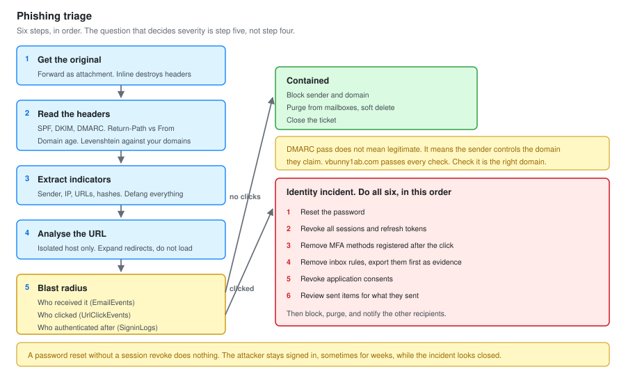

# 05 - Phishing Analysis

Header analysis, URL detonation, blast radius, and purge. Run against 14 reported messages.

Phishing is the highest volume ticket type in most SOCs and the one where a Tier 1 analyst has the most direct impact. It is also the one where the workflow matters more than the intuition.

---

## The Workflow



Six steps, in order. Skipping straight to "is the link bad" is the common mistake, because it answers the wrong question. The question that decides severity is **did anyone click**.

---

## Step 1: Get the Original

**Forwarded as an attachment, never forwarded inline.**

Inline forwarding rewrites the headers. The `Received` chain, the authentication results and the originating IP are all gone, which removes every field you were about to analyse.

In Outlook: right click the message, Forward as Attachment. Or drag it to a new message.

If the user already forwarded it inline, do not analyse what arrived. Pull the original from the mail environment instead:

```powershell
Connect-ExchangeOnline
Get-MessageTrace -RecipientAddress 'vbunny@vbunnylab.com' `
                 -StartDate (Get-Date).AddDays(-7) -EndDate (Get-Date) |
    Where-Object Subject -like '*Invoice*' |
    Select-Object Received, SenderAddress, Subject, MessageId, Status
```

---

## Step 2: Headers

### What to read, in order

| Header | Question it answers |
| --- | --- |
| `Authentication-Results` | Did SPF, DKIM and DMARC pass |
| `Return-Path` | Where bounces go. Different from `From` is a signal |
| `Received` | The delivery chain. **Read bottom up.** The bottom entry is the origin |
| `Reply-To` | Where replies go. Different from `From` redirects the conversation |
| `Message-ID` | Its domain should match the sending domain |
| `X-Originating-IP` | Geolocate and compare against the claimed sender |

### Reading authentication results

```text
Authentication-Results: spf=pass (sender IP is 198.51.100.44)
 smtp.mailfrom=vbunny1ab.com; dkim=pass (signature was verified)
 header.d=vbunny1ab.com; dmarc=pass action=none
 header.from=vbunny1ab.com;
```

Everything passed. This is still phishing.

**DMARC pass does not mean legitimate. It means the sender controls the domain they claim.** An attacker who registers `vbunny1ab.com` and configures SPF and DKIM properly passes every check, because they genuinely own that domain.

The question is not "did it authenticate". It is "is this the right domain". `vbunny1ab.com` versus `vbunnylab.com`, with a one for the l. That is the entire attack.

### What each result actually tells you

| Result | Means |
| --- | --- |
| `spf=fail` | The sending IP is not authorised for that domain. Spoofed |
| `spf=softfail` | Not authorised, but the domain says do not reject. Weak policy |
| `spf=none` | The domain has no SPF record at all. Often a throwaway domain |
| `dkim=fail` | The signature did not verify. Message altered, or spoofed |
| `dkim=none` | Not signed. Common and not conclusive |
| `dmarc=fail` | Alignment failed. Strong signal |
| Everything passes | The sender owns the domain. **Now check if it is the right domain** |

### Domain age

Fast, underused, and frequently the whole answer.

```bash
whois vbunny1ab.com | grep -i "creation\|registered"
```

A domain registered four days ago that is sending invoices is not a close call. Legitimate businesses do not send invoices from domains younger than the invoice.

### Lookalike detection

```kql
let LegitDomains = dynamic(["vbunnylab.com", "microsoft.com", "office365.com"]);
EmailEvents
| where TimeGenerated > ago(7d)
| extend SenderDomain = tostring(split(SenderFromAddress, "@")[1])
| where SenderDomain !in (LegitDomains)
| extend Similarity = toreal(0)
| mv-apply Legit = LegitDomains to typeof(string) on (
    extend Dist = levenshtein(SenderDomain, Legit)
    | where Dist between (1 .. 3)
    | project Legit, Dist)
| project TimeGenerated, SenderFromAddress, SenderDomain, Legit, Dist, Subject, RecipientEmailAddress
| order by Dist asc
```

Levenshtein distance is the number of single-character edits between two strings. A distance of 1 to 3 from a domain you own is a lookalike. `vbunny1ab.com` scores 1 against `vbunnylab.com`.

---

## Step 3: Extract Indicators

Everything that can be blocked or searched for.

```text
Sender address       billing@vbunny1ab.com
Sender domain        vbunny1ab.com
Sending IP           198.51.100.44
Reply-To             accounts.recovery@protonmail.com
Subject              Outstanding Invoice 4471 - Action Required
URLs                 hxxps://vbunny1ab[.]com/portal/login
Attachments          Invoice-4471.html  SHA256 3f9a...
Message-ID           <a4f2...@vbunny1ab.com>
```

**Defang every URL and IP in a ticket.** `hxxps` instead of `https`, brackets around the dots. It stops the ticketing system auto-linking it and stops a colleague clicking it by reflex.

---

## Step 4: URL Analysis

**Never from your own workstation.** Use an isolated analysis VM with no corporate credentials on it, or a sandbox service.

### Expand the redirect chain without loading the page

```bash
curl -sIL 'hxxps://short.example/abc' | grep -i '^location'
```

`-I` requests headers only, `-L` follows redirects. You see the chain without rendering anything.

### What to look for at the destination

| Signal | Means |
| --- | --- |
| A login page that is not on the real domain | Credential harvest |
| The real brand's images loaded from the real site | Lazy cloning, very common |
| A form posting to a different domain | Where the credentials go |
| Base64 in the URL path | Often the target email, pre-filled |
| Cloudflare or similar in front | Hiding the real host |

The pre-filled email is worth understanding. Many phishing kits encode the target address into the URL so the page can display it, which makes the page look personalised. It also means the URL is unique per recipient, so searching for an exact match misses the others. **Search on the domain, not the full URL.**

### Attachments

```bash
sha256sum Invoice-4471.html
file Invoice-4471.html
```

An `.html` attachment claiming to be an invoice is nearly always an HTML smuggling payload. It renders a local page that either harvests credentials or reconstructs a binary in the browser, which gets it past attachment scanning because the file itself contains no executable content.

---

## Step 5: Blast Radius

**The most important step, and the one that decides severity.**

### Who received it

```kql
EmailEvents
| where TimeGenerated > ago(7d)
| where SenderFromDomain == "vbunny1ab.com"
   or Subject has "Outstanding Invoice 4471"
| project TimeGenerated, SenderFromAddress, RecipientEmailAddress, Subject,
          DeliveryAction, DeliveryLocation, ThreatTypes, NetworkMessageId
| order by TimeGenerated asc
```

`DeliveryLocation` matters. `Inbox` means the user saw it. `JunkFolder` means most did not. `Quarantine` means nobody did.

### Who clicked

```kql
let Window = 7d;
let BadUrls =
    EmailUrlInfo
    | where TimeGenerated > ago(Window)
    | where UrlDomain == "vbunny1ab.com"
    | distinct Url, NetworkMessageId;
UrlClickEvents
| where TimeGenerated > ago(Window)
| join kind=inner BadUrls on Url
| project TimeGenerated, AccountUpn, Url, ActionType, IPAddress, IsClickedThrough
| order by TimeGenerated asc
```

`ActionType` of `ClickAllowed` means Safe Links let them through. `IsClickedThrough` true means they were warned and continued anyway.

If nobody clicked, this is a contained phishing ticket. If somebody clicked, it becomes an identity incident and the next query is the one that matters.

### Did anyone authenticate afterwards

```kql
let Clickers = dynamic(["vbunny@vbunnylab.com"]);
let ClickTime = datetime(2026-09-14 09:41:00);
union SigninLogs, AADNonInteractiveUserSignInLogs
| where TimeGenerated between (ClickTime .. ClickTime + 6h)
| where UserPrincipalName in~ (Clickers)
| extend Country = tostring(LocationDetails.countryOrRegion)
| project TimeGenerated, UserPrincipalName, IPAddress, Country,
          AppDisplayName, ClientAppUsed, ResultType, ResultDescription
| order by TimeGenerated asc
```

A successful sign-in from an unfamiliar IP within minutes of the click is credential theft in progress.

### Did the attacker act

Run these three regardless, because they are cheap and they are what the attacker does next.

```kql
// New inbox rules
OfficeActivity
| where TimeGenerated > ago(24h)
| where UserId in~ (Clickers)
| where Operation in ("New-InboxRule", "Set-InboxRule", "UpdateInboxRules")
| project TimeGenerated, UserId, ClientIP, Operation, Parameters
```

```kql
// New MFA methods registered
AuditLogs
| where TimeGenerated > ago(24h)
| where OperationName has_any ("Add security info", "User registered security info",
                               "Update user", "Register device")
| extend Target = tostring(TargetResources[0].userPrincipalName)
| where Target in~ (Clickers)
| project TimeGenerated, Target, OperationName, Result
```

```kql
// Application consent granted
AuditLogs
| where TimeGenerated > ago(24h)
| where OperationName has "Consent to application"
| extend Actor = tostring(InitiatedBy.user.userPrincipalName)
| where Actor in~ (Clickers)
| project TimeGenerated, Actor, OperationName,
          App = tostring(TargetResources[0].displayName)
```

**A new MFA method registered after a credential theft is the attacker establishing their own persistence.** They now pass MFA on their own device, and resetting the password does not remove it.

---

## Step 6: Contain

### If nobody clicked

| Action | Command |
| --- | --- |
| Block sender and domain | Tenant Allow/Block List |
| Purge from mailboxes | Search and purge, below |
| Warn recipients | Through the agreed channel, not a mass email that looks like phishing |

### If someone clicked but did not submit

| Action | Notes |
| --- | --- |
| Block the URL and domain | Safe Links plus the block list |
| Confirm no credentials entered | Ask them. They usually remember |
| Monitor the account for 48 hours | |

### If credentials were submitted

**Order matters. Do all six.**

```text
1. Reset the password
2. Revoke all sessions          <- without this, step 1 does nothing
3. Check and remove MFA methods registered after the click
4. Check and remove inbox rules
5. Check and revoke application consents
6. Review sent items for what the attacker sent from the account
```

```powershell
# Revoke every refresh token for the user
Connect-MgGraph -Scopes "User.ReadWrite.All"
Revoke-MgUserSignInSession -UserId "vbunny@vbunnylab.com"
```

**Step 2 is the one people miss.** A password reset does not invalidate an existing session or refresh token. The attacker stays signed in, sometimes for weeks, while everyone believes the incident is closed.

### Purge

```powershell
Connect-IPPSSession

New-ComplianceSearch -Name "Phish-2026-0914" `
  -ExchangeLocation All `
  -ContentMatchQuery 'from:billing@vbunny1ab.com AND subject:"Outstanding Invoice 4471"'

Start-ComplianceSearch -Identity "Phish-2026-0914"
Get-ComplianceSearch -Identity "Phish-2026-0914" | Select-Object Status, Items

# Soft delete first, recoverable
New-ComplianceSearchAction -SearchName "Phish-2026-0914" -Purge -PurgeType SoftDelete
```

**Always run the search and read the item count before purging.** A `ContentMatchQuery` that is broader than intended will delete legitimate mail out of every mailbox in the tenant, and `HardDelete` is not recoverable.

`SoftDelete` puts messages in Recoverable Items, where they can be restored. Use it unless there is a specific reason not to.

---

## Results Across 14 Reports

| # | Type | Authenticated | Clicked | Credentials | Disposition |
| --- | --- | :---: | :---: | :---: | --- |
| PH-01 | Invoice, lookalike domain | SPF/DKIM/DMARC pass | 1 of 6 | No | True positive, blocked and purged |
| PH-02 | Microsoft 365 credential page | SPF fail | 0 of 12 | No | True positive, purged |
| PH-03 | HR payroll update | DMARC fail | 2 of 4 | **Yes, 1** | **Incident, see case CF-03** |
| PH-04 | Legitimate vendor invoice | All pass | n/a | n/a | False positive, user educated |
| PH-05 | DocuSign lookalike | SPF none | 0 of 8 | No | True positive, purged |
| PH-06 | Internal, compromised partner | All pass | 3 of 9 | No | True positive, partner notified |
| PH-07 | Gift card request, display name spoof | SPF pass, wrong domain | 0 of 2 | No | True positive, BEC attempt |
| PH-08 | Marketing newsletter | All pass | n/a | n/a | False positive |
| PH-09 | HTML smuggling attachment | DMARC fail | 1 of 5 | No | True positive, device scanned |
| PH-10 | Voicemail notification | SPF softfail | 0 of 7 | No | True positive, purged |
| PH-11 | Shared document, OneDrive lookalike | SPF fail | 0 of 3 | No | True positive, purged |
| PH-12 | Password expiry notice | SPF none | 1 of 11 | No | True positive, purged |
| PH-13 | Internal IT survey, authorised | All pass | n/a | n/a | Benign positive, security awareness test |
| PH-14 | Courier delivery failure | DMARC fail | 0 of 6 | No | True positive, purged |

**Eleven true positives, two false positives, one benign positive.**

### What the numbers say

**Display name spoofing is the most effective technique here.** PH-07 came from a free mail provider with the display name set to the finance director. SPF passed, because the attacker legitimately owns their free mail account. Nothing in the authentication results was wrong. The attack was entirely in the display name, which is the one field no protocol validates.

**Users clicked 9 out of 14 times at least once.** That is not a criticism of the users. It is the argument for Safe Links, because in several of these the click was allowed and the protection was what stopped it becoming a credential theft.

**PH-04 and PH-08 were legitimate.** Both were reported because they looked unusual. Neither user was made to feel stupid, which is the only way the eleven real ones get reported too.

**PH-13 was our own awareness test** and it went through the full workflow before anyone checked the schedule. Change calendar first, always. That one is why it is step four of the universal first steps.

---

## Metrics

| Measure | Value |
| --- | --- |
| Reports triaged | 14 |
| Median time to triage | 9 minutes |
| Median time to purge, where purged | 21 minutes |
| True positive rate | 79 percent |
| Reports leading to an incident | 1 |
| Messages purged | 63 across all campaigns |

**A 79 percent true positive rate on user reports is a good number and it should not be higher.** A SOC where every reported message is malicious is a SOC where users only report the obvious ones. The two false positives are evidence the reporting culture works.

---

## What I Would Add

**Automated enrichment.** Sender reputation, domain age and URL detonation take five minutes per report by hand. Playbook `PB-Enrich-Phish` in [06-SOAR-Automation.md](06-SOAR-Automation.md) does the first two. Detonation is not automated yet.

**A user feedback loop.** Nobody told the fourteen reporters what happened. Telling someone their report stopped a campaign is the cheapest way to get the next one reported, and it was not done.

**Attack simulation training.** PH-13 was the only simulated message and it was not part of a programme. A measured baseline of click rates would make the case for Safe Links configuration changes far stronger than an anecdote.

---

Next: [06-SOAR-Automation.md](06-SOAR-Automation.md)
