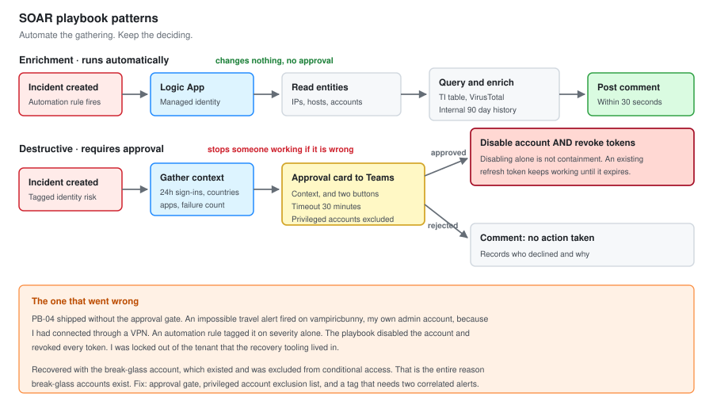

# 06 - SOAR Automation

Six Logic App playbooks attached to Sentinel. What they do, how they are wired, and the one that went wrong.

---

## What Automation Is Actually For

Not replacing the analyst. Removing the parts of triage that are the same every time.

Every phishing report needs the sender reputation checked. Every device alert needs the device owner looked up. Every identity alert needs the user's recent sign-ins pulled. None of that requires judgement, and all of it takes five minutes by hand.

**Automate the gathering. Keep the deciding.**



---

## How It Connects

| Component | Role |
| --- | --- |
| **Logic App** | The workflow itself |
| **Sentinel connector** | Trigger, and the actions that write back to the incident |
| **Managed identity** | How the Logic App authenticates, instead of stored credentials |
| **Automation rule** | What decides which playbook runs on which incident |

### Trigger types

| Trigger | Fires on | Use for |
| --- | --- | --- |
| Incident trigger | Incident created or updated | Most things. Has entities available |
| Alert trigger | Individual alert | When you need per-alert action |
| Entity trigger | Analyst clicks an entity | On-demand enrichment |

**Use the incident trigger unless you have a reason not to.** It has the full entity list, and entities are what every useful playbook operates on.

### Managed identity, not stored credentials

Every playbook here uses a system-assigned managed identity with the narrowest role that works.

```bash
# Grant the Logic App permission to comment on incidents, nothing more
az role assignment create \
  --assignee-object-id <logic-app-principal-id> \
  --assignee-principal-type ServicePrincipal \
  --role "Microsoft Sentinel Responder" \
  --scope /subscriptions/<sub>/resourceGroups/rg-vbunnylab-soc
```

| Role | Grants | Used by |
| --- | --- | --- |
| Microsoft Sentinel Reader | Read incidents | Nothing here. Too narrow |
| Microsoft Sentinel Responder | Comment, tag, change status | PB-01 through PB-04 |
| Microsoft Sentinel Contributor | Everything including rules | Nothing. Too broad |

**A playbook with a stored service account password is a credential sitting in a workflow definition.** Managed identity removes the credential entirely, and it is one of the clearest signs of whether an automation was built carefully.

---

## PB-01: Enrich With Threat Intelligence

**Trigger:** Incident created
**Runs on:** Any incident with an IP or URL entity
**Action:** Comment only. Changes nothing

### What it does

```text
1. Trigger on incident creation
2. Get entities: IPs
3. For each IP:
     - Query the ThreatIntelligenceIndicator table
     - Call VirusTotal for reputation
     - Call AbuseIPDB for abuse confidence
     - Geolocate
4. Build a markdown table
5. Post as an incident comment
6. If any source flags it malicious, add tag "TI-Hit"
```

### The enrichment query

```kql
let TargetIP = "{IP_ENTITY}";
ThreatIntelligenceIndicator
| where TimeGenerated > ago(30d)
| where Active == true
| where NetworkIP == TargetIP or NetworkSourceIP == TargetIP
| summarize
    Sources     = make_set(SourceSystem),
    ThreatTypes = make_set(ThreatType),
    MaxConfidence = max(ConfidenceScore),
    Descriptions  = make_set(Description, 3)
  by NetworkIP
```

### The internal history query, which matters more

```kql
let TargetIP = "{IP_ENTITY}";
union isfuzzy=true
    (DeviceNetworkEvents
     | where RemoteIP == TargetIP
     | summarize Devices = dcount(DeviceName), DeviceList = make_set(DeviceName, 10),
                 FirstSeen = min(TimeGenerated), Connections = count()
     | extend Source = "DeviceNetworkEvents"),
    (SigninLogs
     | where IPAddress == TargetIP
     | summarize Devices = dcount(UserPrincipalName), DeviceList = make_set(UserPrincipalName, 10),
                 FirstSeen = min(TimeGenerated), Connections = count()
     | extend Source = "SigninLogs")
| where TimeGenerated > ago(90d) or isnotempty(Source)
```

**"Have we seen this before" is a better question than "is it on a blocklist".** An IP with no reputation that three machines contacted for the first time today is more interesting than a known-bad IP that one machine hit once.

### Output

```markdown
## Threat Intelligence: 198.51.100.44

| Source | Result |
| --- | --- |
| Sentinel TI | 2 indicators, max confidence 85 |
| VirusTotal | 11 of 89 engines malicious |
| AbuseIPDB | 94 percent confidence, 312 reports |
| Geolocation | NL, AS204957 |

**Internal history**
First seen 2026-09-14 09:42. 1 device (WS11-01). 3 connections.
No prior history in 90 days.
```

Posted automatically within 30 seconds of incident creation. The analyst opens the incident and the enrichment is already there.

---

## PB-02: Enrich Phishing Report

**Trigger:** Incident created, on incidents tagged `Phishing`
**Action:** Comment only

### What it does

```text
1. Extract sender domain from the incident
2. WHOIS lookup for registration date
3. Calculate domain age in days
4. Check SPF, DKIM and DMARC records exist for the domain
5. Levenshtein distance against the organisation's own domains
6. Count recipients from EmailEvents
7. Count clicks from UrlClickEvents
8. Post a summary. If clicks > 0, raise severity to High
```

### The blast radius query

```kql
let Sender = "{SENDER_FROM_INCIDENT}";
let Window = 7d;
let Messages =
    EmailEvents
    | where TimeGenerated > ago(Window)
    | where SenderFromAddress =~ Sender
    | project NetworkMessageId, RecipientEmailAddress, DeliveryLocation, Subject;
let Clicks =
    UrlClickEvents
    | where TimeGenerated > ago(Window)
    | project AccountUpn, Url, ActionType, ClickTime = TimeGenerated;
Messages
| summarize
    Recipients = dcount(RecipientEmailAddress),
    Delivered  = countif(DeliveryLocation == "Inbox"),
    Junked     = countif(DeliveryLocation == "JunkFolder"),
    Quarantined = countif(DeliveryLocation == "Quarantine"),
    RecipientList = make_set(RecipientEmailAddress, 25)
| extend Clickers = toscalar(Clicks | summarize dcount(AccountUpn))
```

### Why the severity bump is automatic

A phishing report where nobody clicked is a ticket. A phishing report where somebody clicked is an identity incident.

That distinction is objective, it comes straight from `UrlClickEvents`, and it does not need an analyst to make it. Automating the severity raise means the incident is already in the right place in the queue before anyone opens it.

**Domain age is the other automatic signal.** Under 30 days pushes the incident to High on its own. Legitimate businesses do not send invoices from domains younger than the invoice.

---

## PB-03: Notify and Assign

**Trigger:** Incident created, severity High or above
**Action:** Posts to Teams, assigns to the on-call analyst

### What it does

```text
1. Read the on-call roster from a Sentinel watchlist
2. Determine who is on shift from the current time
3. Assign the incident to them
4. Post an adaptive card to the SOC Teams channel
5. Card carries: title, severity, entities, and a link to the incident
```

### The roster lookup

```kql
let Now = now();
_GetWatchlist('OnCallRoster')
| extend
    ShiftStart = todatetime(ShiftStart),
    ShiftEnd   = todatetime(ShiftEnd)
| where Now between (ShiftStart .. ShiftEnd)
| project AnalystEmail = SearchKey, AnalystName, Tier
| take 1
```

### The card

```json
{
  "type": "AdaptiveCard",
  "version": "1.4",
  "body": [
    { "type": "TextBlock", "text": "@{triggerBody()?['object']?['properties']?['title']}",
      "weight": "Bolder", "size": "Medium", "wrap": true },
    { "type": "FactSet", "facts": [
      { "title": "Severity",  "value": "@{triggerBody()?['object']?['properties']?['severity']}" },
      { "title": "Incident",  "value": "@{triggerBody()?['object']?['properties']?['incidentNumber']}" },
      { "title": "Assigned",  "value": "@{variables('AnalystName')}" },
      { "title": "Entities",  "value": "@{variables('EntitySummary')}" }
    ]}
  ],
  "actions": [
    { "type": "Action.OpenUrl", "title": "Open in Sentinel",
      "url": "@{triggerBody()?['object']?['properties']?['incidentUrl']}" }
  ]
}
```

**Assignment is the part that matters, not the notification.** An unassigned incident gets worked twice or not at all. Automatic assignment from a roster means there is always a named owner from the moment it is created.

---

## PB-04: Disable Account, With Approval

**Trigger:** Incident created, on incidents with an Account entity and a tag of `IdentityCompromise`
**Action:** Posts an approval. Disables the account only on approval

### What it does

```text
1. Extract the account entity
2. Pull recent sign-ins for context
3. Post an approval card to Teams with the context and two buttons
4. Wait for a response, timeout 30 minutes
5. If approved:
     - Disable the account in Entra ID
     - Revoke all refresh tokens
     - Comment the action and who approved it
6. If rejected or timed out:
     - Comment that no action was taken, and why
```

### The context posted with the approval

```kql
let Account = "{ACCOUNT_ENTITY}";
union SigninLogs, AADNonInteractiveUserSignInLogs
| where TimeGenerated > ago(24h)
| where UserPrincipalName =~ Account
| extend Country = tostring(LocationDetails.countryOrRegion)
| summarize
    Signins   = count(),
    Countries = make_set(Country),
    IPs       = make_set(IPAddress, 10),
    Apps      = make_set(AppDisplayName, 10),
    Failures  = countif(ResultType != 0)
  by UserPrincipalName
```

### The two actions, and why both

```text
Disable the account      Stops new sign-ins
Revoke refresh tokens    Stops existing sessions
```

**Disabling alone is not containment.** An existing refresh token keeps working until it expires. An attacker with a stolen token can continue for hours after the account is disabled, and the incident looks contained while it is not.

```powershell
# What the playbook calls, via Graph
Update-MgUser -UserId $upn -AccountEnabled:$false
Revoke-MgUserSignInSession -UserId $upn
```

### Why approval, not automatic

Disabling an account stops someone working. Get it wrong on an executive during a board meeting and the automation gets switched off permanently, which costs more than the incident did.

**The approval gate is the difference between automation people trust and automation people disable.** Thirty seconds of human confirmation preserves the capability.

---

## PB-05: Isolate Device, With Approval

**Trigger:** Manual, or from SEN-004 (LSASS access)
**Action:** Defender for Endpoint device isolation, on approval

### What it does

```text
1. Extract the host entity
2. Resolve to a Defender device ID
3. Pull the last hour of process activity for context
4. Post an approval card
5. If approved:
     - Call the Defender isolate API, Selective mode
     - Comment with the isolation ID and who approved it
6. Tag the incident "Contained"
```

### Selective versus full isolation

| Mode | Blocks | Leaves working |
| --- | --- | --- |
| **Full** | All network traffic | Defender connectivity only |
| **Selective** | All traffic except approved apps | Teams, Outlook, Defender |

Selective is the default here. It contains the machine while letting you talk to the person using it, which matters because the user is a data source and full isolation cuts them off exactly when you need to ask what they clicked.

### The one rule

**Do not reboot. Do not let anyone reboot.**

Isolation preserves memory. A reboot destroys it, and on a credential access incident the memory is the only thing that answers what was taken. The approval card says this in bold, because under pressure somebody always suggests restarting it.

---

## PB-06: Close Benign Positives

**Trigger:** Incident created, on SEN-012 (rare process)
**Action:** Auto-closes incidents matching a documented allowlist

### What it does

```text
1. Extract the file hash entity
2. Check it against the ApprovedSoftware watchlist
3. If present and the signer matches:
     - Set status Closed, classification BenignPositive
     - Comment with the watchlist entry that matched
4. If not present, leave it alone
```

### The check

```kql
let Hash = "{FILEHASH_ENTITY}";
_GetWatchlist('ApprovedSoftware')
| where SearchKey =~ Hash
| project SHA256 = SearchKey, SoftwareName, Signer, ApprovedBy, ApprovedDate
```

### The rules I put around auto-closure

Auto-closing incidents is how a SOC misses things. Three constraints make it safe enough:

**Hash only, never filename or path.** Both are attacker-controlled. A hash is not.

**Only SEN-012**, which is a Low severity review feed, never an alerting rule.

**Every closure is commented with the watchlist entry that matched**, so the decision is auditable rather than invisible.

An entry only goes on the watchlist after a human has investigated it once and written down why. The watchlist has 23 entries and every one has a name and a date against it.

---

## The One That Went Wrong

**PB-04, first version, had no approval gate.**

It ran automatically on any incident with an Account entity and an `IdentityCompromise` tag. The logic was sound, the Graph calls worked, and I tested it against a test account successfully.

Then SEN-003 (impossible travel) fired on `vampiricbunny`, my own admin account, because I had connected through a VPN. An automation rule tagged it `IdentityCompromise` based on severity. PB-04 disabled the account and revoked every token.

I was locked out of the tenant that the recovery tooling lived in.

### What fixed it

```text
1. Break-glass account, which existed and was excluded from conditional
   access. This is the entire reason break-glass accounts exist
2. Re-enabled vampiricbunny
3. Added the approval gate
4. Added an exclusion for accounts on the PrivilegedAccounts watchlist
5. Changed the automation rule so the tag requires two correlated
   alerts, not one alert at a given severity
```

### What it taught me

**Automated response needs a blast radius assessment before it needs a workflow.** I thought about whether the automation would work. I did not think about what happens when it works on the wrong target.

**Every destructive automation needs an exclusion list, and privileged accounts belong on it.** The accounts most likely to trigger a behavioural rule are the ones doing unusual things legitimately, which is exactly what administrators do all day.

**The break-glass account is not paperwork.** It was the only reason this was a 20 minute problem instead of a support ticket with Microsoft. It had been set up as a checkbox exercise and it turned out to be the thing that mattered.

I left this in the document rather than quietly fixing it, because it is the most useful thing in the file.

---

## Summary

| Playbook | Trigger | Destructive | Approval | Runs per week |
| --- | --- | :---: | :---: | :---: |
| PB-01 Enrich with TI | Incident created | No | No | 34 |
| PB-02 Enrich phishing | Tagged Phishing | No | No | 9 |
| PB-03 Notify and assign | High or above | No | No | 12 |
| PB-04 Disable account | Tagged IdentityCompromise | **Yes** | **Yes** | 2 |
| PB-05 Isolate device | SEN-004 or manual | **Yes** | **Yes** | 1 |
| PB-06 Close benign | SEN-012 | No | No | 41 |

**Four enrichment playbooks, two destructive ones, and both destructive ones require approval.**

### Time saved

| Task | By hand | Automated |
| --- | --- | --- |
| IP reputation and internal history | 4 min | 0 |
| Phishing domain age and blast radius | 6 min | 0 |
| Assignment and notification | 2 min | 0 |
| Rare process allowlist check | 3 min | 0 |

Roughly 4 hours a week across the volumes above, and more importantly the enrichment is already on the incident when the analyst opens it rather than being something they have to go and get.

---

## What I Would Build Next

**URL detonation in PB-02.** Still manual, still the slowest part of phishing triage.

**Automatic inbox rule check** on any identity incident. It is three queries and they are the same three every time.

**A playbook that reverses PB-04.** Re-enabling an account and documenting it is currently manual, which means the undo path is slower than the do path. That is backwards for anything destructive.

---

Next: [07-Shift-Operations.md](07-Shift-Operations.md)
