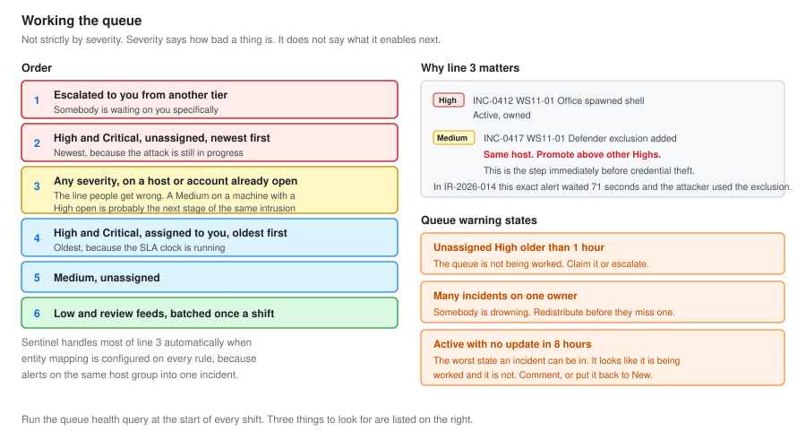

# 07 - Shift Operations

Running the queue. Prioritisation, handover, SLA measurement, and the metrics a SOC lead actually asks for.

The technical work is only half of a SOC 1 role. The other half is that the queue stays under control across shifts, and that somebody can pick up your work when you go home.

---

## Working the Queue



### The order

Not strictly by severity. Severity says how bad a thing is. It does not say what it enables next.

```text
1. Anything already escalated to you from another tier
2. High and Critical, unassigned, newest first
3. Any severity, on a host or account that already has an open incident
4. High and Critical, assigned to you, oldest first
5. Medium, unassigned
6. Low and the review feeds, in a batch, once a shift
```

**Line 3 is the one that is easy to get wrong.** A Medium alert on a machine that already has a High open is not a Medium. It is probably the next stage of the same intrusion.

In [IR-2026-014](../Junior-SOC-Analyst/07-Incident-Report.md) a Level 13 Defender tampering alert sat unworked while a Level 14 was being triaged, and 71 seconds later the attacker used the exclusion that alert described. Strict severity ordering caused that.

Sentinel's entity grouping handles most of this automatically when entity mapping is configured, which is why [03-Analytics-Rules.md](03-Analytics-Rules.md) maps entities on every rule.

### Queue health query

Run at the start of every shift.

```kql
SecurityIncident
| where TimeGenerated > ago(7d)
| summarize arg_max(TimeGenerated, *) by IncidentNumber
| where Status != "Closed"
| extend AgeHours = datetime_diff('hour', now(), CreatedTime)
| extend Owner = iff(isempty(tostring(Owner.userPrincipalName)), "UNASSIGNED", tostring(Owner.userPrincipalName))
| summarize
    Count   = count(),
    Oldest  = max(AgeHours),
    Numbers = make_list(IncidentNumber, 10)
  by Severity, Status, Owner
| order by Severity asc, Oldest desc
```

Three things to look for:

| Signal | Means |
| --- | --- |
| Unassigned High older than 1 hour | The queue is not being worked |
| Many incidents on one owner | Someone is drowning, redistribute |
| Anything open longer than 72 hours | Either stuck or should be closed |

### Ageing incidents

```kql
SecurityIncident
| summarize arg_max(TimeGenerated, *) by IncidentNumber
| where Status == "Active"
| extend AgeHours = datetime_diff('hour', now(), CreatedTime)
| extend HoursSinceUpdate = datetime_diff('hour', now(), LastModifiedTime)
| where HoursSinceUpdate > 8
| project IncidentNumber, Title, Severity, AgeHours, HoursSinceUpdate,
          Owner = tostring(Owner.userPrincipalName)
| order by HoursSinceUpdate desc
```

**Active with no update in eight hours is the worst state an incident can be in.** It looks like it is being worked and it is not. Either somebody is on it, in which case they should comment, or nobody is, in which case it should go back to New.

---

## SLA

### Targets

| Severity | Acknowledge | Triage | Resolve or escalate |
| --- | --- | --- | --- |
| Critical | 15 min | 30 min | 1 hour |
| High | 30 min | 1 hour | 4 hours |
| Medium | 2 hours | 4 hours | 24 hours |
| Low | 8 hours | 24 hours | 5 days |

**Acknowledge means somebody owns it.** Not that work has started. The distinction matters because an unowned incident is invisible, and the acknowledgement clock is the one that catches a queue nobody is watching.

### Measuring it

```kql
let Targets = datatable(Severity:string, AckMins:int, TriageMins:int)
[
    "High",     30,  60,
    "Medium",  120, 240,
    "Low",     480, 1440
];
SecurityIncident
| where TimeGenerated > ago(30d)
| summarize arg_max(TimeGenerated, *) by IncidentNumber
| where Status == "Closed"
| extend
    AckMins    = datetime_diff('minute', FirstModifiedTime, CreatedTime),
    ResolveMins = datetime_diff('minute', ClosedTime, CreatedTime)
| join kind=inner Targets on Severity
| extend AckMet = AckMins <= AckMins1
| summarize
    Incidents      = count(),
    MedianAck      = percentile(AckMins, 50),
    P90Ack         = percentile(AckMins, 90),
    MedianResolve  = percentile(ResolveMins, 50),
    SLAMetPercent  = round(countif(AckMet) * 100.0 / count(), 1)
  by Severity
| order by Severity asc
```

### Results over 30 days

| Severity | Incidents | Median ack | P90 ack | Target | SLA met |
| --- | :---: | :---: | :---: | :---: | :---: |
| High | 14 | 4 min | 11 min | 30 min | 100 percent |
| Medium | 31 | 38 min | 3 h 12 min | 2 hr | 87 percent |
| Low | 62 | 6 h 40 min | 19 h | 8 hr | 71 percent |

**Report the median and the P90, never the mean.** One incident that sat over a weekend drags the mean into uselessness. The median says what a normal incident looks like. The P90 says how bad the bad ones get, which is the number that actually describes the risk.

### Why Low misses SLA and why that is fine

Low severity is the review feed from SEN-012. It is batched once a shift rather than worked as it arrives, so by design it sits.

Two options: change the target to match the working pattern, or change the working pattern. The right answer is the first one, because batching a review feed is correct and a target that does not match reality just trains people to ignore targets.

**A missed SLA that is explained is a process finding. A missed SLA that is hidden is a problem.**

---

## Handover

The shift handover is the single highest leverage twenty minutes in a SOC.

### The format

```text
SHIFT HANDOVER  2026-09-14  Day to Night
From: <analyst>   To: <analyst>

OPEN AND ACTIVE
  INC-0412  High    WS11-01 device compromise
            Status: escalated to Tier 2 at 14:09, awaiting their response
            Next:   nothing from us until they come back
            Watch:  if they do not respond by 18:00, chase

  INC-0418  Medium  Impossible travel, m.calloway
            Status: waiting on the user to confirm VPN use
            Next:   close as benign positive if they confirm
            Watch:  no

CARRYING RISK
  WS11-02 isolated since 14:16. Still isolated deliberately.
  Do not reconnect without Tier 2 sign-off.

KNOWN NOISE TONIGHT
  Backup window 22:00 to 23:00 will fire SEN-012 on FS01.
  Veeam deployment service, expected, document 06 has the detail.

CHANGES IN FLIGHT
  Conditional access policy CA004 pilot starts 20:00.
  Expect legacy auth failures from the pilot group. Not an incident.

ENVIRONMENT
  All connectors healthy as of 17:45.
  DC01 agent restarted at 13:20 after DCR update, confirmed reporting.

NOTHING ELSE OUTSTANDING
```

### The five sections that matter

**Open and active**, with a next action for each. An incident handed over without a next action gets re-triaged from scratch.

**Carrying risk**, which is anything in a deliberately abnormal state. An isolated machine that nobody remembers isolating gets reconnected by someone being helpful.

**Known noise**, so the next shift does not investigate the backup job at 22:14.

**Changes in flight**, because a change window produces alerts that look exactly like attacks.

**Environment health**, because a connector that dies at 02:00 with nobody watching is a blind spot until morning.

### What not to put in it

Do not summarise incidents that are closed. Do not restate what the ticket already says. The handover is exceptions and context, not a report.

---

## Shift Start Checklist

```text
[ ] Read the handover. Ask about anything unclear before the other analyst leaves
[ ] Queue health query. Note anything unassigned or ageing
[ ] Connector health. Every source reporting
[ ] Agent health. No machine silent more than 30 minutes
[ ] Change calendar for this shift
[ ] Any incidents assigned to me from the previous shift
[ ] Claim the oldest unassigned High
```

**Asking questions before the other analyst leaves is the step people skip out of politeness.** Five minutes of questions at handover saves an hour of reconstruction at 02:00.

### Connector health

```kql
union withsource=TableName *
| where TimeGenerated > ago(4h)
| summarize Events = count(), Latest = max(TimeGenerated) by TableName
| extend MinutesSinceLast = datetime_diff('minute', now(), Latest)
| where MinutesSinceLast > 60
| order by MinutesSinceLast desc
```

Empty result is what you want. Anything returned is a source that has gone quiet.

---

## Metrics

### What a SOC lead asks for

| Metric | Why they ask | Where it comes from |
| --- | --- | --- |
| Incident volume by severity | Capacity planning | `SecurityIncident` |
| Median time to acknowledge | Is the queue being watched | `FirstModifiedTime - CreatedTime` |
| Median time to resolve | Throughput | `ClosedTime - CreatedTime` |
| True positive rate | Are the rules any good | `Classification` |
| Top firing rules | What to tune next | `SecurityAlert` |
| Escalation rate | Tier 1 effectiveness | Incidents closed by Tier 1 versus escalated |

### The monthly numbers

```kql
SecurityIncident
| where TimeGenerated > ago(30d)
| summarize arg_max(TimeGenerated, *) by IncidentNumber
| summarize
    Total          = count(),
    Closed         = countif(Status == "Closed"),
    TruePositive   = countif(Classification == "TruePositive"),
    BenignPositive = countif(Classification == "BenignPositive"),
    FalsePositive  = countif(Classification == "FalsePositive"),
    Undetermined   = countif(Classification == "Undetermined")
| extend
    TPRate = round(TruePositive * 100.0 / Closed, 1),
    FPRate = round(FalsePositive * 100.0 / Closed, 1)
```

| Measure | 30 days |
| --- | --- |
| Incidents created | 107 |
| Closed | 103 |
| True positive | 38 (37 percent) |
| Benign positive | 21 (20 percent) |
| False positive | 39 (38 percent) |
| Undetermined | 5 (5 percent) |
| Escalated to Tier 2 | 9 (8 percent) |

### Reading those numbers honestly

**38 percent false positive is higher than I would like**, and SEN-003 accounts for most of it. Kept deliberately at Medium because it correlates well with other alerts, but it is the obvious tuning target.

**20 percent benign positive is a healthy number.** Those are real detections firing on authorised activity. A SOC with no benign positives has either no change activity or rules that are too narrow.

**5 percent undetermined is the number to watch.** Every one of those five was a gap in telemetry rather than a gap in analysis. Two were sign-ins from an IP with no matching device data, which is the case for onboarding the remaining endpoints.

**8 percent escalation rate is about right for Tier 1.** Much lower and Tier 1 is holding things they should pass up. Much higher and they are passing things they could resolve.

### Top firing rules

```kql
SecurityAlert
| where TimeGenerated > ago(30d)
| summarize Alerts = count() by AlertName, AlertSeverity
| join kind=leftouter (
    SecurityIncident
    | where TimeGenerated > ago(30d)
    | summarize arg_max(TimeGenerated, *) by IncidentNumber
    | mv-expand AlertId = AlertIds
    | summarize
        FP = countif(Classification == "FalsePositive"),
        TP = countif(Classification == "TruePositive")
      by Title
  ) on $left.AlertName == $right.Title
| extend FPRate = round(FP * 100.0 / (FP + TP + 1), 1)
| project AlertName, AlertSeverity, Alerts, TP, FP, FPRate
| order by Alerts desc
```

This is the query that drives the weekly tuning session. Rules sorted by volume, with their false positive rate beside them. The top of that list is where the next hour of tuning goes.

---

## Weekly Rhythm

| When | What |
| --- | --- |
| Every shift start | Handover, queue health, connector health |
| Every shift end | Handover written, incidents updated or reassigned |
| Daily | SEN-012 review feed, batched |
| Weekly | Top firing rules review, one tuning change |
| Weekly | Ingestion cost check |
| Monthly | Metrics pack, SLA report, coverage review |

**One tuning change a week, not ten.** Change one rule, measure for a week, keep or revert. Changing several at once means you cannot attribute the result, and a rule set that has been adjusted without measurement drifts quietly into uselessness.

---

## What I Would Improve

**Handover is manual.** It should pull the open incident list automatically and leave the analyst to write only the context. Ten minutes a shift, twice a day, is a real cost.

**No on-call outside working hours.** The lab has no night shift, so an alert at 03:00 waits until morning. That was true in SOC-01 and it is still true. The technical answer is automated containment for the highest confidence rules, and the honest answer is that most small organisations live with the gap.

**SLA targets are guesses.** They are reasonable guesses based on common practice, but they were not derived from this environment's actual capacity. A target nobody can hit is worse than no target.

---

Next: [08-Investigation-Case-Files.md](08-Investigation-Case-Files.md)
