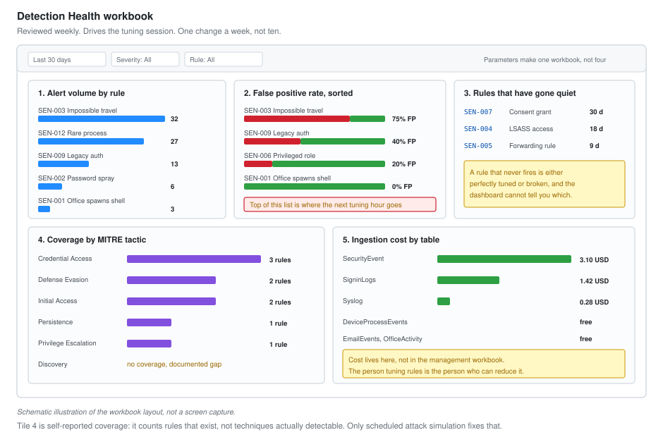

# 09 - Workbooks and Reporting

Three dashboards. One for the analyst on shift, one for tuning, one for management.

Different audiences need different numbers. A dashboard that tries to serve all three serves none of them.

---

## Why Three

| Workbook | Audience | Answers |
| --- | --- | --- |
| **SOC Shift View** | Analyst on shift | What needs me right now |
| **Detection Health** | Whoever tunes rules | What is noisy and what has gone quiet |
| **Security Posture** | Management | Are we getting better or worse |



*Schematic illustration of the workbook layout, not a screen capture.*

---

## Workbook 1: SOC Shift View

Opened at shift start and left on a second monitor.

### Tile 1: Queue right now

```kql
SecurityIncident
| summarize arg_max(TimeGenerated, *) by IncidentNumber
| where Status != "Closed"
| extend
    AgeHours = datetime_diff('hour', now(), CreatedTime),
    Owner    = iff(isempty(tostring(Owner.userPrincipalName)), "UNASSIGNED",
                   tostring(Owner.userPrincipalName))
| summarize Count = count(), OldestHours = max(AgeHours) by Severity, Owner
| order by Severity asc, OldestHours desc
```

Rendered as a tile grid. Red on any unassigned High older than an hour.

### Tile 2: Incidents by hour, last 24

```kql
SecurityIncident
| where TimeGenerated > ago(24h)
| summarize arg_max(TimeGenerated, *) by IncidentNumber
| summarize Count = count() by Severity, bin(CreatedTime, 1h)
| render columnchart with (kind=stacked)
```

A spike at an unusual hour is the thing to notice, more than the total.

### Tile 3: Connector health

```kql
union withsource=TableName *
| where TimeGenerated > ago(4h)
| summarize Events = count(), Latest = max(TimeGenerated) by TableName
| extend MinutesSinceLast = datetime_diff('minute', now(), Latest)
| extend Status = case(
    MinutesSinceLast > 120, "STOPPED",
    MinutesSinceLast > 60,  "DEGRADED",
    "OK")
| project TableName, Events, MinutesSinceLast, Status
| order by MinutesSinceLast desc
```

### Tile 4: Agent health

```kql
Heartbeat
| summarize LastSeen = max(TimeGenerated) by Computer, OSType
| extend MinutesSilent = datetime_diff('minute', now(), LastSeen)
| extend Status = case(MinutesSilent > 60, "SILENT", MinutesSilent > 30, "LATE", "OK")
| order by MinutesSilent desc
```

### Tile 5: Ageing and stalled

```kql
SecurityIncident
| summarize arg_max(TimeGenerated, *) by IncidentNumber
| where Status == "Active"
| extend HoursSinceUpdate = datetime_diff('hour', now(), LastModifiedTime)
| where HoursSinceUpdate > 8
| project IncidentNumber, Title, Severity, HoursSinceUpdate,
          Owner = tostring(Owner.userPrincipalName)
| order by HoursSinceUpdate desc
```

**Tiles 3 and 4 are the ones that justify the workbook.** They are the questions nobody thinks to ask, and the answer being wrong means everything else on the screen is meaningless.

---

## Workbook 2: Detection Health

Reviewed weekly. Drives the tuning session.

### Tile 1: Alert volume by rule

```kql
SecurityAlert
| where TimeGenerated > ago(30d)
| summarize
    Alerts   = count(),
    Days     = dcount(bin(TimeGenerated, 1d)),
    FirstSeen = min(TimeGenerated),
    LastSeen  = max(TimeGenerated)
  by AlertName, AlertSeverity
| extend PerDay = round(todouble(Alerts) / 30.0, 2)
| order by Alerts desc
```

### Tile 2: True positive rate by rule

This is the tile that decides what gets tuned.

```kql
let Classified =
    SecurityIncident
    | where TimeGenerated > ago(30d)
    | summarize arg_max(TimeGenerated, *) by IncidentNumber
    | where Status == "Closed"
    | project Title, Classification, IncidentNumber;
Classified
| summarize
    Total          = count(),
    TruePositive   = countif(Classification == "TruePositive"),
    BenignPositive = countif(Classification == "BenignPositive"),
    FalsePositive  = countif(Classification == "FalsePositive"),
    Undetermined   = countif(Classification == "Undetermined")
  by Title
| extend
    TPRate = round(TruePositive * 100.0 / Total, 1),
    FPRate = round(FalsePositive * 100.0 / Total, 1)
| where Total >= 3
| order by FPRate desc
```

**Sorted by false positive rate descending, with volume beside it.** The top of that list is where the next tuning hour goes. A rule with a 90 percent false positive rate that fires once a month matters less than one at 40 percent firing daily.

### Tile 3: Rules that have gone quiet

```kql
let Configured = dynamic([
    "SEN-001", "SEN-002", "SEN-003", "SEN-004", "SEN-005", "SEN-006",
    "SEN-007", "SEN-008", "SEN-009", "SEN-011", "SEN-012"]);
let Fired =
    SecurityAlert
    | where TimeGenerated > ago(30d)
    | summarize LastFired = max(TimeGenerated) by AlertName;
print RuleId = Configured
| mv-expand RuleId to typeof(string)
| join kind=leftouter Fired on $left.RuleId == $right.AlertName
| extend DaysSinceFired = iff(isnull(LastFired), 999,
                              datetime_diff('day', now(), LastFired))
| project RuleId, LastFired, DaysSinceFired
| order by DaysSinceFired desc
```

**A rule that has never fired is either perfectly tuned or broken, and you cannot tell which from the dashboard.**

This is the tile most people leave out. A rule that silently stopped matching after a schema change looks identical to a rule protecting a quiet environment. The only way to know is to test it, which is why scheduled attack simulation belongs on the roadmap.

### Tile 4: Coverage against MITRE ATT&CK

```kql
SecurityAlert
| where TimeGenerated > ago(90d)
| extend Tactics = parse_json(Tactics)
| mv-expand Tactic = Tactics to typeof(string)
| summarize
    Alerts = count(),
    Rules  = dcount(AlertName),
    RuleList = make_set(AlertName, 10)
  by Tactic
| order by Alerts desc
```

### Tile 5: Ingestion cost by table

```kql
Usage
| where TimeGenerated > ago(30d)
| where IsBillable == true
| summarize BillableGB = round(sum(Quantity) / 1000, 3) by DataType
| extend EstimatedUSD = round(BillableGB * 2.30, 2)
| order by BillableGB desc
```

Cost sits in the detection health workbook on purpose, not in the management one.

**The person tuning rules is the person who can reduce cost**, because the way you reduce cost is by not collecting data no rule uses. Putting the number in front of management produces pressure. Putting it in front of the engineer produces a data collection rule.

---

## Workbook 3: Security Posture

Monthly. Written for people who do not use Sentinel.

### The rule for this workbook

**No KQL on screen. No table names. No rule IDs.**

If a tile needs explaining, it does not belong here. Management dashboards fail by being built for the person who made them.

### Tile 1: Incident volume and trend

```kql
SecurityIncident
| where TimeGenerated > ago(180d)
| summarize arg_max(TimeGenerated, *) by IncidentNumber
| summarize Incidents = count() by Severity, Month = startofmonth(CreatedTime)
| render columnchart with (kind=stacked, title="Security incidents by month")
```

**Volume going up is not automatically bad.** It usually means detection coverage improved. That sentence goes on the tile as a caption, because otherwise the first question every month is why the number went up.

### Tile 2: Response times against target

```kql
let Targets = datatable(Severity:string, TargetMins:int)
[ "High", 30, "Medium", 120, "Low", 480 ];
SecurityIncident
| where TimeGenerated > ago(90d)
| summarize arg_max(TimeGenerated, *) by IncidentNumber
| where Status == "Closed"
| extend AckMins = datetime_diff('minute', FirstModifiedTime, CreatedTime)
| join kind=inner Targets on Severity
| summarize
    Median = percentile(AckMins, 50),
    P90    = percentile(AckMins, 90),
    Target = max(TargetMins),
    MetPercent = round(countif(AckMins <= TargetMins) * 100.0 / count(), 1)
  by Severity, Month = startofmonth(TimeGenerated)
```

Median and P90 against the target line. Never the mean.

### Tile 3: What kind of threats

```kql
SecurityIncident
| where TimeGenerated > ago(90d)
| summarize arg_max(TimeGenerated, *) by IncidentNumber
| where Classification == "TruePositive"
| extend Tactics = parse_json(AdditionalData).tactics
| mv-expand Tactic = Tactics to typeof(string)
| summarize Count = count() by Tactic
| render piechart with (title="Confirmed incidents by attack stage")
```

Attack stage rather than technique. "Credential access" means something to a manager. "T1003.001" does not.

### Tile 4: The three numbers

One tile, three large figures, nothing else.

```kql
SecurityIncident
| where TimeGenerated > ago(30d)
| summarize arg_max(TimeGenerated, *) by IncidentNumber
| summarize
    ['Incidents handled'] = count(),
    ['Confirmed threats'] = countif(Classification == "TruePositive"),
    ['Median response (min)'] = percentile(
        datetime_diff('minute', FirstModifiedTime, CreatedTime), 50)
```

**If somebody reads one tile, make it this one.** Three numbers, plain English labels, no jargon.

### Tile 5: Coverage gaps, stated plainly

Not a query. A maintained markdown tile.

```markdown
## Known gaps

**Overnight coverage.** Alerts outside working hours wait until morning.
Median overnight response is 5 hours 12 minutes against a 30 minute
daytime median. Two incidents this quarter were affected.

**Email delivery detection.** We detect phishing at click and at
execution, not at delivery. Closing this needs a mail gateway feed.

**Discovery techniques.** Domain enumeration is not detected. The
activity is indistinguishable from normal helpdesk work without a
volume-based rule, which is drafted but not validated.
```

**Putting gaps in the management dashboard is a deliberate choice.** A dashboard that only shows wins is how a security programme stops getting funded, because nothing appears to need funding. The gap tile is what turns the roadmap into a budget conversation.

---

## Building a Workbook

Workbooks are JSON. Build in the portal, export, keep in version control.

```bash
# Export
az resource show \
  --ids "/subscriptions/<sub>/resourceGroups/rg-vbunnylab-soc/providers/Microsoft.OperationalInsights/workspaces/law-vbunnylab-soc/providers/Microsoft.Insights/workbooks/<workbook-id>" \
  --query properties.serializedData -o tsv > soc-shift-view.json
```

### Parameters make a workbook reusable

```json
{
  "type": 9,
  "content": {
    "version": "KqlParameterItem/1.0",
    "parameters": [
      {
        "name": "TimeRange",
        "type": 4,
        "value": { "durationMs": 86400000 }
      },
      {
        "name": "Severity",
        "type": 2,
        "multiSelect": true,
        "query": "SecurityIncident | distinct Severity",
        "typeSettings": { "additionalResourceOptions": ["value::all"] }
      }
    ]
  }
}
```

Then reference them in queries as `{TimeRange}` and `{Severity}`. One workbook instead of four near-identical ones.

---

## Reporting Beyond Dashboards

A dashboard is pull. Somebody has to open it. Two things get pushed instead.

### Weekly tuning summary

Posted to the SOC channel by a Logic App every Monday.

```text
DETECTION HEALTH  week ending 2026-09-20

Alerts          142  (last week 138)
Incidents        24  (last week 27)
True positive   9    False positive 11    Benign 4

Noisiest rule
  SEN-003 Impossible travel, 8 alerts, 75 percent FP
  Action: adding DeviceId to custom details, see CF-04

Quiet rules, no fire in 30 days
  SEN-007 Consent grant
  Action: validate with a test consent grant this week

Ingestion
  0.61 GB/day, 4.90 USD projected
  No change from last week
```

### Monthly report

One page. Executive summary, the three numbers, trend, notable incidents, gaps, and what is changing next month.

**Notable incidents should include one that went badly.** A monthly report of unbroken success is not believed, and the month you need to report something serious you will have spent your credibility.

---

## What I Would Change

**Too many tiles.** The shift view started at 12 and works better at 5. A tile nobody looks at is worse than no tile, because it makes the ones that matter harder to find.

**No mobile view.** The on-call view should work on a phone and does not.

**Coverage tile is self-reported.** Tile 4 of the detection health workbook shows tactics covered by rules that exist, not tactics actually detectable. A rule that has silently stopped matching still counts as coverage. Only scheduled attack simulation fixes that, and it is the highest value thing on the roadmap.

---

Back to [README.md](README.md)
