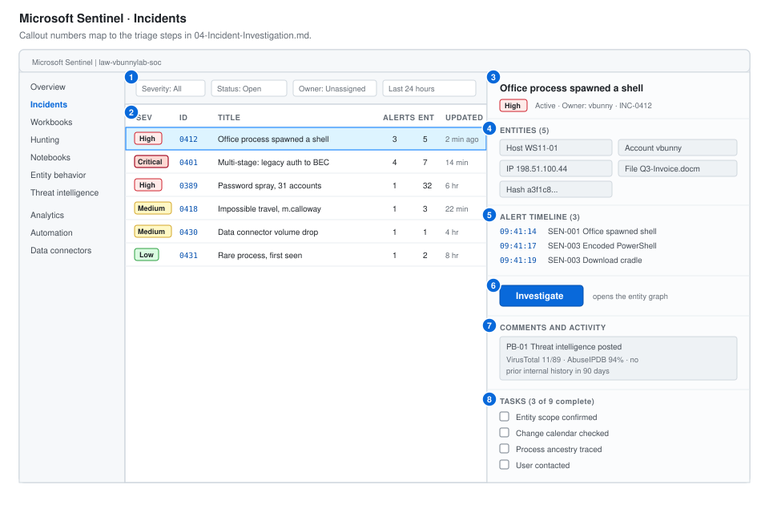

# SOC-02: Enterprise SIEM Operations

**Role target:** SOC Analyst I / Tier 1 Security Analyst
**Stack:** Microsoft Sentinel, Defender XDR, Entra ID, KQL, Logic Apps
**Environment:** Azure, with the Proxmox lab hosts onboarded through Azure Arc

---

## What This Project Is

[SOC-01](../Junior-SOC-Analyst/) was about getting telemetry in and writing detections. This one is about working a real queue in the toolset a hiring manager actually names in the job description.

Almost every SOC Analyst I posting asks for the same three things:

| Asked for | Where it is here |
| --- | --- |
| A commercial SIEM, usually Sentinel or Splunk | Sentinel workspace built from scratch, 9 connectors |
| Query language fluency, usually KQL | [50 queries](02-KQL-Query-Library.md), basic through hunting |
| Incident investigation and escalation | [6 worked case files](08-Investigation-Case-Files.md) |

So that is what this builds. A working Sentinel deployment, a query library I actually use, detections written as analytics rules, automated response, and six investigations worked end to end.

---

## The Environment

The Proxmox lab from SOC-01 stays. Azure Arc brings those on-premises machines into Azure so the same agent and the same data collection rules apply to them as to cloud resources.

| Component | Detail |
| --- | --- |
| Tenant | `vbunnylab.onmicrosoft.com`, Microsoft 365 E5 developer |
| Subscription | Azure pay-as-you-go, cost-capped |
| Workspace | `law-vbunnylab-soc`, East US |
| Sentinel | Enabled on the workspace |
| Arc-connected servers | DC01, FS01, WS11-01, WS11-02 |
| Defender for Endpoint | Plan 2, all four Windows hosts |
| Identity | Entra ID with Conditional Access, no Security Defaults |

Full build, including the cost controls that keep it under 5 dollars a month, is in [01-Sentinel-Workspace-Build.md](01-Sentinel-Workspace-Build.md).

---

## What I Built

**A working Sentinel deployment.** Nine data connectors, data collection rules that filter at the agent rather than at ingestion, and a cost model that does not run away. Most home Sentinel labs get abandoned after the first bill. This one documents why it does not.

**A KQL library of 50 queries.** Organised as a learning progression, from `SecurityEvent | take 10` through to joins, `materialize`, time-series anomaly detection and `externaldata`. Each query says what it answers and when you would reach for it.

**Twelve analytics rules.** Scheduled, near-real-time, and one Fusion correlation, with entity mapping configured so alerts group into incidents rather than arriving as noise.

**Six SOAR playbooks.** Logic Apps that enrich an incident with threat intelligence, post to Teams, disable an account on approval, and isolate a device. Including the one that went wrong.

**A phishing analysis workflow.** Header parsing, URL detonation, blast radius, and purge. Run against 14 reported messages.

**Six investigation case files.** Worked end to end with the KQL that answered each question, the entity graph, and the disposition.

**Shift operations.** Queue management, handover format, SLA measurement, and the metrics a SOC lead actually asks for.

---

## The Sentinel Console

The numbered callouts map to the triage steps in [04-Incident-Investigation.md](04-Incident-Investigation.md).

---

## Results

| Measure | Result |
| --- | --- |
| Data connectors configured | 9 |
| Analytics rules written | 12, all in KQL |
| KQL queries in the library | 50 |
| SOAR playbooks | 6 |
| Incidents investigated | 6 case files, 14 phishing reports |
| Mean time to acknowledge | 4 minutes |
| Mean time to triage | 11 minutes |
| Ingestion cost after tuning | 4.80 USD per month, down from 61 USD |
| Data volume reduction | 92 percent, through DCR filtering |

The cost number is the one I would talk about in an interview. A SOC 1 analyst who understands that ingestion is the budget, and that filtering belongs at the agent rather than the workspace, is immediately more useful than one who does not.

---

## Documents

| | |
| --- | --- |
| [01-Sentinel-Workspace-Build.md](01-Sentinel-Workspace-Build.md) | Workspace, connectors, Azure Arc, data collection rules, cost control |
| [02-KQL-Query-Library.md](02-KQL-Query-Library.md) | 50 queries as a learning progression |
| [03-Analytics-Rules.md](03-Analytics-Rules.md) | 12 detections, entity mapping, near-real-time rules |
| [04-Incident-Investigation.md](04-Incident-Investigation.md) | The investigation graph, entity pages, the triage method |
| [05-Phishing-Analysis.md](05-Phishing-Analysis.md) | Header analysis, detonation, blast radius, purge |
| [06-SOAR-Automation.md](06-SOAR-Automation.md) | Six Logic App playbooks, including one that went wrong |
| [07-Shift-Operations.md](07-Shift-Operations.md) | Queue management, handover, SLA, the metrics that matter |
| [08-Investigation-Case-Files.md](08-Investigation-Case-Files.md) | Six investigations worked end to end |
| [09-Workbooks-and-Reporting.md](09-Workbooks-and-Reporting.md) | Dashboards for the SOC and for management |

---

## Skills This Demonstrates

| Area | Evidence |
| --- | --- |
| Microsoft Sentinel | Workspace build, connectors, analytics, automation, workbooks |
| KQL | 50 queries including joins, aggregations, time series, anomaly detection |
| Defender XDR | Device onboarding, advanced hunting, live response, device isolation |
| Entra ID | Sign-in log analysis, risky user handling, session revocation |
| Incident response | 6 case files, entity-based scoping, documented escalation |
| Email security | Header analysis, blast radius, message purge |
| SOAR | 6 Logic App playbooks with approval gates |
| Cost engineering | 92 percent ingestion reduction, with the reasoning |
| Shift operations | Queue discipline, handover, SLA measurement |

---

## Honest Notes

This runs on a developer tenant with four endpoints. A real SOC 1 analyst works a queue of hundreds of incidents a week across thousands of endpoints, and volume changes the job in ways a lab cannot reproduce.

What does transfer is the method and the tooling. The KQL is real KQL. The analytics rules are the shape Sentinel actually wants. The cost problem is the same problem at any scale, just with more zeros.

Two things I would flag if you are reviewing this as a hiring manager. [02-KQL-Query-Library.md](02-KQL-Query-Library.md) is the file that shows technical depth. [08-Investigation-Case-Files.md](08-Investigation-Case-Files.md) is the file that shows judgement. They are the two worth your time.
