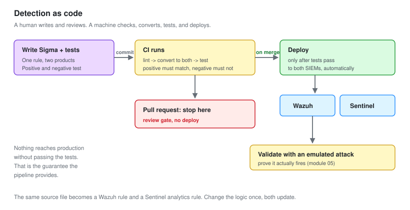
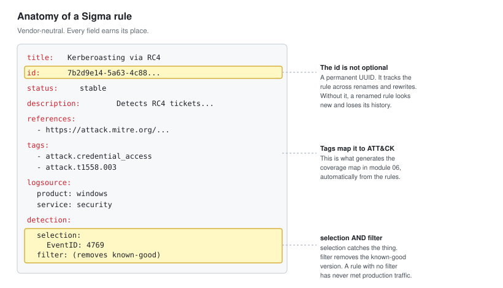

# 02 - Detection as Code

Writing detections once, testing them automatically, and deploying to two SIEMs from one source.

---

## The Workflow

Every detection follows the same path. No rule reaches production any other way.



```text
1. Write the rule as Sigma, on a branch
2. Write its positive and negative tests
3. Open a pull request
4. CI runs: lint, convert, test
5. Review and merge
6. CI deploys to Wazuh and Sentinel
7. Validate with an emulated attack
```

**The point is that steps 4 and 6 are automatic.** A human writes the rule and reviews it. A machine checks the syntax, converts it, tests it, and deploys it. That removes the two ways detections usually break: a typo nobody caught, and a rule that works in one product but was never added to the other.

---

## The Anatomy of a Sigma Rule



Every field earns its place.

```yaml
title: Kerberoasting via RC4 Service Ticket Request    # human-readable name
id: 7b2d9e14-5a63-4c88-b1f2-9d3a7c0e4f52               # permanent UUID
status: stable                                          # experimental / test / stable
description: Detects service ticket requests using...   # what and why
references:
  - https://attack.mitre.org/techniques/T1558/003/     # where to read more
tags:
  - attack.credential_access                            # ATT&CK tactic
  - attack.t1558.003                                    # ATT&CK technique
logsource:
  product: windows                                      # what data this needs
  service: security
detection:
  selection:                                            # the matching logic
    EventID: 4769
    TicketEncryptionType: '0x17'
  filter:                                               # what to exclude
    ServiceName|endswith: '$'
  condition: selection and not filter                   # how they combine
falsepositives:
  - Legacy applications that only support RC4            # honesty about noise
level: high                                             # severity
```

**The `id` field is not optional.** It is a permanent UUID that lets you track a rule across renames and rewrites. Without it, a rule that gets a better title looks like a brand new rule, and its history is lost.

**The `filter` and `condition` are where quality lives.** `selection` catches the thing. `filter` removes the known-good version of the thing. `condition` combines them. A rule with a selection and no filter is a rule that has never met production traffic.

---

## Conversion

One rule, two products, one command each.

```bash
# Wazuh
sigma convert -t wazuh -p windows_sysmon rules/credential-access/kerberoasting.yml \
    -o output/wazuh/kerberoasting.xml

# Sentinel
sigma convert -t kusto rules/credential-access/kerberoasting.yml \
    -o output/sentinel/kerberoasting.kql
```

### Handling the differences

The two products name fields differently, and Sigma handles this with pipelines.

| Concept | Wazuh field | Sentinel field |
| --- | --- | --- |
| Process name | `win.eventdata.image` | `FileName` |
| Command line | `win.eventdata.commandLine` | `ProcessCommandLine` |
| Parent process | `win.eventdata.parentImage` | `InitiatingProcessFileName` |

A Sigma **pipeline** maps the neutral field names to each product's names during conversion. You maintain the pipeline once, and every rule benefits.

```bash
# A pipeline maps generic fields to Sentinel's schema
sigma convert -t kusto -p microsoft_xdr rules/... 
```

**This is the whole value of Sigma in one paragraph.** You never write `win.eventdata.commandLine` or `ProcessCommandLine` in a rule. You write `CommandLine`, and the pipeline translates. Change SIEM, change the pipeline, keep every rule.

---

## Testing

A detection you have not tested is a guess. The test harness runs each rule against its sample logs and confirms the right thing happens.

### The test script

```bash
#!/bin/bash
# pipeline/test.sh  -  runs every rule against its tests
set -e
fail=0

for rule in rules/**/*.yml; do
  name=$(basename "$rule" .yml)
  testdir="tests/$name"
  [ -d "$testdir" ] || { echo "NO TESTS: $name"; fail=1; continue; }

  # The positive log must match
  if ! sigma-test "$rule" "$testdir/positive.json" --expect match; then
    echo "FAIL (positive did not match): $name"; fail=1
  fi

  # The negative log must not match
  if ! sigma-test "$rule" "$testdir/negative.json" --expect no-match; then
    echo "FAIL (negative matched, this rule is noisy): $name"; fail=1
  fi
done

exit $fail
```

`sigma-test` here is a small wrapper that converts the rule to a query engine and runs the sample log through it. The real tooling for this is `sigma` plus a test framework such as `pySigma` with a validation backend, or the community project `sigma-cli` combined with a log-matching harness.

### What the two tests catch

| Test | Catches |
| --- | --- |
| Positive fails | The rule is broken and would miss the real attack |
| Negative matches | The rule is too broad and would flood the queue |

**Both failures are equally bad.** A rule that misses the attack is useless. A rule that fires on everything is worse, because it trains analysts to ignore it, which then hides the real one. The negative test is the one that keeps a SOC usable.

---

## The Sigma Linter

Before any conversion, the rule has to be valid Sigma. The built-in validator checks it.

```bash
sigma check rules/
```

It catches:

- Missing required fields (no `id`, no `logsource`)
- Duplicate UUIDs across rules
- Fields that do not exist in the log source
- Conditions that reference a selection that is not defined
- Deprecated syntax

**Duplicate UUID detection has saved me twice.** Copy a rule as a starting point, forget to change the `id`, and now two rules share an identity. The linter catches it before it becomes a confusing production problem.

---

## The CI Pipeline

This ties it together. On every change, the machine runs the whole thing.

```yaml
# ci/pipeline.yml  -  runs on every pull request and merge
name: detections

on: [pull_request, push]

jobs:
  validate:
    runs-on: ubuntu-latest
    steps:
      - uses: actions/checkout@v4

      - name: Install Sigma
        run: pipx install sigma-cli && pipx inject sigma-cli pysigma-backend-kusto

      - name: Lint every rule
        run: sigma check rules/

      - name: Convert to both SIEMs
        run: |
          bash pipeline/convert.sh wazuh
          bash pipeline/convert.sh sentinel

      - name: Run positive and negative tests
        run: bash pipeline/test.sh

  deploy:
    needs: validate
    if: github.ref == 'refs/heads/main'
    runs-on: ubuntu-latest
    steps:
      - name: Deploy to Wazuh
        run: bash pipeline/deploy.sh wazuh
      - name: Deploy to Sentinel
        run: bash pipeline/deploy.sh sentinel
```

Read the logic:

- **On a pull request:** lint, convert, test. It does not deploy. This is the review gate.
- **On merge to main:** it deploys, but only after validation passed.

**Nothing reaches production without passing the tests.** That is the guarantee the pipeline provides, and it is the thing that lets you deploy detections confidently without a second analyst watching every one.

---

## Deployment

The deploy scripts push the converted rules into each product's rule store.

```bash
# Wazuh: copy the XML, syntax-check, restart the manager
scp output/wazuh/*.xml labadmin@siem:/tmp/detections/
ssh labadmin@siem 'sudo cp /tmp/detections/*.xml /var/ossec/etc/rules/ \
    && sudo /var/ossec/bin/wazuh-logtest -t \
    && sudo systemctl restart wazuh-manager'
```

```bash
# Sentinel: deploy the analytics rules via ARM template or the API
az deployment group create \
    --resource-group rg-vbunnylab-soc \
    --template-file output/sentinel/analytics-rules.bicep
```

**The Wazuh deploy runs `wazuh-logtest -t` before restarting.** A malformed rule stops the manager from starting, and a SIEM that will not start is silently collecting nothing. The syntax check in the deploy step is the last guard against that.

---

## Version Control in Practice

The git history becomes the audit trail a SOC needs.

```bash
# Why does this rule exist, and who changed it
git log --oneline rules/credential-access/kerberoasting.yml

a4f21c8  Raise threshold to 5 distinct SPNs, was too noisy
9d3e7b2  Add RC4 encryption type filter
1c8a4f0  Initial Kerberoasting detection
```

```bash
# What changed between two versions of the rule set
git diff v1.2 v1.3 -- rules/
```

**"Why is this rule the way it is" is answerable.** In a console-based SOC, a rule's threshold is 5 and nobody remembers why. Here, the commit that changed it says "was too noisy," and you can see the version before it. That history is worth as much as the rules themselves.

---

## What I Migrated

The starting point was the hand-written rules from the earlier projects. Migrating them into this pipeline was the first real work.

| Source | Rules | Outcome |
| --- | --- | --- |
| SOC-01 Wazuh rules | 10 | Migrated to Sigma, all pass tests |
| SOC-02 Sentinel rules | 12 | Migrated to Sigma, all pass tests |
| New for this project | 2 | Written directly as code |
| **Total** | **24** | Deployed to both SIEMs from one source |

### What the migration found

**Two rules were subtly broken.** The SOC-01 startup-folder rule had a field name that never matched anything, so it had never fired. It looked healthy in the console. The negative test passed trivially because the positive one never matched either. Writing a real positive test from a captured log exposed it immediately.

**This is the argument for detection as code in one finding.** A rule that has never fired looks identical to a rule protecting a quiet environment. Only a test built from a real attack log tells them apart.

---

## Checklist

- [ ] Every rule is Sigma, with an id and ATT&CK tags
- [ ] Every rule has a positive and negative test from real logs
- [ ] The linter passes on the whole rule set
- [ ] Rules convert cleanly to both Wazuh and Sentinel
- [ ] CI runs lint, convert and test on every change
- [ ] Deployment happens from the pipeline, not by hand
- [ ] The git history explains why each rule is the way it is
- [ ] The old hand-written rules are migrated and tested

---

Next: [03-Threat-Hunting-Methodology.md](03-Threat-Hunting-Methodology.md)
