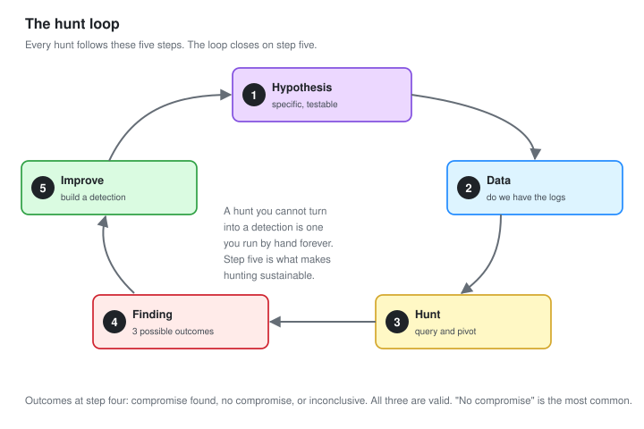

# 03 - Threat Hunting Methodology

Looking for attackers when no alert has fired. The method, before the hunts.

---

## What Hunting Is, and Is Not

**Threat hunting is looking for a compromise that your detections did not catch.**

It is not working the alert queue. An alert means a rule fired. A hunt is for what no rule covers, which is by definition the thing most likely to still be there.

| Alerting | Hunting |
| --- | --- |
| Reactive. Something fired | Proactive. Nothing fired |
| The tool found it | You go looking |
| Known-bad, defined in advance | Suspected-bad, defined by a hypothesis |
| Produces a ticket | Produces a finding, or a new detection, or confidence |

**The output of a hunt is not always a finding.** A hunt that finds nothing produces two valuable things: confidence that a particular attack is not present, and often a new detection so that next time it would be caught automatically.

---

## Why Hunt At All

If the detections were perfect, you would not need to. They are not, for three reasons.

**New techniques.** An attacker uses a method no rule was written for. Only a human looking finds it.

**Gaps you do not know about.** [Module 06](06-Detection-Coverage.md) maps coverage, but a map shows known gaps. Hunting finds the ones the map missed.

**The assumption of breach.** A mature program assumes something is already inside and goes looking, rather than waiting to be told. That assumption is the mindset that separates Tier 2 from Tier 1.

---

## The Hunt Loop



Every hunt follows the same five steps.

```text
1. Hypothesis     A specific, testable statement about an attacker
2. Data           What logs would show it, and do we have them
3. Hunt           Query, pivot, and analyse
4. Finding        Compromise, no compromise, or inconclusive
5. Improve        Turn a successful hunt into a detection
        |
        +--> back to a new hypothesis
```

**The loop closes on step 5.** A hunt you cannot turn into a repeatable detection is a hunt you have to run by hand forever. The goal is that each successful hunt makes the next one unnecessary, because now a rule catches it.

---

## Step 1: The Hypothesis

This is the step that decides whether a hunt is any good.

**Bad hypothesis:** "Let me look for malware."

That is not testable. It has no end. You will look at logs for an hour and conclude nothing.

**Good hypothesis:** "If an attacker established persistence on a workstation, there would be a process starting from a user-writable folder that is not a known application."

That is testable. It names the data, it defines what a positive looks like, and it has an end.

### The shape of a good hypothesis

```text
IF   an attacker did [specific technique]
THEN there would be [specific observable]
IN   [specific data source]
THAT differs from normal by [specific characteristic]
```

Worked example:

```text
IF   an attacker is beaconing to command and control
THEN there would be repeated outbound connections
IN   the network connection logs
THAT occur at suspiciously regular intervals
```

**Every hunt in [module 04](04-Hunt-Case-Files.md) starts with a hypothesis in this shape.** If you cannot write one, you are not ready to hunt yet. You are ready to read about a technique until you can.

### Where hypotheses come from

| Source | Example |
| --- | --- |
| Threat intelligence | A report says a group uses scheduled tasks. Hunt for unusual ones |
| A detection gap | Module 06 shows no Discovery coverage. Hunt for enumeration |
| An incident elsewhere | Another company was hit this way. Are we |
| The ATT&CK matrix | Pick a technique with no detection and hunt for it |
| A hunch | Something felt off in a ticket. Follow it |

---

## Step 2: The Data

A hypothesis is only huntable if you have the data to test it.

```text
For each hypothesis, answer:
  What log source shows this behaviour?
  Do we collect it?
  Do we retain it long enough?
  Is it in a form I can query at scale?
```

**Half of hunting is discovering you do not have the data.** That is not a wasted hunt. "We cannot hunt for exfiltration because we have no proxy logs" is a finding. It goes to whoever decides what to collect, and it is exactly the gap analysis that [module 06](06-Detection-Coverage.md) formalises.

---

## Step 3: The Hunt

Now you query. Two broad styles.

### Hypothesis-driven

You have a specific idea and you test it directly. Most hunts here are this kind.

```kql
// Hypothesis: persistence via a startup entry in user-writable space
DeviceRegistryEvents
| where TimeGenerated > ago(30d)
| where RegistryKey has "CurrentVersion\\Run"
| where RegistryValueData has_any ("AppData","Temp","ProgramData","Users\\Public")
| summarize FirstSeen=min(TimeGenerated), Count=count() by DeviceName, RegistryValueData
```

### Data-driven, or stack counting

You do not have a specific idea. You look at all of something and find the outliers. This is how you hunt for the unknown.

```kql
// Stack every autorun value. The rare ones are interesting.
DeviceRegistryEvents
| where RegistryKey has "CurrentVersion\\Run"
| summarize Machines=dcount(DeviceName) by RegistryValueData
| order by Machines asc
```

**Rarity is the hunter's best signal.** Malware is rare by definition. Something that appears on one machine out of fifty deserves a look, whether or not you had a hypothesis about it. Stack counting turns "I do not know what to look for" into "show me what is unusual."

### Pivoting

A hunt is rarely one query. You find something interesting, then pivot.

```text
Found: an odd process on WS-04
  Pivot: what else did that process do?    (network, files, registry)
  Pivot: what started it?                   (parent process)
  Pivot: is it on any other machine?        (the hash, across the estate)
  Pivot: what account was it running as?    (and where else is that account)
```

**Pivoting is the actual skill.** The first finding is a thread. Following it is the hunt. Each pivot answers "and then what," and the story assembles itself.

---

## Step 4: The Finding

Every hunt ends in one of three states. All three are valid.

| Outcome | Means | Next |
| --- | --- | --- |
| **Compromise found** | Something is there | Open an incident |
| **No compromise** | The hypothesis was tested and held | Write it up, build a detection |
| **Inconclusive** | Could not test it properly | Usually a data gap. Report it |

**"No compromise" is the most common result and it is not a failure.** You have proven a specific attack is not present, and you have built the query to check again. Six hunts, two findings, four clean is a healthy ratio, not a poor one.

---

## Step 5: Improve

The loop closes here. A successful hunt becomes a detection.

```text
Hunt query that worked
        |
        v
Generalise it (remove the specific host, the specific time)
        |
        v
Add a threshold that separates the finding from normal
        |
        v
Write it as a Sigma rule (module 02)
        |
        v
Test it, deploy it
        |
        v
Now it runs automatically. You never hunt for this by hand again.
```

**This is what makes hunting sustainable.** A team that hunts and never builds detections hunts the same things forever. A team that closes the loop shrinks the space of things it has to hunt by hand, and moves up the maturity model in [module 09](09-Metrics-and-Maturity.md).

---

## The Frameworks

Two published frameworks describe this. Worth knowing by name, because interviewers ask.

**PEAK** (Prepare, Execute, Act with Knowledge). A modern framework from Splunk. Three hunt types: hypothesis-driven, baseline (stack counting), and model-assisted. It is the vocabulary this module uses.

**TaHiTI** (Targeted Hunting integrating Threat Intelligence). Ties hunting to threat intelligence, so hunts are driven by what adversaries actually do rather than by guesswork.

**The Sqrrl hunting maturity model** describes where a program sits, from ad-hoc to automated. Covered in [module 09](09-Metrics-and-Maturity.md).

You do not need to memorise them. You need to hunt in a repeatable, documented way, which is what they all describe.

---

## Documenting a Hunt

Every hunt gets written up, whatever the outcome. The template:

```text
HUNT-ID       H-0001
DATE          2026-09-22
HYPOTHESIS    If an attacker established persistence, there would be a
              process starting from a user-writable folder that is not
              a known application.
DATA SOURCE   Sysmon event 1, DeviceProcessEvents. 30 days retained.
SCOPE         All Windows hosts.
METHOD        [the queries run]
FINDINGS      [what was found, or that nothing was]
OUTCOME       No compromise / Compromise / Inconclusive
DETECTION     [the new rule built, if any]
NOTES         [anything worth remembering]
```

**Writing up the empty hunts matters as much as the productive ones.** In six months, "did we ever check for this" is answerable, and the query is there to run again. An undocumented hunt is a hunt you will repeat from scratch.

---

## Checklist

- [ ] You can write a hypothesis in the IF-THEN-IN-THAT shape
- [ ] You check whether the data exists before starting
- [ ] You know both hypothesis-driven and stack-counting styles
- [ ] You pivot from the first finding rather than stopping
- [ ] You accept "no compromise" as a valid, common outcome
- [ ] You turn successful hunts into detections
- [ ] You document every hunt, including the empty ones

---

Next: [04-Hunt-Case-Files.md](04-Hunt-Case-Files.md)
